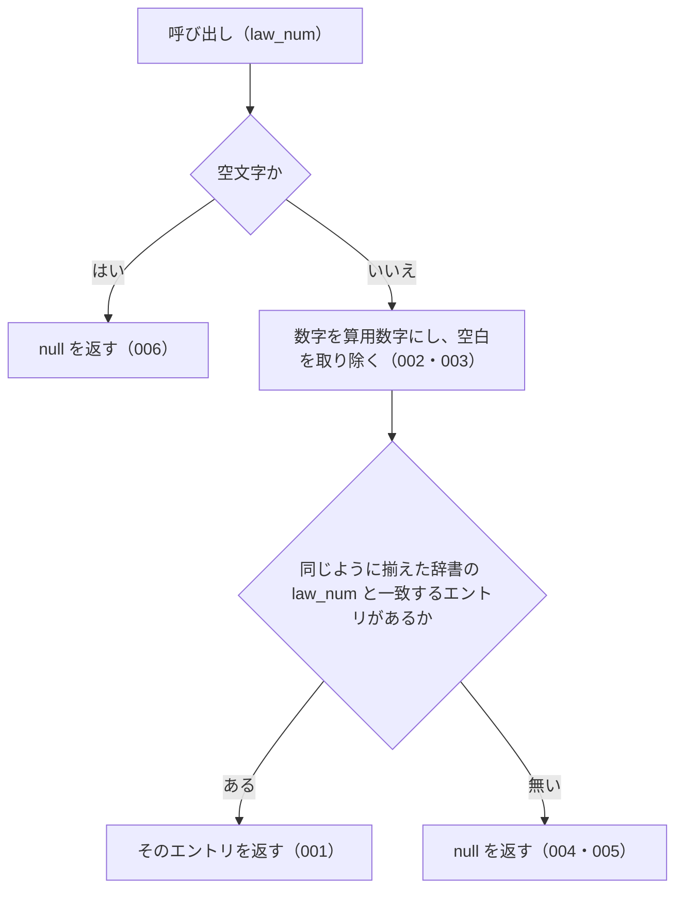

# lookupByLawNum

<!-- GENERATED FILE — 手で編集しない。シグネチャと説明は dist/index.d.ts、使用状況は mcp/*/src の import、利用者と得られる結果・扱わないこと・処理の流れ・仕様項目の一覧は specs/current/lookup_by_law_num/spec.md、使いどころは scripts/spec-pages/houki-abbreviations/lookup_by_law_num.md から。 -->

::: info
houki-abbreviations **v0.7.1** の `dist/index.d.ts` と `specs/current/lookup_by_law_num/spec.md` から自動生成しました（仕様 ID 9 件・2026-10-10）。手で編集しないでください。再生成は `node scripts/generate-reference.mjs` です。
:::

*関数 ・ v0.5.0 で追加 ・ family では未使用*

法令番号から辞書エントリを引く。

入力と辞書の `law_num` の両方を `normalizeLawNum` に通してから比較するので、
漢数字（`昭和六十三年法律第百八号`）でも算用数字（`昭和63年法律第108号`）でも
全角数字でも同じエントリが返る（v0.6.0 から。v0.5.x は漢数字の完全一致のみ）。

## 利用者と得られる結果

この関数の利用者と、利用者が渡すもの・得られる結果を示します。

- houki-abbreviations を import する利用者（houki-egov-mcp・houki-nta-mcp などの MCP サーバー、またはアプリケーション）。条文や通達に書かれた法令番号（`昭和六十三年法律第百八号` など）を渡して、その法令の略称・正式名称などを持つ辞書のエントリを受け取る

## シグネチャ

import して呼ぶときの形です。パッケージの型定義（`dist/index.d.ts`）から写しています。

```ts
function lookupByLawNum(law_num: string): AbbreviationEntry | null;
```

**関係する型**: [`AbbreviationEntry`](/reference/lib/houki-abbreviations/types#abbreviationentry)

## 例

型定義の JSDoc に書かれている例です。

::: details 例
```ts
import { lookupByLawNum } from '@shuji-bonji/houki-abbreviations';

lookupByLawNum('昭和六十三年法律第百八号')?.formal;  // '消費税法'
lookupByLawNum('昭和63年法律第108号')?.formal;        // '消費税法'（v0.6.0 から算用数字でも引ける）
```
:::

## 扱わないこと

この関数が意図して扱わないことです。

- 元号の別表記（`S63` / `昭63`）を吸収すること（`lookupByLawNum('S63年法律第108号')` は `null`）
- `第` や `号` の省略を吸収すること（[SPEC-ABBR-LOOKUP-BY-LAW-NUM-004](/specs/houki-abbreviations/lookup_by_law_num#spec-abbr-lookup-by-law-num-004)）
- 法令の種別名（`法律` / `政令`）を補うこと
- `law_num` を持たないエントリ（v0.6.0 の辞書で 174 件中 165 件）を引くこと
- e-Gov の法令 ID から引くこと（`lookupByLawId`）
- 略称・正式名称・別名から引くこと（`resolveAbbreviation`）
- 法令番号の表記を揃えた文字列そのものを返すこと（`normalizeLawNum`）
- 1 回の呼び出しで複数の法令番号を引くこと

## 処理の流れ

仕様書の「処理の流れ」の節を、図も含めてそのまま写しています。図が大きいので畳んでいます。

::: details 処理の流れの図（仕様書の写し）
図の中の番号は「できること」の仕様 ID の末尾 3 桁です。


:::

## 仕様項目の一覧

この関数の仕様項目 9 件の見出しです。仕様項目は受入テストと 1 対 1 で対応していて、条件と例は[仕様書ページ](/specs/houki-abbreviations/lookup_by_law_num)で読めます。

::: details 仕様項目の見出し（9 件）
| 仕様 ID | 仕様項目 |
|---|---|
| [001](/specs/houki-abbreviations/lookup_by_law_num#spec-abbr-lookup-by-law-num-001) | 漢数字の法令番号でエントリを返す |
| [002](/specs/houki-abbreviations/lookup_by_law_num#spec-abbr-lookup-by-law-num-002) | 算用数字・全角数字・位ごとの漢数字でも同じエントリを返す |
| [003](/specs/houki-abbreviations/lookup_by_law_num#spec-abbr-lookup-by-law-num-003) | 空白を無視する |
| [004](/specs/houki-abbreviations/lookup_by_law_num#spec-abbr-lookup-by-law-num-004) | 第・号を省いた形や元号の違う形には null を返す |
| [005](/specs/houki-abbreviations/lookup_by_law_num#spec-abbr-lookup-by-law-num-005) | 一致するエントリが無ければ null を返す |
| [006](/specs/houki-abbreviations/lookup_by_law_num#spec-abbr-lookup-by-law-num-006) | 空文字の law_num には null を返す |
| [007](/specs/houki-abbreviations/lookup_by_law_num#spec-abbr-lookup-by-law-num-007) | 空白だけの law_num には null を返す |
| [008](/specs/houki-abbreviations/lookup_by_law_num#spec-abbr-lookup-by-law-num-008) | 数字の先頭の 0 を無視する |
| [009](/specs/houki-abbreviations/lookup_by_law_num#spec-abbr-lookup-by-law-num-009) | 元年と 1 年を同じ年として照合する |
:::

## 関連ページ

このページの元になった文書と、あわせて読むページです。

- [houki-abbreviations の解説](/lib/houki-abbreviations)
- [houki-abbreviations の API の一覧](/reference/lib/houki-abbreviations/)
- [lookupByLawNum の仕様書ページ](/specs/houki-abbreviations/lookup_by_law_num)
- [元の仕様書（GitHub、v0.7.1）](https://github.com/shuji-bonji/houki-abbreviations/blob/v0.7.1/specs/current/lookup_by_law_num/spec.md)
