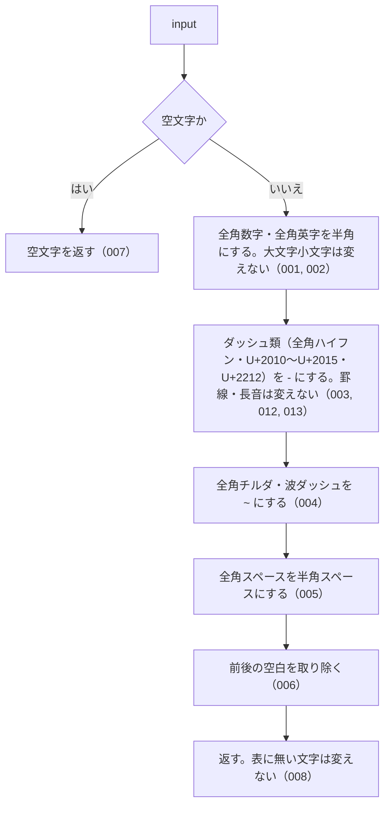

# normalizeJpText

<!-- GENERATED FILE — 手で編集しない。シグネチャと説明は dist/index.d.ts、使用状況は mcp/*/src の import、利用者と得られる結果・扱わないこと・処理の流れ・仕様項目の一覧は specs/current/normalize_jp_text/spec.md、使いどころは scripts/spec-pages/houki-abbreviations/normalize_jp_text.md から。 -->

::: info
houki-abbreviations **v0.7.0** の `dist/index.d.ts` と `specs/current/normalize_jp_text/spec.md` から自動生成しました（仕様 ID 13 件・2026-10-10）。手で編集しないでください。再生成は `node scripts/generate-reference.mjs` です。
:::

*関数 ・ v0.3.0 で追加 ・ houki-egov-mcp / houki-nta-mcp が使用*

日本語テキストの全角ゆらぎを保守的に半角化する。

数値表記・ASCII 文字・特定記号（ダッシュ類、チルダ、スペース）の全角／半角
表記揺れを吸収するための関数。**大文字小文字は保持する**ため、
「ＰＬ法」→「PL法」のように元の casing は変わらない。
ダッシュ類は `－` `‐` `‑` `–` `—` `―` `−` の 7 文字を `-` にする（v0.7.0 から。
v0.6.1 までは全角ハイフン `－` だけだった）。罫線 `─` と長音 `ー` は変えない。

漢字・ひらがな・カタカナ・中黒（・）・各種句読点は変更しない。どの変換も
1 文字を 1 文字に置き換えるので、文字数が変わるのは前後の空白を取り除くときだけ。

入力が空文字や `null`/`undefined` 相当（`!input`）の場合は空文字を返す。

## 利用者と得られる結果

この関数の利用者と、利用者が渡すもの・得られる結果を示します。

- このパッケージを import するコード（houki-hub family の MCP サーバーなど）。法令・通達の本文や利用者の入力を渡して、全角と半角の書き分けを揃えた文字列を受け取る。DB に入れる文字列と検索に使う文字列の両方に同じ関数を通して照合する
- このパッケージの中では、`resolveAbbreviation(name, { normalize: true })` と `searchByName` / `findSimilar` の `normalize` がこの関数を使う

## シグネチャ

import して呼ぶときの形です。パッケージの型定義（`dist/index.d.ts`）から写しています。

```ts
function normalizeJpText(input: string): string;
```

| 引数 | 説明 |
|---|---|
| `input` | 正規化対象の文字列 |

**戻り値**: 半角化された文字列（前後の空白は trim 済み）

## 例

型定義の JSDoc に書かれている例です。

::: details 例
```ts
normalizeJpText('１８３－２');     // '183-2'
normalizeJpText('１８３―２');     // '183-2'（U+2015 などのダッシュ類も。v0.7.0 から）
normalizeJpText('183～193共-1');  // '183~193共-1'（チルダのみ半角化）
normalizeJpText('ＰＬ法');         // 'PL法'（大文字保持）
normalizeJpText('  消法  ');      // '消法'（trim）
normalizeJpText('消　法');         // '消 法'（全角スペース → 半角）
```
:::

## 扱わないこと

この関数が意図して扱わないことです。

- 英大文字を小文字にすること、続いた空白を 1 つにまとめること（`normalizeSearchQuery`）
- 漢数字を算用数字にすること（法令番号なら `normalizeLawNum`、漢数字だけの文字列なら `kanjiToNumber`）
- 半角カナを全角カナにすること
- 表に無い全角記号（`／` `（` `）` など）を半角にすること（未決 2）

## 処理の流れ

仕様書の「処理の流れ」の節を、図も含めてそのまま写しています。図が大きいので畳んでいます。

::: details 処理の流れの図（仕様書の写し）
図の中の番号は「できること」の仕様 ID の末尾 3 桁です。


:::

## 仕様項目の一覧

この関数の仕様項目 13 件の見出しです。仕様項目は受入テストと 1 対 1 で対応していて、条件と例は[仕様書ページ](/specs/houki-abbreviations/normalize_jp_text)で読めます。

::: details 仕様項目の見出し（13 件）
| 仕様 ID | 仕様項目 |
|---|---|
| [001](/specs/houki-abbreviations/normalize_jp_text#spec-abbr-normalize-jp-text-001) | 全角数字を半角数字にする |
| [002](/specs/houki-abbreviations/normalize_jp_text#spec-abbr-normalize-jp-text-002) | 全角英字を半角英字にし、大文字小文字は変えない |
| [003](/specs/houki-abbreviations/normalize_jp_text#spec-abbr-normalize-jp-text-003) | 全角ハイフンを半角ハイフンにする |
| [004](/specs/houki-abbreviations/normalize_jp_text#spec-abbr-normalize-jp-text-004) | 全角チルダと波ダッシュを半角チルダにする |
| [005](/specs/houki-abbreviations/normalize_jp_text#spec-abbr-normalize-jp-text-005) | 全角スペースを半角スペースにする |
| [006](/specs/houki-abbreviations/normalize_jp_text#spec-abbr-normalize-jp-text-006) | 前後の空白を取り除く |
| [007](/specs/houki-abbreviations/normalize_jp_text#spec-abbr-normalize-jp-text-007) | 空文字には空文字を返す |
| [008](/specs/houki-abbreviations/normalize_jp_text#spec-abbr-normalize-jp-text-008) | 表に無い文字は変えない |
| [009](/specs/houki-abbreviations/normalize_jp_text#spec-abbr-normalize-jp-text-009) | null と undefined には空文字を返す |
| [010](/specs/houki-abbreviations/normalize_jp_text#spec-abbr-normalize-jp-text-010) | 表に無い全角記号は変えない |
| [011](/specs/houki-abbreviations/normalize_jp_text#spec-abbr-normalize-jp-text-011) | 前後のタブ・改行・ノーブレークスペースも取り除く |
| [012](/specs/houki-abbreviations/normalize_jp_text#spec-abbr-normalize-jp-text-012) | 全角ハイフン以外のダッシュ類も半角ハイフンにする |
| [013](/specs/houki-abbreviations/normalize_jp_text#spec-abbr-normalize-jp-text-013) | 罫線と長音は半角ハイフンにしない |
:::

## 関連ページ

このページの元になった文書と、あわせて読むページです。

- [houki-abbreviations の解説](/lib/houki-abbreviations)
- [houki-abbreviations の API の一覧](/reference/lib/houki-abbreviations/)
- [normalizeJpText の仕様書ページ](/specs/houki-abbreviations/normalize_jp_text)
- [元の仕様書（GitHub、v0.7.0）](https://github.com/shuji-bonji/houki-abbreviations/blob/v0.7.0/specs/current/normalize_jp_text/spec.md)
