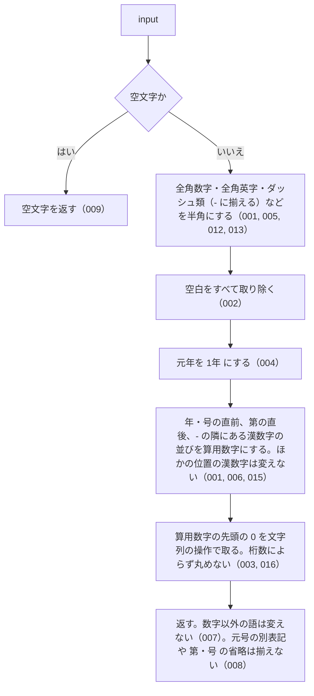

# normalizeLawNum

<!-- GENERATED FILE — 手で編集しない。シグネチャと説明は dist/index.d.ts、使用状況は mcp/*/src の import、利用者と得られる結果・扱わないこと・処理の流れ・仕様項目の一覧は specs/current/normalize_law_num/spec.md、使いどころは scripts/spec-pages/houki-abbreviations/normalize_law_num.md から。 -->

::: info
houki-abbreviations **v0.7.0** の `dist/index.d.ts` と `specs/current/normalize_law_num/spec.md` から自動生成しました（仕様 ID 16 件・2026-10-10）。手で編集しないでください。再生成は `node scripts/generate-reference.mjs` です。
:::

*関数 ・ v0.6.0 で追加 ・ family では未使用*

法令番号の表記を、照合に使える 1 つの形に揃える。

`昭和二十五年法律第百三十七号` と `昭和25年法律第137号` と `昭和２５年法律第１３７号`
を同じ文字列（`昭和25年法律第137号`）にする。`lookupByLawNum` はこの関数を
入力と辞書の両方に通してから比較する（Normalize-everywhere）。

行うこと:

1. `normalizeJpText` と同じ全角 → 半角の変換（数字・英字・ダッシュ類 `―` `－` `‐` `‑` `–` `—` `−`
   → `-`・チルダ・空白）。人事院規則の `一―一` のダッシュもここで `-` になる
2. 空白をすべて取り除く（`昭和25年 法律 第137号` → `昭和25年法律第137号`）
3. `元年` → `1年`（`令和元年` → `令和1年`）
4. 年・番号の位置にある漢数字の並びを算用数字にする（{@link kanjiToNumber}。位取りと
   位ごとの両方）。対象は直後が `年` か `号`、直前が `第`、直前か直後が `-` のどれかに
   当たる並びだけで、地名や語の一部の漢数字（`千葉県` `一般`）は変えない（v0.7.0 から。
   v0.6.1 までは `千葉県` → `1000葉県` になっていた）。読めない並びはそのまま残す
5. 算用数字の先頭の 0 を取る（`第0137号` → `第137号`）。桁数の上限は無く、数値に
   変換して丸めることはしない（v0.7.0 から）

行わないこと: 元号の別表記（`S25` / `昭25`）、`第` や `号` の有無の吸収、
法令の種別名（`法律` / `政令`）の補完。これらは表記の揺れではなく別の書き方なので、
呼び出し側で揃える。

入力が空文字や `null`/`undefined` 相当（`!input`）の場合は空文字を返す。

## 利用者と得られる結果

この関数の利用者と、利用者が渡すもの・得られる結果を示します。

- このパッケージを import するコード（houki-hub family の MCP サーバーなど）。漢数字・算用数字・全角数字のどれで書かれた法令番号でも、照合に使う 1 つの文字列を受け取る。比べる 2 つの法令番号の両方にこの関数を通してから比べる
- このパッケージの中では `lookupByLawNum` が、入力と辞書の `law_num` の両方にこの関数を通してから比べる

## シグネチャ

import して呼ぶときの形です。パッケージの型定義（`dist/index.d.ts`）から写しています。

```ts
function normalizeLawNum(input: string): string;
```

| 引数 | 説明 |
|---|---|
| `input` | 法令番号（漢数字・算用数字・全角数字のいずれでも） |

**戻り値**: 算用数字に揃えた法令番号

## 例

型定義の JSDoc に書かれている例です。

::: details 例
```ts
normalizeLawNum('昭和二十五年法律第百三十七号'); // '昭和25年法律第137号'
normalizeLawNum('昭和25年法律第137号');         // '昭和25年法律第137号'
normalizeLawNum('昭和２５年法律第１３７号');     // '昭和25年法律第137号'
normalizeLawNum('昭和二五年法律第一三七号');     // '昭和25年法律第137号'（位ごとの漢数字）
normalizeLawNum('令和元年法律第一号');           // '令和1年法律第1号'
normalizeLawNum('昭和二十四年人事院規則一―一'); // '昭和24年人事院規則1-1'
normalizeLawNum('昭和二十一年憲法');             // '昭和21年憲法'
```
:::

## 扱わないこと

この関数が意図して扱わないことです。

- 元号の別表記（`S25` / `昭25`）を元号名にすること、`第` や `号` を補うこと、法令の種別名（`法律` / `政令`）を補うこと（呼び出し側で揃える）
- 万以上の単位を読むこと。`normalizeLawNum('第二万三千号')` は `'第二万3000号'` になり、`第23000号` とは一致しない（`kanjiToNumber` が万を読まないため。`二` は `万` に隣り合うので変えない）
- 元号を西暦にすること
- 法令番号として正しい形かを確かめること（どんな文字列でも変換して返す）
- 辞書から法令を引くこと（`lookupByLawNum`）

## 処理の流れ

仕様書の「処理の流れ」の節を、図も含めてそのまま写しています。図が大きいので畳んでいます。

::: details 処理の流れの図（仕様書の写し）
図の中の番号は「できること」の仕様 ID の末尾 3 桁です。


:::

## 仕様項目の一覧

この関数の仕様項目 16 件の見出しです。仕様項目は受入テストと 1 対 1 で対応していて、条件と例は[仕様書ページ](/specs/houki-abbreviations/normalize_law_num)で読めます。

::: details 仕様項目の見出し（16 件）
| 仕様 ID | 仕様項目 |
|---|---|
| [001](/specs/houki-abbreviations/normalize_law_num#spec-abbr-normalize-law-num-001) | 漢数字・算用数字・全角数字の法令番号を同じ文字列にする |
| [002](/specs/houki-abbreviations/normalize_law_num#spec-abbr-normalize-law-num-002) | 空白をすべて取り除く |
| [003](/specs/houki-abbreviations/normalize_law_num#spec-abbr-normalize-law-num-003) | 算用数字の先頭の 0 を取る |
| [004](/specs/houki-abbreviations/normalize_law_num#spec-abbr-normalize-law-num-004) | 元年を 1 年にする |
| [005](/specs/houki-abbreviations/normalize_law_num#spec-abbr-normalize-law-num-005) | 人事院規則の番号のダッシュを半角ハイフンにする |
| [006](/specs/houki-abbreviations/normalize_law_num#spec-abbr-normalize-law-num-006) | 番号の無い法令番号も年の数字を揃える |
| [007](/specs/houki-abbreviations/normalize_law_num#spec-abbr-normalize-law-num-007) | 数字以外の語は変えない |
| [008](/specs/houki-abbreviations/normalize_law_num#spec-abbr-normalize-law-num-008) | 元号の別表記と「第」「号」の省略は揃えない |
| [009](/specs/houki-abbreviations/normalize_law_num#spec-abbr-normalize-law-num-009) | 空文字には空文字を返す |
| [010](/specs/houki-abbreviations/normalize_law_num#spec-abbr-normalize-law-num-010) | 読めない漢数字の並びはそのまま残す |
| [011](/specs/houki-abbreviations/normalize_law_num#spec-abbr-normalize-law-num-011) | 空白で分かれた元年も 1 年にする |
| [012](/specs/houki-abbreviations/normalize_law_num#spec-abbr-normalize-law-num-012) | U+2015 以外のダッシュ類も半角ハイフンにする |
| [013](/specs/houki-abbreviations/normalize_law_num#spec-abbr-normalize-law-num-013) | 罫線と長音は半角ハイフンにしない |
| [014](/specs/houki-abbreviations/normalize_law_num#spec-abbr-normalize-law-num-014) | null と undefined には空文字を返す |
| [015](/specs/houki-abbreviations/normalize_law_num#spec-abbr-normalize-law-num-015) | 年・番号の位置に無い漢数字は変えない |
| [016](/specs/houki-abbreviations/normalize_law_num#spec-abbr-normalize-law-num-016) | 桁数の大きい算用数字も丸めない |
:::

## 関連ページ

このページの元になった文書と、あわせて読むページです。

- [houki-abbreviations の解説](/lib/houki-abbreviations)
- [houki-abbreviations の API の一覧](/reference/lib/houki-abbreviations/)
- [normalizeLawNum の仕様書ページ](/specs/houki-abbreviations/normalize_law_num)
- [元の仕様書（GitHub、v0.7.0）](https://github.com/shuji-bonji/houki-abbreviations/blob/v0.7.0/specs/current/normalize_law_num/spec.md)
