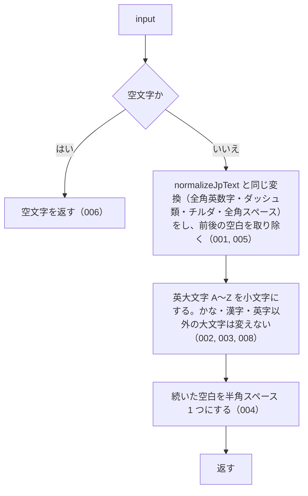

# normalizeSearchQuery

<!-- GENERATED FILE — 手で編集しない。シグネチャと説明は dist/index.d.ts、使用状況は mcp/*/src の import、利用者と得られる結果・扱わないこと・処理の流れ・仕様項目の一覧は specs/current/normalize_search_query/spec.md、使いどころは scripts/spec-pages/houki-abbreviations/normalize_search_query.md から。 -->

::: info
houki-abbreviations **v0.7.0** の `dist/index.d.ts` と `specs/current/normalize_search_query/spec.md` から自動生成しました（仕様 ID 8 件・2026-10-10）。手で編集しないでください。再生成は `node scripts/generate-reference.mjs` です。
:::

*関数 ・ v0.3.0 で追加 ・ houki-egov-mcp / houki-nta-mcp が使用*

検索クエリ向けの積極的な正規化。

`normalizeJpText` の処理に加えて以下を行う:
- ASCII 大文字 `A`〜`Z` → 小文字（全角の `Ａ`〜`Ｚ` は半角にしたうえで小文字）。
  小文字にするのはこの 52 字だけで、ローマ数字 `Ⅰ`・ギリシャ文字 `Α`・`À` などは
  変えない（v0.7.0 から。v0.6.1 までは `toLowerCase` で英字以外も小文字にしていた）
- 連続する空白文字 → 単一の半角スペース

houki-nta-mcp の FTS5 検索のように、ユーザー入力の表記ゆれを最大限
吸収したいケース向け。実際の DB 検索では、本関数の出力に対して
さらに FTS5 用のエスケープ（`"`、`^` など）を別途行うこと。

注意: この関数は「`PL法`」と「`pl法`」を同一視するため、
`resolveAbbreviation({ normalize: true })` の内部処理では使用していない
（`PL法` のような大文字混じりエントリを正しく解決するため、
width-only の `normalizeJpText` のみを使用）。

## 利用者と得られる結果

この関数の利用者と、利用者が渡すもの・得られる結果を示します。

- このパッケージを import するコード（houki-hub family の MCP サーバーなど）。利用者が入力した検索語を渡して、全文検索にかける前の文字列を受け取る。検索の構文に使う記号（`"` `^` など）のエスケープは呼び出し側が別に行う
- このパッケージの中ではどの関数もこの関数を使わない（`resolveAbbreviation` の `normalize` は大文字小文字を区別するため `normalizeJpText` を使う）

## シグネチャ

import して呼ぶときの形です。パッケージの型定義（`dist/index.d.ts`）から写しています。

```ts
function normalizeSearchQuery(input: string): string;
```

| 引数 | 説明 |
|---|---|
| `input` | 検索クエリ |

**戻り値**: 正規化された検索クエリ

## 例

型定義の JSDoc に書かれている例です。

::: details 例
```ts
normalizeSearchQuery('ＰＬ法');         // 'pl法'
normalizeSearchQuery(' 消    法 ');    // '消 法'（連続空白を単一化）
normalizeSearchQuery('１８３－２');     // '183-2'
```
:::

## 扱わないこと

この関数が意図して扱わないことです。

- 大文字小文字を区別したまま揃えること（`normalizeJpText`）
- 検索の構文に使う記号のエスケープ（呼び出し側が行う）
- 漢数字を算用数字にすること（`normalizeLawNum` / `kanjiToNumber`）
- ひらがなとカタカナ、半角カナと全角カナを同じにすること

## 処理の流れ

仕様書の「処理の流れ」の節を、図も含めてそのまま写しています。図が大きいので畳んでいます。

::: details 処理の流れの図（仕様書の写し）
図の中の番号は「できること」の仕様 ID の末尾 3 桁です。


:::

## 仕様項目の一覧

この関数の仕様項目 8 件の見出しです。仕様項目は受入テストと 1 対 1 で対応していて、条件と例は[仕様書ページ](/specs/houki-abbreviations/normalize_search_query)で読めます。

::: details 仕様項目の見出し（8 件）
| 仕様 ID | 仕様項目 |
|---|---|
| [001](/specs/houki-abbreviations/normalize_search_query#spec-abbr-normalize-search-query-001) | normalizeJpText と同じ全角→半角の変換をする |
| [002](/specs/houki-abbreviations/normalize_search_query#spec-abbr-normalize-search-query-002) | 英大文字を小文字にする |
| [003](/specs/houki-abbreviations/normalize_search_query#spec-abbr-normalize-search-query-003) | 漢字・かなは変えない |
| [004](/specs/houki-abbreviations/normalize_search_query#spec-abbr-normalize-search-query-004) | 続いた空白を半角スペース 1 つにする |
| [005](/specs/houki-abbreviations/normalize_search_query#spec-abbr-normalize-search-query-005) | 前後の空白を取り除く |
| [006](/specs/houki-abbreviations/normalize_search_query#spec-abbr-normalize-search-query-006) | 空文字には空文字を返す |
| [007](/specs/houki-abbreviations/normalize_search_query#spec-abbr-normalize-search-query-007) | null と undefined には空文字を返す |
| [008](/specs/houki-abbreviations/normalize_search_query#spec-abbr-normalize-search-query-008) | 英字以外の大文字は変えない |
:::

## 関連ページ

このページの元になった文書と、あわせて読むページです。

- [houki-abbreviations の解説](/lib/houki-abbreviations)
- [houki-abbreviations の API の一覧](/reference/lib/houki-abbreviations/)
- [normalizeSearchQuery の仕様書ページ](/specs/houki-abbreviations/normalize_search_query)
- [元の仕様書（GitHub、v0.7.0）](https://github.com/shuji-bonji/houki-abbreviations/blob/v0.7.0/specs/current/normalize_search_query/spec.md)
