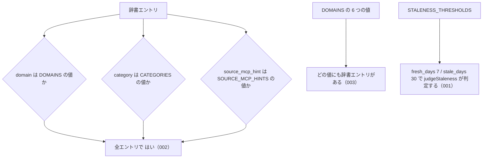

# 公開定数

<!-- GENERATED FILE — 手で編集しない。シグネチャと説明は dist/index.d.ts、使用状況は mcp/*/src の import、使う人と受け取るもの・できないこと・処理の流れ・約束の一覧は specs/current/public_constants/spec.md、使いどころは scripts/spec-pages/houki-abbreviations/public_constants.md から。 -->

::: info
houki-abbreviations **v0.7.0** の `dist/index.d.ts` と `specs/current/public_constants/spec.md` から自動生成しました（仕様 ID 9 件・2026-10-10）。手で編集しないでください。再生成は `node scripts/generate-reference.mjs` です。
:::

CATEGORIES / DOMAINS / LAW_TYPE_CODES / SOURCE_MCP_HINTS / STALENESS_THRESHOLDS

## 使う人と受け取るもの

この値を誰が呼び、何を渡して何を受け取るかを示します。

- houki-hub family の MCP サーバー（houki-egov-mcp・houki-nta-mcp など）。辞書エントリの `domain` / `category` / `source_mcp_hint` がとりうる値の一覧として読み、引数の検査や管轄の判定に使う。鮮度の判定では `STALENESS_THRESHOLDS` の境界を使う
- このパッケージの辞書データ（`src/data/*.json`）。各エントリの値はこれらの定数の値のどれかにする

## 値

このページで説明する値です。シグネチャと説明は、パッケージの型定義（`dist/index.d.ts`）から写しています。

### CATEGORIES

*定数 ・ v0.1.0 で追加 ・ houki-nta-mcp が使用*

```ts
const CATEGORIES: readonly ["constitution", "law", "cabinet-order", "imperial-ordinance", "ministerial-ordinance", "rule", "kokuji", "kihon-tsutatsu", "kobetsu-tsutatsu", "qa-jirei", "tax-answer", "hanrei", "saiketsu"];
```

法令カテゴリ — どの種類のテキスト（法律本体・通達・判例など）を指すか。

- 'constitution' / 'law' / 'cabinet-order' / 'imperial-ordinance' /
  'ministerial-ordinance' / 'rule' は e-Gov 配下（houki-egov-mcp）。
- 'kokuji'（告示）は各省庁公式サイト配下（houki-nta-mcp / houki-mhlw-mcp 等）。
  e-Gov 法令 API は告示を持たない。`law_type` は持たず、`law_id` は `null`（v0.7.0 から）。
- 'kihon-tsutatsu' / 'kobetsu-tsutatsu' / 'qa-jirei' / 'tax-answer' は
  各省庁公式サイト配下（houki-nta-mcp 等）。
- 'hanrei' / 'saiketsu' は判例・裁決系。

13 の値をこの順で持つ（`kokuji` は `rule` の次。v0.6.1 までは 12 の値）。
凍結されている（v0.7.0 から）。

### DOMAINS

*定数 ・ v0.1.0 で追加 ・ houki-egov-mcp / houki-nta-mcp が使用*

```ts
const DOMAINS: readonly ["tax", "labor", "accounting", "commercial", "civil", "administrative"];
```

ドメインタグ（実務分野での分類）

凍結されている（v0.7.0 から）。`push` や要素への代入は strict mode では `TypeError` になる。

### LAW_TYPE_CODES

*定数 ・ v0.1.0 で追加 ・ houki-egov-mcp が使用*

```ts
const LAW_TYPE_CODES: Readonly<{
    readonly Act: "AC";
    readonly CabinetOrder: "CO";
    readonly ImperialOrdinance: "IO";
    readonly MinisterialOrdinance: "MO";
    readonly Rule: "RU";
}>;
```

e-Gov law_id の種別プレフィックス

凍結されている（v0.7.0 から）。キーへの代入は strict mode では `TypeError` になる。

### SOURCE_MCP_HINTS

*定数 ・ v0.1.0 で追加 ・ houki-nta-mcp が使用*

```ts
const SOURCE_MCP_HINTS: readonly ["houki-egov", "houki-nta", "houki-mhlw", "houki-jaish", "houki-court", "houki-saiketsu"];
```

参照すべき MCP のヒント。

houki ファミリーの各 MCP が、自分の管轄外エントリを LLM に「正しい MCP に
誘導する」ために使う。

- 'houki-egov': e-Gov 法令API (憲法・法律・政令・勅令・府省令・規則。告示は持たない)
- 'houki-nta': 国税庁通達・告示・Q&A・タックスアンサー
- 'houki-mhlw': 厚労省通達・告示・通知
- 'houki-jaish': 労働安全衛生の通達（JAISH: 安全衛生情報センター）
- 'houki-court': 判例（裁判所サイト）
- 'houki-saiketsu': 国税不服審判所裁決

凍結されている（v0.7.0 から）。

### STALENESS_THRESHOLDS

*定数 ・ v0.4.1 で追加 ・ houki-egov-mcp / houki-nta-mcp が使用*

```ts
const STALENESS_THRESHOLDS: Readonly<{
    /** fresh と判定する境界 (この日数 **未満** なら fresh) */
    readonly fresh_days: 7;
    /** stale と判定する境界 (この日数 **未満** なら stale、それ以上は outdated) */
    readonly stale_days: 30;
}>;
```

family 共通の閾値定数 (日数)。

各 MCP は同じ感覚で staleness を判定するため本定数を参照する。
個別の MCP で異なる閾値が必要な場合は `judgeStaleness` をラップして
MCP 固有の閾値を使う関数を作ってよい。凍結されているので、キーへの代入は
strict mode では `TypeError` になり、`judgeStaleness` の境界は実行時に変えられない
（v0.7.0 から）。

## できないこと

この値が引き受けないことです。

- 値を追加・変更する手段を持つこと（凍結されている。009。値を変えるにはこのパッケージの新しい版が要る）
- 鮮度を判定すること（`judgeStaleness`）。この文書は境界の値だけを書く
- エントリの `law_id` の形を検査すること（`isValidLawId`）
- エントリの一覧を分野・種類・MCP サーバー別に返すこと（`listByDomain`・`listByCategory`・`listBySourceMcpHint`）

## 処理の流れ

仕様書の「処理の流れ」の節を、図も含めてそのまま写しています。図が大きいので畳んでいます。

::: details 処理の流れの図（仕様書の写し）
定数なので呼び出しの流れは無い。辞書エントリの値と定数の関係を示します。図の中の番号は「できること」の仕様 ID の末尾 3 桁です。


:::

## 約束の一覧

この値が守る約束 9 件の見出しです。約束は受入テストと 1 対 1 で対応していて、条件と例は[仕様書ページ](/specs/houki-abbreviations/public_constants)で読めます。

::: details 約束の見出し（9 件）
| 仕様 ID | 約束 |
|---|---|
| [001](/specs/houki-abbreviations/public_constants#spec-abbr-public-constants-001) | STALENESS_THRESHOLDS は fresh_days 7・stale_days 30 を持つ |
| [002](/specs/houki-abbreviations/public_constants#spec-abbr-public-constants-002) | 辞書の全エントリの domain・category・source_mcp_hint は定数の値のどれかである |
| [003](/specs/houki-abbreviations/public_constants#spec-abbr-public-constants-003) | DOMAINS のどの値にも辞書のエントリがある |
| [004](/specs/houki-abbreviations/public_constants#spec-abbr-public-constants-004) | LAW_TYPE_CODES は 5 つの法令種別と種別コードの対応を持つ |
| [005](/specs/houki-abbreviations/public_constants#spec-abbr-public-constants-005) | law_id と law_type の両方を持つエントリは、law_id の種別コードが LAW_TYPE_CODES と一致する |
| [006](/specs/houki-abbreviations/public_constants#spec-abbr-public-constants-006) | DOMAINS は 6 つの値をこの順で持つ |
| [007](/specs/houki-abbreviations/public_constants#spec-abbr-public-constants-007) | CATEGORIES は 13 の値をこの順で持つ |
| [008](/specs/houki-abbreviations/public_constants#spec-abbr-public-constants-008) | SOURCE_MCP_HINTS は 6 つの値をこの順で持つ |
| [009](/specs/houki-abbreviations/public_constants#spec-abbr-public-constants-009) | 公開定数は凍結されていて、代入は TypeError になる |
:::

## 関連ページ

このページの元になった文書と、あわせて読むページです。

- [houki-abbreviations の解説](/lib/houki-abbreviations)
- [houki-abbreviations の API の一覧](/reference/lib/houki-abbreviations/)
- [公開定数 の仕様書ページ](/specs/houki-abbreviations/public_constants)
- [元の仕様書（GitHub、v0.7.0）](https://github.com/shuji-bonji/houki-abbreviations/blob/v0.7.0/specs/current/public_constants/spec.md)
