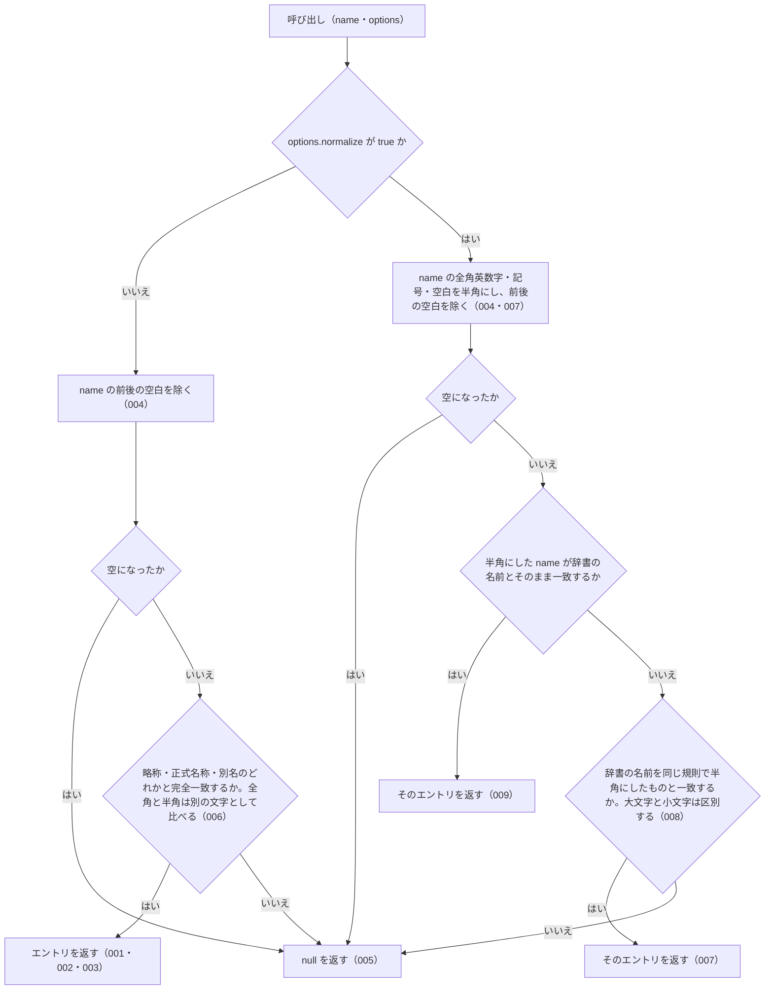

# resolveAbbreviation

<!-- GENERATED FILE — 手で編集しない。シグネチャと説明は dist/index.d.ts、使用状況は mcp/*/src の import、利用者と得られる結果・扱わないこと・処理の流れ・仕様項目の一覧は specs/current/resolve_abbreviation/spec.md、使いどころは scripts/spec-pages/houki-abbreviations/resolve_abbreviation.md から。 -->

::: info
houki-abbreviations **v0.7.0** の `dist/index.d.ts` と `specs/current/resolve_abbreviation/spec.md` から自動生成しました（仕様 ID 13 件・2026-10-10）。手で編集しないでください。再生成は `node scripts/generate-reference.mjs` です。
:::

*関数 ・ v0.1.0 で追加 ・ houki-egov-mcp / houki-nta-mcp が使用*

略称・通称・正式名称のいずれかから辞書エントリを引く。

- 前後の空白はトリム
- 完全一致のみ（部分一致はしない）
- 見つからなければ null
- `options.normalize` が `true` のとき、全角／半角の表記ゆらぎを吸収する

## 利用者と得られる結果

この関数の利用者と、利用者が渡すもの・得られる結果を示します。

- houki-hub family の MCP サーバー（houki-egov-mcp・houki-nta-mcp など）と、このパッケージを import する利用者のコード。`name` を渡して、その名前が辞書のどのエントリ（法令・通達）を指すかを受け取る

## シグネチャ

import して呼ぶときの形です。パッケージの型定義（`dist/index.d.ts`）から写しています。

```ts
function resolveAbbreviation(name: string, options?: ResolveAbbreviationOptions): AbbreviationEntry | null;
```

| 引数 | 説明 |
|---|---|
| `name` | 略称・通称・正式名称のいずれか |
| `options` | 照合オプション（省略可） |

**戻り値**: 該当エントリ、見つからなければ null

**関係する型**: [`AbbreviationEntry`](/reference/lib/houki-abbreviations/types#abbreviationentry)・[`ResolveAbbreviationOptions`](/reference/lib/houki-abbreviations/types#resolveabbreviationoptions)

## 例

型定義の JSDoc に書かれている例です。

::: details 例
```ts
resolveAbbreviation('消法')                         // → 消費税法
resolveAbbreviation('消費税法')                     // → 消費税法
resolveAbbreviation('消費税')                       // → 消費税法（aliases）
resolveAbbreviation('  消法  ')                    // → 消費税法（前後空白OK）
resolveAbbreviation('存在しない')                   // → null

// 正規化モード（v0.3.0〜）
resolveAbbreviation('　消法　', { normalize: true }); // → 消費税法（前後の全角スペース吸収）
resolveAbbreviation('消　法', { normalize: true });   // → null（途中の空白は取り除かない）
resolveAbbreviation('ＰＬ法', { normalize: true });   // → 製造物責任法（全角→半角）
resolveAbbreviation('ＰＬ法');                         // → null（normalize: false がデフォルト）
```
:::

## 扱わないこと

この関数が意図して扱わないことです。

- 部分一致で探すこと（`searchByName`）
- 似た名前（打ち間違い）から探すこと（`findSimilar` / `suggestCorrection`）
- e-Gov の法令 ID から引くこと（`lookupByLawId`）
- 法令番号から引くこと（`lookupByLawNum`）
- 1 件のエントリの名前をすべて返すこと（`getAllNames`）
- 文章の中から法令名を探すこと（`extractLawNames`）
- 1 回の呼び出しで複数の名前を引くこと
- 名前の途中にある空白を無視して照合すること（`normalize: true` でも、全角空白を半角空白にするだけで取り除かない。未決 1）
- 英字の大文字と小文字の違いを吸収すること（`normalize: true` でも区別する）
- 見つからなかったときに候補や理由を返すこと（`null` だけを返す）

## 処理の流れ

仕様書の「処理の流れ」の節を、図も含めてそのまま写しています。図が大きいので畳んでいます。

::: details 処理の流れの図（仕様書の写し）
`name` を受け取ってからエントリを返すまでに、何をどの順で確かめるかを示します。図の中の番号は「できること」の仕様 ID の末尾 3 桁です。


:::

## 仕様項目の一覧

この関数の仕様項目 13 件の見出しです。仕様項目は受入テストと 1 対 1 で対応していて、条件と例は[仕様書ページ](/specs/houki-abbreviations/resolve_abbreviation)で読めます。

::: details 仕様項目の見出し（13 件）
| 仕様 ID | 仕様項目 |
|---|---|
| [001](/specs/houki-abbreviations/resolve_abbreviation#spec-abbr-resolve-abbreviation-001) | 略称からエントリを返す |
| [002](/specs/houki-abbreviations/resolve_abbreviation#spec-abbr-resolve-abbreviation-002) | 正式名称からエントリを返す |
| [003](/specs/houki-abbreviations/resolve_abbreviation#spec-abbr-resolve-abbreviation-003) | 別名からエントリを返す |
| [004](/specs/houki-abbreviations/resolve_abbreviation#spec-abbr-resolve-abbreviation-004) | 前後の空白を除いてから照合する |
| [005](/specs/houki-abbreviations/resolve_abbreviation#spec-abbr-resolve-abbreviation-005) | 辞書に無い名前と空の名前には null を返す |
| [006](/specs/houki-abbreviations/resolve_abbreviation#spec-abbr-resolve-abbreviation-006) | 既定では全角と半角を別の文字として照合する |
| [007](/specs/houki-abbreviations/resolve_abbreviation#spec-abbr-resolve-abbreviation-007) | normalize: true では全角英字を半角にして照合する |
| [008](/specs/houki-abbreviations/resolve_abbreviation#spec-abbr-resolve-abbreviation-008) | normalize: true でも大文字と小文字は区別する |
| [009](/specs/houki-abbreviations/resolve_abbreviation#spec-abbr-resolve-abbreviation-009) | normalize: true でも、半角にする前から一致する名前は同じエントリを返す |
| [010](/specs/houki-abbreviations/resolve_abbreviation#spec-abbr-resolve-abbreviation-010) | 既定の照合でも前後の全角空白・タブ・改行を除く |
| [011](/specs/houki-abbreviations/resolve_abbreviation#spec-abbr-resolve-abbreviation-011) | normalize: false・空のオブジェクト・null の options は options を省いたときと同じ |
| [012](/specs/houki-abbreviations/resolve_abbreviation#spec-abbr-resolve-abbreviation-012) | normalize: true でも別名からエントリを返す |
| [013](/specs/houki-abbreviations/resolve_abbreviation#spec-abbr-resolve-abbreviation-013) | name が null・undefined のときは null を返す |
:::

## 関連ページ

このページの元になった文書と、あわせて読むページです。

- [houki-abbreviations の解説](/lib/houki-abbreviations)
- [houki-abbreviations の API の一覧](/reference/lib/houki-abbreviations/)
- [resolveAbbreviation の仕様書ページ](/specs/houki-abbreviations/resolve_abbreviation)
- [元の仕様書（GitHub、v0.7.0）](https://github.com/shuji-bonji/houki-abbreviations/blob/v0.7.0/specs/current/resolve_abbreviation/spec.md)
