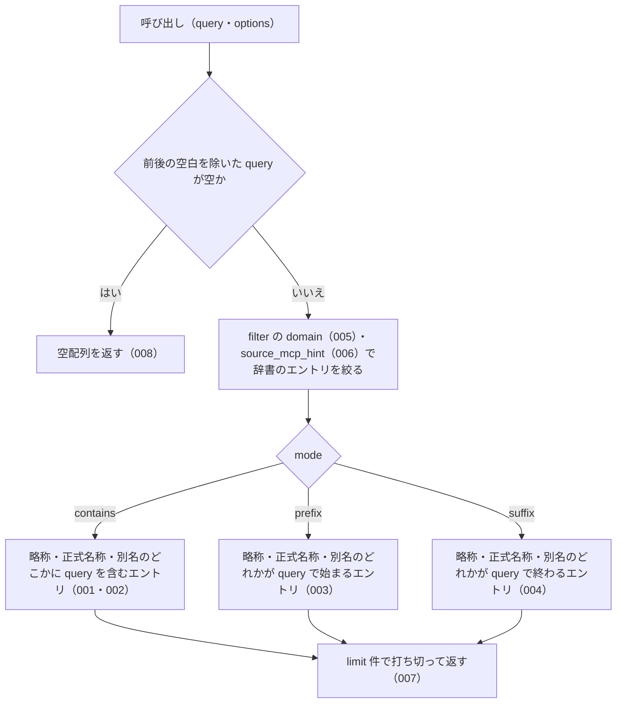

# searchByName

<!-- GENERATED FILE — 手で編集しない。シグネチャと説明は dist/index.d.ts、使用状況は mcp/*/src の import、利用者と得られる結果・扱わないこと・処理の流れ・仕様項目の一覧は specs/current/search_by_name/spec.md、使いどころは scripts/spec-pages/houki-abbreviations/search_by_name.md から。 -->

::: info
houki-abbreviations **v0.7.1** の `dist/index.d.ts` と `specs/current/search_by_name/spec.md` から自動生成しました（仕様 ID 20 件・2026-10-10）。手で編集しないでください。再生成は `node scripts/generate-reference.mjs` です。
:::

*関数 ・ v0.4.0 で追加 ・ family では未使用*

名前で検索 (部分一致)。`abbr` / `formal` / `aliases` のどれかにマッチする
エントリを返す。

## 利用者と得られる結果

この関数の利用者と、利用者が渡すもの・得られる結果を示します。

- houki-abbreviations を import する利用者（houki-nta-mcp・houki-egov-mcp などの MCP サーバー、または独自のコード）。`労働` のような名前の一部を渡して、略称・正式名称・別名のどれかにその文字列を含む辞書のエントリを受け取る

## シグネチャ

import して呼ぶときの形です。パッケージの型定義（`dist/index.d.ts`）から写しています。

```ts
function searchByName(query: string, options?: _SearchOptions): AbbreviationEntry[];
```

**関係する型**: [`AbbreviationEntry`](/reference/lib/houki-abbreviations/types#abbreviationentry)

## 例

型定義の JSDoc に書かれている例です。

::: details 例
```ts
import { searchByName } from '@shuji-bonji/houki-abbreviations';

searchByName('労働');
// → 労基法, 労契法, 労安衛法, ...

searchByName('税法', { mode: 'contains' });
// → 法人税法, 消費税法, 所得税法, ...

searchByName('労働', { filter: { domain: 'labor' }, limit: 10 });
```
:::

## 扱わないこと

この関数が意図して扱わないことです。

- 綴りの誤りを許して探すこと（`findSimilar`）
- 完全一致で 1 件に決めること（`resolveAbbreviation`）
- 英字の大文字・小文字の違いを同じとみなすこと（`searchByName('pl法')` は `PL法` を別名に持つ `製造物責任法` を返さず `[]`）
- 一致の近さで並べ替えること（返す順は辞書の並び。未決 1）
- 法令 ID や法令番号から探すこと（`lookupByLawId` / `lookupByLawNum`）

## 処理の流れ

仕様書の「処理の流れ」の節を、図も含めてそのまま写しています。図が大きいので畳んでいます。

::: details 処理の流れの図（仕様書の写し）
呼び出しを受けてから配列を返すまでに、何をどの順で確かめるかを示します。図の中の番号は「できること」の仕様 ID の末尾 3 桁です。


:::

## 仕様項目の一覧

この関数の仕様項目 20 件の見出しです。仕様項目は受入テストと 1 対 1 で対応していて、条件と例は[仕様書ページ](/specs/houki-abbreviations/search_by_name)で読めます。

::: details 仕様項目の見出し（20 件）
| 仕様 ID | 仕様項目 |
|---|---|
| [001](/specs/houki-abbreviations/search_by_name#spec-abbr-search-by-name-001) | 既定の contains で、query を含むエントリを返す |
| [002](/specs/houki-abbreviations/search_by_name#spec-abbr-search-by-name-002) | 別名（aliases）に一致したエントリも返す |
| [003](/specs/houki-abbreviations/search_by_name#spec-abbr-search-by-name-003) | prefix は query で始まる名前を持つエントリを返す |
| [004](/specs/houki-abbreviations/search_by_name#spec-abbr-search-by-name-004) | suffix は query で終わる名前を持つエントリを返す |
| [005](/specs/houki-abbreviations/search_by_name#spec-abbr-search-by-name-005) | filter.domain で分野を絞る |
| [006](/specs/houki-abbreviations/search_by_name#spec-abbr-search-by-name-006) | filter.source_mcp_hint で本文を持つ MCP を絞る |
| [007](/specs/houki-abbreviations/search_by_name#spec-abbr-search-by-name-007) | limit の件数で打ち切る |
| [008](/specs/houki-abbreviations/search_by_name#spec-abbr-search-by-name-008) | 空の query には空配列を返す |
| [009](/specs/houki-abbreviations/search_by_name#spec-abbr-search-by-name-009) | 一致したエントリを辞書の並びのまま返す |
| [010](/specs/houki-abbreviations/search_by_name#spec-abbr-search-by-name-010) | 複数の名前が一致しても 1 つのエントリは 1 回だけ返す |
| [011](/specs/houki-abbreviations/search_by_name#spec-abbr-search-by-name-011) | 既定では全角英数字を半角にしてから比べる |
| [012](/specs/houki-abbreviations/search_by_name#spec-abbr-search-by-name-012) | normalize が false のときは全角英数字をそのまま比べる |
| [013](/specs/houki-abbreviations/search_by_name#spec-abbr-search-by-name-013) | filter.category で文書の種類を絞る |
| [014](/specs/houki-abbreviations/search_by_name#spec-abbr-search-by-name-014) | filter に複数のキーを渡すと、すべてを満たすエントリだけを返す |
| [015](/specs/houki-abbreviations/search_by_name#spec-abbr-search-by-name-015) | filter のキーに空の配列を渡すと、そのキーでは絞らない |
| [016](/specs/houki-abbreviations/search_by_name#spec-abbr-search-by-name-016) | limit を省くと 50 件で打ち切る |
| [017](/specs/houki-abbreviations/search_by_name#spec-abbr-search-by-name-017) | 1 未満の limit には RangeError を投げる |
| [018](/specs/houki-abbreviations/search_by_name#spec-abbr-search-by-name-018) | 小数の limit には RangeError を投げる |
| [019](/specs/houki-abbreviations/search_by_name#spec-abbr-search-by-name-019) | NaN・Infinity・数でない limit には例外を投げる |
| [020](/specs/houki-abbreviations/search_by_name#spec-abbr-search-by-name-020) | 500 を超える limit には RangeError を投げる |
:::

## 関連ページ

このページの元になった文書と、あわせて読むページです。

- [houki-abbreviations の解説](/lib/houki-abbreviations)
- [houki-abbreviations の API の一覧](/reference/lib/houki-abbreviations/)
- [searchByName の仕様書ページ](/specs/houki-abbreviations/search_by_name)
- [元の仕様書（GitHub、v0.7.1）](https://github.com/shuji-bonji/houki-abbreviations/blob/v0.7.1/specs/current/search_by_name/spec.md)
