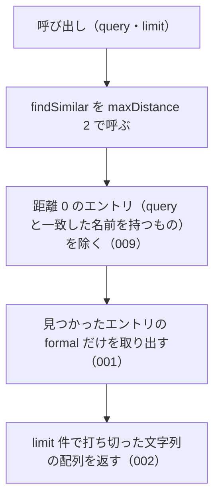

# suggestCorrection

<!-- GENERATED FILE — 手で編集しない。シグネチャと説明は dist/index.d.ts、使用状況は mcp/*/src の import、利用者と得られる結果・扱わないこと・処理の流れ・仕様項目の一覧は specs/current/suggest_correction/spec.md、使いどころは scripts/spec-pages/houki-abbreviations/suggest_correction.md から。 -->

::: info
houki-abbreviations **v0.7.1** の `dist/index.d.ts` と `specs/current/suggest_correction/spec.md` から自動生成しました（仕様 ID 9 件・2026-10-10）。手で編集しないでください。再生成は `node scripts/generate-reference.mjs` です。
:::

*関数 ・ v0.4.0 で追加 ・ family では未使用*

「もしかして」サジェスト。`findSimilar` の薄いラッパで、上位 N 件の
`formal` だけを文字列配列で返す。LLM プロンプトでそのまま使える形。
`query` と一致した名前を持つエントリ（`distance: 0`）は入れない（v0.7.0 から）。

## 利用者と得られる結果

この関数の利用者と、利用者が渡すもの・得られる結果を示します。

- houki-abbreviations を import する利用者（houki-nta-mcp・houki-egov-mcp などの MCP サーバー、または独自のコード）。辞書に無い名前を渡して、「もしかして」として示す正式名称の一覧を文字列の配列で受け取る。LLM へのプロンプトにそのまま入れる用途を想定する

## シグネチャ

import して呼ぶときの形です。パッケージの型定義（`dist/index.d.ts`）から写しています。

```ts
function suggestCorrection(query: string, limit?: number): string[];
```

## 例

型定義の JSDoc に書かれている例です。

::: details 例
```ts
suggestCorrection('労働基準法施行例');
// → ['労働基準法施行規則']
suggestCorrection('民法');
// → ['民事訴訟法', '民事執行法', '民事保全法']（民法 自身は入らない）
```
:::

## 扱わないこと

この関数が意図して扱わないことです。

- 編集距離の上限（`maxDistance`）や `filter` を指定すること（指定したいときは `findSimilar` を使う）
- どの名前に近かったか・どれだけ近かったかを返すこと（`findSimilar` の `matchedKey` と `distance`）
- 名前の一部で探すこと（`searchByName`）

## 処理の流れ

仕様書の「処理の流れ」の節を、図も含めてそのまま写しています。図が大きいので畳んでいます。

::: details 処理の流れの図（仕様書の写し）
呼び出しを受けてから配列を返すまでの流れを示します。図の中の番号は「できること」の仕様 ID の末尾 3 桁です。


:::

## 仕様項目の一覧

この関数の仕様項目 9 件の見出しです。仕様項目は受入テストと 1 対 1 で対応していて、条件と例は[仕様書ページ](/specs/houki-abbreviations/suggest_correction)で読めます。

::: details 仕様項目の見出し（9 件）
| 仕様 ID | 仕様項目 |
|---|---|
| [001](/specs/houki-abbreviations/suggest_correction#spec-abbr-suggest-correction-001) | 近いエントリの正式名称を文字列の配列で返す |
| [002](/specs/houki-abbreviations/suggest_correction#spec-abbr-suggest-correction-002) | limit の件数で打ち切る |
| [003](/specs/houki-abbreviations/suggest_correction#spec-abbr-suggest-correction-003) | limit を省くと 5 件で打ち切る |
| [004](/specs/houki-abbreviations/suggest_correction#spec-abbr-suggest-correction-004) | 1 未満の limit には RangeError を投げる |
| [005](/specs/houki-abbreviations/suggest_correction#spec-abbr-suggest-correction-005) | 空の query には空配列を返す |
| [006](/specs/houki-abbreviations/suggest_correction#spec-abbr-suggest-correction-006) | 小数の limit には RangeError を投げる |
| [007](/specs/houki-abbreviations/suggest_correction#spec-abbr-suggest-correction-007) | NaN・Infinity・数でない limit には例外を投げる |
| [008](/specs/houki-abbreviations/suggest_correction#spec-abbr-suggest-correction-008) | 500 を超える limit には RangeError を投げる |
| [009](/specs/houki-abbreviations/suggest_correction#spec-abbr-suggest-correction-009) | query と一致した名前を持つエントリは候補に入れない |
:::

## 関連ページ

このページの元になった文書と、あわせて読むページです。

- [houki-abbreviations の解説](/lib/houki-abbreviations)
- [houki-abbreviations の API の一覧](/reference/lib/houki-abbreviations/)
- [suggestCorrection の仕様書ページ](/specs/houki-abbreviations/suggest_correction)
- [元の仕様書（GitHub、v0.7.1）](https://github.com/shuji-bonji/houki-abbreviations/blob/v0.7.1/specs/current/suggest_correction/spec.md)
