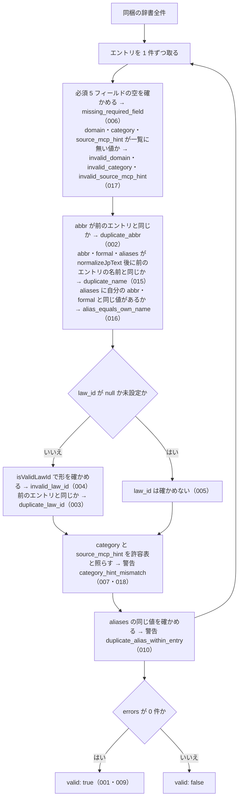

# validateAllEntries

<!-- GENERATED FILE — 手で編集しない。シグネチャと説明は dist/index.d.ts、使用状況は mcp/*/src の import、利用者と得られる結果・扱わないこと・処理の流れ・仕様項目の一覧は specs/current/validate_all_entries/spec.md、使いどころは scripts/spec-pages/houki-abbreviations/validate_all_entries.md から。 -->

::: info
houki-abbreviations **v0.7.1** の `dist/index.d.ts` と `specs/current/validate_all_entries/spec.md` から自動生成しました（仕様 ID 17 件・2026-10-10）。手で編集しないでください。再生成は `node scripts/generate-reference.mjs` です。
:::

*関数 ・ v0.5.0 で追加 ・ family では未使用*

辞書全体の静的整合性をチェックする。CI 用途を想定。

## 利用者と得られる結果

この関数の利用者と、利用者が渡すもの・得られる結果を示します。

- houki-abbreviations の辞書を編集する人と CI。辞書にエントリを足したり直したりしたあとで呼び、同梱の辞書全件に重複・欠損・形の誤りが無いかを受け取る
- `npm run validate`（`dist/index.js` の `validateAllEntries` を呼び、警告を `WARN:`、エラーを `ERROR:` で出力し、エラーがあれば終了コード 1 で終わる）

## シグネチャ

import して呼ぶときの形です。パッケージの型定義（`dist/index.d.ts`）から写しています。

```ts
function validateAllEntries(): _ValidationReport;
```

## 例

型定義の JSDoc に書かれている例です。

::: details 例
```ts
import { validateAllEntries } from '@shuji-bonji/houki-abbreviations';

const report = validateAllEntries();
if (!report.valid) {
  console.error(report.errors);
  process.exit(1);
}
report.warnings.forEach((w) => console.warn(w.message));
```
:::

## 扱わないこと

この関数が意図して扱わないことです。

- 利用者が用意したエントリの配列を渡して検査すること（公開する `validateAllEntries` は引数を取らず、同梱の辞書だけを検査する）
- `law_id` の法令が e-Gov に実在するか、`formal` や `law_num` が e-Gov の値と一致するかを確かめること（e-Gov API を呼ぶ `scripts/verify-law-ids.mjs` で行う。パッケージには含まれない）
- `formal` の重複、`aliases` がほかのエントリの `formal` や `aliases` と同じことを見つけること（未決 3）
- `category` / `domain` / `source_mcp_hint` の値が決められた一覧にあるかを確かめること（未決 2）
- 誤りを直すこと（見つけて返すだけで、辞書は変えない）

## 処理の流れ

仕様書の「処理の流れ」の節を、図も含めてそのまま写しています。図が大きいので畳んでいます。

::: details 処理の流れの図（仕様書の写し）
辞書のエントリを 1 件ずつ、次の順で確かめます。図の中の番号は「できること」の仕様 ID の末尾 3 桁です。


:::

## 仕様項目の一覧

この関数の仕様項目 17 件の見出しです。仕様項目は受入テストと 1 対 1 で対応していて、条件と例は[仕様書ページ](/specs/houki-abbreviations/validate_all_entries)で読めます。

::: details 仕様項目の見出し（17 件）
| 仕様 ID | 仕様項目 |
|---|---|
| [001](/specs/houki-abbreviations/validate_all_entries#spec-abbr-validate-all-entries-001) | エラーが無ければ valid: true と空の errors を返す |
| [002](/specs/houki-abbreviations/validate_all_entries#spec-abbr-validate-all-entries-002) | abbr の重複をエラーにする |
| [003](/specs/houki-abbreviations/validate_all_entries#spec-abbr-validate-all-entries-003) | law_id の重複をエラーにする |
| [004](/specs/houki-abbreviations/validate_all_entries#spec-abbr-validate-all-entries-004) | 形の誤った law_id をエラーにする |
| [005](/specs/houki-abbreviations/validate_all_entries#spec-abbr-validate-all-entries-005) | law_id が null のエントリは law_id を確かめない |
| [006](/specs/houki-abbreviations/validate_all_entries#spec-abbr-validate-all-entries-006) | 必須フィールドの欠けをエラーにする |
| [007](/specs/houki-abbreviations/validate_all_entries#spec-abbr-validate-all-entries-007) | category と source_mcp_hint の組み合わせの食い違いは警告にする |
| [009](/specs/houki-abbreviations/validate_all_entries#spec-abbr-validate-all-entries-009) | v0.6.0 の同梱辞書は全件エラーなし |
| [010](/specs/houki-abbreviations/validate_all_entries#spec-abbr-validate-all-entries-010) | 1 件のエントリの中で重なる別名は警告にする |
| [011](/specs/houki-abbreviations/validate_all_entries#spec-abbr-validate-all-entries-011) | law_id が空文字なら形の誤りにする |
| [012](/specs/houki-abbreviations/validate_all_entries#spec-abbr-validate-all-entries-012) | 形の誤った law_id でも重なれば重複のエラーにする |
| [013](/specs/houki-abbreviations/validate_all_entries#spec-abbr-validate-all-entries-013) | エラーと警告には問題のあったエントリが付く |
| [014](/specs/houki-abbreviations/validate_all_entries#spec-abbr-validate-all-entries-014) | エラーと警告の message に該当エントリの abbr が入る |
| [015](/specs/houki-abbreviations/validate_all_entries#spec-abbr-validate-all-entries-015) | 別のエントリと重なる名前をエラーにする |
| [016](/specs/houki-abbreviations/validate_all_entries#spec-abbr-validate-all-entries-016) | 自分の abbr・formal と同じ別名をエラーにする |
| [017](/specs/houki-abbreviations/validate_all_entries#spec-abbr-validate-all-entries-017) | 一覧に無い domain・category・source_mcp_hint をエラーにする |
| [018](/specs/houki-abbreviations/validate_all_entries#spec-abbr-validate-all-entries-018) | kokuji の source_mcp_hint は houki-nta か houki-mhlw |
:::

## 関連ページ

このページの元になった文書と、あわせて読むページです。

- [houki-abbreviations の解説](/lib/houki-abbreviations)
- [houki-abbreviations の API の一覧](/reference/lib/houki-abbreviations/)
- [validateAllEntries の仕様書ページ](/specs/houki-abbreviations/validate_all_entries)
- [元の仕様書（GitHub、v0.7.1）](https://github.com/shuji-bonji/houki-abbreviations/blob/v0.7.1/specs/current/validate_all_entries/spec.md)
