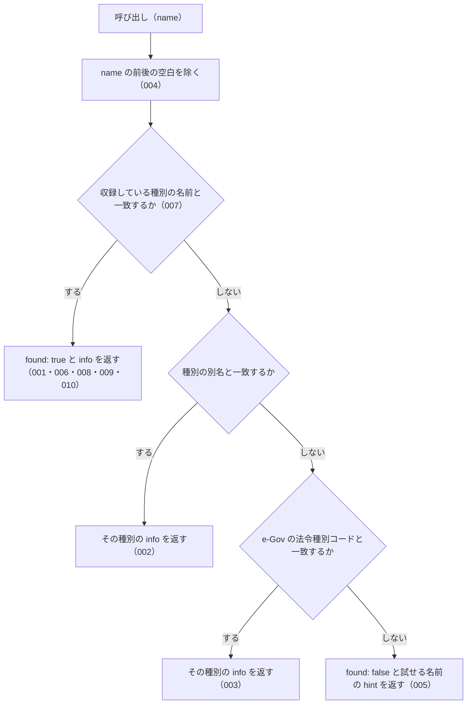

# explain_law_type

<!-- GENERATED FILE — 手で編集しない。説明と引数はサーバーの tools/list、呼び出し例は scripts/reference-examples/houki-egov/ja/explain_law_type.md、使う人と受け取るもの・できないこと・処理の流れ・約束の一覧は specs/current/explain_law_type/spec.md、使いどころは scripts/spec-pages/houki-egov/explain_law_type.md から。 -->

::: info
houki-egov-mcp **v0.20.0** の `tools/list` と `specs/current/explain_law_type/spec.md` から自動生成しました（仕様 ID 22 件・2026-10-10）。手で編集しないでください。再生成は `node scripts/generate-reference.mjs` です。
:::

法令種別（憲法・法律・政令・省令・規則・条例・告示・通達 等）の制定主体・階層上の位置・国民への拘束力・実務上の注意点を解説する。法務専門家でない利用者が「政令と省令の違い」「通達は守らなくていいのか」等を確認するための知識ツール。

## 使う人と受け取るもの

このツールを誰が呼び、何を渡して何を受け取るかを示します。

- MCP クライアント（Claude などの LLM、または CLI から呼ぶ人）。法令種別の名前（`政令`・`通達` など）を渡して、その種別を誰が定めるか・法令の階層のどこにあるか・国民を拘束するか・罰則を設けられるかの解説を受け取る。法務の専門家でない利用者が「政令と省令の違い」「通達は守らなくてよいのか」を確かめるのに使う

## 引数

呼び出すときに渡す値です。動いているサーバーの `tools/list` から写しています。

| 引数 | 型 | 必須 | 既定値 | 説明 |
|---|---|---|---|---|
| `name` | string (minLength 1) | **必須** |  | 法令種別の名前。例: "法律", "政令", "省令", "規則", "条例", "告示", "通達", "訓令", "憲法"。aliases と e-Gov の法令種別コードも解決します（例: "施行令" → 政令、"施行規則" → 省令、"Act" → 法律、"Constitution" → 憲法、"Rule" → 規則） |

## 呼び出し例

実際に呼び出したときの引数と応答です。版と日付は実測したときのものです。

::: details 呼び出し例 — 「通達は守らなくてよいのか」
- 実測: v0.20.0（2026-10-05）
- ローカル DB: 不要（サーバー内蔵の知識）

**引数**

```jsonc
{ "name": "通達" }
```

**返る JSON**

```jsonc
{
  "name": "通達",
  "found": true,
  "info": {
    "name": "通達",
    "aliases": ["基本通達", "取扱通達"],
    "enacting_body": "上級行政機関（各省庁・国税庁・最高裁等）",
    "hierarchy_rank": 99,
    "level": "agency-internal",
    "binds_citizens": false,
    "can_set_penalties": false,
    "description": "行政機関内部に対する解釈指針・運用指示。**法令ではなく、国民を直接拘束しない**（裁判所も通達には拘束されない）。ただし行政の運用は通達に従って行われるため、**実務上は通達を踏まえないと申請等で不利益**を受けることがある。…",
    "examples": ["消費税法基本通達（消基通）", "所得税基本通達（所基通）", "法人税基本通達（法基通）", "電子帳簿保存法取扱通達", "36協定関係の厚生労働省通達"],
    "sources": [
      { "label": "国税庁ウェブサイト", "url": "https://www.nta.go.jp/law/tsutatsu/" },
      { "label": "厚生労働省 法令等データベース", "url": "https://www.mhlw.go.jp/hourei_db/" },
      { "label": "安全衛生情報センター（JAISH）", "url": "https://www.jaish.gr.jp/" }
    ],
    "notes": [
      "「AI が通達を引用したから OK」とは言えない — 法的根拠は法律・政令・省令にある",
      "税務署・労基署等は通達に従って判断するため、実務では確認必須",
      "e-Gov には掲載されない — 各省庁サイト経由で取得"
    ]
  },
  "related_tools": ["search_law", "get_law", "get_toc"],
  "see_also": "https://github.com/shuji-bonji/houki-egov-mcp/blob/main/docs/LAW-HIERARCHY.md"
}
```

`binds_citizens: false` が、通達が国民を拘束しないことを表します。「施行令」「施行規則」「Act」のような別名も `name` に渡せます。`see_also` は法令の階層をまとめた文書の URL です。
:::

## できないこと

このツールが引き受けないことです。

- 個々の法令（例: `消費税法施行令`）がどの種別かを判定すること（法令の種別は `search_law` や `get_law` の応答の `law_type`）
- 法令や通達の本文を返すこと
- 通達・条例・告示を e-Gov から取ること（`sources` で取得元を示すだけ）
- 個別の事案で、ある通達や告示に従う必要があるかを判断すること

## 処理の流れ

仕様書の「処理の流れ」の節を、図も含めてそのまま写しています。図が大きいので畳んでいます。

::: details 処理の流れの図（仕様書の写し）
呼び出しを受けてから応答を返すまでに、何をどの順で確かめるかを示します。図の中の番号は「できること」の仕様 ID の末尾 3 桁です。


:::

## 約束の一覧

このツールが守る約束 22 件の見出しです。約束は受入テストと 1 対 1 で対応していて、条件と例は[仕様書ページ](/specs/houki-egov/explain_law_type)で読めます。

::: details 約束の見出し（22 件）
| 仕様 ID | 約束 |
|---|---|
| [001](/specs/houki-egov/explain_law_type#spec-egov-explain-law-type-001) | 種別の名前から解説を返す |
| [002](/specs/houki-egov/explain_law_type#spec-egov-explain-law-type-002) | 別名から、その種別の解説を返す |
| [003](/specs/houki-egov/explain_law_type#spec-egov-explain-law-type-003) | e-Gov の法令種別コードから、その種別の解説を返す |
| [004](/specs/houki-egov/explain_law_type#spec-egov-explain-law-type-004) | 前後の空白を除いてから照合する |
| [005](/specs/houki-egov/explain_law_type#spec-egov-explain-law-type-005) | 知らない名前は、エラーにせず `found: false` と試せる名前を返す |
| [006](/specs/houki-egov/explain_law_type#spec-egov-explain-law-type-006) | `info` のフィールド |
| [007](/specs/houki-egov/explain_law_type#spec-egov-explain-law-type-007) | 収録している種別 |
| [008](/specs/houki-egov/explain_law_type#spec-egov-explain-law-type-008) | `hierarchy_rank` は憲法・法律・政令・省令の順に大きくなる |
| [009](/specs/houki-egov/explain_law_type#spec-egov-explain-law-type-009) | 通達と訓令は国民を直接拘束しない |
| [010](/specs/houki-egov/explain_law_type#spec-egov-explain-law-type-010) | 罰則を設けられるのは法律・政令・省令・条例で、通達と告示は設けられない |
| [011](/specs/houki-egov/explain_law_type#spec-egov-explain-law-type-011) | `found: true` の応答は `related_tools` を持つ |
| [012](/specs/houki-egov/explain_law_type#spec-egov-explain-law-type-012) | `info` の任意のフィールド `aliases`・`law_type_code`・`notes` |
| [013](/specs/houki-egov/explain_law_type#spec-egov-explain-law-type-013) | `sources` の要素は `label` と `url` を持ち、`url` は空文字のことがある |
| [014](/specs/houki-egov/explain_law_type#spec-egov-explain-law-type-014) | `found: false` の応答は、収録している種別の名前を `next_actions` で示す |
| [015](/specs/houki-egov/explain_law_type#spec-egov-explain-law-type-015) | 応答の `name` は渡した値のまま返す |
| [016](/specs/houki-egov/explain_law_type#spec-egov-explain-law-type-016) | 大文字と小文字、全角と半角を区別して照合する |
| [017](/specs/houki-egov/explain_law_type#spec-egov-explain-law-type-017) | 府令・内閣府令は省令、基本通達・取扱通達は通達の解説を返す |
| [018](/specs/houki-egov/explain_law_type#spec-egov-explain-law-type-018) | `Object.prototype` のプロパティの名前は知らない名前として `found: false` を返す |
| [019](/specs/houki-egov/explain_law_type#spec-egov-explain-law-type-019) | name が空文字・空白だけのときは収録している種別の表と照合せずに `INVALID_ARGUMENT` を返す |
| [020](/specs/houki-egov/explain_law_type#spec-egov-explain-law-type-020) | `see_also` は MCP クライアントから開ける GitHub の URL |
| [021](/specs/houki-egov/explain_law_type#spec-egov-explain-law-type-021) | `通知` は `通達` と別の種別として解説し、`通達` の別名に入れない |
| [022](/specs/houki-egov/explain_law_type#spec-egov-explain-law-type-022) | e-Gov の法令種別コード `Constitution`・`Rule` から、憲法・規則の解説を返す |
:::

## 関連ページ

このページの元になった文書と、あわせて読むページです。

- [houki-egov-mcp の解説](/mcp/houki-egov)
- [houki-egov-mcp のツール一覧](/reference/mcp/houki-egov/)
- [explain_law_type の仕様書ページ](/specs/houki-egov/explain_law_type)
- [元の仕様書（GitHub、v0.20.0）](https://github.com/shuji-bonji/houki-egov-mcp/blob/v0.20.0/specs/current/explain_law_type/spec.md)
