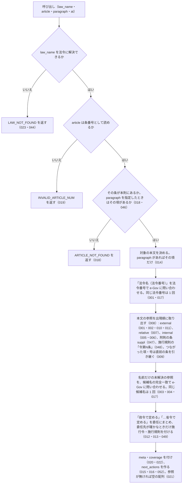

# get_article_references

<!-- GENERATED FILE — 手で編集しない。説明と引数はサーバーの tools/list、呼び出し例は scripts/reference-examples/houki-egov/ja/get_article_references.md、使う人と受け取るもの・できないこと・処理の流れ・約束の一覧は specs/current/get_article_references/spec.md、使いどころは scripts/spec-pages/houki-egov/get_article_references.md から。 -->

::: info
houki-egov-mcp **v0.20.0** の `tools/list` と `specs/current/get_article_references/spec.md` から自動生成しました（仕様 ID 52 件・2026-10-10）。手で編集しないでください。再生成は `node scripts/generate-reference.mjs` です。
:::

条文本文が引用している参照を取り出します。対象は本則の条だけです（附則の条の本文は get_law の suppl_index で読めます）。他法令の条（法令名と法令番号から law_id を解決）、同一法令内の条・項・号、本文の「附則第N条」（kind: "suppl"。どの附則の条かは特定しません）、「政令で定める」「財務省令で定める」の委任を返し、解決できた参照に get_law（条の無い他法令の参照には get_toc）の引数を next_actions で付けます。委任先は法令単位で、政令は施行令、省令・府令は施行規則を定めた命令の名前が委任の文言と合うときだけ付け、確かでないときは target_law: null にします。「前項」「同法」は解決しません。正規表現で取れた範囲だけを返し、網羅性は主張しません。

## 使う人と受け取るもの

このツールを誰が呼び、何を渡して何を受け取るかを示します。

- MCP クライアント（Claude などの LLM、または CLI から呼ぶ人）。`law_name` と `article`（任意で `paragraph`・`at`）を渡して、その条（または項）の本文が引用している他法令の条・同一法令内の条項号・「政令で定める」などの委任を受け取り、`next_actions` で次に読む条を知る

## 引数

呼び出すときに渡す値です。動いているサーバーの `tools/list` から写しています。

| 引数 | 型 | 必須 | 既定値 | 説明 |
|---|---|---|---|---|
| `law_name` | string (minLength 1) | **必須** |  | 法令名または略称。例: "所得税法", "所法" |
| `article` | string (minLength 1) | **必須** |  | 条番号。例: "57の2", "第57条の2", "第五十七条の二" |
| `paragraph` | integer (≥ 1) | 任意 |  | 項番号（1 以上の整数）。指定するとその項の本文だけを対象にする。省略時は条全体 |
| `at` | string | 任意 |  | 時点指定。YYYY-MM-DD 形式（get_law と同じ） |

## 呼び出し例

実際に呼び出したときの引数と応答です。版と日付は実測したときのものです。

::: details 呼び出し例 — 「所得税法 57 条の 2 第 2 項が引いている法令」
- 実測: v0.20.0（2026-10-05）
- ローカル DB: 不要（`next_actions` の `search_fulltext` を実行するときだけ必要）

**引数**

```jsonc
{ "law_name": "所得税法", "article": "57の2", "paragraph": 2 }
```

**返る JSON**

```jsonc
{
  "meta": {
    "law_id": "340AC0000000033",
    "title": "所得税法",
    "law_num": "昭和四十年法律第三十三号",
    "retrieved_at": "2026-10-04T20:19:27.014Z",
    "url": "https://laws.e-gov.go.jp/law/340AC0000000033",
    "at": null,
    "article": "57の2",
    "paragraph": 2
  },
  "references": [
    {
      "kind": "relative",
      "raw": "前項",
      "resolved": false
    },
    {
      "kind": "internal",
      "raw": "第二十八条第一項",
      "article": "28",
      "paragraph": 1
    },
    {
      "kind": "external",
      "raw": "雇用保険法（昭和四十九年法律第百十六号）第十条第五項第一号",
      "law_name": "雇用保険法",
      "law_num": "昭和四十九年法律第百十六号",
      "law_id": "349AC0000000116",
      "article": "10",
      "paragraph": 5,
      "item": "1",
      "resolved": true
    },
    {
      "kind": "external",
      "raw": "母子及び父子並びに寡婦福祉法（昭和三十九年法律第百二十九号）第三十一条第一号",
      "law_name": "母子及び父子並びに寡婦福祉法",
      "law_num": "昭和三十九年法律第百二十九号",
      "law_id": "339AC0000000129",
      "article": "31",
      "item": "1",
      "resolved": true
    },
    {
      "kind": "relative",
      "raw": "同法第三十一条の十",
      "resolved": false
    },
    {
      "kind": "relative",
      "raw": "同号",
      "resolved": false
    },
    {
      "kind": "external",
      "raw": "職業能力開発促進法第三十条の三",
      "law_name": "職業能力開発促進法",
      "article": "30の3",
      "resolved": true,
      "law_num": "昭和四十四年法律第六十四号",
      "law_id": "344AC0000000064"
    },
    {
      "kind": "relative",
      "raw": "次号",
      "resolved": false
    },
    {
      "kind": "external",
      "raw": "雇用保険法第六十条の二第一項",
      "law_name": "雇用保険法",
      "law_num": "昭和四十九年法律第百十六号",
      "law_id": "349AC0000000116",
      "article": "60の2",
      "paragraph": 1,
      "resolved": true
    },
    {
      "kind": "relative",
      "raw": "同号",
      "resolved": false
    }
  ],
  "delegations": [
    {
      "kind": "delegation",
      "raw": "財務省令で定める",
      "count": 7,
      "target": "enforcement_rule",
      "target_law": {
        "relation": "enforcement_rule",
        "law_id": "340M50000040011",
        "title": "所得税法施行規則",
        "url": "https://laws.e-gov.go.jp/law/340M50000040011"
      }
    },
    {
      "kind": "delegation",
      "raw": "政令で定める",
      "count": 7,
      "target": "enforcement_order",
      "target_law": {
        "relation": "enforcement_order",
        "law_id": "340CO0000000096",
        "title": "所得税法施行令",
        "url": "https://laws.e-gov.go.jp/law/340CO0000000096"
      }
    }
  ],
  "coverage": {
    "method": "regex",
    "note": "本文の文字列から正規表現で取れた参照だけを返しています。取れなかった参照があっても検出できません。「前項」「同法」「同条」などは解決していません（resolved: false）。法令名の候補が e-Gov に無かった参照も resolved: false のままです。委任先の条は特定していません（target_law は法令単位）。網羅性は保証しません"
  },
  "next_actions": [
    {
      "action": "get_law",
      "reason": "同一法令内の参照先を読めます",
      "example": {
        "law_name": "所得税法",
        "article": "28",
        "paragraph": 1
      }
    },
    {
      "action": "get_law",
      "reason": "引用先の条を読めます",
      "example": {
        "law_name": "雇用保険法",
        "article": "10",
        "paragraph": 5,
        "item": "1"
      }
    },
    {
      "action": "get_law",
      "reason": "引用先の条を読めます",
      "example": {
        "law_name": "母子及び父子並びに寡婦福祉法",
        "article": "31",
        "item": "1"
      }
    },
    {
      "action": "get_law",
      "reason": "引用先の条を読めます",
      "example": {
        "law_name": "職業能力開発促進法",
        "article": "30の3"
      }
    },
    {
      "action": "get_law",
      "reason": "引用先の条を読めます",
      "example": {
        "law_name": "雇用保険法",
        "article": "60の2",
        "paragraph": 1
      }
    },
    {
      "action": "search_fulltext",
      "reason": "所得税法施行規則の中で第57条の2を受けている条を探せます（ローカル DB がある場合。無ければ get_toc で目次から探してください）",
      "example": {
        "keyword": "所得税法施行規則 法第五十七条の二"
      }
    },
    {
      "action": "search_fulltext",
      "reason": "所得税法施行令の中で第57条の2を受けている条を探せます（ローカル DB がある場合。無ければ get_toc で目次から探してください）",
      "example": {
        "keyword": "所得税法施行令 法第五十七条の二"
      }
    }
  ]
}
```

`kind` は 4 つです。`external` は他法令への参照で、`law_name`（法令番号）の形なら法令番号で、法令番号が無ければ候補名の完全一致で `law_id` を解決します（職業能力開発促進法がその例）。解決できなければ `resolved: false` のまま `law_name` に候補が入ります。`internal` は同一法令内の参照で、条も項も無い「第N号」にはその文が属する項の番号が付きます。`relative`（「前項」「同法第三十一条の十」「同号」）は解決しません。`suppl` は本文の「附則第N条」で、どの附則の条かは特定せず `resolved: false` で返します（v0.18.0 から。それまでは本則の条を指す `internal` にしていました）。この条の本文には附則への参照が無いので、例には出てきません。`delegations[]` の `target_law` は法令単位で、委任先が無いときや確かでないときは `null` です（省令・府令は、施行規則を定めた命令の名前が委任の文言と合うときだけ付きます。この例の施行規則の法令番号は `昭和四十年大蔵省令第十一号` で、`大蔵省令` は `財務省令` と同じ省に当たるものとして扱うので付いています）。どの条が受けているかは `next_actions` の `search_fulltext`（ローカル DB）か `get_toc` で探します。`next_actions[].example` はそのまま `get_law` の引数になります。
:::

## できないこと

このツールが引き受けないことです。

- 「前項」「同法」「同条」「次条」などが指す条・法令を特定すること（`relative` で `resolved: false` のまま返す）
- 委任先の条を特定すること（`target_law` は法令単位。条は `search_fulltext` や `get_toc` で探す）
- 条文の見出し（条見出し・条名）から参照を取り出すこと（本文の文だけを対象にする）
- 参照先の条文の本文を返すこと（`next_actions` で `get_law` を案内するだけ）
- 引用している参照が網羅されていると保証すること（正規表現で取れた範囲だけ）
- 逆方向の参照（この条を引用している他の条）を返すこと
- 附則の中の条を対象にすること（本則の条だけ。附則の条は `get_law` の `suppl_index` で読む）
- 本文の「附則第N条」が、どの附則の条かを特定すること（`kind: "suppl"`・`resolved: false` で返す）

## 処理の流れ

仕様書の「処理の流れ」の節を、図も含めてそのまま写しています。図が大きいので畳んでいます。

::: details 処理の流れの図（仕様書の写し）
呼び出しを受けてから応答を返すまでに、何をどの順で確かめるかを示します。図の中の番号は「できること」の仕様 ID の末尾 3 桁です。


:::

## 約束の一覧

このツールが守る約束 52 件の見出しです。約束は受入テストと 1 対 1 で対応していて、条件と例は[仕様書ページ](/specs/houki-egov/get_article_references)で読めます。

::: details 約束の見出し（52 件）
| 仕様 ID | 約束 |
|---|---|
| [001](/specs/houki-egov/get_article_references#spec-egov-get-article-references-001) | 「法令名（法令番号）第N条…」は法令番号で解決し、law_id 付きの external で返す |
| [002](/specs/houki-egov/get_article_references#spec-egov-get-article-references-002) | 同じ本文に法令番号付きで出た法令名は、法令番号の無い参照でも同じ法令として解決する |
| [003](/specs/houki-egov/get_article_references#spec-egov-get-article-references-003) | 名前だけの参照は、候補名と e-Gov の法令名の完全一致で解決する |
| [004](/specs/houki-egov/get_article_references#spec-egov-get-article-references-004) | 解決できなかった名前の参照は resolved: false で返す |
| [005](/specs/houki-egov/get_article_references#spec-egov-get-article-references-005) | 法令名の無い条・項・号は、同一法令内の internal で返す |
| [006](/specs/houki-egov/get_article_references#spec-egov-get-article-references-006) | 条も項も無い号だけの参照には、その文が属する項の番号を付ける |
| [007](/specs/houki-egov/get_article_references#spec-egov-get-article-references-007) | 「前項」「同法第N条」などは relative で返し、解決しない |
| [008](/specs/houki-egov/get_article_references#spec-egov-get-article-references-008) | references は本文の出現順に並ぶ |
| [009](/specs/houki-egov/get_article_references#spec-egov-get-article-references-009) | 条を書かない項・号が直前の参照に 1 語でつながっていれば、直前の参照の条を引き継ぐ |
| [010](/specs/houki-egov/get_article_references#spec-egov-get-article-references-010) | 施行令・施行規則の本文の「法第N条」は、親の法律への external で返す |
| [011](/specs/houki-egov/get_article_references#spec-egov-get-article-references-011) | 既知の法令名の直前が漢字なら、その法令への参照とはみなさない |
| [012](/specs/houki-egov/get_article_references#spec-egov-get-article-references-012) | 「政令で定める」「…省令で定める」を委任として出現回数でまとめ、委任先が確かなときだけ施行令・施行規則を付ける |
| [013](/specs/houki-egov/get_article_references#spec-egov-get-article-references-013) | 施行令の本文の「政令で定める」は、その施行令自身への委任として self: true を付ける |
| [014](/specs/houki-egov/get_article_references#spec-egov-get-article-references-014) | paragraph を指定すると、その項の本文だけを対象にする |
| [015](/specs/houki-egov/get_article_references#spec-egov-get-article-references-015) | 条の分かる参照ごとに get_law の引数を next_actions で付ける |
| [016](/specs/houki-egov/get_article_references#spec-egov-get-article-references-016) | 委任ごとに search_fulltext の引数を next_actions で付け、自身への委任からは作らない |
| [017](/specs/houki-egov/get_article_references#spec-egov-get-article-references-017) | 同じ法令番号・同じ候補名は、1 回の呼び出しで 1 回しか e-Gov に問い合わせない |
| [018](/specs/houki-egov/get_article_references#spec-egov-get-article-references-018) | 指定した条・項が無ければエラー `ARTICLE_NOT_FOUND` |
| [019](/specs/houki-egov/get_article_references#spec-egov-get-article-references-019) | 条番号として読めない article はエラー `INVALID_ARTICLE_NUM` |
| [020](/specs/houki-egov/get_article_references#spec-egov-get-article-references-020) | 応答に coverage を常に付け、網羅性を主張しない |
| [021](/specs/houki-egov/get_article_references#spec-egov-get-article-references-021) | 参照も委任も無い本文からは空の配列を返す |
| [022](/specs/houki-egov/get_article_references#spec-egov-get-article-references-022) | meta に対象の条を利用者向けの表記で返し、項を指定しないときは `meta.paragraph` を null にする |
| [023](/specs/houki-egov/get_article_references#spec-egov-get-article-references-023) | 法令に解決できない law_name はエラー `LAW_NOT_FOUND` で、resolve_abbreviation・search_law を案内する |
| [024](/specs/houki-egov/get_article_references#spec-egov-get-article-references-024) | houki-egov-mcp の管轄外の略称はエラー `OUT_OF_SCOPE` で、管轄の MCP を案内する |
| [025](/specs/houki-egov/get_article_references#spec-egov-get-article-references-025) | e-Gov からの取得に失敗したら、どの段階でも SOURCE_* のエラーを返し、取り出した参照は返さない |
| [026](/specs/houki-egov/get_article_references#spec-egov-get-article-references-026) | 条が無いときの ARTICLE_NOT_FOUND は、渡した law_name で get_toc を案内する |
| [027](/specs/houki-egov/get_article_references#spec-egov-get-article-references-027) | 項が無いときの ARTICLE_NOT_FOUND は next_actions を付けず、hint で項番号の数え方を書く |
| [028](/specs/houki-egov/get_article_references#spec-egov-get-article-references-028) | INVALID_ARTICLE_NUM の hint に受け付ける条番号の形の例を書く |
| [029](/specs/houki-egov/get_article_references#spec-egov-get-article-references-029) | 略称辞書の正式名称が本文に条を伴って出たら、e-Gov に問い合わせずに external で解決する |
| [030](/specs/houki-egov/get_article_references#spec-egov-get-article-references-030) | 名前だけの参照の候補名は、1 回の呼び出しで 20 種類までしか e-Gov に問い合わせない |
| [031](/specs/houki-egov/get_article_references#spec-egov-get-article-references-031) | 委任先の法令が e-Gov に無いとき・確かでないときは、`target_law: null` で delegations に入れ、search_fulltext を作らない |
| [032](/specs/houki-egov/get_article_references#spec-egov-get-article-references-032) | next_actions は example が同じ案内を 1 回だけ入れる |
| [033](/specs/houki-egov/get_article_references#spec-egov-get-article-references-033) | 条全体を対象にしたとき、別の項に出た同じ委任の文言は 1 件にまとめて count を合算する |
| [034](/specs/houki-egov/get_article_references#spec-egov-get-article-references-034) | meta に対象の法令の law_id・title・law_num・url・retrieved_at と、渡した at を入れる |
| [035](/specs/houki-egov/get_article_references#spec-egov-get-article-references-035) | target_law に委任先の法令の公開ページの URL を入れる |
| [036](/specs/houki-egov/get_article_references#spec-egov-get-article-references-036) | next_actions の reason は、案内の種類ごとに決まった文言にする |
| [037](/specs/houki-egov/get_article_references#spec-egov-get-article-references-037) | 漢数字の条番号を渡しても、meta.article は get_law に渡せる表記で返す |
| [038](/specs/houki-egov/get_article_references#spec-egov-get-article-references-038) | 施行令の条からの search_fulltext は、呼び名を「令」にする |
| [039](/specs/houki-egov/get_article_references#spec-egov-get-article-references-039) | law_name・article が空文字・空白だけのときは e-Gov に問い合わせずに `INVALID_ARGUMENT` を返す |
| [040](/specs/houki-egov/get_article_references#spec-egov-get-article-references-040) | `paragraph` は 1 以上の整数で、0・負の数・小数は `INVALID_ARGUMENT` にして法令を取らない |
| [041](/specs/houki-egov/get_article_references#spec-egov-get-article-references-041) | `at` は `YYYY-MM-DD` の形だけを受け付け、形に合わない値と暦に無い日付は `INVALID_ARGUMENT` |
| [042](/specs/houki-egov/get_article_references#spec-egov-get-article-references-042) | 法令名の検索が通信の失敗で終わったときは `LAW_NOT_FOUND` ではなく `SOURCE_*` を返す |
| [043](/specs/houki-egov/get_article_references#spec-egov-get-article-references-043) | `law_name` の全角英数字・ダッシュ類・全角空白は半角に揃えてから略称辞書と照合する |
| [044](/specs/houki-egov/get_article_references#spec-egov-get-article-references-044) | 法令名が完全一致しないときは、参照を取り出さず候補を付けた `LAW_NOT_FOUND` を返す |
| [045](/specs/houki-egov/get_article_references#spec-egov-get-article-references-045) | 本文の法令番号・法令名で他の法令を引くときも、完全一致だけを使い、検索結果の全件から探す |
| [046](/specs/houki-egov/get_article_references#spec-egov-get-article-references-046) | 対象の条は本則の中だけで探し、附則にだけある条番号は `ARTICLE_NOT_FOUND` にする |
| [047](/specs/houki-egov/get_article_references#spec-egov-get-article-references-047) | 本文の「附則第N条」は `kind: "suppl"`・`resolved: false` で返し、本則の条への internal にしない |
| [048](/specs/houki-egov/get_article_references#spec-egov-get-article-references-048) | 施行規則の本文の「令第N条」は、兄弟の施行令への external で返す |
| [049](/specs/houki-egov/get_article_references#spec-egov-get-article-references-049) | 省令・府令の委任は、施行規則を定めた命令の名前が委任の文言と合うときだけ施行規則に結び付ける |
| [050](/specs/houki-egov/get_article_references#spec-egov-get-article-references-050) | 施行規則の条からは、施行令への委任の search_fulltext を作らない |
| [051](/specs/houki-egov/get_article_references#spec-egov-get-article-references-051) | 対象の法令本文の取得で e-Gov が 404・時点の 400 を返したときは `LAW_NOT_FOUND`・`INVALID_ARGUMENT` |
| [052](/specs/houki-egov/get_article_references#spec-egov-get-article-references-052) | 条を持たない external の参照からは、呼んだ条の番号を使わず、参照先の法令の get_toc を案内する |
:::

## 関連ページ

このページの元になった文書と、あわせて読むページです。

- [houki-egov-mcp の解説](/mcp/houki-egov)
- [houki-egov-mcp のツール一覧](/reference/mcp/houki-egov/)
- [get_article_references の仕様書ページ](/specs/houki-egov/get_article_references)
- [元の仕様書（GitHub、v0.20.0）](https://github.com/shuji-bonji/houki-egov-mcp/blob/v0.20.0/specs/current/get_article_references/spec.md)
