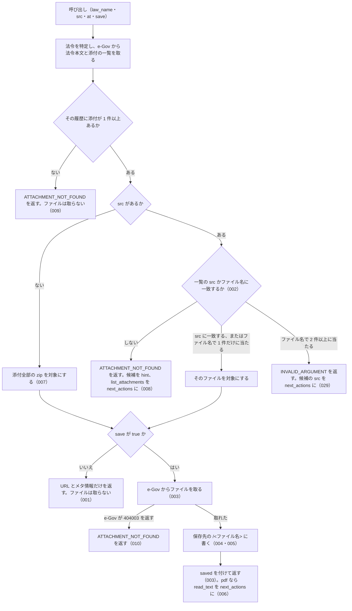

# get_attachment

<!-- GENERATED FILE — 手で編集しない。説明と引数はサーバーの tools/list、呼び出し例は scripts/reference-examples/houki-egov/ja/get_attachment.md、利用者と得られる結果・扱わないこと・処理の流れ・仕様項目の一覧は specs/current/get_attachment/spec.md、使いどころは scripts/spec-pages/houki-egov/get_attachment.md から。 -->

::: info
houki-egov-mcp **v0.20.1** の `tools/list` と `specs/current/get_attachment/spec.md` から自動生成しました（仕様 ID 31 件・2026-10-10）。手で編集しないでください。再生成は `node scripts/generate-reference.mjs` です。
:::

添付ファイル 1 件（src 指定）か、その法令履歴の添付ファイルをまとめた zip（src 省略）を取る。既定では e-Gov からファイルを取らず、URL とメタ情報（ファイル名・種別・置き場所）だけを返す。save: true のときだけファイルを取得してサーバー側の保存先（既定は XDG_CACHE_HOME か ~/.cache の下の houki-egov-mcp/files/。環境変数 HOUKI_EGOV_FILES_DIR で変更）に書き、絶対パスを返す。保存先はツールの引数では指定できない。base64 の中身は返さない。

## 利用者と得られる結果

このツールの利用者と、利用者が渡すもの・得られる結果を示します。

- MCP クライアント（Claude などの LLM、または CLI から呼ぶ人）。`law_name` と、`list_attachments` で選んだ `src`（省けば添付全部の zip）を渡して、そのファイルの URL とメタ情報を受け取る。`save: true` を付けたときは、サーバーが保存したファイルの絶対パスを受け取る
- MCP サーバーを起動する人。環境変数 `HOUKI_EGOV_FILES_DIR` で保存先のディレクトリを決める

## 引数

呼び出すときに渡す値です。動いているサーバーの `tools/list` から写しています。

| 引数 | 型 | 必須 | 既定値 | 説明 |
|---|---|---|---|---|
| `law_name` | string (minLength 1) | **必須** |  | 法令名または略称 |
| `src` | string | 任意 |  | list_attachments が返す attachments[].src（例 "./pict/H11HO127-001.jpg"）。ファイル名だけ（"H11HO127-001.jpg"）でも引ける。省略すると添付ファイル全部の zip |
| `at` | string | 任意 |  | 時点指定。YYYY-MM-DD 形式。list_attachments と同じ時点を渡す |
| `save` | boolean | 任意 | `false` | true でファイルを取得してディスクに保存し、応答の saved.path に絶対パスを返す（デフォルト: false）。false のときは URL だけを返し、e-Gov からファイルは取らない |

::: tip 既定ではファイルを取りません
`save` を付けないと e-Gov の `/attachment` は呼ばず、URL と置き場所だけを返します。URL は `list_attachments` にも入っているので、保存したいときだけこのツールを `save: true` で呼びます。保存先はサーバー側で決まり（既定 `${XDG_CACHE_HOME:-~/.cache}/houki-egov-mcp/files/<law_revision_id>/`、環境変数 `HOUKI_EGOV_FILES_DIR` で変更）、引数では指定できません。
:::

## 呼び出し例

実際に呼び出したときの引数と応答です。版と日付は実測したときのものです。

::: details 呼び出し例 — 「日章旗の寸法図をディスクに置く」
- 実測: v0.20.0（2026-10-05）
- 確かめた版: v0.20.1（2026-10-10）
- ローカル DB: 不要

**引数**

```jsonc
{ "law_name": "国旗及び国歌に関する法律", "src": "./pict/H11HO127-001.jpg", "save": true }
```

**返る JSON**

```jsonc
{
  "meta": { "law_id": "411AC0000000127", "title": "国旗及び国歌に関する法律", "law_revision_id": "411AC0000000127_19990813_000000000000000", "at": null, "…": "…" },
  "kind": "file",                                   // src を省くと "zip"
  "src": "./pict/H11HO127-001.jpg",
  "file_name": "H11HO127-001.jpg",
  "file_type": "jpg",
  "content_type": "image/jpeg",
  "url": "https://laws.e-gov.go.jp/api/2/attachment/411AC0000000127_19990813_000000000000000?src=.%2Fpict%2FH11HO127-001.jpg",
  "location": { "tag": "AppdxNote", "title": "別記第一", "related_article": "（第一条関係）" },
  "updated": "2024-07-25T00:20:13+09:00",
  "saved": {
    "path": "~/.cache/houki-egov-mcp/files/411AC0000000127_19990813_000000000000000/H11HO127-001.jpg",
    "bytes": 12614,
    "response_content_type": "image/jpeg"           // e-Gov の応答ヘッダー。pdf は application/octet-stream で返る
  },
  "note": "H11HO127-001.jpg（12.3 KB）を ~/.cache/houki-egov-mcp/files/411AC0000000127_19990813_000000000000000/H11HO127-001.jpg に保存しました。"
}
```

`saved.path` は実際には利用者のホームからの絶対パスで返ります（例ではホームを `~` にしました）。`src` はファイル名だけ（`"H11HO127-001.jpg"`）でも引けます。`meta.at` は時点を渡していないので `null` です。pdf を保存したときは `next_actions` に pdf-reader-mcp の `read_text`（`path` 付き）が入ります。
:::

::: details 呼び出し例 — 一覧に無い `src` を渡したとき（`ATTACHMENT_NOT_FOUND`）
- 実測: v0.20.0（2026-10-05）
- 確かめた版: v0.20.1（2026-10-10）
- ローカル DB: 不要

**引数**

```jsonc
{ "law_name": "国旗及び国歌に関する法律", "src": "nope.jpg" }
```

**返る JSON**

```jsonc
{
  "error": "添付ファイルが見つかりません: nope.jpg（国旗及び国歌に関する法律、履歴 411AC0000000127_19990813_000000000000000）",
  "code": "ATTACHMENT_NOT_FOUND",
  "hint": "この履歴の添付ファイル 2 件: ./pict/H11HO127-001.jpg, ./pict/H11HO127-002.jpg",
  "next_actions": [
    { "action": "list_attachments", "reason": "添付ファイルの一覧から src を選び直せます", "example": { "law_name": "国旗及び国歌に関する法律" } }
  ]
}
```

添付が 1 件も無い法令（民法）で呼んだときも `ATTACHMENT_NOT_FOUND` です。一覧にはあるのに e-Gov の `/attachment` が「存在しない」（code 404003）を返したときも同じ code で、`detail.cause` に e-Gov の応答本文が入ります。
:::

## 扱わないこと

このツールが意図して扱わないことです。

- ファイルの中身（バイト列や base64）を応答に入れること
- 保存先のパスやファイル名を引数で決めること（決めるのはサーバーを起動する人の環境変数だけ）
- 保存したファイルを消すこと
- pdf の本文を読むこと（pdf-reader-mcp に `url` か `saved.path` を渡す）
- 添付ファイルの一覧を返すこと（`list_attachments`）

## 処理の流れ

仕様書の「処理の流れ」の節を、図も含めてそのまま写しています。図が大きいので畳んでいます。

::: details 処理の流れの図（仕様書の写し）
呼び出しを受けてから応答を返すまでに、何をどの順で確かめるかを示します。図の中の番号は「できること」の仕様 ID の末尾 3 桁です。


:::

## 仕様項目の一覧

このツールの仕様項目 31 件の見出しです。仕様項目は受入テストと 1 対 1 で対応していて、条件と例は[仕様書ページ](/specs/houki-egov/get_attachment)で読めます。

::: details 仕様項目の見出し（31 件）
| 仕様 ID | 仕様項目 |
|---|---|
| [001](/specs/houki-egov/get_attachment#spec-egov-get-attachment-001) | save を付けないときは、ファイルを取らずに URL とメタ情報を返す |
| [002](/specs/houki-egov/get_attachment#spec-egov-get-attachment-002) | src はファイル名だけでも、1 件に決まるなら引ける |
| [003](/specs/houki-egov/get_attachment#spec-egov-get-attachment-003) | save: true でファイルを取得して保存し、パスとサイズを返す |
| [004](/specs/houki-egov/get_attachment#spec-egov-get-attachment-004) | 保存先は <保存先のディレクトリ>/&lt;law_revision_id>/<ファイル名> |
| [005](/specs/houki-egov/get_attachment#spec-egov-get-attachment-005) | 保存するファイル名にはディレクトリの部分を残さない |
| [006](/specs/houki-egov/get_attachment#spec-egov-get-attachment-006) | pdf を保存したら pdf-reader-mcp の read_text を案内する |
| [007](/specs/houki-egov/get_attachment#spec-egov-get-attachment-007) | src を省くと、添付ファイル全部の zip を対象にする |
| [008](/specs/houki-egov/get_attachment#spec-egov-get-attachment-008) | 一覧に無い src はエラーにし、選び直す道を案内する |
| [009](/specs/houki-egov/get_attachment#spec-egov-get-attachment-009) | 添付が 1 件も無い法令はエラーにする |
| [010](/specs/houki-egov/get_attachment#spec-egov-get-attachment-010) | e-Gov に実体が無いファイルはエラーにする |
| [011](/specs/houki-egov/get_attachment#spec-egov-get-attachment-011) | save なしで pdf を指したときは pdf-reader-mcp の read_url を案内する |
| [012](/specs/houki-egov/get_attachment#spec-egov-get-attachment-012) | save なしの zip の note |
| [013](/specs/houki-egov/get_attachment#spec-egov-get-attachment-013) | save なしの 1 件の note には保存先のディレクトリを書く |
| [014](/specs/houki-egov/get_attachment#spec-egov-get-attachment-014) | 時点（at）を渡すと、その時点の法令履歴の添付を対象にする |
| [015](/specs/houki-egov/get_attachment#spec-egov-get-attachment-015) | 一覧に無い src のエラーで案内する list_attachments にも at を入れる |
| [016](/specs/houki-egov/get_attachment#spec-egov-get-attachment-016) | 特定できない法令と管轄外の資料はエラーにする |
| [017](/specs/houki-egov/get_attachment#spec-egov-get-attachment-017) | 添付が無いときのエラーの hint と next_actions |
| [018](/specs/houki-egov/get_attachment#spec-egov-get-attachment-018) | e-Gov が 404003 以外の 4xx を返したときは SOURCE_API_ERROR |
| [019](/specs/houki-egov/get_attachment#spec-egov-get-attachment-019) | e-Gov の 429・5xx・時間切れ・ネットワークの失敗 |
| [020](/specs/houki-egov/get_attachment#spec-egov-get-attachment-020) | 環境変数が無いときの保存先 |
| [021](/specs/houki-egov/get_attachment#spec-egov-get-attachment-021) | 同じ法令履歴の同じファイル名を保存すると上書きする |
| [022](/specs/houki-egov/get_attachment#spec-egov-get-attachment-022) | 一覧に updated があるファイルでは、応答にも updated を付ける |
| [023](/specs/houki-egov/get_attachment#spec-egov-get-attachment-023) | law_name が空文字・空白だけのときは略称辞書と e-Gov に問い合わせずに `INVALID_ARGUMENT` を返す |
| [024](/specs/houki-egov/get_attachment#spec-egov-get-attachment-024) | `at` は `YYYY-MM-DD` の形だけを受け付け、形に合わない値と暦に無い日付は `INVALID_ARGUMENT` |
| [025](/specs/houki-egov/get_attachment#spec-egov-get-attachment-025) | `src` が空文字・空白だけのときは `src` を省いたときと同じに扱う |
| [026](/specs/houki-egov/get_attachment#spec-egov-get-attachment-026) | 法令名の検索が通信の失敗で終わったときは `LAW_NOT_FOUND` ではなく `SOURCE_*` を返す |
| [027](/specs/houki-egov/get_attachment#spec-egov-get-attachment-027) | 上限（50 MB）を超えるファイルは `FILE_TOO_LARGE` で断り、Content-Length で分かるときは本文を読まない |
| [028](/specs/houki-egov/get_attachment#spec-egov-get-attachment-028) | `law_name` の全角英数字・ダッシュ類・全角空白は半角に揃えてから略称辞書と照合する |
| [029](/specs/houki-egov/get_attachment#spec-egov-get-attachment-029) | ファイル名だけの src が 2 件以上の添付に当たるときは、どれも選ばずに `INVALID_ARGUMENT` を返し、候補の src を案内する |
| [030](/specs/houki-egov/get_attachment#spec-egov-get-attachment-030) | 法令名が完全一致しないときは、添付を取らず候補を付けた `LAW_NOT_FOUND` を返す |
| [031](/specs/houki-egov/get_attachment#spec-egov-get-attachment-031) | 法令本文の取得で e-Gov が 404・時点の 400 を返したときは `LAW_NOT_FOUND`・`INVALID_ARGUMENT` |
:::

## 関連ページ

このページの元になった文書と、あわせて読むページです。

- [houki-egov-mcp の解説](/mcp/houki-egov)
- [houki-egov-mcp のツール一覧](/reference/mcp/houki-egov/)
- [get_attachment の仕様書ページ](/specs/houki-egov/get_attachment)
- [元の仕様書（GitHub、v0.20.1）](https://github.com/shuji-bonji/houki-egov-mcp/blob/v0.20.1/specs/current/get_attachment/spec.md)
