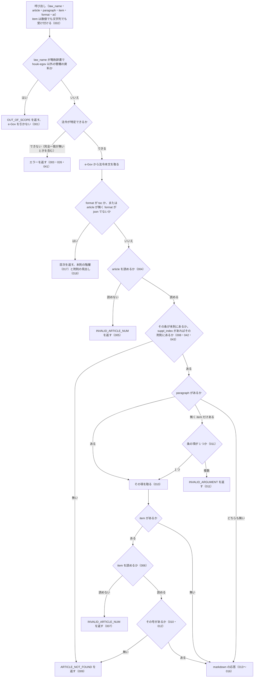

# get_law

<!-- GENERATED FILE — 手で編集しない。説明と引数はサーバーの tools/list、呼び出し例は scripts/reference-examples/houki-egov/ja/get_law.md、利用者と得られる結果・扱わないこと・処理の流れ・仕様項目の一覧は specs/current/get_law/spec.md、使いどころは scripts/spec-pages/houki-egov/get_law.md から。 -->

::: info
houki-egov-mcp **v0.20.1** の `tools/list` と `specs/current/get_law/spec.md` から自動生成しました（仕様 ID 43 件・2026-10-10）。手で編集しないでください。再生成は `node scripts/generate-reference.mjs` です。
:::

日本の法令から条文を取得します。略称（消法・所法・労基法 等）に対応し、条・項・号の単位で指定できます。法令名は題名の完全一致だけを使い、一致しなければ候補を付けた LAW_NOT_FOUND を返します。article の条は本則の中から探し、附則の条は suppl_index で附則を指して取ります。章・節をまとめて取るときは get_law_range を使います。

## 利用者と得られる結果

このツールの利用者と、利用者が渡すもの・得られる結果を示します。

- MCP クライアント（Claude などの LLM、または CLI から呼ぶ人）。`law_name` と `article`（任意で `paragraph`・`item`）を渡して、e-Gov 法令 API v2 から取った法令の条・項・号の本文を受け取る。`article` を省くと、その法令の目次を受け取る

## 引数

呼び出すときに渡す値です。動いているサーバーの `tools/list` から写しています。

| 引数 | 型 | 必須 | 既定値 | 説明 |
|---|---|---|---|---|
| `law_name` | string (minLength 1) | **必須** |  | 法令名または略称。例: "消費税法", "消法", "労基法", "民法" |
| `article` | string | 任意 |  | 条番号。例: "30", "30の2", "第30条の2"。漢数字（"第三十条", "三十の二"）と全角数字も可（v0.7.0）。本則の条を探します。附則の条は suppl_index で附則を指してください。format="toc" の場合は省略可 |
| `paragraph` | integer (≥ 1) | 任意 |  | 項番号（1 以上の整数）。省略時は条文全体 |
| `item` | number \| string | 任意 |  | 号番号。数値（8）か文字列（"8"・"8の2"・"第8号の2"・"八の二"）。枝番号の号（第8号の2）は文字列で指定する。漢数字と全角数字も可（v0.7.0）。項が複数ある条では paragraph も指定する（項が 1 つの条では省略可）。省略時は項全体 |
| `format` | `"markdown"` \| `"json"` \| `"toc"` | 任意 | `"markdown"` | 出力形式。"markdown"=条文全文（デフォルト）, "toc"=目次のみ（トークン節約）, "json"=構造化 |
| `suppl_index` | integer (≥ 1) | 任意 |  | 附則の番号（1 以上の整数）。get_toc の suppl_provisions[].index、get_law_range の suppl_index と同じ番号です。渡すと article をその附則の中で探します。省くと本則の中だけを探します |
| `at` | string | 任意 |  | 時点指定。YYYY-MM-DD 形式。例: "2024-04-01" でその時点の条文を取得（e-Gov v2 対応） |

::: tip 引数名は `law_name` です
過去の文書に `lawNumber` と書かれていたことがありますが、そのような引数はありません。渡すと `INVALID_ARGUMENT` になります。条番号の枝番は「57の2」のように「の」で書きます。
:::

## 呼び出し例

実際に呼び出したときの引数と応答です。版と日付は実測したときのものです。

::: details 呼び出し例 — 「消費税法 57 条の 2 第 1 項の本文を JSON で」
- 実測: v0.20.0（2026-10-05）
- ローカル DB: 不要

**引数**

```jsonc
{ "law_name": "消費税法", "article": "57の2", "paragraph": 1, "format": "json" }
```

**返る JSON**

```jsonc
{
  "format": "json",
  "data": {
    "article_num": "57_2",
    "paragraph_num": 1,
    "item_num": null,
    "suppl_index": null,
    "node": {
      "tag": "Paragraph",
      "attr": { "Num": "1" },
      "children": [
        { "tag": "ParagraphNum", "attr": {}, "children": [] },
        {
          "tag": "ParagraphSentence",
          "attr": {},
          "children": [
            {
              "tag": "Sentence",
              "attr": { "Num": "1", "WritingMode": "vertical" },
              "children": [
                "国内において課税資産の譲渡等を行い、又は行おうとする事業者であつて、第五十七条の四第一項に規定する適格請求書の交付をしようとする事業者（第九条第一項本文の規定により消費税を納める義務が免除される事業者を除く。）は、税務署長の登録を受けることができる。"
              ]
            }
          ]
        }
      ]
    }
  },
  "meta": {
    "law_id": "363AC0000000108",
    "title": "消費税法",
    "law_num": "昭和六十三年法律第百八号",
    "retrieved_at": "2026-10-04T20:19:52.055Z",
    "url": "https://laws.e-gov.go.jp/law/363AC0000000108",
    "at": null
  }
}
```

`data.item_num` は号を指定したときの号番号、`data.suppl_index` は附則の条を `suppl_index` で指したときの附則の番号で、どちらも指定していないので `null` です。`meta.at` は時点（`at`）を渡していないので `null` です。`format` を省略すると Markdown の本文が返ります。引用するときは `meta.law_num`・`meta.url`・`meta.retrieved_at` を添えてください。
:::

::: details 呼び出し例 — 「消費税法 30 条 2 項を Markdown で」（号と、号の下のイ・ロ）
- 実測: v0.20.0（2026-10-05）
- ローカル DB: 不要

**引数**

```jsonc
{ "law_name": "消法", "article": "30", "paragraph": 2 }
```

**返る JSON（抜粋）**

```jsonc
{
  "format": "markdown",
  "markdown": "# 消費税法 第30条第2項\n（仕入れに係る消費税額の控除）\n\n**第2項**\n前項の場合において、…",
  "meta": {
    "law_id": "363AC0000000108",
    "title": "消費税法",
    "law_num": "昭和六十三年法律第百八号",
    "retrieved_at": "2026-10-04T20:19:54.250Z",
    "url": "https://laws.e-gov.go.jp/law/363AC0000000108",
    "at": null
  }
}
```

**`markdown` の中身（抜粋。「…」は省略した部分）**

```text
# 消費税法 第30条第2項
（仕入れに係る消費税額の控除）

**第2項**
前項の場合において、…次の各号に掲げる場合の区分に応じ当該各号に定める方法により計算した金額とする。
一 当該課税期間中に国内において行つた課税仕入れ…にその区分が明らかにされている場合　イに掲げる金額にロに掲げる金額を加算する方法
- イ 課税資産の譲渡等にのみ要する課税仕入れ、特定課税仕入れ及び課税貨物に係る課税仕入れ等の税額の合計額
- ロ 課税資産の譲渡等とその他の資産の譲渡等に共通して要する課税仕入れ、特定課税仕入れ及び課税貨物に係る課税仕入れ等の税額の合計額に課税売上割合を乗じて計算した金額
二 前号に掲げる場合以外の場合　当該課税期間における課税仕入れ等の税額の合計額に課税売上割合を乗じて計算する方法

---
出典：e-Gov法令検索（デジタル庁）
URL: https://laws.e-gov.go.jp/law/363AC0000000108
取得日時: 2026-10-04T20:19:54.250Z
```

号は「一」「二」のように e-Gov の表示どおりの漢数字で始まり、見出し語と本文の間は全角空白です。号の下のイ・ロ・ハは `- イ …` の箇条書きになります。
:::

::: details 呼び出し例 — 「所得税法 89 条 1 項を Markdown で」（項の直下の表）
- 実測: v0.20.0（2026-10-05）
- ローカル DB: 不要

**引数**

```jsonc
{ "law_name": "所法", "article": "89", "paragraph": 1 }
```

**`markdown` の中身**

```text
# 所得税法 第89条第1項
（税率）

居住者に対して課する所得税の額は、その年分の課税総所得金額又は課税退職所得金額をそれぞれ次の表の上欄に掲げる金額に区分してそれぞれの金額に同表の下欄に掲げる税率を乗じて計算した金額を合計した金額と、その年分の課税山林所得金額の五分の一に相当する金額を同表の上欄に掲げる金額に区分してそれぞれの金額に同表の下欄に掲げる税率を乗じて計算した金額を合計した金額に五を乗じて計算した金額との合計額とする。

|  |  |
| --- | --- |
| 百九十五万円以下の金額 | 百分の五 |
| 百九十五万円を超え三百三十万円以下の金額 | 百分の十 |
| 三百三十万円を超え六百九十五万円以下の金額 | 百分の二十 |
| 六百九十五万円を超え九百万円以下の金額 | 百分の二十三 |
| 九百万円を超え千八百万円以下の金額 | 百分の三十三 |
| 千八百万円を超え四千万円以下の金額 | 百分の四十 |
| 四千万円を超える金額 | 百分の四十五 |

---
出典：e-Gov法令検索（デジタル庁）
URL: https://laws.e-gov.go.jp/law/340AC0000000033
取得日時: 2026-10-04T20:19:56.504Z
```

条文中の表は Markdown の表で返ります。法令の表の多くは見出し行を持たないため、1 行目（見出し行）は空欄です。`meta` は上の例と同じ形です（`law_num` は「昭和四十年法律第三十三号」）。
:::

::: details 呼び出し例 — 枝番号の号（消費税法 2 条 1 項 8 号の 2）
- 実測: v0.20.0（2026-10-05）
- ローカル DB: 不要

**引数**

```jsonc
{ "law_name": "消費税法", "article": "2", "paragraph": 1, "item": "8の2" }
```

**返る JSON（抜粋）**

```jsonc
{
  "format": "markdown",
  "markdown": "# 消費税法 第2条第1項第8号の2\n（定義）\n\n八の二 特定資産の譲渡等　事業者向け電気通信利用役務の提供及び特定役務の提供をいう。\n\n---\n出典：e-Gov法令検索（デジタル庁）\n…",
  "meta": {
    "law_id": "363AC0000000108",
    "title": "消費税法",
    "law_num": "昭和六十三年法律第百八号",
    "url": "https://laws.e-gov.go.jp/law/363AC0000000108",
    "at": null
    // retrieved_at は省略
  }
}
```

枝番号の号は `item` に文字列で渡します（`"8の2"`・`"第8号の2"`。v0.6.0 から）。項が 1 つだけの条（法人税法 2 条など）は `paragraph` を省けます。項が複数ある条で `paragraph` を省くと、`INVALID_ARGUMENT`（「第30条は項が 13 個あるため、item（号番号）を指定するときは paragraph（項番号）も指定してください」）になります。
:::

::: details 呼び出し例 — 存在しない条を指定したとき（`ARTICLE_NOT_FOUND`）
- 実測: v0.20.0（2026-10-05）
- ローカル DB: 不要

**引数**

```jsonc
{ "law_name": "消費税法", "article": "3000" }
```

**返る JSON**（`isError: true` 付き）

```jsonc
{
  "error": "条文が見つかりません: 第3000条 in 消費税法",
  "code": "ARTICLE_NOT_FOUND",
  "hint": "法令名・条番号を確認してください。format: \"toc\" で目次を確認できます",
  "next_actions": [
    {
      "action": "get_toc",
      "reason": "目次を確認して正しい条番号を特定できます",
      "example": { "law_name": "消費税法" }
    }
  ]
}
```

`next_actions[0]` に次に呼ぶべきツールと引数の例が入っています。`article` は本則の中だけを探すので、本則に無く附則にだけある条番号も `ARTICLE_NOT_FOUND` になります（v0.18.0 から。附則の条は `suppl_index` で附則を指して取ります）。法令名が略称辞書にも e-Gov の題名にも完全一致しないときは、候補を付けた `LAW_NOT_FOUND` が返ります（v0.18.0 から）。エラーコードの語彙と、コードごとの対処は [houki-research Skill](/skills/houki-research) が定めています。
:::

## 扱わないこと

このツールが意図して扱わないことです。

- 編・章・節や附則 1 本をまとめて取ること（`get_law_range`）
- 目次に附則の中の条を載せること（目次の附則は見出しだけ。附則の条まで見るのは `get_toc` の `suppl: "full"`）
- 削除された条をまとめた範囲（e-Gov の `534:535` など）に含まれる 1 つの条番号（`"534"`）で引くこと（`ARTICLE_NOT_FOUND` になる）
- 1 回の呼び出しで複数の条・項・号を取ること
- 条文の中の参照（他の条・他の法令）を解決すること（`get_article_references`）
- 改正履歴を返すこと（`get_law_revisions`）
- 通達・判例など e-Gov 以外の資料を返すこと（`OUT_OF_SCOPE` を返す）
- 条文に解釈や判断を加えること

## 処理の流れ

仕様書の「処理の流れ」の節を、図も含めてそのまま写しています。図が大きいので畳んでいます。

::: details 処理の流れの図（仕様書の写し）
呼び出しを受けてから応答を返すまでに、何をどの順で確かめるかを示します。図の中の番号は「できること」の仕様 ID の末尾 3 桁です。


:::

## 仕様項目の一覧

このツールの仕様項目 43 件の見出しです。仕様項目は受入テストと 1 対 1 で対応していて、条件と例は[仕様書ページ](/specs/houki-egov/get_law)で読めます。

::: details 仕様項目の見出し（43 件）
| 仕様 ID | 仕様項目 |
|---|---|
| [001](/specs/houki-egov/get_law#spec-egov-get-law-001) | 通達などの略称は OUT_OF_SCOPE を返し、e-Gov を引かない |
| [002](/specs/houki-egov/get_law#spec-egov-get-law-002) | item は数値でも文字列でも受け付ける |
| [003](/specs/houki-egov/get_law#spec-egov-get-law-003) | law_name が空文字・空白だけのときは e-Gov に問い合わせずに `INVALID_ARGUMENT` を返す |
| [004](/specs/houki-egov/get_law#spec-egov-get-law-004) | 条番号は算用数字・漢数字・全角数字のどれでも指定できる |
| [005](/specs/houki-egov/get_law#spec-egov-get-law-005) | 読めない条番号は受け付けない |
| [006](/specs/houki-egov/get_law#spec-egov-get-law-006) | 号番号は数値・算用数字・漢数字・全角数字のどれでも指定できる |
| [007](/specs/houki-egov/get_law#spec-egov-get-law-007) | 読めない号番号は受け付けない |
| [008](/specs/houki-egov/get_law#spec-egov-get-law-008) | 条番号で、本則の条を取り出す（枝番号の条を含む） |
| [009](/specs/houki-egov/get_law#spec-egov-get-law-009) | 存在しない条・号は ARTICLE_NOT_FOUND を返す |
| [010](/specs/houki-egov/get_law#spec-egov-get-law-010) | paragraph で項を、paragraph と item で号を取り出す |
| [011](/specs/houki-egov/get_law#spec-egov-get-law-011) | item だけを指定したとき、項が 1 つの条はその項の号を返し、項が複数の条は INVALID_ARGUMENT を返す |
| [012](/specs/houki-egov/get_law#spec-egov-get-law-012) | 枝番号の号を取り出す |
| [013](/specs/houki-egov/get_law#spec-egov-get-law-013) | markdown の応答の見出し |
| [014](/specs/houki-egov/get_law#spec-egov-get-law-014) | 号の行と、号の下のイ・ロ・ハの書き方 |
| [015](/specs/houki-egov/get_law#spec-egov-get-law-015) | 2 項目以降の項には項番号の行を付ける |
| [016](/specs/houki-egov/get_law#spec-egov-get-law-016) | 表は Markdown の表にする |
| [017](/specs/houki-egov/get_law#spec-egov-get-law-017) | 目次は本則の階層を返す |
| [018](/specs/houki-egov/get_law#spec-egov-get-law-018) | 目次の附則は見出しだけを返す |
| [019](/specs/houki-egov/get_law#spec-egov-get-law-019) | 応答の外形は format ごとに決まっている |
| [020](/specs/houki-egov/get_law#spec-egov-get-law-020) | meta には法令の識別情報と取得日時と時点が常に入る |
| [021](/specs/houki-egov/get_law#spec-egov-get-law-021) | markdown の条文の末尾に出典・URL・時点・取得日時の行を置く |
| [022](/specs/houki-egov/get_law#spec-egov-get-law-022) | 目次の 1 行目は「<法令名> — 目次」で、末尾は条文と同じ行を置く |
| [023](/specs/houki-egov/get_law#spec-egov-get-law-023) | json の data は e-Gov 形式の条番号と、指定した粒度の構造を返す |
| [024](/specs/houki-egov/get_law#spec-egov-get-law-024) | json の paragraph_num と item_num は、渡した値をそのまま返し、渡さないときは null |
| [025](/specs/houki-egov/get_law#spec-egov-get-law-025) | format が json で article を省くと INVALID_ARGUMENT を返し、目次の取り方を案内する |
| [026](/specs/houki-egov/get_law#spec-egov-get-law-026) | 法令が特定できないときは LAW_NOT_FOUND を返し、略称の確認と検索を案内する |
| [027](/specs/houki-egov/get_law#spec-egov-get-law-027) | 存在しない項は ARTICLE_NOT_FOUND を返し、項番号が 1 始まりであることを案内する |
| [028](/specs/houki-egov/get_law#spec-egov-get-law-028) | e-Gov が 429 を返したときは SOURCE_RATE_LIMITED を返す |
| [029](/specs/houki-egov/get_law#spec-egov-get-law-029) | e-Gov の応答が時間切れのときは SOURCE_TIMEOUT を返す |
| [030](/specs/houki-egov/get_law#spec-egov-get-law-030) | e-Gov が 5xx を返したときは再試行できる SOURCE_API_ERROR を返す |
| [031](/specs/houki-egov/get_law#spec-egov-get-law-031) | law_id を決めた後に e-Gov が 404・時点の 400・そのほかの 4xx を返したときのエラー |
| [032](/specs/houki-egov/get_law#spec-egov-get-law-032) | OUT_OF_SCOPE の応答は、管轄の MCP への切り替えを案内する |
| [033](/specs/houki-egov/get_law#spec-egov-get-law-033) | format が toc のときは article を使わずに目次を返す |
| [034](/specs/houki-egov/get_law#spec-egov-get-law-034) | at を渡すと、その時点の本文を e-Gov から取って返す |
| [035](/specs/houki-egov/get_law#spec-egov-get-law-035) | at が違えば、同じ法令でも別の本文として取る |
| [036](/specs/houki-egov/get_law#spec-egov-get-law-036) | `paragraph` は 1 以上の整数で、0・負の数・小数は `INVALID_ARGUMENT` にして法令を取らない |
| [037](/specs/houki-egov/get_law#spec-egov-get-law-037) | `at` は `YYYY-MM-DD` の形だけを受け付け、形に合わない値と暦に無い日付は `INVALID_ARGUMENT` |
| [038](/specs/houki-egov/get_law#spec-egov-get-law-038) | 法令名の検索が通信の失敗で終わったときは `LAW_NOT_FOUND` ではなく `SOURCE_*` を返す |
| [039](/specs/houki-egov/get_law#spec-egov-get-law-039) | `law_name` の全角英数字・ダッシュ類・全角空白は半角に揃えてから略称辞書と照合する |
| [040](/specs/houki-egov/get_law#spec-egov-get-law-040) | `item` だけを指定して項を補ったときは、json の `data.paragraph_num` に補った項番号 `1` を入れる |
| [041](/specs/houki-egov/get_law#spec-egov-get-law-041) | 法令名が完全一致しないときは、条文を返さず候補を付けた `LAW_NOT_FOUND` を返す |
| [042](/specs/houki-egov/get_law#spec-egov-get-law-042) | `suppl_index` を渡さないときは本則の中だけで条を探し、附則にだけある条番号は `ARTICLE_NOT_FOUND` にして附則の番号を案内する |
| [043](/specs/houki-egov/get_law#spec-egov-get-law-043) | `suppl_index` で附則を指すと、その附則の中の条・項・号を返す |
:::

## 関連ページ

このページの元になった文書と、あわせて読むページです。

- [houki-egov-mcp の解説](/mcp/houki-egov)
- [houki-egov-mcp のツール一覧](/reference/mcp/houki-egov/)
- [get_law の仕様書ページ](/specs/houki-egov/get_law)
- [元の仕様書（GitHub、v0.20.1）](https://github.com/shuji-bonji/houki-egov-mcp/blob/v0.20.1/specs/current/get_law/spec.md)
