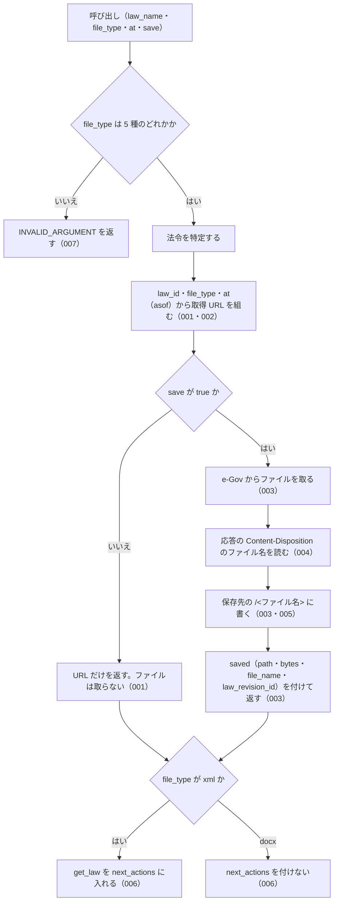

# get_law_file

<!-- GENERATED FILE — 手で編集しない。説明と引数はサーバーの tools/list、呼び出し例は scripts/reference-examples/houki-egov/ja/get_law_file.md、使う人と受け取るもの・できないこと・処理の流れ・約束の一覧は specs/current/get_law_file/spec.md、使いどころは scripts/spec-pages/houki-egov/get_law_file.md から。 -->

::: info
houki-egov-mcp **v0.20.0** の `tools/list` と `specs/current/get_law_file/spec.md` から自動生成しました（仕様 ID 23 件・2026-10-10）。手で編集しないでください。再生成は `node scripts/generate-reference.mjs` です。
:::

法令本文を 1 つのファイル（xml / json / html / rtf / docx）で取る道を返す。既定では認証なしで開ける URL だけを返し、save: true のときだけファイルを取得してサーバー側の保存先（既定は XDG_CACHE_HOME か ~/.cache の下の houki-egov-mcp/files/。環境変数 HOUKI_EGOV_FILES_DIR で変更）に書いて絶対パスを返す。条文を読むだけなら get_law / get_law_range のほうが小さく済む（民法の xml は 1.6 MB、docx は 182 KB）。人が Word や ブラウザーで開く版が要るとき（docx / html / rtf）と、法令 XML をそのまま処理したいとき（xml / json）のためのツール。

## 使う人と受け取るもの

このツールを誰が呼び、何を渡して何を受け取るかを示します。

- MCP クライアント（Claude などの LLM、または CLI から呼ぶ人）。`law_name` と `file_type` を渡して、法令本文 1 つ分のファイル（xml / json / html / rtf / docx）を取る URL を受け取る。`save: true` を付けたときは、サーバーが保存したファイルの絶対パスと、そのファイルの法令履歴 ID を受け取る
- MCP サーバーを起動する人。環境変数 `HOUKI_EGOV_FILES_DIR` で保存先のディレクトリを決める

## 引数

呼び出すときに渡す値です。動いているサーバーの `tools/list` から写しています。

| 引数 | 型 | 必須 | 既定値 | 説明 |
|---|---|---|---|---|
| `law_name` | string (minLength 1) | **必須** |  | 法令名または略称。例: "民法", "消法" |
| `file_type` | `"xml"` \| `"json"` \| `"html"` \| `"rtf"` \| `"docx"` | **必須** |  | ファイル種別。xml = 法令標準 XML、json = e-Gov の JSON、html、rtf、docx（Word） |
| `at` | string | 任意 |  | 時点指定。YYYY-MM-DD 形式。その時点以前で最新の履歴の本文ファイルになる（e-Gov の asof） |
| `save` | boolean | 任意 | `false` | true でファイルを取得してディスクに保存し、応答の saved.path に絶対パスを返す（デフォルト: false）。保存すると e-Gov のファイル名から法令履歴 ID（saved.law_revision_id）が分かる |

::: tip 条文を読むなら get_law / get_law_range
`xml` / `json` は法令全体で、民法は 1.6 MB あります。条文を読むだけなら `get_law`（1 条）か `get_law_range`（章・節）のほうが小さく済みます。このツールは、人が Word やブラウザーで開く版（`docx` / `html` / `rtf`）が要るときと、法令標準 XML をそのまま処理したいときのものです。
:::

## 呼び出し例

実際に呼び出したときの引数と応答です。版と日付は実測したときのものです。

::: details 呼び出し例 — 「民法の全文を Word で」（URL だけ）
- 実測: v0.20.0（2026-10-05）
- ローカル DB: 不要

**引数**

```jsonc
{ "law_name": "民法", "file_type": "docx" }
```

**返る JSON**

```jsonc
{
  "meta": {
    "law_id": "129AC0000000089",
    "title": "民法",
    "law_num": "明治二十九年法律第八十九号",
    "retrieved_at": "2026-10-04T20:20:03.161Z",
    "url": "https://laws.e-gov.go.jp/law/129AC0000000089",
    "at": null
  },
  "file_type": "docx",
  "content_type": "application/vnd.openxmlformats-officedocument.wordprocessingml.document",
  "url": "https://laws.e-gov.go.jp/api/2/law_file/docx/129AC0000000089",     // 認証なしで開ける
  "note": "民法 の本文を docx で取る URL です。認証なしで開けます（現時点で最新の履歴）。ファイルをディスクに置くには save: true を付けてください（~/.cache/houki-egov-mcp/files 以下に保存します）。"
}
```

`save` を付けないと e-Gov には法令名の解決（`/laws`）しか問い合わせません。`at` を付けると URL に `?asof=YYYY-MM-DD` が付き、その時点以前で最新の履歴の本文になります。
:::

::: details 呼び出し例 — 「2020 年 4 月 1 日時点の国旗国歌法を HTML で保存」
- 実測: v0.20.0（2026-10-05）
- ローカル DB: 不要

**引数**

```jsonc
{ "law_name": "国旗及び国歌に関する法律", "file_type": "html", "at": "2020-04-01", "save": true }
```

**返る JSON（抜粋）**

```jsonc
{
  "meta": { "law_id": "411AC0000000127", "title": "国旗及び国歌に関する法律", "at": "2020-04-01", "…": "…" },
  "file_type": "html",
  "content_type": "text/html",
  "url": "https://laws.e-gov.go.jp/api/2/law_file/html/411AC0000000127?asof=2020-04-01",
  "saved": {
    "path": "~/.cache/houki-egov-mcp/files/411AC0000000127_19990813_000000000000000/411AC0000000127_19990813_000000000000000.html",
    "bytes": 38537,
    "file_name": "411AC0000000127_19990813_000000000000000.html",   // e-Gov の Content-Disposition のまま
    "law_revision_id": "411AC0000000127_19990813_000000000000000"    // ファイル名から分かる「どの履歴の本文か」
  },
  "note": "411AC0000000127_19990813_000000000000000.html（37.6 KB）を … に保存しました。"
}
```

保存すると e-Gov のファイル名から法令履歴 ID が取れます（URL だけのときは分かりません）。実測では民法の docx が 182 KB、消費税法の rtf が 1.8 MB でした。1 ファイル 50 MB（52,428,800 バイト）を超えるときは保存せず、`FILE_TOO_LARGE`（`retryable: false`、`detail.bytes` に大きさ）を返します。Content-Length で分かるときは本文を読みません（v0.16.0 から。v0.15.x では `INVALID_ARGUMENT` でした）。
:::

## できないこと

このツールが引き受けないことです。

- ファイルの中身（バイト列や base64）を応答に入れること
- 保存先のパスやファイル名を引数で決めること（決めるのはサーバーを起動する人の環境変数だけ）
- 条・項を選んで一部だけのファイルを取ること（ファイルは法令全体。一部を読むのは `get_law` / `get_law_range`）
- `save` なしで、その URL がどの法令履歴の本文を返すかを知らせること（`saved.law_revision_id` は保存したときだけ）
- 添付ファイル（別表・様式の図）を取ること（`list_attachments` / `get_attachment`）

## 処理の流れ

仕様書の「処理の流れ」の節を、図も含めてそのまま写しています。図が大きいので畳んでいます。

::: details 処理の流れの図（仕様書の写し）
呼び出しを受けてから応答を返すまでに、何をどの順で確かめるかを示します。図の中の番号は「できること」の仕様 ID の末尾 3 桁です。


:::

## 約束の一覧

このツールが守る約束 23 件の見出しです。約束は受入テストと 1 対 1 で対応していて、条件と例は[仕様書ページ](/specs/houki-egov/get_law_file)で読めます。

::: details 約束の見出し（23 件）
| 仕様 ID | 約束 |
|---|---|
| [001](/specs/houki-egov/get_law_file#spec-egov-get-law-file-001) | save を付けないときは、ファイルを取らずに URL を返す |
| [002](/specs/houki-egov/get_law_file#spec-egov-get-law-file-002) | 時点（at）は URL の asof になる |
| [003](/specs/houki-egov/get_law_file#spec-egov-get-law-file-003) | save: true でファイルを取得し、法令履歴 ID の名前で保存する。法令履歴 ID が分からないときは null を返す |
| [004](/specs/houki-egov/get_law_file#spec-egov-get-law-file-004) | Content-Disposition のファイル名の読み方。`filename*` があればそれを使う |
| [005](/specs/houki-egov/get_law_file#spec-egov-get-law-file-005) | 保存するファイル名にはディレクトリの部分を残さない |
| [006](/specs/houki-egov/get_law_file#spec-egov-get-law-file-006) | xml では条文を読む get_law を案内する |
| [007](/specs/houki-egov/get_law_file#spec-egov-get-law-file-007) | file_type は 5 種のどれかでなければならない |
| [008](/specs/houki-egov/get_law_file#spec-egov-get-law-file-008) | save なしでは、e-Gov への問い合わせは法令名の解決だけ |
| [009](/specs/houki-egov/get_law_file#spec-egov-get-law-file-009) | json でも get_law を案内し、html・rtf では案内しない |
| [010](/specs/houki-egov/get_law_file#spec-egov-get-law-file-010) | save なしの note は、どの時点の履歴かと保存先のディレクトリを書く |
| [011](/specs/houki-egov/get_law_file#spec-egov-get-law-file-011) | 保存したときの note |
| [012](/specs/houki-egov/get_law_file#spec-egov-get-law-file-012) | 特定できない法令と管轄外の資料はエラーにする |
| [013](/specs/houki-egov/get_law_file#spec-egov-get-law-file-013) | file_type の検査は、法令の特定より先に行う |
| [014](/specs/houki-egov/get_law_file#spec-egov-get-law-file-014) | ファイルの取得に失敗したときの code |
| [015](/specs/houki-egov/get_law_file#spec-egov-get-law-file-015) | 429・5xx・ネットワークの失敗は取り直してから返す |
| [016](/specs/houki-egov/get_law_file#spec-egov-get-law-file-016) | 環境変数が無いときの保存先 |
| [017](/specs/houki-egov/get_law_file#spec-egov-get-law-file-017) | 同じファイルを保存すると上書きする |
| [018](/specs/houki-egov/get_law_file#spec-egov-get-law-file-018) | law_name が空文字・空白だけのときは略称辞書と e-Gov に問い合わせずに `INVALID_ARGUMENT` を返す |
| [019](/specs/houki-egov/get_law_file#spec-egov-get-law-file-019) | `at` は `YYYY-MM-DD` の形だけを受け付け、形に合わない値と暦に無い日付は `INVALID_ARGUMENT` |
| [020](/specs/houki-egov/get_law_file#spec-egov-get-law-file-020) | 法令名の検索が通信の失敗で終わったときは `LAW_NOT_FOUND` ではなく `SOURCE_*` を返す |
| [021](/specs/houki-egov/get_law_file#spec-egov-get-law-file-021) | 上限（50 MB）を超えるファイルは `FILE_TOO_LARGE` で断り、Content-Length で分かるときは本文を読まない |
| [022](/specs/houki-egov/get_law_file#spec-egov-get-law-file-022) | `law_name` の全角英数字・ダッシュ類・全角空白は半角に揃えてから略称辞書と照合する |
| [023](/specs/houki-egov/get_law_file#spec-egov-get-law-file-023) | 法令名が完全一致しないときは、URL を返さず候補を付けた `LAW_NOT_FOUND` を返す |
:::

## 関連ページ

このページの元になった文書と、あわせて読むページです。

- [houki-egov-mcp の解説](/mcp/houki-egov)
- [houki-egov-mcp のツール一覧](/reference/mcp/houki-egov/)
- [get_law_file の仕様書ページ](/specs/houki-egov/get_law_file)
- [元の仕様書（GitHub、v0.20.0）](https://github.com/shuji-bonji/houki-egov-mcp/blob/v0.20.0/specs/current/get_law_file/spec.md)
