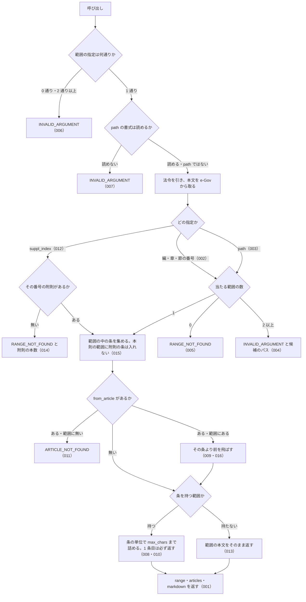

# get_law_range

<!-- GENERATED FILE — 手で編集しない。説明と引数はサーバーの tools/list、呼び出し例は scripts/reference-examples/houki-egov/ja/get_law_range.md、利用者と得られる結果・扱わないこと・処理の流れ・仕様項目の一覧は specs/current/get_law_range/spec.md、使いどころは scripts/spec-pages/houki-egov/get_law_range.md から。 -->

::: info
houki-egov-mcp **v0.20.1** の `tools/list` と `specs/current/get_law_range/spec.md` から自動生成しました（仕様 ID 35 件・2026-10-10）。手で編集しないでください。再生成は `node scripts/generate-reference.mjs` です。
:::

法令の編・章・節・款・目のいずれか、または附則 1 本を範囲にして、その中の条を本文ごと取得する。1 条ずつ引く get_law と、目次だけを返す get_toc の間を埋める（民法・会社法・消費税法のように get_law で 1 条ずつ引くと手数がかかり、法令全体では長すぎる場合に使う）。範囲は条の単位で文字数の上限まで返し、入り切らなかったときは truncated と続きの条番号（next_from_article）を返す。返した範囲（パス・見出し・条の数・最初と最後の条）は応答の range に入る。

## 利用者と得られる結果

このツールの利用者と、利用者が渡すもの・得られる結果を示します。

- MCP クライアント（Claude などの LLM、または CLI から呼ぶ人）。`law_name` と範囲（編・章・節の番号、`get_toc` の `path`、または附則の番号）を渡して、その範囲の条の本文を受け取る。範囲が長くて打ち切られたときは、応答の `next_from_article` を `from_article` に渡して続きを取る

## 引数

呼び出すときに渡す値です。動いているサーバーの `tools/list` から写しています。

| 引数 | 型 | 必須 | 既定値 | 説明 |
|---|---|---|---|---|
| `law_name` | string (minLength 1) | **必須** |  | 法令名または略称。例: "民法", "会社法", "消法" |
| `part` | string \| number | 任意 |  | 編の番号。"3" / 3 / "三" / "第三編" / 枝番号は "2の2"。上位の階層は無いので単独で指定できる |
| `chapter` | string \| number | 任意 |  | 章の番号。章番号は編ごとに振り直されるため（民法には第一章が 5 つある）、編を持つ法令では part も指定する。指定が複数の範囲に当たるときは、候補のパスを付けた INVALID_ARGUMENT を返す |
| `section` | string \| number | 任意 |  | 節の番号。上位の part / chapter も指定すると範囲が一つに決まる |
| `subsection` | string \| number | 任意 |  | 款の番号 |
| `division` | string \| number | 任意 |  | 目の番号 |
| `path` | string | 任意 |  | 範囲のパス。get_toc が返す toc[].path をそのまま渡せる。例: "Part3/Chapter2"（民法第三編第二章）、"Chapter2/Section1/Subsection2"。編・章・節の番号との同時指定はできない |
| `suppl_index` | integer (≥ 1) | 任意 |  | 附則の番号（1 以上の整数）。get_toc が返す suppl_provisions[].index と同じ番号で、search_fulltext が「附則(3) 1」と表示する番号でもある。条を持たず項だけで書かれた附則は、範囲の本文をそのまま返す |
| `from_article` | string | 任意 |  | 範囲の中のこの条から返す。前の応答が truncated だったときに next_from_article の値を渡して続きを取る。例: "561", "548の4", "第五百六十一条" |
| `max_chars` | integer (2000–120000) | 任意 | `30000` | 返す条本文の文字数の上限（デフォルト: 30000、2000〜120000）。条の途中では切らないため、1 条目だけは上限を超えても返す |
| `at` | string | 任意 |  | 時点指定。YYYY-MM-DD 形式（get_law と同じ） |

::: tip 範囲の指定は 3 通り、同時には 1 つだけ
編・章・節・款・目の番号（`part` / `chapter` / `section` / `subsection` / `division`）、範囲のパス（`path`）、附則の番号（`suppl_index`）のいずれか 1 つを指定します。2 通り以上を渡すと `INVALID_ARGUMENT` になります。
:::

## 呼び出し例

実際に呼び出したときの引数と応答です。版と日付は実測したときのものです。

::: details 呼び出し例 — 「民法の契約の章をまとめて読みたい」
- 実測: v0.20.0（2026-10-05）
- 確かめた版: v0.20.1（2026-10-10）
- ローカル DB: 不要

**引数**

```jsonc
{ "law_name": "民法", "part": 3, "chapter": 2 }
```

**返る JSON（抜粋）**

```jsonc
{
  "markdown": "# 民法 第三編　債権 第二章　契約\n\n## 第521条\n（契約の締結及び内容の自由）\n\n何人も、法令に特別の定めがある場合を除き、契約をするかどうかを自由に決定することができる。\n\n**第2項**\n契約の当事者は、法令の制限内において、契約の内容を自由に決定することができる。\n…",
  "range": {
    "path": "Part3/Chapter2",
    "titles": ["第三編　債権", "第二章　契約"],
    "tag": "Chapter",
    "article_count": 198,      // この章が持つ条の数
    "returned_count": 186,     // 本文を返した条の数
    "skipped_count": 0,
    "truncated": true,
    "body_chars": 29919,
    "max_chars": 30000,
    "first_article": "第521条",
    "last_article": "第684条",
    "next_from_article": "685",
    "note": "範囲の条 198 件のうち 186 件を返しました（第521条〜第684条）。本文 29,919 文字（上限 30,000 文字）。上限で打ち切りました。続きは from_article: \"685\" を付けて同じ範囲を呼び直してください。",
    "next_actions": [
      {
        "action": "get_law_range",
        "reason": "同じ範囲の続きの条から取れます",
        "example": { "law_name": "民法", "path": "Part3/Chapter2", "from_article": "685" }
      }
    ]
  },
  "articles": [
    { "num": "521", "label": "第521条", "caption": "（契約の締結及び内容の自由）" },
    { "num": "522", "label": "第522条", "caption": "（契約の成立と方式）" }
    // …計 186 件
  ],
  "meta": {
    "law_id": "129AC0000000089",
    "title": "民法",
    "law_num": "明治二十九年法律第八十九号",
    "retrieved_at": "2026-10-04T20:20:10.699Z",
    "url": "https://laws.e-gov.go.jp/law/129AC0000000089",
    "at": null
  }
}
```

上限（既定 30,000 文字）に達したので、198 条のうち 186 条で打ち切っています。条の途中では切りません。続きは `{ "law_name": "民法", "path": "Part3/Chapter2", "from_article": "685" }` で取れます（`range.next_actions` にそのまま入っています）。`max_chars` を渡したときは、`example` にも同じ `max_chars` が入ります。
:::

::: details 呼び出し例 — 「遺留分の章だけ読みたい」（`path` で指定）
- 実測: v0.20.0（2026-10-05）
- 確かめた版: v0.20.1（2026-10-10）
- ローカル DB: 不要

**引数**

```jsonc
{ "law_name": "民法", "path": "Part5/Chapter9" }
```

`path` は `get_toc` の応答の `toc[].path` をそのまま渡した値です。

**返る JSON（抜粋）**

```jsonc
{
  "range": {
    "path": "Part5/Chapter9",
    "titles": ["第五編　相続", "第九章　遺留分"],
    "tag": "Chapter",
    "article_count": 8,
    "returned_count": 8,
    "skipped_count": 0,
    "truncated": false,
    "body_chars": 2284,
    "max_chars": 30000,
    "first_article": "第1042条",
    "last_article": "第1049条",
    "note": "範囲の条 8 件のうち 8 件を返しました（第1042条〜第1049条）。本文 2,284 文字（上限 30,000 文字）。"
  },
  "articles": [
    { "num": "1042", "label": "第1042条", "caption": "（遺留分の帰属及びその割合）" },
    { "num": "1043", "label": "第1043条", "caption": "（遺留分を算定するための財産の価額）" },
    { "num": "1044", "label": "第1044条" },
    { "num": "1046", "label": "第1046条", "caption": "（遺留分侵害額の請求）" }
    // …計 8 件
  ]
}
```

条見出し（`caption`）が無い条もあります（第1044条）。`truncated: false` なら、その範囲の条はすべて返っています。
:::

::: details 呼び出し例 — 「章だけ指定したら候補が返ってきた」
- 実測: v0.20.0（2026-10-05）
- 確かめた版: v0.20.1（2026-10-10）
- ローカル DB: 不要

**引数**

```jsonc
{ "law_name": "民法", "chapter": 2 }
```

**返る JSON**

```jsonc
{
  "error": "指定された範囲が 5 か所あります。上位の階層も指定してください",
  "code": "INVALID_ARGUMENT",
  "hint": "該当するパス: Part1/Chapter2, Part2/Chapter2, Part3/Chapter2, Part4/Chapter2, Part5/Chapter2（Chapter@Num は編ごとに振り直されます）",
  "next_actions": [
    { "action": "get_law_range", "reason": "第一編　総則 第二章　人",
      "example": { "law_name": "民法", "path": "Part1/Chapter2" } },
    { "action": "get_law_range", "reason": "第二編　物権 第二章　占有権",
      "example": { "law_name": "民法", "path": "Part2/Chapter2" } },
    { "action": "get_law_range", "reason": "第三編　債権 第二章　契約",
      "example": { "law_name": "民法", "path": "Part3/Chapter2" } }
    // …計 5 件（第四編・第五編の第二章が続く）
  ]
}
```

章番号は編ごとに振り直されます。民法には第一章が 5 つ、第一節が 19、会社法には第一節が 22 あります。どれか 1 つを推測で選ばず、候補の見出しとパスを返します。`next_actions` の `example` をそのまま次の呼び出しに使えます。
:::

::: details 呼び出し例 — 「附則の 7 本目を読む」
- 実測: v0.20.0（2026-10-05）
- 確かめた版: v0.20.1（2026-10-10）
- ローカル DB: 不要

**引数**

```jsonc
{ "law_name": "消費税法", "suppl_index": 7 }
```

`suppl_index` は `get_toc` の `suppl_provisions[].index`（`search_fulltext` が「附則(7) 1」と表示する番号）と同じです。

**返る JSON**

```jsonc
{
  "markdown": "# 消費税法 附則(7) 平成二年六月二二日法律第三六号（抄）\n\nこの法律は、平成二年十月一日から施行する。\n…",
  "range": {
    "suppl_index": 7,
    "titles": ["附則(7) 平成二年六月二二日法律第三六号（抄）"],
    "tag": "SupplProvision",
    "article_count": 0,
    "returned_count": 0,
    "skipped_count": 0,
    "truncated": false,
    "body_chars": 21,
    "max_chars": 30000,
    "note": "この範囲は条を持たず項だけで書かれているため、範囲の本文をそのまま返しました（21 文字）"
  },
  "articles": []
}
```

条を立てず項だけで書かれた附則（消費税法に 9 本あります）は `article_count: 0` になり、範囲の本文をそのまま返します。
:::

## 扱わないこと

このツールが意図して扱わないことです。

- 条より細かい単位（項・号）で範囲を指すこと（1 条の項・号は `get_law`）
- 複数の附則や、本則と附則をまたいだ範囲を 1 回で返すこと
- 条の途中で打ち切ること（上限を超えても 1 条目は丸ごと返し、2 条目以降は条の単位で打ち切る）
- 範囲の目次だけを返すこと（目次は `get_toc`）
- `format` を選ぶこと（応答は markdown と `range`・`articles` の両方を常に返す）

## 処理の流れ

仕様書の「処理の流れ」の節を、図も含めてそのまま写しています。図が大きいので畳んでいます。

::: details 処理の流れの図（仕様書の写し）
呼び出しを受けてから応答を返すまでに、何をどの順で確かめるかを示します。図の中の番号は「できること」の仕様 ID の末尾 3 桁です。


:::

## 仕様項目の一覧

このツールの仕様項目 35 件の見出しです。仕様項目は受入テストと 1 対 1 で対応していて、条件と例は[仕様書ページ](/specs/houki-egov/get_law_range)で読めます。

::: details 仕様項目の見出し（35 件）
| 仕様 ID | 仕様項目 |
|---|---|
| [001](/specs/houki-egov/get_law_range#spec-egov-get-law-range-001) | 指定した範囲の条を本文ごと返し、範囲の内訳を `range` に入れる |
| [002](/specs/houki-egov/get_law_range#spec-egov-get-law-range-002) | 編・章・節の番号はいくつかの書き方で受ける |
| [003](/specs/houki-egov/get_law_range#spec-egov-get-law-range-003) | `path` で範囲を指す |
| [004](/specs/houki-egov/get_law_range#spec-egov-get-law-range-004) | 上位を省いた指定が複数の範囲に当たるときは、候補のパスを返す |
| [005](/specs/houki-egov/get_law_range#spec-egov-get-law-range-005) | 範囲が無いときは RANGE_NOT_FOUND を返す |
| [006](/specs/houki-egov/get_law_range#spec-egov-get-law-range-006) | 範囲の指定が無いとき、2 通り以上を同時に指定したときはエラーにする |
| [007](/specs/houki-egov/get_law_range#spec-egov-get-law-range-007) | 読めない `path` はエラーにする |
| [008](/specs/houki-egov/get_law_range#spec-egov-get-law-range-008) | 文字数の上限を超える範囲は条の単位で打ち切り、続きの条番号と、同じ条件で呼び直す例を返す |
| [009](/specs/houki-egov/get_law_range#spec-egov-get-law-range-009) | `from_article` から続きを返す |
| [010](/specs/houki-egov/get_law_range#spec-egov-get-law-range-010) | 1 条だけで上限を超えるときも、その 1 条は返す |
| [011](/specs/houki-egov/get_law_range#spec-egov-get-law-range-011) | 範囲に無い条を `from_article` に渡すと ARTICLE_NOT_FOUND を返す |
| [012](/specs/houki-egov/get_law_range#spec-egov-get-law-range-012) | `suppl_index` で附則 1 本を範囲にする |
| [013](/specs/houki-egov/get_law_range#spec-egov-get-law-range-013) | 条を持たず項だけの附則は、本文をそのまま返す |
| [014](/specs/houki-egov/get_law_range#spec-egov-get-law-range-014) | 無い附則の番号は RANGE_NOT_FOUND を返す |
| [015](/specs/houki-egov/get_law_range#spec-egov-get-law-range-015) | 本則の範囲には附則の条を入れない |
| [016](/specs/houki-egov/get_law_range#spec-egov-get-law-range-016) | 削除された条をまとめた条も 1 条として返し、そこから続きを取れる |
| [017](/specs/houki-egov/get_law_range#spec-egov-get-law-range-017) | 法令が見つからないときは LAW_NOT_FOUND を返す |
| [018](/specs/houki-egov/get_law_range#spec-egov-get-law-range-018) | houki-egov の管轄外の名前には OUT_OF_SCOPE を返す |
| [019](/specs/houki-egov/get_law_range#spec-egov-get-law-range-019) | 法令本文の取得で e-Gov が失敗したときのエラー |
| [020](/specs/houki-egov/get_law_range#spec-egov-get-law-range-020) | 読めない編・章・節・款・目の番号は、e-Gov に問い合わせる前に INVALID_ARGUMENT を返す |
| [021](/specs/houki-egov/get_law_range#spec-egov-get-law-range-021) | 読めない `from_article` は INVALID_ARTICLE_NUM を返す |
| [022](/specs/houki-egov/get_law_range#spec-egov-get-law-range-022) | `max_chars` を省くと 30,000 文字で、適用した上限を `range.max_chars` に入れる |
| [023](/specs/houki-egov/get_law_range#spec-egov-get-law-range-023) | 範囲外の `max_chars` は tools/call で INVALID_ARGUMENT にする |
| [024](/specs/houki-egov/get_law_range#spec-egov-get-law-range-024) | 款・目（`subsection` / `division`）で範囲を指す |
| [025](/specs/houki-egov/get_law_range#spec-egov-get-law-range-025) | 応答の `meta` |
| [026](/specs/houki-egov/get_law_range#spec-egov-get-law-range-026) | markdown の末尾に `range.note` と出典を書く |
| [027](/specs/houki-egov/get_law_range#spec-egov-get-law-range-027) | `at` で時点を指定する |
| [028](/specs/houki-egov/get_law_range#spec-egov-get-law-range-028) | 候補が 6 か所以上のとき、`hint` には全部、`next_actions` には先頭の 5 件を入れる |
| [029](/specs/houki-egov/get_law_range#spec-egov-get-law-range-029) | law_name が空文字・空白だけのときは略称辞書と e-Gov に問い合わせずに `INVALID_ARGUMENT` を返す |
| [030](/specs/houki-egov/get_law_range#spec-egov-get-law-range-030) | `suppl_index` は 1 以上の整数で、0・負の数・小数は `INVALID_ARGUMENT` にして法令を取らない |
| [031](/specs/houki-egov/get_law_range#spec-egov-get-law-range-031) | `at` は `YYYY-MM-DD` の形だけを受け付け、形に合わない値と暦に無い日付は `INVALID_ARGUMENT` |
| [032](/specs/houki-egov/get_law_range#spec-egov-get-law-range-032) | 法令名の検索が通信の失敗で終わったときは `LAW_NOT_FOUND` ではなく `SOURCE_*` を返す |
| [033](/specs/houki-egov/get_law_range#spec-egov-get-law-range-033) | `law_name` の全角英数字・ダッシュ類・全角空白は半角に揃えてから略称辞書と照合する |
| [034](/specs/houki-egov/get_law_range#spec-egov-get-law-range-034) | 法令名が完全一致しないときは、範囲の条を返さず候補を付けた `LAW_NOT_FOUND` を返す |
| [035](/specs/houki-egov/get_law_range#spec-egov-get-law-range-035) | 法令本文の取得で e-Gov が 404・時点の 400 を返したときは `LAW_NOT_FOUND`・`INVALID_ARGUMENT` |
:::

## 関連ページ

このページの元になった文書と、あわせて読むページです。

- [houki-egov-mcp の解説](/mcp/houki-egov)
- [houki-egov-mcp のツール一覧](/reference/mcp/houki-egov/)
- [get_law_range の仕様書ページ](/specs/houki-egov/get_law_range)
- [元の仕様書（GitHub、v0.20.1）](https://github.com/shuji-bonji/houki-egov-mcp/blob/v0.20.1/specs/current/get_law_range/spec.md)
