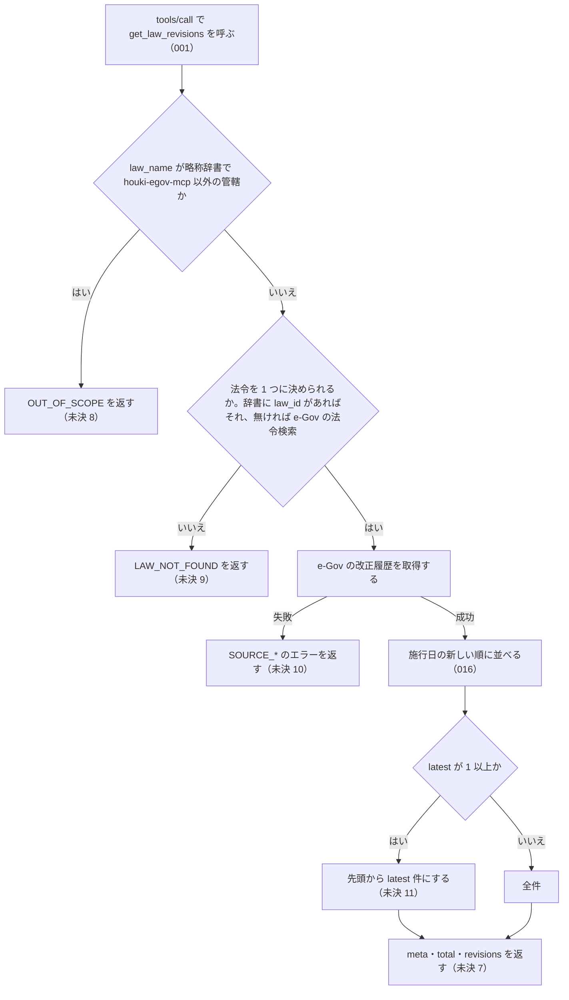

# get_law_revisions

<!-- GENERATED FILE — 手で編集しない。説明と引数はサーバーの tools/list、呼び出し例は scripts/reference-examples/houki-egov/ja/get_law_revisions.md、利用者と得られる結果・扱わないこと・処理の流れ・仕様項目の一覧は specs/current/get_law_revisions/spec.md、使いどころは scripts/spec-pages/houki-egov/get_law_revisions.md から。 -->

::: info
houki-egov-mcp **v0.20.1** の `tools/list` と `specs/current/get_law_revisions/spec.md` から自動生成しました（仕様 ID 18 件・2026-10-10）。手で編集しないでください。再生成は `node scripts/generate-reference.mjs` です。
:::

法令の改正履歴を取得します。e-Gov v2 の /law_revisions を使います。各改正の公布日・施行日・改正法令番号・状態（current_revision_status。CurrentEnforced=現行、PreviousEnforced=旧法、UnEnforced=未施行）等を返します。並びは施行日の新しい順で、まだ施行されていない改正も含みます。

## 利用者と得られる結果

このツールの利用者と、利用者が渡すもの・得られる結果を示します。

- MCP クライアント（Claude などの LLM、または CLI から呼ぶ人）。`law_name` を渡して、その法令の改正の一覧（改正ごとの公布日・施行日・改正法令の番号と題名・その版の状態）を受け取る

## 引数

呼び出すときに渡す値です。動いているサーバーの `tools/list` から写しています。

| 引数 | 型 | 必須 | 既定値 | 説明 |
|---|---|---|---|---|
| `law_name` | string (minLength 1) | **必須** |  | 法令名または略称。例: "消費税法", "消法", "民法" |
| `latest` | integer (≥ 1) | 任意 |  | 最新N件のみ返却（1 以上の整数。省略時は全件）。例: 5 |

## 呼び出し例

実際に呼び出したときの引数と応答です。版と日付は実測したときのものです。

::: details 呼び出し例 — 「消費税法の直近の改正と施行日」
- 実測: v0.20.0（2026-10-05）
- 確かめた版: v0.20.1（2026-10-10）
- ローカル DB: 不要

**引数**

```jsonc
{ "law_name": "消費税法", "latest": 2 }
```

**返る JSON**

```jsonc
{
  "meta": {
    "law_id": "363AC0000000108",
    "title": "消費税法",
    "law_num": "昭和六十三年法律第百八号",
    "retrieved_at": "2026-10-04T20:19:35.609Z",
    "url": "https://laws.e-gov.go.jp/law/363AC0000000108",
    "at": null
  },
  "total": 65,
  "revisions": [
    {
      "law_revision_id": "363AC0000000108_20300619_507AC0000000074",
      "amendment_promulgate_date": "2025-06-20",
      "amendment_enforcement_date": "2030-06-19",
      "amendment_enforcement_comment": "公布の日から起算して五年を超えない範囲内において政令で定める日",
      "amendment_law_num": "令和七年法律第七十四号",
      "amendment_law_title": "社会経済の変化を踏まえた年金制度の機能強化のための国民年金法等の一部を改正する等の法律",
      "amendment_law_id": "507AC0000000074",
      "current_revision_status": "UnEnforced"
    },
    {
      "law_revision_id": "363AC0000000108_20280401_508AC0000000012",
      "amendment_promulgate_date": "2026-03-31",
      "amendment_enforcement_date": "2028-04-01",
      "amendment_enforcement_comment": null,
      "amendment_law_num": "令和八年法律第十二号",
      "amendment_law_title": "所得税法等の一部を改正する法律",
      "amendment_law_id": "508AC0000000012",
      "current_revision_status": "UnEnforced"
    }
  ]
}
```

`current_revision_status` が `UnEnforced` のものは公布済みで未施行です。`amendment_enforcement_comment` に「政令で定める日」とあるときは、`amendment_enforcement_date` は上限の見込みで、確定日ではありません。`total` は全改正数で、`latest` を省略すると全件が返ります。並びは施行日の新しい順です。
:::

## 扱わないこと

このツールが意図して扱わないことです。

- 改正前・改正後の条文の本文や、条ごとの新旧の差分を返すこと（時点の本文は `get_law` の `at`）
- 改正法令そのものの本文を返すこと（`amendment_law_id` を `get_law` に渡す）
- 施行日・公布日・状態で絞り込むこと（`latest` で先頭から件数を絞るだけ）
- ローカル DB から返すこと（呼び出しごとに e-Gov を引く）
- 1 回の呼び出しで複数の法令の改正履歴を返すこと

## 処理の流れ

仕様書の「処理の流れ」の節を、図も含めてそのまま写しています。図が大きいので畳んでいます。

::: details 処理の流れの図（仕様書の写し）
呼び出しを受けてから応答を返すまでに、何をどの順で確かめるかを示します。図の中の番号は「できること」の仕様 ID の末尾 3 桁です。「未決 N」と書いた分岐は、「未決」の N 番の項目が指す仕様 ID でテストしています。


:::

## 仕様項目の一覧

このツールの仕様項目 18 件の見出しです。仕様項目は受入テストと 1 対 1 で対応していて、条件と例は[仕様書ページ](/specs/houki-egov/get_law_revisions)で読めます。

::: details 仕様項目の見出し（18 件）
| 仕様 ID | 仕様項目 |
|---|---|
| [001](/specs/houki-egov/get_law_revisions#spec-egov-get-law-revisions-001) | get_law_revisions という名前のツールとして呼べる |
| [002](/specs/houki-egov/get_law_revisions#spec-egov-get-law-revisions-002) | meta・total・revisions の形で改正履歴を返し、値の無いフィールドは null にする |
| [003](/specs/houki-egov/get_law_revisions#spec-egov-get-law-revisions-003) | 管轄外の名前は e-Gov を引かずに OUT_OF_SCOPE を返す |
| [004](/specs/houki-egov/get_law_revisions#spec-egov-get-law-revisions-004) | 法令が見つからないときは LAW_NOT_FOUND を返す |
| [005](/specs/houki-egov/get_law_revisions#spec-egov-get-law-revisions-005) | e-Gov が 429 を返し続けたら SOURCE_RATE_LIMITED を返す |
| [006](/specs/houki-egov/get_law_revisions#spec-egov-get-law-revisions-006) | e-Gov の応答を待ちきれなかったら SOURCE_TIMEOUT を返す |
| [007](/specs/houki-egov/get_law_revisions#spec-egov-get-law-revisions-007) | e-Gov が 500 番台を返し続けたら retryable: true の SOURCE_API_ERROR を返す |
| [008](/specs/houki-egov/get_law_revisions#spec-egov-get-law-revisions-008) | 改正履歴の取得で e-Gov が 404・`404001` を返したときは `LAW_NOT_FOUND`、そのほかの 429 と 500 番台以外の HTTP エラーは retryable: false の SOURCE_API_ERROR を返す |
| [009](/specs/houki-egov/get_law_revisions#spec-egov-get-law-revisions-009) | latest が 1 以上なら、施行日の新しい順の先頭から latest 件を返し、total は絞る前の件数のまま |
| [010](/specs/houki-egov/get_law_revisions#spec-egov-get-law-revisions-010) | latest を省くと全件を返す |
| [011](/specs/houki-egov/get_law_revisions#spec-egov-get-law-revisions-011) | 略称辞書に law_id がある名前は e-Gov の法令検索を引かない |
| [012](/specs/houki-egov/get_law_revisions#spec-egov-get-law-revisions-012) | `latest` は 1 以上の整数で、0・負の数・小数は `INVALID_ARGUMENT` にして改正履歴を取らない |
| [013](/specs/houki-egov/get_law_revisions#spec-egov-get-law-revisions-013) | law_name が空文字・空白だけのときは略称辞書と e-Gov に問い合わせずに `INVALID_ARGUMENT` を返す |
| [014](/specs/houki-egov/get_law_revisions#spec-egov-get-law-revisions-014) | 法令名の検索が通信の失敗で終わったときは `LAW_NOT_FOUND` ではなく `SOURCE_*` を返す |
| [015](/specs/houki-egov/get_law_revisions#spec-egov-get-law-revisions-015) | `law_name` の全角英数字・ダッシュ類・全角空白は半角に揃えてから略称辞書と照合する |
| [016](/specs/houki-egov/get_law_revisions#spec-egov-get-law-revisions-016) | `revisions` は施行日の新しい順に並べ、まだ施行されていない改正も含める |
| [017](/specs/houki-egov/get_law_revisions#spec-egov-get-law-revisions-017) | `current_revision_status` は e-Gov の値をそのまま返す |
| [018](/specs/houki-egov/get_law_revisions#spec-egov-get-law-revisions-018) | 法令名が完全一致しないときは、改正履歴を返さず候補を付けた `LAW_NOT_FOUND` を返す |
:::

## 関連ページ

このページの元になった文書と、あわせて読むページです。

- [houki-egov-mcp の解説](/mcp/houki-egov)
- [houki-egov-mcp のツール一覧](/reference/mcp/houki-egov/)
- [get_law_revisions の仕様書ページ](/specs/houki-egov/get_law_revisions)
- [元の仕様書（GitHub、v0.20.1）](https://github.com/shuji-bonji/houki-egov-mcp/blob/v0.20.1/specs/current/get_law_revisions/spec.md)
