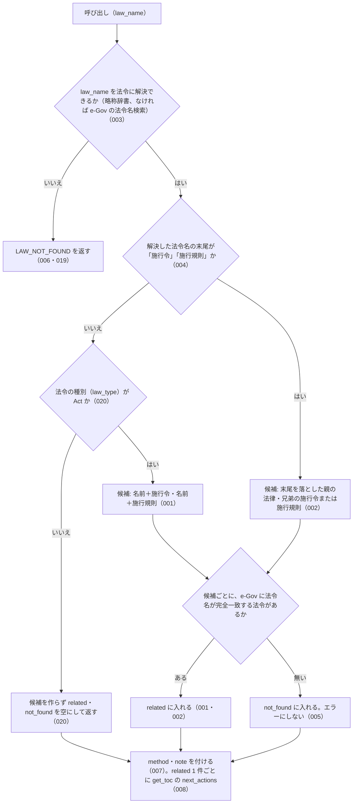

# get_related_laws

<!-- GENERATED FILE — 手で編集しない。説明と引数はサーバーの tools/list、呼び出し例は scripts/reference-examples/houki-egov/ja/get_related_laws.md、利用者と得られる結果・扱わないこと・処理の流れ・仕様項目の一覧は specs/current/get_related_laws/spec.md、使いどころは scripts/spec-pages/houki-egov/get_related_laws.md から。 -->

::: info
houki-egov-mcp **v0.20.1** の `tools/list` と `specs/current/get_related_laws/spec.md` から自動生成しました（仕様 ID 20 件・2026-10-10）。手で編集しないでください。再生成は `node scripts/generate-reference.mjs` です。
:::

法令名の規則で関連する法令を引きます。法律なら施行令・施行規則、施行令・施行規則なら親の法律と兄弟を、e-Gov に実在するものだけ返します（law_id 付き）。名前の末尾に「施行令」「施行規則」を付けた（落とした）候補だけを試すので、別の名前の下位法令や告示は返りません。法律でも施行令・施行規則でもない法令（省令・政令・規則など）からは候補を作らず、related を空にして note に理由を書きます。網羅性は主張しません。

## 利用者と得られる結果

このツールの利用者と、利用者が渡すもの・得られる結果を示します。

- MCP クライアント（Claude などの LLM、または CLI から呼ぶ人）。`law_name` を渡して、その法令の施行令・施行規則（施行令・施行規則を渡したときは親の法律と兄弟）のうち e-Gov に実在するものを `law_id` 付きで受け取る

## 引数

呼び出すときに渡す値です。動いているサーバーの `tools/list` から写しています。

| 引数 | 型 | 必須 | 既定値 | 説明 |
|---|---|---|---|---|
| `law_name` | string (minLength 1) | **必須** |  | 法令名または略称。例: "所得税法", "所法", "所得税法施行令" |

## 呼び出し例

実際に呼び出したときの引数と応答です。版と日付は実測したときのものです。

::: details 呼び出し例 — 「所得税法の施行令と施行規則」
- 実測: v0.20.0（2026-10-05）
- 確かめた版: v0.20.1（2026-10-10）
- ローカル DB: 不要

**引数**

```jsonc
{ "law_name": "所得税法" }
```

**返る JSON**

```jsonc
{
  "law": {
    "law_id": "340AC0000000033",
    "title": "所得税法",
    "law_num": "昭和四十年法律第三十三号"
  },
  "related": [
    {
      "relation": "enforcement_order",
      "law_id": "340CO0000000096",
      "title": "所得税法施行令",
      "law_num": "昭和四十年政令第九十六号",
      "law_type": "CabinetOrder",
      "abbr": "所令",
      "url": "https://laws.e-gov.go.jp/law/340CO0000000096"
    },
    {
      "relation": "enforcement_rule",
      "law_id": "340M50000040011",
      "title": "所得税法施行規則",
      "law_num": "昭和四十年大蔵省令第十一号",
      "law_type": "MinisterialOrdinance",
      "abbr": "所規",
      "url": "https://laws.e-gov.go.jp/law/340M50000040011"
    }
  ],
  "not_found": [],
  "method": "law_name_rule",
  "note": "法令名の末尾に「施行令」「施行規則」を付けた（または落とした）名前で e-Gov に実在するものだけを返しています。「…の施行に関する省令」など別の名前の下位法令、複数の省令、告示は対象外です。網羅性は保証しません",
  "next_actions": [
    {
      "action": "get_toc",
      "reason": "施行令の目次を見て、委任先の条を探せます",
      "example": {
        "law_name": "所得税法施行令"
      }
    },
    {
      "action": "get_toc",
      "reason": "施行規則の目次を見て、委任先の条を探せます",
      "example": {
        "law_name": "所得税法施行規則"
      }
    }
  ],
  "meta": {
    "retrieved_at": "2026-10-04T20:19:37.770Z",
    "at": null
  }
}
```

`related[]` は、法令名の末尾に「施行令」「施行規則」を付けた候補を e-Gov に問い合わせ、`law_title` が完全一致した 1 件だけです。無かった候補は `not_found[]` に残ります（民法なら `related` が空で `not_found` に 2 件）。`abbr` は略称辞書にあるときだけ付きます。施行令を渡すと `relation: "parent_act"` で親の法律と、兄弟の施行規則が返ります。「…の施行に関する省令」のような別の名前の下位法令は返らないので、`note` を citation に添えてください。法律でも施行令・施行規則でもない法令（省令・政令・規則など）を渡すと、候補を作らずに `related: []`・`not_found: []` を返し、`note` に理由を書きます（v0.18.0 から）。`meta.at` はこのツールが時点を受け取らないため常に `null` です。
:::

## 扱わないこと

このツールが意図して扱わないことです。

- 名前の末尾に「施行令」「施行規則」を付ける・落とす以外の規則で下位法令を探すこと（「…の施行に関する省令」「…施行細則」、複数の省令、告示は返さない）
- 関連法令の条文や、どの条がどの条に委任しているかを返すこと（条単位の委任は `get_article_references`、目次は `get_toc`）
- 時点を指定して関連法令を引くこと（引数に時点が無い）
- 通達など houki-egov-mcp の管轄外の資料を関連として返すこと
- 関連法令が網羅されていると保証すること

## 処理の流れ

仕様書の「処理の流れ」の節を、図も含めてそのまま写しています。図が大きいので畳んでいます。

::: details 処理の流れの図（仕様書の写し）
呼び出しを受けてから応答を返すまでに、何をどの順で確かめるかを示します。図の中の番号は「できること」の仕様 ID の末尾 3 桁です。


:::

## 仕様項目の一覧

このツールの仕様項目 20 件の見出しです。仕様項目は受入テストと 1 対 1 で対応していて、条件と例は[仕様書ページ](/specs/houki-egov/get_related_laws)で読めます。

::: details 仕様項目の見出し（20 件）
| 仕様 ID | 仕様項目 |
|---|---|
| [001](/specs/houki-egov/get_related_laws#spec-egov-get-related-laws-001) | 法律からは、実在する施行令と施行規則を law_id 付きで返す |
| [002](/specs/houki-egov/get_related_laws#spec-egov-get-related-laws-002) | 施行令・施行規則からは、親の法律と兄弟を返す |
| [003](/specs/houki-egov/get_related_laws#spec-egov-get-related-laws-003) | 略称で指定できる |
| [004](/specs/houki-egov/get_related_laws#spec-egov-get-related-laws-004) | 施行令・施行規則として扱うのは、名前の末尾が「施行令」「施行規則」のものだけ |
| [005](/specs/houki-egov/get_related_laws#spec-egov-get-related-laws-005) | e-Gov に無い候補は not_found に入れ、エラーにしない |
| [006](/specs/houki-egov/get_related_laws#spec-egov-get-related-laws-006) | 法令に解決できない名前はエラー `LAW_NOT_FOUND` |
| [007](/specs/houki-egov/get_related_laws#spec-egov-get-related-laws-007) | 応答に method と note を常に付ける |
| [008](/specs/houki-egov/get_related_laws#spec-egov-get-related-laws-008) | related 1 件ごとに get_toc を next_actions で案内する |
| [009](/specs/houki-egov/get_related_laws#spec-egov-get-related-laws-009) | related の要素に law_num・law_type・url を付ける |
| [010](/specs/houki-egov/get_related_laws#spec-egov-get-related-laws-010) | 成功の応答の meta に、応答を作った日時と `at: null` を入れる |
| [011](/specs/houki-egov/get_related_laws#spec-egov-get-related-laws-011) | 法令番号が分からないときは law.law_num を付けない |
| [012](/specs/houki-egov/get_related_laws#spec-egov-get-related-laws-012) | next_actions の get_toc に、related の法令名と関係に応じた reason を付ける |
| [013](/specs/houki-egov/get_related_laws#spec-egov-get-related-laws-013) | houki-egov-mcp の管轄外の略称はエラー `OUT_OF_SCOPE` で、管轄の MCP を案内する |
| [014](/specs/houki-egov/get_related_laws#spec-egov-get-related-laws-014) | 候補の問い合わせで e-Gov からの取得に失敗したら、SOURCE_* のエラーを返し候補ごとの結果は返さない |
| [015](/specs/houki-egov/get_related_laws#spec-egov-get-related-laws-015) | LAW_NOT_FOUND に hint と、resolve_abbreviation・search_law の next_actions を付ける |
| [016](/specs/houki-egov/get_related_laws#spec-egov-get-related-laws-016) | law_name が空文字・空白だけのときは略称辞書と e-Gov に問い合わせずに `INVALID_ARGUMENT` を返す |
| [017](/specs/houki-egov/get_related_laws#spec-egov-get-related-laws-017) | 法令名の検索が通信の失敗で終わったときは `LAW_NOT_FOUND` ではなく `SOURCE_*` を返す |
| [018](/specs/houki-egov/get_related_laws#spec-egov-get-related-laws-018) | `law_name` の全角英数字・ダッシュ類・全角空白は半角に揃えてから略称辞書と照合する |
| [019](/specs/houki-egov/get_related_laws#spec-egov-get-related-laws-019) | 法令名が完全一致しないときは、関連法令を引かず候補を付けた `LAW_NOT_FOUND` を返す |
| [020](/specs/houki-egov/get_related_laws#spec-egov-get-related-laws-020) | 法律でもなく、名前の末尾が「施行令」「施行規則」でもない法令からは候補を作らない |
:::

## 関連ページ

このページの元になった文書と、あわせて読むページです。

- [houki-egov-mcp の解説](/mcp/houki-egov)
- [houki-egov-mcp のツール一覧](/reference/mcp/houki-egov/)
- [get_related_laws の仕様書ページ](/specs/houki-egov/get_related_laws)
- [元の仕様書（GitHub、v0.20.1）](https://github.com/shuji-bonji/houki-egov-mcp/blob/v0.20.1/specs/current/get_related_laws/spec.md)
