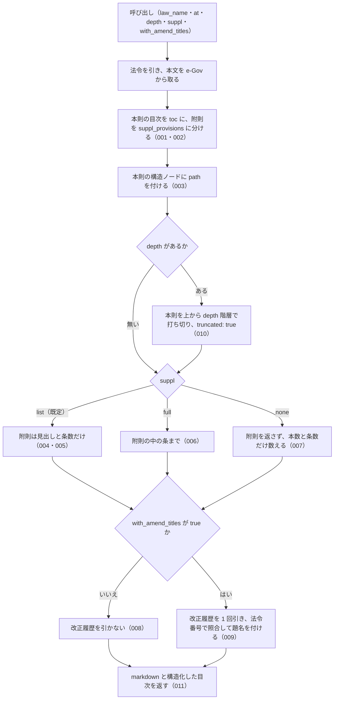

# get_toc

<!-- GENERATED FILE — 手で編集しない。説明と引数はサーバーの tools/list、呼び出し例は scripts/reference-examples/houki-egov/ja/get_toc.md、使う人と受け取るもの・できないこと・処理の流れ・約束の一覧は specs/current/get_toc/spec.md、使いどころは scripts/spec-pages/houki-egov/get_toc.md から。 -->

::: info
houki-egov-mcp **v0.20.0** の `tools/list` と `specs/current/get_toc/spec.md` から自動生成しました（仕様 ID 28 件・2026-10-10）。手で編集しないでください。再生成は `node scripts/generate-reference.mjs` です。
:::

法令の目次（編・章・節・条の構造）のみを取得する。トークン節約用。本則は `toc`、附則は改正法ごとに `suppl_provisions` へ分けて返す（現行の規定と、改正法ごとの施行日・経過措置を混ぜないため）。既定では附則は見出しと条数だけを返し、`suppl: "full"` で附則の中の条まで返す。depth で階層を浅く打ち切れる（民法・会社法のような大規模法令の概観把握向け）。応答の toc[].path（例 "Part3/Chapter2"）は get_law_range にそのまま渡せる。

## 使う人と受け取るもの

このツールを誰が呼び、何を渡して何を受け取るかを示します。

- MCP クライアント（Claude などの LLM、または CLI から呼ぶ人）。`law_name` を渡して、法令の編・章・節・条の目次（本則）と、改正法ごとの附則の目次を受け取る。受け取った `toc[].path` や `suppl_provisions[].index` を `get_law_range` に渡して、範囲の本文を取る

## 引数

呼び出すときに渡す値です。動いているサーバーの `tools/list` から写しています。

| 引数 | 型 | 必須 | 既定値 | 説明 |
|---|---|---|---|---|
| `law_name` | string (minLength 1) | **必須** |  | 法令名または略称 |
| `at` | string | 任意 |  | 時点指定（YYYY-MM-DD） |
| `depth` | integer (≥ 1) | 任意 |  | 本則の構造階層（編・章・節・款・目）を上から何階層まで返すか（1 以上の整数）。最上位の階層から数えるので、編を持つ法令（民法など）では 1 が編まで、章から始まる法令（消費税法など）では 1 が章までです。省略時は全階層 |
| `suppl` | `"list"` \| `"full"` \| `"none"` | 任意 | `"list"` | 附則をどこまで返すか。"list"（デフォルト）=改正法ごとの見出しと条数だけ、"full"=附則の中の条まで、"none"=附則を返さない。附則は改正法ごとに積み上がり、所得税法は 352 本・条 983 件あるため、既定では見出しだけを返す |
| `with_amend_titles` | boolean | 任意 | `false` | 附則に改正法の題名を付ける（デフォルト: false）。附則の属性には法令番号しか無いため、改正履歴（get_law_revisions と同じ e-Gov の応答）を 1 回引いて法令番号で照合する。e-Gov の改正履歴は近年の改正が中心なので、それより古い改正法の題名は付かない（付いた本数と付かなかった本数は応答の suppl.amend_law_titles に入る） |

::: tip 本則と附則は別に返ります（v0.13.0）
本則は `toc`、附則は改正法ごとに `suppl_provisions` へ分かれます。既定（`suppl: "list"`）では附則は見出しと条数だけで、中の条は返りません。`toc` の構造ノードに付く `path`（例 `Part3/Chapter2`）は、`get_law_range` にそのまま渡して章・節の条文を取れます（v0.14.0）。
:::

## 呼び出し例

実際に呼び出したときの引数と応答です。版と日付は実測したときのものです。

::: details 呼び出し例 — 「民法の大区分だけ見たい」
- 実測: v0.20.0（2026-10-05）
- ローカル DB: 不要

**引数**

```jsonc
{ "law_name": "民法", "depth": 1 }
```

**返る JSON（抜粋）**

```jsonc
{
  "markdown": "# 民法 — 目次\n\n## 本則\n\n- 第一編　総則\n- 第二編　物権\n- 第三編　債権\n- 第四編　親族\n- 第五編　相続\n\n## 附則（67 本・条 201 件）\n\n- 附則(1) 大正一五年四月二四日法律第六九号 — 項のみ\n…",
  "toc": [
    { "tag": "Part", "num": "1", "title": "第一編　総則", "path": "Part1", "children": [] },
    { "tag": "Part", "num": "2", "title": "第二編　物権", "path": "Part2", "children": [] },
    { "tag": "Part", "num": "3", "title": "第三編　債権", "path": "Part3", "children": [] },
    { "tag": "Part", "num": "4", "title": "第四編　親族", "path": "Part4", "children": [] },
    { "tag": "Part", "num": "5", "title": "第五編　相続", "path": "Part5", "children": [] }
  ],
  "suppl_provisions": [
    {
      "index": 1,
      "label": "附則",
      "amend_law_num": "大正一五年四月二四日法律第六九号",
      "extract": false,
      "article_count": 0,
      "paragraph_only": true,   // 条を立てず項だけで書かれた附則
      "children": []
    },
    {
      "index": 3,
      "label": "附則",
      "amend_law_num": "昭和二二年四月一六日法律第六一号",
      "extract": true,          // 抄（改正法の附則の一部だけを載せた形）
      "article_count": 1,
      "paragraph_only": false,
      "children": []
    }
    // …計 67 件
  ],
  "suppl": {
    "mode": "list",
    "count": 67,
    "article_count": 201,
    "note": "附則 67 本の見出しと条数だけを返しました（条は合計 201 件）。中の条まで要るときは suppl: \"full\" を指定してください"
  },
  "meta": {
    "law_id": "129AC0000000089",
    "title": "民法",
    "law_num": "明治二十九年法律第八十九号",
    "retrieved_at": "2026-10-04T20:20:23.578Z",
    "url": "https://laws.e-gov.go.jp/law/129AC0000000089",
    "at": null
  },
  "node_count": 5,
  "truncated": true
}
```

`node_count` は本則のノード数、`truncated: true` は `depth` で本則の階層を打ち切ったことを示します（附則の本数は `depth` では変わりません）。`toc[].path` を `get_law_range` に渡すと、その編・章の条文を本文ごと取れます。特定の条を探すだけなら、`get_toc` より `search_fulltext` に「民法 不法行為」のように法令名と語を渡す方が短く済みます。
:::

## できないこと

このツールが引き受けないことです。

- 条の本文を返すこと（範囲の本文は `get_law_range`、1 条ずつは `get_law`）
- 附則の中に `path` を付けること（附則は `suppl_provisions[].index` で指す）
- 題名が e-Gov の改正履歴に無い古い改正法に、題名を付けること
- `format` を選ぶこと（応答は markdown と構造化した目次の両方を常に返す）

## 処理の流れ

仕様書の「処理の流れ」の節を、図も含めてそのまま写しています。図が大きいので畳んでいます。

::: details 処理の流れの図（仕様書の写し）
呼び出しを受けてから応答を返すまでに、何をどの順で行うかを示します。図の中の番号は「できること」の仕様 ID の末尾 3 桁です。


:::

## 約束の一覧

このツールが守る約束 28 件の見出しです。約束は受入テストと 1 対 1 で対応していて、条件と例は[仕様書ページ](/specs/houki-egov/get_toc)で読めます。

::: details 約束の見出し（28 件）
| 仕様 ID | 約束 |
|---|---|
| [001](/specs/houki-egov/get_toc#spec-egov-get-toc-001) | 本則を `toc`、附則を `suppl_provisions` に分けて返す |
| [002](/specs/houki-egov/get_toc#spec-egov-get-toc-002) | `toc` のノードの形 |
| [003](/specs/houki-egov/get_toc#spec-egov-get-toc-003) | 本則の構造ノードに、`get_law_range` にそのまま渡せる `path` を付ける |
| [004](/specs/houki-egov/get_toc#spec-egov-get-toc-004) | 既定（`suppl: "list"`）では附則の見出しと条数だけを返す |
| [005](/specs/houki-egov/get_toc#spec-egov-get-toc-005) | `suppl_provisions` の各要素の形 |
| [006](/specs/houki-egov/get_toc#spec-egov-get-toc-006) | `suppl: "full"` では附則の中の条まで返す |
| [007](/specs/houki-egov/get_toc#spec-egov-get-toc-007) | `suppl: "none"` では附則を返さず、本数と条数だけを返す |
| [008](/specs/houki-egov/get_toc#spec-egov-get-toc-008) | 既定では改正履歴を引かない |
| [009](/specs/houki-egov/get_toc#spec-egov-get-toc-009) | `with_amend_titles: true` で附則に改正法の題名を付ける |
| [010](/specs/houki-egov/get_toc#spec-egov-get-toc-010) | `depth` で本則の階層を上から打ち切る |
| [011](/specs/houki-egov/get_toc#spec-egov-get-toc-011) | markdown の目次 |
| [012](/specs/houki-egov/get_toc#spec-egov-get-toc-012) | 法令が見つからないときは LAW_NOT_FOUND を返す |
| [013](/specs/houki-egov/get_toc#spec-egov-get-toc-013) | houki-egov の管轄外の名前には OUT_OF_SCOPE を返す |
| [014](/specs/houki-egov/get_toc#spec-egov-get-toc-014) | 法令本文の取得で e-Gov が失敗したときのエラー |
| [015](/specs/houki-egov/get_toc#spec-egov-get-toc-015) | 応答の `meta` |
| [016](/specs/houki-egov/get_toc#spec-egov-get-toc-016) | `node_count` は返した本則の目次のノード数 |
| [017](/specs/houki-egov/get_toc#spec-egov-get-toc-017) | markdown の見出しと末尾の出典 |
| [018](/specs/houki-egov/get_toc#spec-egov-get-toc-018) | `at` で時点を指定する |
| [019](/specs/houki-egov/get_toc#spec-egov-get-toc-019) | `suppl: "full"` と `depth` を一緒に渡すと、附則の中の目次も打ち切る |
| [020](/specs/houki-egov/get_toc#spec-egov-get-toc-020) | 改正履歴が取れなかったときは、題名なしの目次を返す |
| [021](/specs/houki-egov/get_toc#spec-egov-get-toc-021) | `suppl: "none"` のときは `with_amend_titles` を渡しても改正履歴を引かない |
| [023](/specs/houki-egov/get_toc#spec-egov-get-toc-023) | `depth` は 1 以上の整数で、0・負の数・小数は `INVALID_ARGUMENT` にして法令を取らない |
| [024](/specs/houki-egov/get_toc#spec-egov-get-toc-024) | `at` は `YYYY-MM-DD` の形だけを受け付け、形に合わない値と暦に無い日付は `INVALID_ARGUMENT` |
| [025](/specs/houki-egov/get_toc#spec-egov-get-toc-025) | law_name が空文字・空白だけのときは e-Gov に問い合わせずに `INVALID_ARGUMENT` を返す |
| [026](/specs/houki-egov/get_toc#spec-egov-get-toc-026) | 法令名の検索が通信の失敗で終わったときは `LAW_NOT_FOUND` ではなく `SOURCE_*` を返す |
| [027](/specs/houki-egov/get_toc#spec-egov-get-toc-027) | `law_name` の全角英数字・ダッシュ類・全角空白は半角に揃えてから略称辞書と照合する |
| [028](/specs/houki-egov/get_toc#spec-egov-get-toc-028) | 法令名が完全一致しないときは、目次を返さず候補を付けた `LAW_NOT_FOUND` を返す |
| [029](/specs/houki-egov/get_toc#spec-egov-get-toc-029) | 法令本文の取得で e-Gov が 404・時点の 400 を返したときは `LAW_NOT_FOUND`・`INVALID_ARGUMENT` |
:::

## 関連ページ

このページの元になった文書と、あわせて読むページです。

- [houki-egov-mcp の解説](/mcp/houki-egov)
- [houki-egov-mcp のツール一覧](/reference/mcp/houki-egov/)
- [get_toc の仕様書ページ](/specs/houki-egov/get_toc)
- [元の仕様書（GitHub、v0.20.0）](https://github.com/shuji-bonji/houki-egov-mcp/blob/v0.20.0/specs/current/get_toc/spec.md)
