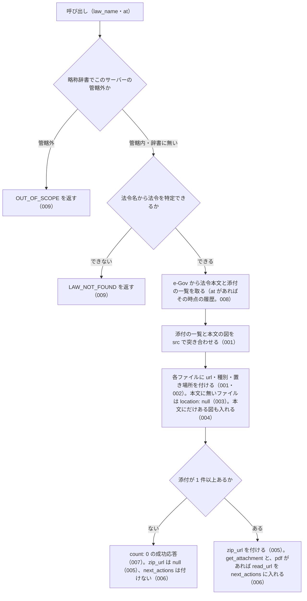

# list_attachments

<!-- GENERATED FILE — 手で編集しない。説明と引数はサーバーの tools/list、呼び出し例は scripts/reference-examples/houki-egov/ja/list_attachments.md、利用者と得られる結果・扱わないこと・処理の流れ・仕様項目の一覧は specs/current/list_attachments/spec.md、使いどころは scripts/spec-pages/houki-egov/list_attachments.md から。 -->

::: info
houki-egov-mcp **v0.20.1** の `tools/list` と `specs/current/list_attachments/spec.md` から自動生成しました（仕様 ID 25 件・2026-10-10）。手で編集しないでください。再生成は `node scripts/generate-reference.mjs` です。
:::

法令に付いている添付ファイル（別表・様式・別記の図。jpg / pdf）の一覧を返す。各ファイルに、認証なしで開ける取得 URL と、法令の中の置き場所（「別表第一（第一条関係）」「附録第十一号様式」のような見出しと関係条文、条の中なら条番号）を付ける。get_law の条文には図の中身が入らないので、別表・様式の図が要るときにこのツールで URL を取る。pdf は pdf-reader-mcp の read_url に url を渡して読める。ファイルの中身は返さない。

## 利用者と得られる結果

このツールの利用者と、利用者が渡すもの・得られる結果を示します。

- MCP クライアント（Claude などの LLM、または CLI から呼ぶ人）。`law_name`（と任意で `at`）を渡して、その法令履歴に付いている添付ファイル（別表・様式・別記の図。jpg / pdf）の一覧を受け取る。一覧の `url` をそのまま開くか、pdf-reader-mcp の `read_url` に渡すか、`get_attachment` で保存する

## 引数

呼び出すときに渡す値です。動いているサーバーの `tools/list` から写しています。

| 引数 | 型 | 必須 | 既定値 | 説明 |
|---|---|---|---|---|
| `law_name` | string (minLength 1) | **必須** |  | 法令名または略称。例: "戸籍法施行規則", "国旗及び国歌に関する法律" |
| `at` | string | 任意 |  | 時点指定。YYYY-MM-DD 形式（get_law と同じ）。添付ファイルは法令履歴ごとに付くので、時点を変えると一覧も変わる |

::: tip 条文に入らないものはここから
別表・様式・別記の図は `get_law` の Markdown には入りません（`Fig` 要素は落ちます）。届書の書式や旗の寸法図が要るときは、まずこのツールで一覧と URL を取ります。URL は認証なしで開けるので、pdf は pdf-reader-mcp の `read_url` にそのまま渡せます。
:::

## 呼び出し例

実際に呼び出したときの引数と応答です。版と日付は実測したときのものです。

::: details 呼び出し例 — 「国旗国歌法の日章旗の寸法図はどこにあるか」
- 実測: v0.20.0（2026-10-05）
- 確かめた版: v0.20.1（2026-10-10）
- ローカル DB: 不要

**引数**

```jsonc
{ "law_name": "国旗及び国歌に関する法律" }
```

**返る JSON**

```jsonc
{
  "meta": {
    "law_id": "411AC0000000127",
    "title": "国旗及び国歌に関する法律",
    "law_num": "平成十一年法律第百二十七号",
    "law_revision_id": "411AC0000000127_19990813_000000000000000",   // 添付ファイルはこの履歴に付く
    "retrieved_at": "2026-10-04T20:20:26.713Z",
    "url": "https://laws.e-gov.go.jp/law/411AC0000000127",
    "at": null
  },
  "count": 2,
  "attachments": [
    {
      "src": "./pict/H11HO127-001.jpg",                 // get_attachment の src にそのまま渡す
      "file_name": "H11HO127-001.jpg",
      "file_type": "jpg",
      "content_type": "image/jpeg",
      "url": "https://laws.e-gov.go.jp/api/2/attachment/411AC0000000127_19990813_000000000000000?src=.%2Fpict%2FH11HO127-001.jpg",
      "location": { "tag": "AppdxNote", "title": "別記第一", "related_article": "（第一条関係）" },   // 日章旗の制式
      "updated": "2024-07-25T00:20:13+09:00"
    },
    {
      "src": "./pict/H11HO127-002.jpg",
      "file_name": "H11HO127-002.jpg",
      "file_type": "jpg",
      "content_type": "image/jpeg",
      "url": "https://laws.e-gov.go.jp/api/2/attachment/411AC0000000127_19990813_000000000000000?src=.%2Fpict%2FH11HO127-002.jpg",
      "location": { "tag": "AppdxNote", "title": "別記第二", "related_article": "（第二条関係）" },   // 君が代の楽譜
      "updated": "2024-07-25T00:20:13+09:00"
    }
  ],
  "zip_url": "https://laws.e-gov.go.jp/api/2/attachment/411AC0000000127_19990813_000000000000000",
  "note": "国旗及び国歌に関する法律 の添付ファイル 2 件（jpg 2 件）。url は認証なしで開けます。",
  "next_actions": [
    {
      "action": "get_attachment",
      "reason": "1 件を保存するときは save: true を付ける（保存しないなら一覧の url をそのまま使えます）",
      "example": { "law_name": "国旗及び国歌に関する法律", "src": "./pict/H11HO127-001.jpg", "save": true }
    }
  ]
}
```

`location` は e-Gov の一覧（`attached_files_info`）には無い情報で、本文の `Fig` 要素がどの別表・様式の下にあるかから付けています。
:::

::: details 呼び出し例 — 「戸籍法施行規則の様式（届書の書式）を一覧で」
- 実測: v0.20.0（2026-10-05）
- 確かめた版: v0.20.1（2026-10-10）
- ローカル DB: 不要

**引数**

```jsonc
{ "law_name": "戸籍法施行規則" }
```

**返る JSON（抜粋）**

```jsonc
{
  "meta": { "law_id": "322M40000010094", "title": "戸籍法施行規則", "law_revision_id": "322M40000010094_20260626_508M60000010043", "at": null, "…": "…" },
  "count": 42,
  "attachments": [
    {
      "src": "./pict/2JH00000247973.jpg", "file_type": "jpg", "content_type": "image/jpeg",
      "url": "https://laws.e-gov.go.jp/api/2/attachment/322M40000010094_20260626_508M60000010043?src=.%2Fpict%2F2JH00000247973.jpg",
      "location": { "tag": "AppdxTable", "title": "別表第二", "related_article": "（第三十条の二関係）" },
      "updated": "2026-07-15T10:10:29+09:00"
    },
    // … jpg 7 件
    {
      "src": "./pict/2FH00000007000.pdf", "file_type": "pdf", "content_type": "application/pdf",
      "url": "https://laws.e-gov.go.jp/api/2/attachment/322M40000010094_20260626_508M60000010043?src=.%2Fpict%2F2FH00000007000.pdf",
      "location": { "tag": "AppdxStyle", "title": "附録第一号様式", "related_article": "戸籍（第一条関係）" },
      "updated": "2026-07-15T10:10:24+09:00"
    },
    {
      "src": "./pict/2FH00000076885.pdf", "file_type": "pdf", "content_type": "application/pdf",
      "url": "https://laws.e-gov.go.jp/api/2/attachment/322M40000010094_20260626_508M60000010043?src=.%2Fpict%2F2FH00000076885.pdf",
      "location": { "tag": "AppdxStyle", "title": "附録第十一号様式", "related_article": "出生の届書（日本産業規格Ａ列四番）（第五十九条関係）" },
      "updated": "2026-07-15T10:10:26+09:00"
    }
    // … pdf 35 件（別表 7・様式 22・書式 13）
  ],
  "note": "戸籍法施行規則 の添付ファイル 42 件（jpg 7 件、pdf 35 件）。url は認証なしで開けます。",
  "next_actions": [
    { "action": "get_attachment", "reason": "…", "example": { "law_name": "戸籍法施行規則", "src": "./pict/2JH00000247973.jpg", "save": true } },
    { "action": "pdf-reader-mcp:read_url", "reason": "pdf の添付は pdf-reader-mcp の read_url に url を渡すと本文を読めます", "example": { "url": "https://laws.e-gov.go.jp/api/2/attachment/322M40000010094_20260626_508M60000010043?src=.%2Fpict%2F2FH00000007000.pdf" } }
  ]
}
```

`location.title` で「附録第十一号様式」を選び、その `url` を pdf-reader-mcp の `read_url` に渡せば出生届の書式が読めます。添付が無い法令（民法）では `count: 0` の成功応答で、エラーにはなりません。
:::

## 扱わないこと

このツールが意図して扱わないことです。

- 添付ファイルの中身（画像・pdf のバイト列や base64）を返すこと。返すのは URL だけで、取得・保存は `get_attachment` が行う
- pdf の添付の本文を読むこと（pdf-reader-mcp の `read_url` に `url` を渡す）
- 図の中身（別表の表の値など）をテキストにすること
- 複数の時点の添付の一覧を比べること（時点ごとに `at` を変えて呼ぶ）

## 処理の流れ

仕様書の「処理の流れ」の節を、図も含めてそのまま写しています。図が大きいので畳んでいます。

::: details 処理の流れの図（仕様書の写し）
呼び出しを受けてから応答を返すまでに、何をどの順で確かめるかを示します。図の中の番号は「できること」の仕様 ID の末尾 3 桁です。


:::

## 仕様項目の一覧

このツールの仕様項目 25 件の見出しです。仕様項目は受入テストと 1 対 1 で対応していて、条件と例は[仕様書ページ](/specs/houki-egov/list_attachments)で読めます。

::: details 仕様項目の見出し（25 件）
| 仕様 ID | 仕様項目 |
|---|---|
| [001](/specs/houki-egov/list_attachments#spec-egov-list-attachments-001) | 添付ファイルの一覧を、取得 URL と種別付きで返す |
| [002](/specs/houki-egov/list_attachments#spec-egov-list-attachments-002) | 各ファイルに、法令の中の置き場所を付ける |
| [003](/specs/houki-egov/list_attachments#spec-egov-list-attachments-003) | 本文に見つからないファイルは、置き場所を null にして数を知らせる |
| [004](/specs/houki-egov/list_attachments#spec-egov-list-attachments-004) | 本文にだけある図も一覧に入れる |
| [005](/specs/houki-egov/list_attachments#spec-egov-list-attachments-005) | 添付ファイルをまとめた zip の URL を返す |
| [006](/specs/houki-egov/list_attachments#spec-egov-list-attachments-006) | 1 件の保存と pdf の読み取りを案内する |
| [007](/specs/houki-egov/list_attachments#spec-egov-list-attachments-007) | 添付が無い法令は count 0 の成功応答にする |
| [008](/specs/houki-egov/list_attachments#spec-egov-list-attachments-008) | 時点（at）を渡すと、その時点の法令履歴の一覧になる |
| [009](/specs/houki-egov/list_attachments#spec-egov-list-attachments-009) | 特定できない法令と管轄外の資料はエラーにする |
| [010](/specs/houki-egov/list_attachments#spec-egov-list-attachments-010) | 一覧は attached_files_info の順、その後ろに本文にだけある図を本文の出現順に並べる |
| [011](/specs/houki-egov/list_attachments#spec-egov-list-attachments-011) | 同じ src は 1 件にし、最初に出てきたものの値を使う |
| [012](/specs/houki-egov/list_attachments#spec-egov-list-attachments-012) | 別表・書式・別図・付録の中の図の置き場所 |
| [013](/specs/houki-egov/list_attachments#spec-egov-list-attachments-013) | 別表・様式・条・附則のどれにも入らない図は tag: "Law" |
| [014](/specs/houki-egov/list_attachments#spec-egov-list-attachments-014) | 附則の中の条にある図には、附則の改正法番号も付ける |
| [015](/specs/houki-egov/list_attachments#spec-egov-list-attachments-015) | meta の法令 ID・題名・法令番号・取得日時・URL・時点 |
| [016](/specs/houki-egov/list_attachments#spec-egov-list-attachments-016) | next_actions の example の中身 |
| [017](/specs/houki-egov/list_attachments#spec-egov-list-attachments-017) | e-Gov の応答に法令履歴 ID が無いときはエラーにする |
| [018](/specs/houki-egov/list_attachments#spec-egov-list-attachments-018) | 法令本文の取得に失敗したときの code |
| [019](/specs/houki-egov/list_attachments#spec-egov-list-attachments-019) | 429・5xx・ネットワークの失敗は取り直してから返す |
| [020](/specs/houki-egov/list_attachments#spec-egov-list-attachments-020) | law_name が空文字・空白だけのときは略称辞書と e-Gov に問い合わせずに `INVALID_ARGUMENT` を返す |
| [021](/specs/houki-egov/list_attachments#spec-egov-list-attachments-021) | `at` は `YYYY-MM-DD` の形だけを受け付け、形に合わない値と暦に無い日付は `INVALID_ARGUMENT` |
| [022](/specs/houki-egov/list_attachments#spec-egov-list-attachments-022) | 法令名の検索が通信の失敗で終わったときは `LAW_NOT_FOUND` ではなく `SOURCE_*` を返す |
| [023](/specs/houki-egov/list_attachments#spec-egov-list-attachments-023) | `law_name` の全角英数字・ダッシュ類・全角空白は半角に揃えてから略称辞書と照合する |
| [024](/specs/houki-egov/list_attachments#spec-egov-list-attachments-024) | 法令名が完全一致しないときは、一覧を返さず候補を付けた `LAW_NOT_FOUND` を返す |
| [025](/specs/houki-egov/list_attachments#spec-egov-list-attachments-025) | 附則の別表・様式・付録の中の図には、その見出しと附則の改正法番号を付ける |
:::

## 関連ページ

このページの元になった文書と、あわせて読むページです。

- [houki-egov-mcp の解説](/mcp/houki-egov)
- [houki-egov-mcp のツール一覧](/reference/mcp/houki-egov/)
- [list_attachments の仕様書ページ](/specs/houki-egov/list_attachments)
- [元の仕様書（GitHub、v0.20.1）](https://github.com/shuji-bonji/houki-egov-mcp/blob/v0.20.1/specs/current/list_attachments/spec.md)
