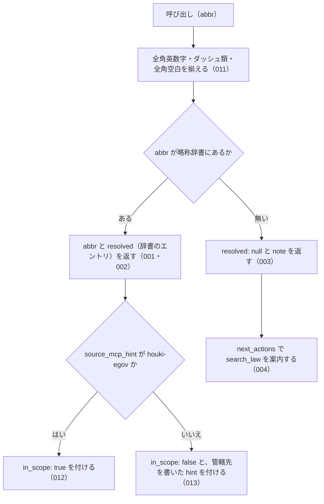

# resolve_abbreviation

<!-- GENERATED FILE — 手で編集しない。説明と引数はサーバーの tools/list、呼び出し例は scripts/reference-examples/houki-egov/ja/resolve_abbreviation.md、利用者と得られる結果・扱わないこと・処理の流れ・仕様項目の一覧は specs/current/resolve_abbreviation/spec.md、使いどころは scripts/spec-pages/houki-egov/resolve_abbreviation.md から。 -->

::: info
houki-egov-mcp **v0.20.1** の `tools/list` と `specs/current/resolve_abbreviation/spec.md` から自動生成しました（仕様 ID 13 件・2026-10-10）。手で編集しないでください。再生成は `node scripts/generate-reference.mjs` です。
:::

略称・通称から正式な法令名と law_id を解決する。略称辞書の内容を確認するための診断ツール。全角英数字・ダッシュ類・全角空白は半角に揃えてから照合する。辞書のエントリはどの管轄でも返し（通達なら houki-nta の管轄）、in_scope と hint で管轄を示す。

## 利用者と得られる結果

このツールの利用者と、利用者が渡すもの・得られる結果を示します。

- MCP クライアント（Claude などの LLM、または CLI から呼ぶ人）。`abbr` を渡して、その略称が略称辞書のどのエントリ（正式名称・e-Gov の法令 ID・分野・種別・本文を持つ MCP）を指すかを受け取る。辞書の内容を確かめるための診断に使う

## 引数

呼び出すときに渡す値です。動いているサーバーの `tools/list` から写しています。

| 引数 | 型 | 必須 | 既定値 | 説明 |
|---|---|---|---|---|
| `abbr` | string (minLength 1) | **必須** |  | 略称。例: "消法", "所法", "労基法", "民" |

## 呼び出し例

実際に呼び出したときの引数と応答です。版と日付は実測したときのものです。

::: details 呼び出し例 — 「消基通 は何の略で、どのサーバーが担当か」
- 実測: v0.20.0（2026-10-05）
- 確かめた版: v0.20.1（2026-10-10）
- ローカル DB: 不要（辞書は houki-abbreviations に内蔵）

**引数**

```jsonc
{ "abbr": "消基通" }
```

**返る JSON**

```jsonc
{
  "abbr": "消基通",
  "resolved": {
    "abbr": "消基通",
    "formal": "消費税法基本通達",
    "law_id": null,
    "domain": "tax",
    "category": "kihon-tsutatsu",
    "source_mcp_hint": "houki-nta",
    "note": "国税庁長官が発する消費税法の解釈通達。実務の主要参照"
  },
  "in_scope": false,
  "hint": "このエントリは houki-nta の管轄です。houki-nta-mcp で取得してください。"
}
```

`in_scope: false` と `hint`、`source_mcp_hint: "houki-nta"` のとおり、この略称の本文は houki-egov-mcp ではなく houki-nta-mcp（`nta_get_tsutatsu`）で取ります（`in_scope` と `hint` は v0.16.0 から）。`resolved.aliases` は、通称があるエントリにだけ付きます（houki-abbreviations 0.7.0 から、`formal` と同じ値は入れていません）。通達は e-Gov に載っていないため `law_id` は `null` です。法律の略称（「消法」「個情法」）なら `law_id` に e-Gov の ID が入り、`source_mcp_hint` は `"houki-egov"` になります。
:::

## 扱わないこと

このツールが意図して扱わないことです。

- 略称を渡して条文を返すこと（条文は `get_law`。`get_law` も略称を受け付ける）
- 部分一致や似た名前（打ち間違い）から候補を探すこと
- 文章の中から法令名を探すこと
- 1 回の呼び出しで複数の略称を引くこと
- 辞書に無い法令を e-Gov で探すこと（`next_actions` で `search_law` を案内するだけ）

## 処理の流れ

仕様書の「処理の流れ」の節を、図も含めてそのまま写しています。図が大きいので畳んでいます。

::: details 処理の流れの図（仕様書の写し）
呼び出しを受けてから応答を返すまでに、何をどの順で確かめるかを示します。図の中の番号は「できること」の仕様 ID の末尾 3 桁です。


:::

## 仕様項目の一覧

このツールの仕様項目 13 件の見出しです。仕様項目は受入テストと 1 対 1 で対応していて、条件と例は[仕様書ページ](/specs/houki-egov/resolve_abbreviation)で読めます。

::: details 仕様項目の見出し（13 件）
| 仕様 ID | 仕様項目 |
|---|---|
| [001](/specs/houki-egov/resolve_abbreviation#spec-egov-resolve-abbreviation-001) | 辞書にある略称は、`resolved` に辞書のエントリを入れて返す |
| [002](/specs/houki-egov/resolve_abbreviation#spec-egov-resolve-abbreviation-002) | 返すエントリは種別と本文を持つ MCP の名前を持つ |
| [003](/specs/houki-egov/resolve_abbreviation#spec-egov-resolve-abbreviation-003) | 辞書に無い略称は、エラーにせず `resolved: null` と `note` を返す |
| [004](/specs/houki-egov/resolve_abbreviation#spec-egov-resolve-abbreviation-004) | 辞書に無い略称には、`search_law` を試す案内を付ける |
| [005](/specs/houki-egov/resolve_abbreviation#spec-egov-resolve-abbreviation-005) | 正式名称からも、そのエントリを返す |
| [006](/specs/houki-egov/resolve_abbreviation#spec-egov-resolve-abbreviation-006) | 別名からも、そのエントリを返す |
| [007](/specs/houki-egov/resolve_abbreviation#spec-egov-resolve-abbreviation-007) | 前後の空白を除いてから辞書と照合する |
| [008](/specs/houki-egov/resolve_abbreviation#spec-egov-resolve-abbreviation-008) | 応答の abbr は渡した値のまま返す |
| [009](/specs/houki-egov/resolve_abbreviation#spec-egov-resolve-abbreviation-009) | resolved は略称辞書のエントリをそのまま返す |
| [010](/specs/houki-egov/resolve_abbreviation#spec-egov-resolve-abbreviation-010) | abbr が空文字・空白だけのときは略称辞書を引かずに `INVALID_ARGUMENT` を返す |
| [011](/specs/houki-egov/resolve_abbreviation#spec-egov-resolve-abbreviation-011) | `abbr` の全角英数字・ダッシュ類・全角空白は半角に揃えてから辞書と照合する |
| [012](/specs/houki-egov/resolve_abbreviation#spec-egov-resolve-abbreviation-012) | houki-egov の管轄のエントリには `in_scope: true` を付ける |
| [013](/specs/houki-egov/resolve_abbreviation#spec-egov-resolve-abbreviation-013) | 管轄外のエントリには `in_scope: false` と管轄先を書いた `hint` を付ける |
:::

## 関連ページ

このページの元になった文書と、あわせて読むページです。

- [houki-egov-mcp の解説](/mcp/houki-egov)
- [houki-egov-mcp のツール一覧](/reference/mcp/houki-egov/)
- [resolve_abbreviation の仕様書ページ](/specs/houki-egov/resolve_abbreviation)
- [元の仕様書（GitHub、v0.20.1）](https://github.com/shuji-bonji/houki-egov-mcp/blob/v0.20.1/specs/current/resolve_abbreviation/spec.md)
