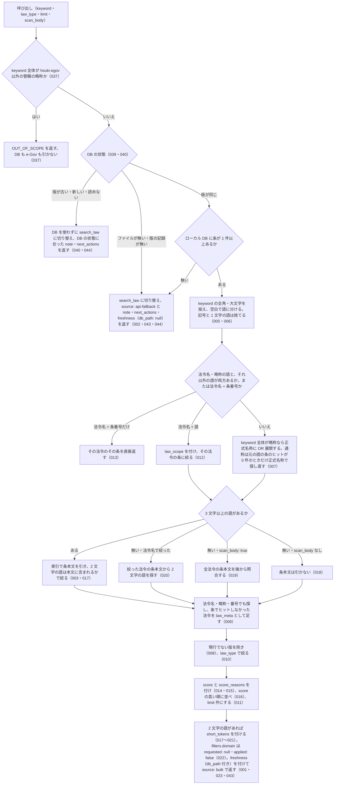

# search_fulltext

<!-- GENERATED FILE — 手で編集しない。説明と引数はサーバーの tools/list、呼び出し例は scripts/reference-examples/houki-egov/ja/search_fulltext.md、使う人と受け取るもの・できないこと・処理の流れ・約束の一覧は specs/current/search_fulltext/spec.md、使いどころは scripts/spec-pages/houki-egov/search_fulltext.md から。 -->

::: info
houki-egov-mcp **v0.20.0** の `tools/list` と `specs/current/search_fulltext/spec.md` から自動生成しました（仕様 ID 42 件・2026-10-10）。手で編集しないでください。再生成は `node scripts/generate-reference.mjs` です。
:::

法令の条文本文をキーワードで横断して全文検索します（ローカル SQLite FTS5）。`npx -y @shuji-bonji/houki-egov-mcp@latest --bulk-download-everything` で構築した bulk DB を引きます。略称は正式名称にも展開し（例: "労基法" → "労基法" または "労働基準法"）、通称（例: "インボイス"）は元の語で条が当たらないときだけ正式名称で探し直します。展開したときは expanded_keywords を返します。各ヒットに条番号・snippet・score・DB の鮮度（freshness）を付けて返します。bulk DB が無いときと、DB の版がこの houki-egov-mcp と合わないときは search_law（法令名の題名の一致）に切り替え、その旨と次にすることを note で返します。DB は作らず、書き換えません。2 文字の語（「相殺」「時効」）は本文の索引（trigram）に載らないため既定では本文を引かず、何をして結果を出したかを応答の short_tokens に返します。keyword 全体が通達などの管轄外の略称（例: "消基通"）なら、DB も e-Gov も引かずに OUT_OF_SCOPE を返します。

## 使う人と受け取るもの

このツールを誰が呼び、何を渡して何を受け取るかを示します。

- MCP クライアント（Claude などの LLM、または CLI から呼ぶ人）。`keyword` を渡して、ローカル DB（`--bulk-download-everything` で作ったもの）に入っている法令の条文本文から、キーワードを含む条の一覧を受け取る

## 引数

呼び出すときに渡す値です。動いているサーバーの `tools/list` から写しています。

| 引数 | 型 | 必須 | 既定値 | 説明 |
|---|---|---|---|---|
| `keyword` | string (minLength 1) | **必須** |  | 検索キーワード。スペース区切りで AND 検索します。法令名・略称を含めると（例: "民法 不法行為", "労基法 時間外"）その法令の条に絞って本文を検索します。「第30条」を含めると該当条番号のヒットを上位に寄せ、法令名 + 条番号だけ（例: "民法 第709条"）ならその条を直接返します（漢数字は未対応）。keyword 全体が略称なら正式名称にも展開し、通称なら元の語で条が当たらないときだけ正式名称で探し直します。keyword 全体が管轄外の略称なら OUT_OF_SCOPE を返します。2 文字の語だけのとき（例: "相殺"）は索引を引けないため、既定では条本文を引かず法令名の照合だけを返します。法令名か 3 文字以上の語を添えると索引で本文を引けます |
| `law_type` | `"Constitution"` \| `"Act"` \| `"CabinetOrder"` \| `"ImperialOrder"` \| `"MinisterialOrdinance"` \| `"Rule"` | 任意 |  | 法令種別で絞り込みます。e-Gov の law_type の値（Constitution=憲法、Act=法律、CabinetOrder=政令、ImperialOrder=勅令、MinisterialOrdinance=府省令、Rule=規則） |
| `limit` | integer (1–30) | 任意 | `10` | 取得件数（1〜30 の整数。デフォルト: 10） |
| `scan_body` | boolean | 任意 | `false` | 2 文字の語だけのクエリ（例: "相殺"）で、索引を使わずに全法令の条本文を端から照合する（デフォルト: false）。索引を引けない語の本文を探す最後の手段で、5〜20 秒かかり、並び順も関連度順にならない。法令名を添えられるなら（例: "民法 相殺"）そちらが速く正確。3 文字以上の語を含むクエリでは索引を引くので、この引数は効かない |

::: warning ローカル DB が必要です
`npx -y @shuji-bonji/houki-egov-mcp@latest --bulk-download-everything` で DB を作っていないと、応答の `source` が `"api-fallback"` になり、`search_law`（法令名のタイトル一致）の結果が `fallback` に入って返ります。そのときは本文検索は行われていません。`note` の先頭に開こうとした DB のパスが入り、`note` と `next_actions` に DB を作るコマンドが入っています（v0.20.0 から。DB を開けないときは `next_actions` が `search_law` の 1 件だけになります）。
:::

## 呼び出し例

実際に呼び出したときの引数と応答です。版と日付は実測したときのものです。

::: details 呼び出し例 — 「民法で不法行為に関係する条は」
- 実測: v0.20.0（2026-10-05）
- ローカル DB: あり（`freshness.last_sync_date` が 2026-10-04 の DB）

**引数**

```jsonc
{ "keyword": "民法 不法行為", "limit": 3 }
```

**返る JSON**

```jsonc
{
  "keyword": "民法 不法行為",
  "source": "bulk",
  "count": 3,
  "hits": [
    {
      "match_type": "article",
      "law_id": "129AC0000000089",
      "law_revision_id": "129AC0000000089_20260624_508AC0000000045",
      "law_title": "民法",
      "law_num": "明治二十九年法律第八十九号",
      "law_type": "Act",
      "article_num": "724",
      "caption": "（不法行為による損害賠償請求権の消滅時効）",
      "chapter_path": "第三編　債権 第五章　不法行為",
      "snippet": "<b>不法行為</b>による損害賠償の請求権は、次 … ",
      "rank": -15.07,
      "score": 0.701,
      "score_reasons": ["fts rank -15.07 → base 0.601", "article_caption_match"],
      "url": "https://laws.e-gov.go.jp/law/129AC0000000089"
    },
    { "article_num": "724の2", "caption": "（人の生命又は身体を害する不法行為による損害賠償請求権の消滅時効）", "score": 0.685 /* … */ },
    { "article_num": "719", "caption": "（共同不法行為者の責任）", "score": 0.677 /* … */ }
  ],
  "freshness": {
    "last_sync_date": "2026-10-04",
    "last_full_dl_at": "2026-10-03T19:19:36.391Z",
    "staleness": "fresh",
    "days_since_sync": 0,
    "db_path": "~/.cache/houki-egov-mcp/laws.db"
  },
  "filters": {
    "law_type": null,
    "domain": { "requested": null, "applied": false, "note": "分野での絞り込みはしていません（domain の引数は 0.18.0 で外しました）" }
  },
  "law_scope": [{ "token": "民法", "law_title": "民法", "law_id": "129AC0000000089" }]
}
```

- `law_scope` は、キーワードの中で法令名として認識した語です。ここに入った法令の条だけを検索しています
- `chapter_path` に編・章が入るので、`get_toc` を呼ばなくても位置が分かります
- 「民法 第709条」のように法令名と条番号だけを渡すと、検索せずにその条を直接返します
- `filters.domain` は 0.18.0 で `domain` の引数を外した後も応答に残っていて、`requested` は常に `null` です。`domain` を渡すと `INVALID_ARGUMENT`（`path: "domain"`）になります
- この例は法令名と語をそのまま検索したので `expanded_keywords` がありません。略称（「労基法」など）は正式名称にも広げて検索し、通称（「インボイス」など）は元の語で条が 1 件も当たらなかったときだけ正式名称で探し直します（v0.18.0 から）。広げたときは、何に広げたかが `expanded_keywords` に入ります
- `freshness.db_path` は引いた DB のパスで、ホームディレクトリの部分は `~` に置き換えてあります（v0.20.0 から）。ターミナルで `--sync` などを実行した DB と、MCP サーバーが開いた DB が同じかを確かめるときに使います。DB を引かなかったとき（`source: "api-fallback"`）は、`freshness` の 5 つのキーがすべて `null` です
- `freshness.staleness` が `fresh` 以外なら、`npx -y @shuji-bonji/houki-egov-mcp@latest --bulk-download-everything` の再実行を検討してください
:::

## できないこと

このツールが引き受けないことです。

- 条文の本文を丸ごと返すこと（`snippet` だけ。本文は `get_law` / `get_law_range`）
- ローカル DB を作ること・作り直すこと・更新すること（CLI の `--bulk-download-everything` / `--sync`。DB のファイルが無くても作らない。[SPEC-EGOV-SEARCH-FULLTEXT-039](/specs/houki-egov/search_fulltext#spec-egov-search-fulltext-039)）
- 分野で絞ること（`domain` の引数は無い。[SPEC-EGOV-SEARCH-FULLTEXT-022](/specs/houki-egov/search_fulltext#spec-egov-search-fulltext-022)）
- 漢数字の「第三十条」を条番号として扱うこと（本文の語として探す）
- 1 文字の語で探すこと
- 前の版（施行済みで置き換わった版）や未施行の版の条を探すこと、時点を指定して探すこと
- 部分一致以外の探し方（似た語・読み仮名・同義語）。展開するのは略称辞書にある略称・通称から正式名称への 1 つだけ

## 処理の流れ

仕様書の「処理の流れ」の節を、図も含めてそのまま写しています。図が大きいので畳んでいます。

::: details 処理の流れの図（仕様書の写し）
呼び出しを受けてから応答を返すまでに、何をどの順で確かめるかを示します。図の中の番号は「できること」の仕様 ID の末尾 3 桁です。


:::

## 約束の一覧

このツールが守る約束 42 件の見出しです。約束は受入テストと 1 対 1 で対応していて、条件と例は[仕様書ページ](/specs/houki-egov/search_fulltext)で読めます。

::: details 約束の見出し（42 件）
| 仕様 ID | 約束 |
|---|---|
| [001](/specs/houki-egov/search_fulltext#spec-egov-search-fulltext-001) | ローカル DB に条があれば DB を引いて返す |
| [002](/specs/houki-egov/search_fulltext#spec-egov-search-fulltext-002) | ローカル DB に条が無いときは search_law に切り替える |
| [003](/specs/houki-egov/search_fulltext#spec-egov-search-fulltext-003) | 条本文にキーワードを含む条を返す |
| [004](/specs/houki-egov/search_fulltext#spec-egov-search-fulltext-004) | 条番号は本則・附則・別表を区別した表示形式で返す |
| [005](/specs/houki-egov/search_fulltext#spec-egov-search-fulltext-005) | 空白で区切った語は AND で探し、記号と 1 文字の語は捨てる |
| [006](/specs/houki-egov/search_fulltext#spec-egov-search-fulltext-006) | 全角英数字・全角空白・大文字の違いを吸収して探す |
| [007](/specs/houki-egov/search_fulltext#spec-egov-search-fulltext-007) | 略称は正式名称にも OR 展開して探し、通称は元の語の条のヒットが 0 件のときだけ正式名称で探し直す |
| [008](/specs/houki-egov/search_fulltext#spec-egov-search-fulltext-008) | 同じ法令の現行でない版は返さない |
| [009](/specs/houki-egov/search_fulltext#spec-egov-search-fulltext-009) | 法令名・略称で当たった法令は law_meta として返す |
| [010](/specs/houki-egov/search_fulltext#spec-egov-search-fulltext-010) | law_type で法令種別を絞る |
| [011](/specs/houki-egov/search_fulltext#spec-egov-search-fulltext-011) | limit で返す件数を絞る |
| [012](/specs/houki-egov/search_fulltext#spec-egov-search-fulltext-012) | 法令名と語を並べたクエリは、その法令の条に絞る |
| [013](/specs/houki-egov/search_fulltext#spec-egov-search-fulltext-013) | 法令名と条番号だけのクエリは、その条を直接返す |
| [014](/specs/houki-egov/search_fulltext#spec-egov-search-fulltext-014) | キーワードに「第N条」があれば、その条のヒットを上位に寄せる |
| [015](/specs/houki-egov/search_fulltext#spec-egov-search-fulltext-015) | ヒットごとに 0〜1 の score とその内訳を付ける |
| [016](/specs/houki-egov/search_fulltext#spec-egov-search-fulltext-016) | ヒットは score の高い順に並べる |
| [017](/specs/houki-egov/search_fulltext#spec-egov-search-fulltext-017) | 3 文字以上の語があるときは、索引で引いた条を 2 文字の語で絞る |
| [018](/specs/houki-egov/search_fulltext#spec-egov-search-fulltext-018) | 2 文字の語だけのクエリは、既定では条本文を引かずにそのことを返す |
| [019](/specs/houki-egov/search_fulltext#spec-egov-search-fulltext-019) | scan_body: true のときは全法令の条本文を端から照合する |
| [020](/specs/houki-egov/search_fulltext#spec-egov-search-fulltext-020) | 法令名で絞ったクエリの 2 文字の語は、その法令の条本文から探す |
| [021](/specs/houki-egov/search_fulltext#spec-egov-search-fulltext-021) | 2 文字の語を含まないクエリには short_tokens を付けない |
| [022](/specs/houki-egov/search_fulltext#spec-egov-search-fulltext-022) | `domain` は引数に無く、`filters.domain` は絞り込みをしていないことを返す |
| [023](/specs/houki-egov/search_fulltext#spec-egov-search-fulltext-023) | DB の鮮度を freshness で返す |
| [024](/specs/houki-egov/search_fulltext#spec-egov-search-fulltext-024) | limit を省くと 10 件で打ち切る |
| [027](/specs/houki-egov/search_fulltext#spec-egov-search-fulltext-027) | DB を開けないときも search_law に切り替える |
| [028](/specs/houki-egov/search_fulltext#spec-egov-search-fulltext-028) | search_law に切り替えたとき、keyword があれば法令名の検索結果を fallback に入れる |
| [029](/specs/houki-egov/search_fulltext#spec-egov-search-fulltext-029) | search_law に切り替えたとき、law_type と limit を切り替え先に渡す |
| [030](/specs/houki-egov/search_fulltext#spec-egov-search-fulltext-030) | scan_body: true の走査は 150 件で打ち切り、そのことを返す |
| [031](/specs/houki-egov/search_fulltext#spec-egov-search-fulltext-031) | 法令名で絞った 2 文字の語の検索も 150 件で打ち切り、そのことを返す |
| [032](/specs/houki-egov/search_fulltext#spec-egov-search-fulltext-032) | 応答の keyword は前後の空白を除いた値にする |
| [033](/specs/houki-egov/search_fulltext#spec-egov-search-fulltext-033) | `limit` は 1 以上 30 以下の整数で、範囲の外は `INVALID_ARGUMENT` にして丸めない |
| [034](/specs/houki-egov/search_fulltext#spec-egov-search-fulltext-034) | keyword が空文字・空白だけのときは DB も e-Gov も引かずに `INVALID_ARGUMENT` を返す |
| [035](/specs/houki-egov/search_fulltext#spec-egov-search-fulltext-035) | 同期の記録の日付を解釈できないときは `INTERNAL_ERROR`（`retryable: false`）を返し、全件の取り込みを案内する |
| [036](/specs/houki-egov/search_fulltext#spec-egov-search-fulltext-036) | 検索語のダッシュ類は `-` に揃えて探し、版 3 の DB の本文も同じ揃え方で入っている |
| [037](/specs/houki-egov/search_fulltext#spec-egov-search-fulltext-037) | `keyword` 全体が houki-egov 以外の管轄の略称のときは、DB も e-Gov も引かずに `OUT_OF_SCOPE` を返す |
| [038](/specs/houki-egov/search_fulltext#spec-egov-search-fulltext-038) | `law_type` の選択肢は DB と e-Gov の `law_type` の値と同じで、勅令は `ImperialOrder` |
| [039](/specs/houki-egov/search_fulltext#spec-egov-search-fulltext-039) | DB のファイルを作らず、DB に書き込まない |
| [040](/specs/houki-egov/search_fulltext#spec-egov-search-fulltext-040) | 版が同じでない DB は使わずに search_law に切り替える |
| [041](/specs/houki-egov/search_fulltext#spec-egov-search-fulltext-041) | 段落だけの附則のヒットは `附則(<n>)` と返し、`caption` は `null` |
| [042](/specs/houki-egov/search_fulltext#spec-egov-search-fulltext-042) | 応答に出す DB のパスは、ホームディレクトリの部分を `~` に置き換える |
| [043](/specs/houki-egov/search_fulltext#spec-egov-search-fulltext-043) | `freshness` は常にオブジェクトで、`db_path` に引いた DB のパスを入れる |
| [044](/specs/houki-egov/search_fulltext#spec-egov-search-fulltext-044) | `search_law` に切り替えたときの `note` と `next_actions` は、DB の状態ごとに決める |
:::

## 関連ページ

このページの元になった文書と、あわせて読むページです。

- [houki-egov-mcp の解説](/mcp/houki-egov)
- [houki-egov-mcp のツール一覧](/reference/mcp/houki-egov/)
- [search_fulltext の仕様書ページ](/specs/houki-egov/search_fulltext)
- [元の仕様書（GitHub、v0.20.0）](https://github.com/shuji-bonji/houki-egov-mcp/blob/v0.20.0/specs/current/search_fulltext/spec.md)
