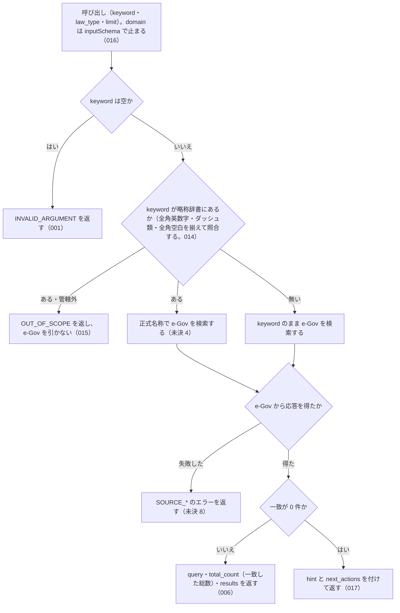

# search_law

<!-- GENERATED FILE — 手で編集しない。説明と引数はサーバーの tools/list、呼び出し例は scripts/reference-examples/houki-egov/ja/search_law.md、利用者と得られる結果・扱わないこと・処理の流れ・仕様項目の一覧は specs/current/search_law/spec.md、使いどころは scripts/spec-pages/houki-egov/search_law.md から。 -->

::: info
houki-egov-mcp **v0.20.0** の `tools/list` と `specs/current/search_law/spec.md` から自動生成しました（仕様 ID 18 件・2026-10-10）。手で編集しないでください。再生成は `node scripts/generate-reference.mjs` です。
:::

日本の法令を、法令の題名のキーワードや略称で検索します。e-Gov 法令 API v2 を使い、略称は略称辞書で正式名称に直してから探します。total_count は e-Gov で一致した法令の総数で、results の件数（limit 以下）とは限りません。一致が 0 件のときは、条文の本文を探す search_fulltext と略称を確かめる resolve_abbreviation を hint と next_actions で案内します。

## 利用者と得られる結果

このツールの利用者と、利用者が渡すもの・得られる結果を示します。

- MCP クライアント（Claude などの LLM、または CLI から呼ぶ人）。`keyword`（法令名の一部または略称）を渡して、e-Gov 法令API v2 で法令名が一致する法令の一覧（法令 ID・題名・法令番号・種別・e-Gov の URL）を受け取る

## 引数

呼び出すときに渡す値です。動いているサーバーの `tools/list` から写しています。

| 引数 | 型 | 必須 | 既定値 | 説明 |
|---|---|---|---|---|
| `keyword` | string (minLength 1) | **必須** |  | 検索キーワード。例: "消費税", "労働基準", "育児休業"。略称も可（例: "消法", "労基法"） |
| `law_type` | `"Constitution"` \| `"Act"` \| `"CabinetOrder"` \| `"ImperialOrder"` \| `"MinisterialOrdinance"` \| `"Rule"` | 任意 |  | 法令種別で絞り込みます。e-Gov の law_type の値（Constitution=憲法、Act=法律、CabinetOrder=政令、ImperialOrder=勅令、MinisterialOrdinance=府省令、Rule=規則） |
| `limit` | integer (1–50) | 任意 | `10` | 取得件数（1〜50 の整数。デフォルト: 10） |

::: tip 略称はそのまま渡せます
「個情法」「消法」「労基法」のような略称は、houki-abbreviations の辞書で正式名に直してから検索します。応答の `query.resolved` に、何に直したかが入ります。
:::

## 呼び出し例

実際に呼び出したときの引数と応答です。版と日付は実測したときのものです。

::: details 呼び出し例 — 「個情法の正式名と法令番号を知りたい」
- 実測: v0.20.0（2026-10-05）
- ローカル DB: 不要（e-Gov 法令 API v2 をその場で呼びます）

**引数**

```jsonc
{ "keyword": "個情法", "limit": 3 }
```

**返る JSON**

```jsonc
{
  "query": { "keyword": "個情法", "resolved": "個人情報の保護に関する法律" },
  "total_count": 17,
  "results": [
    {
      "law_id": "415AC0000000057",
      "title": "個人情報の保護に関する法律",
      "law_num": "平成十五年法律第五十七号",
      "law_type": "Act",
      "promulgation_date": "2003-05-30",
      "url": "https://laws.e-gov.go.jp/law/415AC0000000057"
    },
    {
      "law_id": "415AC0000000058",
      "title": "行政機関の保有する個人情報の保護に関する法律",
      "law_num": "平成十五年法律第五十八号",
      "law_type": "Act",
      "promulgation_date": "2003-05-30",
      "url": "https://laws.e-gov.go.jp/law/415AC0000000058"
    },
    {
      "law_id": "415AC0000000059",
      "title": "独立行政法人等の保有する個人情報の保護に関する法律",
      "law_num": "平成十五年法律第五十九号",
      "law_type": "Act",
      "promulgation_date": "2003-05-30",
      "url": "https://laws.e-gov.go.jp/law/415AC0000000059"
    }
  ],
  "hint": null,
  "next_actions": []
}
```

`total_count` は e-Gov で題名が一致した法令の総数（17 件）で、`limit: 3` で返した `results` の件数とは違います（v0.18.0 から。それまでは `results` の件数でした）。1 件以上当たったときは `hint` が `null`、`next_actions` が `[]` です。0 件のときは、条文の本文を探す `search_fulltext` と略称を確かめる `resolve_abbreviation` が `hint` と `next_actions` に入ります。

`results[].law_id` をそのまま次の `get_law` / `get_toc` に渡せます。タイトル一致の検索なので、条文本文の中の語を探すときは `search_fulltext` を使ってください。
:::

## 扱わないこと

このツールが意図して扱わないことです。

- 条文の本文を検索すること（本文の全文検索は `search_fulltext`）
- 条文を返すこと（条文の取得は `get_law`）
- 通達を検索すること（通達は e-Gov に収録されていない）
- 略称辞書の内容を確かめること（`resolve_abbreviation`）
- 時点を指定して、その時点の法令名で検索すること

## 処理の流れ

仕様書の「処理の流れ」の節を、図も含めてそのまま写しています。図が大きいので畳んでいます。

::: details 処理の流れの図（仕様書の写し）
呼び出しを受けてから応答を返すまでに、何をどの順で確かめるかを示します。図の中の番号は「できること」の仕様 ID の末尾 3 桁です。ID の無い枝はテストが無い振る舞いで、「未決」に書いています。


:::

## 仕様項目の一覧

このツールの仕様項目 18 件の見出しです。仕様項目は受入テストと 1 対 1 で対応していて、条件と例は[仕様書ページ](/specs/houki-egov/search_law)で読めます。

::: details 仕様項目の見出し（18 件）
| 仕様 ID | 仕様項目 |
|---|---|
| [001](/specs/houki-egov/search_law#spec-egov-search-law-001) | 空の keyword は検索せずにエラー `INVALID_ARGUMENT` を返す |
| [002](/specs/houki-egov/search_law#spec-egov-search-law-002) | 略称は正式名称に置き換えて検索し、`query.resolved` に正式名称を入れる |
| [003](/specs/houki-egov/search_law#spec-egov-search-law-003) | 辞書に無い keyword はそのまま検索し、`query.resolved` を付けない |
| [004](/specs/houki-egov/search_law#spec-egov-search-law-004) | 正式名称・別名も、辞書の正式名称に置き換えて検索する |
| [005](/specs/houki-egov/search_law#spec-egov-search-law-005) | 前後の空白を除いてから略称辞書と照合し、`query.keyword` は渡した値のまま返す |
| [006](/specs/houki-egov/search_law#spec-egov-search-law-006) | 成功時の応答の形 |
| [007](/specs/houki-egov/search_law#spec-egov-search-law-007) | 空白だけの keyword も検索せずにエラー `INVALID_ARGUMENT` を返す |
| [008](/specs/houki-egov/search_law#spec-egov-search-law-008) | law_type を e-Gov の検索に渡し、`query.law_type` に入れる |
| [009](/specs/houki-egov/search_law#spec-egov-search-law-009) | e-Gov が 429 を返したら `SOURCE_RATE_LIMITED` を返す |
| [010](/specs/houki-egov/search_law#spec-egov-search-law-010) | e-Gov への問い合わせがタイムアウトしたら `SOURCE_TIMEOUT` を返す |
| [011](/specs/houki-egov/search_law#spec-egov-search-law-011) | e-Gov が 5xx を返したら `retryable: true` の `SOURCE_API_ERROR` を返す |
| [012](/specs/houki-egov/search_law#spec-egov-search-law-012) | e-Gov が 429 以外の 4xx を返したら `retryable: false` の `SOURCE_API_ERROR` を返す |
| [013](/specs/houki-egov/search_law#spec-egov-search-law-013) | `limit` は 1 以上 50 以下の整数で、範囲の外は `INVALID_ARGUMENT` にして丸めない |
| [014](/specs/houki-egov/search_law#spec-egov-search-law-014) | `keyword` の略称の照合で全角英数字・ダッシュ類・全角空白を吸収する |
| [015](/specs/houki-egov/search_law#spec-egov-search-law-015) | houki-egov の管轄でない略称は `OUT_OF_SCOPE` を返し、e-Gov を引かない |
| [016](/specs/houki-egov/search_law#spec-egov-search-law-016) | `domain` は引数に無く、渡すと `INVALID_ARGUMENT` にする |
| [017](/specs/houki-egov/search_law#spec-egov-search-law-017) | 一致が 0 件のときは、法令の題名だけを探したことと次の手を返す |
| [018](/specs/houki-egov/search_law#spec-egov-search-law-018) | `law_type` の選択肢は e-Gov の `law_type` の値と同じで、勅令は `ImperialOrder` |
:::

## 関連ページ

このページの元になった文書と、あわせて読むページです。

- [houki-egov-mcp の解説](/mcp/houki-egov)
- [houki-egov-mcp のツール一覧](/reference/mcp/houki-egov/)
- [search_law の仕様書ページ](/specs/houki-egov/search_law)
- [元の仕様書（GitHub、v0.20.0）](https://github.com/shuji-bonji/houki-egov-mcp/blob/v0.20.0/specs/current/search_law/spec.md)
