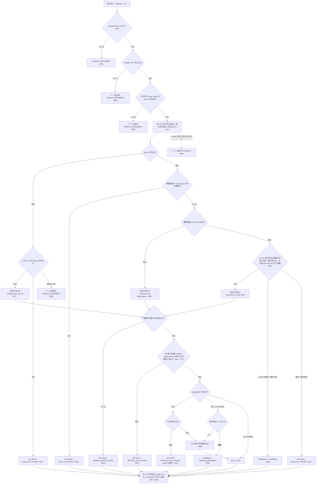

# verify_citations

<!-- GENERATED FILE — 手で編集しない。説明と引数はサーバーの tools/list、呼び出し例は scripts/reference-examples/houki-egov/ja/verify_citations.md、利用者と得られる結果・扱わないこと・処理の流れ・仕様項目の一覧は specs/current/verify_citations/spec.md、使いどころは scripts/spec-pages/houki-egov/verify_citations.md から。 -->

::: info
houki-egov-mcp **v0.20.1** の `tools/list` と `specs/current/verify_citations/spec.md` から自動生成しました（仕様 ID 48 件・2026-10-10）。手で編集しないでください。再生成は `node scripts/generate-reference.mjs` です。
:::

LLM が組み立てた法令の引用リストを、1 回の呼び出しでまとめて実在確認します。件ごとに found / not_found / ambiguous を返し、リストの中に存在しない引用が混ざっていてもツール全体はエラーにしません。found の件には正式名称・法令番号・条見出し・law_id・URL を付けます。確かめるのは「その条（指定があれば項・号）が e-Gov の法令にあるか」だけで、引用が主張を支えるかどうかは判定しません。略称は略称辞書で正式名称に直してから照合し、法令名は完全一致だけを採ります。条は本則の中で確かめ、附則の条は suppl_index で附則を指してください。

## 利用者と得られる結果

このツールの利用者と、利用者が渡すもの・得られる結果を示します。

- MCP クライアント（Claude などの LLM、または CLI から呼ぶ人）。回答に添える法令の引用（法令名または `law_id`、条、任意で項・号）の配列を渡して、件ごとに「e-Gov の法令にその条・項・号があるか」の判定を受け取る

## 引数

呼び出すときに渡す値です。動いているサーバーの `tools/list` から写しています。

| 引数 | 型 | 必須 | 既定値 | 説明 |
|---|---|---|---|---|
| `citations` | object[] | **必須** |  | 確かめたい引用の配列（最大 50 件） |
| `citations[].law_name` | string | 任意 |  | 法令名または略称。例: "所得税法", "所法"。law_id を書くなら省略可 |
| `citations[].law_id` | string | 任意 |  | e-Gov の law_id。例: "340AC0000000033"。law_name より優先する。law_name と両方省略はできない |
| `citations[].article` | string (minLength 1) | **必須** |  | 条番号。例: "30", "30の2", "第三十条の二" |
| `citations[].paragraph` | integer (≥ 1) | 任意 |  | 項番号（1 以上の整数）。省略すると条までを確かめる |
| `citations[].item` | number \| string | 任意 |  | 号番号。数値（8）か文字列（"8"・"8の2"・"八の二"）。項が複数ある条で項を書かずに号だけを指定すると ambiguous になる |
| `citations[].suppl_index` | integer (≥ 1) | 任意 |  | 附則の番号（1 以上の整数。get_toc の suppl_provisions[].index と同じ）。渡すと article をその附則の中で確かめます。省くと本則の中だけで確かめます |
| `citations[].label` | string | 任意 |  | 引用元の表示文字列。判定には使わず、そのまま results に返す |
| `at` | string | 任意 |  | 時点指定。YYYY-MM-DD 形式。全件に同じ時点を適用する |

::: tip リストごと渡します
引用が 1 件でも 50 件でも 1 回の呼び出しで確かめます。存在しない引用が混ざっていても、ツール全体はエラーになりません（件ごとに `status` が付きます）。
:::

## 呼び出し例

実際に呼び出したときの引数と応答です。版と日付は実測したときのものです。

::: details 呼び出し例 — 「書こうとしている引用 5 件をまとめて確かめる」
- 実測: v0.20.0（2026-10-05）
- 確かめた版: v0.20.1（2026-10-10）
- ローカル DB: 不要

**引数**

```jsonc
{
  "citations": [
    { "law_name": "消法", "article": "30", "paragraph": 1, "label": "消費税法第30条第1項（仕入税額控除）" },
    { "law_name": "電子帳簿保存法", "article": "7", "label": "電帳法7条（電子取引の保存）" },
    { "law_name": "民法", "article": "9999", "label": "民法第9999条" },
    { "law_name": "所得税法", "article": "2", "item": 8, "label": "所法2条8号" },
    { "law_name": "所得税法施行規則", "article": "36の4", "label": "所規36条の4" }
  ]
}
```

**返る JSON（抜粋）**

```jsonc
{
  "summary": { "total": 5, "found": 3, "not_found": 1, "ambiguous": 1, "all_found": false },
  "results": [
    {
      "index": 0,
      "input": { "law_name": "消法", "article": "30", "paragraph": 1, "label": "消費税法第30条第1項（仕入税額控除）" },
      "status": "found",
      "law": {
        "law_id": "363AC0000000108",
        "title": "消費税法",
        "law_num": "昭和六十三年法律第百八号",
        "law_type": "Act",
        "url": "https://laws.e-gov.go.jp/law/363AC0000000108"
      },
      "resolved_by": "abbreviation",          // 略称辞書で「消法」→「消費税法」
      "article": { "num": "30", "label": "第30条", "caption": "（仕入れに係る消費税額の控除）", "suppl_index": null },
      "paragraph": 1
    },
    {
      "index": 1,
      "input": { "law_name": "電子帳簿保存法", "article": "7", "label": "電帳法7条（電子取引の保存）" },
      "status": "found",
      "law": {
        "law_id": "410AC0000000025",
        "title": "電子計算機を使用して作成する国税関係帳簿書類の保存方法等の特例に関する法律",
        "law_num": "平成十年法律第二十五号",
        "law_type": "Act",
        "url": "https://laws.e-gov.go.jp/law/410AC0000000025"
      },
      "resolved_by": "exact_title",
      "article": { "num": "7", "label": "第7条", "caption": "（電子取引の取引情報に係る電磁的記録の保存）", "suppl_index": null }
    },
    {
      "index": 2,
      "input": { "law_name": "民法", "article": "9999", "label": "民法第9999条" },
      "status": "not_found",
      "law": { "law_id": "129AC0000000089", "title": "民法", "law_num": "明治二十九年法律第八十九号", "law_type": "Act", "url": "https://laws.e-gov.go.jp/law/129AC0000000089" },
      "resolved_by": "abbreviation",
      "code": "ARTICLE_NOT_FOUND",
      "reason": "民法に第9999条はありません",
      "next_actions": [
        { "action": "get_toc", "reason": "目次を確認して正しい条番号を特定できます", "example": { "law_name": "民法" } }
      ]
    },
    {
      "index": 3,
      "input": { "law_name": "所得税法", "article": "2", "item": 8, "label": "所法2条8号" },
      "status": "ambiguous",
      "law": { "law_id": "340AC0000000033", "title": "所得税法", "law_num": "昭和四十年法律第三十三号", "law_type": "Act", "url": "https://laws.e-gov.go.jp/law/340AC0000000033" },
      "resolved_by": "abbreviation",
      "article": { "num": "2", "label": "第2条", "caption": "（定義）", "suppl_index": null },
      "code": "INVALID_ARGUMENT",
      "reason": "所得税法第2条は項が 2 個あるため、号だけではどの項の号か決まりません",
      "next_actions": [
        { "action": "add_paragraph", "reason": "同じ引用に paragraph（項番号）を足すと判定できます",
          "example": { "law_name": "所得税法", "article": "2", "paragraph": 1 } }
      ]
    },
    {
      "index": 4,
      "input": { "law_name": "所得税法施行規則", "article": "36の4", "label": "所規36条の4" },
      "status": "found",
      "law": { "law_id": "340M50000040011", "title": "所得税法施行規則", "law_num": "昭和四十年大蔵省令第十一号", "law_type": "MinisterialOrdinance", "url": "https://laws.e-gov.go.jp/law/340M50000040011" },
      "resolved_by": "exact_title",
      "article": { "num": "36_4", "label": "第36条の4", "caption": "（青色専従者給与に関する届出書の記載事項等）", "suppl_index": null }
    }
  ],
  "method": "per_citation_lookup",
  "note": "各件について「その条（指定があれば項・号）が e-Gov の法令にあるか」だけを確かめています。引用した条文が主張を支えるかどうかは判定していません。…",
  "meta": { "retrieved_at": "2026-10-04T20:20:33.435Z", "at": null }
}
```

`resolved_by` は法令名をどう決めたか（`abbreviation` は略称辞書、`exact_title` は e-Gov の題名の完全一致）です。「民法」「所得税法」は辞書に載っているので `abbreviation` になります。`article.suppl_index` は本則の条では `null` で、附則の条を `suppl_index` で指したときに附則の番号が入ります（v0.18.0 から）。本則に無く附則にだけある条番号は、本則の条として扱わず `not_found`（`ARTICLE_NOT_FOUND`）になります。

`label` は判定に使わず、そのまま `results[].input` に返るので、書きかけの原稿の表記と突き合わせられます。`not_found` の件は citation から外し、`next_actions` の `get_toc` で条番号を引き直します。`ambiguous` の件は、`candidates[]`（法令名が複数当たった場合）か `next_actions`（項を足す場合）を見て指定を直します。

**確かめていないこと**: 引用が主張を支えるかどうかは判定しません。また削除された条（e-Gov が `Num="534:535"` でまとめている条）を個別の条番号で渡すと `not_found` になります。
:::

## 扱わないこと

このツールが意図して扱わないことです。

- 引用した条文が主張を支えるかどうかを判定すること（確かめるのは条・項・号が e-Gov の法令にあるかだけ）
- 条文本文を返すこと（本文は `get_law`）
- 51 件以上の引用を 1 回で確かめること
- 通達・判例など houki-egov の管轄外の文書の引用を確かめること（`OUT_OF_SCOPE` を返すだけ）
- 件ごとに別の時点を指定すること（`at` は全件に同じ時点を使う）

## 処理の流れ

仕様書の「処理の流れ」の節を、図も含めてそのまま写しています。図が大きいので畳んでいます。

::: details 処理の流れの図（仕様書の写し）
呼び出しを受けてから応答を返すまでに、何をどの順で確かめるかを示す。図の中の番号は「できること」の仕様 ID の末尾 3 桁。


:::

## 仕様項目の一覧

このツールの仕様項目 48 件の見出しです。仕様項目は受入テストと 1 対 1 で対応していて、条件と例は[仕様書ページ](/specs/houki-egov/verify_citations)で読めます。

::: details 仕様項目の見出し（48 件）
| 仕様 ID | 仕様項目 |
|---|---|
| [001](/specs/houki-egov/verify_citations#spec-egov-verify-citations-001) | 引数の形は inputSchema で確かめる |
| [002](/specs/houki-egov/verify_citations#spec-egov-verify-citations-002) | citations が空ならツール全体をエラーにする |
| [003](/specs/houki-egov/verify_citations#spec-egov-verify-citations-003) | law_name と law_id のどちらも無い件があればツール全体をエラーにする |
| [004](/specs/houki-egov/verify_citations#spec-egov-verify-citations-004) | 存在しない引用が混ざっていても件ごとの判定を返す |
| [005](/specs/houki-egov/verify_citations#spec-egov-verify-citations-005) | found の件に付くもの |
| [006](/specs/houki-egov/verify_citations#spec-egov-verify-citations-006) | 略称は略称辞書で正式名称に直してから照合する |
| [007](/specs/houki-egov/verify_citations#spec-egov-verify-citations-007) | law_id を書いた件はその法令で照合する |
| [008](/specs/houki-egov/verify_citations#spec-egov-verify-citations-008) | 項が 1 つだけの条は、項を書かずに号を指定できる |
| [009](/specs/houki-egov/verify_citations#spec-egov-verify-citations-009) | 項が複数ある条で号だけを指定した件は ambiguous にする |
| [010](/specs/houki-egov/verify_citations#spec-egov-verify-citations-010) | 条が無い件は ARTICLE_NOT_FOUND にする |
| [011](/specs/houki-egov/verify_citations#spec-egov-verify-citations-011) | 項が無い件は ARTICLE_NOT_FOUND にし、実在した条は残す |
| [012](/specs/houki-egov/verify_citations#spec-egov-verify-citations-012) | 法令名が引けない件は LAW_NOT_FOUND にする |
| [013](/specs/houki-egov/verify_citations#spec-egov-verify-citations-013) | 法令名が完全一致せず部分一致がある件は ambiguous にして候補を返す |
| [014](/specs/houki-egov/verify_citations#spec-egov-verify-citations-014) | houki-egov の管轄外の引用は OUT_OF_SCOPE にする |
| [015](/specs/houki-egov/verify_citations#spec-egov-verify-citations-015) | e-Gov が「その法令が無い」と答えた件は LAW_NOT_FOUND にする |
| [016](/specs/houki-egov/verify_citations#spec-egov-verify-citations-016) | summary に件数の内訳と all_found を付ける |
| [017](/specs/houki-egov/verify_citations#spec-egov-verify-citations-017) | 同じ法令名が並んでも e-Gov への問い合わせは 1 回にまとめる |
| [018](/specs/houki-egov/verify_citations#spec-egov-verify-citations-018) | 条番号の書き方が読めない件は INVALID_ARTICLE_NUM にする |
| [019](/specs/houki-egov/verify_citations#spec-egov-verify-citations-019) | e-Gov に問い合わせられなかったときはツール全体をエラーにする |
| [020](/specs/houki-egov/verify_citations#spec-egov-verify-citations-020) | 応答の note に判定の範囲を書く |
| [021](/specs/houki-egov/verify_citations#spec-egov-verify-citations-021) | 応答の meta に取得日時と時点を付ける |
| [022](/specs/houki-egov/verify_citations#spec-egov-verify-citations-022) | at を渡すと、その時点の本文で条・項・号を確かめる |
| [023](/specs/houki-egov/verify_citations#spec-egov-verify-citations-023) | 号が無い件は ARTICLE_NOT_FOUND にし、実在した条と項は残す |
| [024](/specs/houki-egov/verify_citations#spec-egov-verify-citations-024) | 号番号の書き方が読めない件は INVALID_ARTICLE_NUM にする |
| [025](/specs/houki-egov/verify_citations#spec-egov-verify-citations-025) | 条・項・号が無い件と条番号・号番号が読めない件の next_actions は get_toc |
| [026](/specs/houki-egov/verify_citations#spec-egov-verify-citations-026) | 法令名が引けない件の next_actions は resolve_abbreviation と search_law |
| [027](/specs/houki-egov/verify_citations#spec-egov-verify-citations-027) | 部分一致の候補がある件と e-Gov が知らない law_id の件の next_actions は search_law |
| [028](/specs/houki-egov/verify_citations#spec-egov-verify-citations-028) | 管轄外の件の next_actions は delegate_to_mcp |
| [029](/specs/houki-egov/verify_citations#spec-egov-verify-citations-029) | 項が複数ある条で号だけを指定した件の next_actions は add_paragraph |
| [030](/specs/houki-egov/verify_citations#spec-egov-verify-citations-030) | 部分一致の候補は先頭の 5 件までで、reason には全件数を書く |
| [031](/specs/houki-egov/verify_citations#spec-egov-verify-citations-031) | law_name と law_id の両方を書いた件は law_id だけで法令を決める |
| [032](/specs/houki-egov/verify_citations#spec-egov-verify-citations-032) | 空白だけの law_name / law_id は無いものとして扱う |
| [033](/specs/houki-egov/verify_citations#spec-egov-verify-citations-033) | 同じ law_id が並んでも e-Gov への法令本文の問い合わせは 1 回にまとめる |
| [034](/specs/houki-egov/verify_citations#spec-egov-verify-citations-034) | e-Gov がタイムアウトしたときはツール全体を SOURCE_TIMEOUT にする |
| [035](/specs/houki-egov/verify_citations#spec-egov-verify-citations-035) | e-Gov が 5xx を返したときはツール全体を SOURCE_API_ERROR にする |
| [036](/specs/houki-egov/verify_citations#spec-egov-verify-citations-036) | e-Gov が 429 を返したときはツール全体を SOURCE_RATE_LIMITED にする |
| [037](/specs/houki-egov/verify_citations#spec-egov-verify-citations-037) | 削除された条をまとめた範囲表記を照合できる |
| [038](/specs/houki-egov/verify_citations#spec-egov-verify-citations-038) | 漢数字・全角数字・「第…条」の条番号を e-Gov の形に直して照合する |
| [039](/specs/houki-egov/verify_citations#spec-egov-verify-citations-039) | 略称辞書に law_id が無い法令名は e-Gov の法令名との完全一致で照合する |
| [040](/specs/houki-egov/verify_citations#spec-egov-verify-citations-040) | `at` は `YYYY-MM-DD` の形だけを受け付け、形に合わない値と暦に無い日付は `INVALID_ARGUMENT` |
| [041](/specs/houki-egov/verify_citations#spec-egov-verify-citations-041) | `citations[].paragraph` は 1 以上の整数で、0・負の数・小数はツール全体を `INVALID_ARGUMENT` にして法令を取らない |
| [042](/specs/houki-egov/verify_citations#spec-egov-verify-citations-042) | `citations[].article` が空文字・空白だけのときはツール全体を `INVALID_ARGUMENT` にする |
| [043](/specs/houki-egov/verify_citations#spec-egov-verify-citations-043) | e-Gov との通信と関係の無い例外は `SOURCE_*` にせず `INTERNAL_ERROR` にする |
| [044](/specs/houki-egov/verify_citations#spec-egov-verify-citations-044) | `law_name` の全角英数字・ダッシュ類・全角空白は半角に揃えてから略称辞書と照合する |
| [045](/specs/houki-egov/verify_citations#spec-egov-verify-citations-045) | 法令名の完全一致は、部分一致の上位 50 件ではなく全件から探し、`at` を渡したときは法令名の検索にも使う |
| [046](/specs/houki-egov/verify_citations#spec-egov-verify-citations-046) | `suppl_index` の無い件は本則の中だけで条を確かめ、附則にだけある条番号は ARTICLE_NOT_FOUND にする |
| [047](/specs/houki-egov/verify_citations#spec-egov-verify-citations-047) | `suppl_index` を書いた件は、その附則の中で条・項・号を確かめる |
| [048](/specs/houki-egov/verify_citations#spec-egov-verify-citations-048) | e-Gov が時点を受け付けないと答えたときはツール全体を `INVALID_ARGUMENT` にし、そのほかの 400 はツール全体を `SOURCE_API_ERROR` にする |
:::

## 関連ページ

このページの元になった文書と、あわせて読むページです。

- [houki-egov-mcp の解説](/mcp/houki-egov)
- [houki-egov-mcp のツール一覧](/reference/mcp/houki-egov/)
- [verify_citations の仕様書ページ](/specs/houki-egov/verify_citations)
- [元の仕様書（GitHub、v0.20.1）](https://github.com/shuji-bonji/houki-egov-mcp/blob/v0.20.1/specs/current/verify_citations/spec.md)
