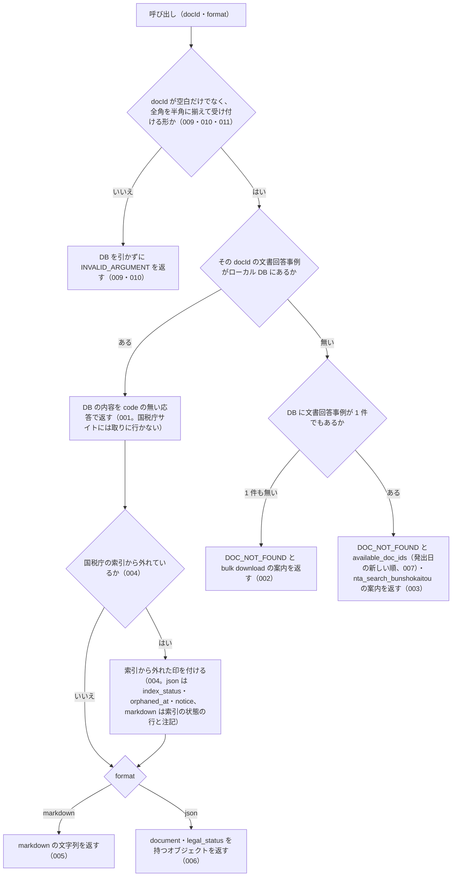

# nta_get_bunshokaitou

<!-- GENERATED FILE — 手で編集しない。説明と引数はサーバーの tools/list、呼び出し例は scripts/reference-examples/houki-nta/ja/nta_get_bunshokaitou.md、使う人と受け取るもの・できないこと・処理の流れ・約束の一覧は specs/current/nta_get_bunshokaitou/spec.md、使いどころは scripts/spec-pages/houki-nta/nta_get_bunshokaitou.md から。 -->

::: info
houki-nta-mcp **v0.27.0** の `tools/list` と `specs/current/nta_get_bunshokaitou/spec.md` から自動生成しました（仕様 ID 11 件・2026-10-10）。手で編集しないでください。再生成は `node scripts/generate-reference.mjs` です。
:::

文書回答事例の本文を docId で取得する（DB 経由）。本庁系は "shotoku/250416"、国税局系は "tokyo/shotoku/260218" のような形式。

## 使う人と受け取るもの

このツールを誰が呼び、何を渡して何を受け取るかを示します。

- MCP クライアント（Claude などの LLM、または CLI から呼ぶ人）。`docId` を渡して、ローカル DB に入っている国税庁の文書回答事例 1 件の本文・発出日・添付 PDF の一覧を受け取る

## 引数

呼び出すときに渡す値です。動いているサーバーの `tools/list` から写しています。

| 引数 | 型 | 必須 | 既定値 | 説明 |
|---|---|---|---|---|
| `docId` | string (minLength 1) | **必須** |  | 文書 ID。税目/フォルダー名（本庁。例: "shotoku/250416"）か 局/税目/フォルダー名（国税局。例: "tokyo/shotoku/260218"）。全角の数字・ハイフンは半角に揃えて読む |
| `format` | `"markdown"` \| `"json"` | 任意 | `"markdown"` | 出力形式 |

::: tip 本文は「表 + 別紙」でできています
文書回答事例のページは、照会者・関係する法令条項等・回答年月日・回答者・回答内容が表に入り、照会の趣旨・事実関係・理由は「別紙」（別ページ）にあります。v0.10.3 / v0.10.4 から、表の各行を「見出し: 値」の形で取り込み、別紙を `【別紙】` として本文の末尾に連結します。v0.10.2 以前に作った DB には本文が入っていないので、`npx -y @shuji-bonji/houki-nta-mcp@latest --bulk-download-bunshokaitou --refresh` で再投入してください。
:::

## 呼び出し例

実際に呼び出したときの引数と応答です。版と日付は実測したときのものです。

::: details 呼び出し例 — 「産科医療特別給付事業の給付金は非課税か」（本庁系）
- 実測: v0.25.0（2026-10-05）
- ローカル DB: あり（この文書の `fetchedAt` は 2026-10-04 の取り込み）

**引数**

```jsonc
{ "docId": "shotoku/250416", "format": "json" }
```

**返る JSON（本文は抜粋）**

```jsonc
{
  "document": {
    "docType": "bunshokaitou",
    "docId": "shotoku/250416",
    "taxonomy": "shotoku",
    "title": "産科医療特別給付事業に基づき支払われる給付金の所得税法上の取扱いについて",
    "issuedAt": "2025-04-07",
    "issuer": "国税庁",
    "sourceUrl": "https://www.nta.go.jp/law/bunshokaito/shotoku/250416/index.htm",
    "fetchedAt": "2026-10-04T03:27:25.095Z",
    "fullText": "取引等に係る税務上の取扱い等に関する照会（同業者団体等用）\n〔照会〕\n照会者 （フリガナ） 団体の名称: （コウセイロウドウショウ） 厚生労働省\n…\n関係する法令条項等: 所得税法第9条第1項18号、所得税法施行令第30条\n添付書類: ・産科医療特別給付事業 実施要綱\n〔回答〕\n回答年月日: 令和7年4月7日\n回答者: 国税庁課税部審理室長\n回答内容: 標題のことについては、ご照会に係る事実関係を前提とする限り、貴見のとおりで差し支えありません。 ただし、次のことを申し添えます。 (1) この文書回答は、…個々の納税者が行う具体的な取引等に適用する場合においては、この回答内容と異なる課税関係が生ずることがあります。 (2) この回答内容は国税庁としての見解であり、個々の納税者の申告内容等を拘束するものではありません。\n【別紙】\n別紙\n医政地発0331第4号 令和7年3月31日\n国税庁 課税部審理室長 殿\n厚生労働省医政局地域医療計画課長\n産科医療補償制度（以下「本体制度」といいます。）は、…\n記\n【1 本件事業の概要】\n【(1) 本件事業の給付対象】\n…\n【2 本件給付対象者に支払われる本件給付金が非課税所得として取り扱われる理由】\n…\n以上",
    "attachedPdfs": [],
    "orphanedAt": null
  },
  "index_status": null,
  "orphaned_at": null,
  "notice": null,
  "legal_status": {
    "binds_citizens": false,
    "binds_courts": false,
    "binds_tax_office": false,
    "note": "文書回答事例は照会者・国税庁双方の合意に基づく個別事案回答であり、一般的な法的拘束力はない。同じ事案で同様の判断を期待することは可能だが、実務判断は通達・法令本文に基づく必要がある"
  },
  "source": "db"
}
```

読むときの手がかりは 3 つあります。`関係する法令条項等` に法令名と条番号が入るので、そこから houki-egov-mcp の `get_law` につなげられます。`回答内容` が国税庁の結論で、この例では「貴見のとおりで差し支えありません」と、個別の取引では課税関係が異なりうるという但し書きが付いています。`【別紙】` 以降が照会者の主張と事実関係で、結論の理由はここにあります。

`index_status`・`orphaned_at`・`notice`（と `document.orphanedAt`）は、国税庁の索引からこの文書が消えたときに値が入ります。この例では索引に載っているので、どれも `null` です。

引用するときは `sourceUrl` と `issuedAt`（回答年月日）を添え、`legal_status` のとおり「照会者以外を拘束しない個別事案の回答」であることを残してください。
:::

::: details 呼び出し例 — 国税局系（`tokyo/shohi/251017`）
- 実測: v0.25.0（2026-10-05）
- ローカル DB: あり

国税局系は `docId` が局名から始まり、回答者が国税局の審理課長になります。別紙の置き場所もページごとに違います（`another.htm` / `01.htm#a01` / `besshi.htm`）が、呼び出す側が意識する必要はありません。

**引数**

```jsonc
{ "docId": "tokyo/shohi/251017", "format": "json" }
```

**返る JSON（本文は抜粋）**

```jsonc
{
  "document": {
    "docType": "bunshokaitou",
    "docId": "tokyo/shohi/251017",
    "taxonomy": "shohi",
    "title": "人工衛星打上げ輸送サービスに係る消費税の取扱いについて",
    "issuedAt": "2025-10-17",
    "issuer": "東京国税局",
    "sourceUrl": "https://www.nta.go.jp/about/organization/tokyo/bunshokaito/shohi/251017/index.htm",
    "fetchedAt": "2026-10-04T03:35:35.116Z",
    "fullText": "【取引等に係る税務上の取扱い等に関する事前照会】\n〔照会〕\n…\n関係する法令条項等: 消費税法第4条、第7条 消費税法施行令第6条 消費税法施行規則第5条 消費税法基本通達5-7-13\n〔回答〕\n回答年月日 令和7年10月17日 回答者 東京国税局審理課長\n回答内容: 標題のことについては、ご照会に係る事実関係を前提とする限り、貴見のとおりで差し支えありません。…\n【別紙】\n【1 事前照会の趣旨】\n当社は、人工衛星を所有する顧客より発注を受け、ロケットによる人工衛星打上げ輸送サービス…\n【2 事前照会に係る取引等の事実関係】\n(1) 本件サービスについて …\nイ ロケットの準備 人工衛星の打上げが可能なロケットを調達する。\n…\n【3 上記2の事実関係に対して事前照会者の求める見解となることの理由】\n…\nロ 宇宙空間は「国内以外の地域」に該当するか …宇宙空間は、消費税法における「国内」に該当せず、「国内以外の地域」に該当するものと考えます。\n…\n以上",
    "attachedPdfs": [],
    "orphanedAt": null
  },
  "index_status": null,
  "orphaned_at": null,
  "notice": null,
  // legal_status は上の例と同じ
  "source": "db"
}
```

別紙の箇条書き（`イ` `ロ` `ハ` や `(1)` `(2)`）は、階層をたたんで 1 行ずつの段落として入ります。この文書では本文が約 7,000 文字あり、その大半が別紙です。
:::

## できないこと

このツールが引き受けないことです。

- DB に無い文書を国税庁サイトから取ること（docId から個別ページの URL を組み立てるには税目フォルダの世代差を解く必要があるため。取り込むのは `--bulk-download-bunshokaitou`）。応答に `source: "live"` が現れることはない
- 題名やキーワードから文書を探すこと（探すのは `nta_search_bunshokaitou`）
- 添付 PDF の本文を読むこと（一覧と読み方を返すだけ。PDF の一覧だけが要るときは `nta_inspect_pdf_meta`）
- 本文を照会要旨・回答要旨などの節に分けて返すこと（本文は 1 続きの平文）
- 回答が今の法令・通達でも成り立つかを判定すること

## 処理の流れ

仕様書の「処理の流れ」の節を、図も含めてそのまま写しています。図が大きいので畳んでいます。

::: details 処理の流れの図（仕様書の写し）
呼び出しを受けてから応答を返すまでに、何をどの順で確かめるかを示します。図の中の番号は「できること」の仕様 ID の末尾 3 桁です。


:::

## 約束の一覧

このツールが守る約束 11 件の見出しです。約束は受入テストと 1 対 1 で対応していて、条件と例は[仕様書ページ](/specs/houki-nta/nta_get_bunshokaitou)で読めます。

::: details 約束の見出し（11 件）
| 仕様 ID | 約束 |
|---|---|
| [001](/specs/houki-nta/nta_get_bunshokaitou#spec-nta-get-bunshokaitou-001) | ローカル DB にある文書はエラーにせず返す |
| [002](/specs/houki-nta/nta_get_bunshokaitou#spec-nta-get-bunshokaitou-002) | DB に文書回答事例が 1 件も無いときは投入を案内する |
| [003](/specs/houki-nta/nta_get_bunshokaitou#spec-nta-get-bunshokaitou-003) | 文書はあるが docId が無いときは「見つかりません」と候補を返す |
| [004](/specs/houki-nta/nta_get_bunshokaitou#spec-nta-get-bunshokaitou-004) | 国税庁の索引から消えた文書に印を付け、索引にある文書では印のキーを null にする |
| [005](/specs/houki-nta/nta_get_bunshokaitou#spec-nta-get-bunshokaitou-005) | markdown（既定）の応答 |
| [006](/specs/houki-nta/nta_get_bunshokaitou#spec-nta-get-bunshokaitou-006) | json の応答 |
| [007](/specs/houki-nta/nta_get_bunshokaitou#spec-nta-get-bunshokaitou-007) | `available_doc_ids` は発出日の新しい順で、発出日の無い文書は後ろに置く |
| [008](/specs/houki-nta/nta_get_bunshokaitou#spec-nta-get-bunshokaitou-008) | kind の無い添付 PDF は題名から kind を決めて返す |
| [009](/specs/houki-nta/nta_get_bunshokaitou#spec-nta-get-bunshokaitou-009) | docId が空文字・空白だけのときはDBを引かずに `INVALID_ARGUMENT` を返す |
| [010](/specs/houki-nta/nta_get_bunshokaitou#spec-nta-get-bunshokaitou-010) | `docId` が受け付ける形でないときは DB を引かずに `INVALID_ARGUMENT` を返す |
| [011](/specs/houki-nta/nta_get_bunshokaitou#spec-nta-get-bunshokaitou-011) | `docId` は半角に揃えてから形を確かめる |
:::

## 関連ページ

このページの元になった文書と、あわせて読むページです。

- [houki-nta-mcp の解説](/mcp/houki-nta)
- [houki-nta-mcp のツール一覧](/reference/mcp/houki-nta/)
- [nta_get_bunshokaitou の仕様書ページ](/specs/houki-nta/nta_get_bunshokaitou)
- [元の仕様書（GitHub、v0.27.0）](https://github.com/shuji-bonji/houki-nta-mcp/blob/v0.27.0/specs/current/nta_get_bunshokaitou/spec.md)
