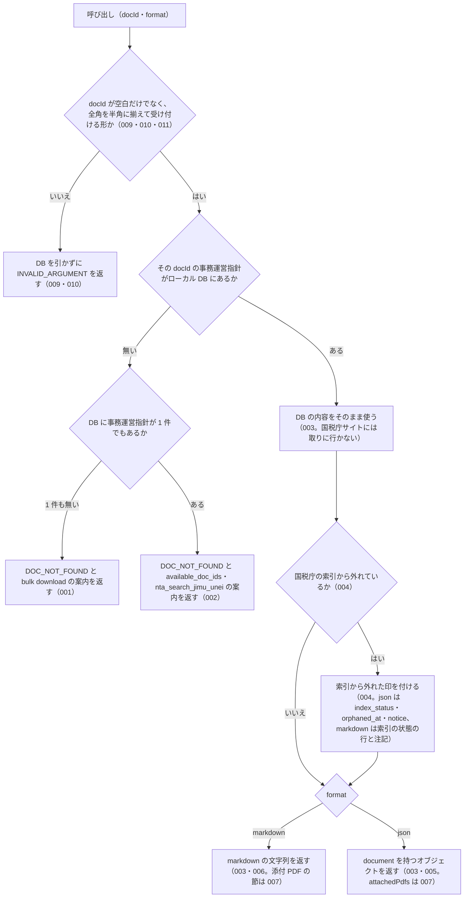

# nta_get_jimu_unei

<!-- GENERATED FILE — 手で編集しない。説明と引数はサーバーの tools/list、呼び出し例は scripts/reference-examples/houki-nta/ja/nta_get_jimu_unei.md、利用者と得られる結果・扱わないこと・処理の流れ・仕様項目の一覧は specs/current/nta_get_jimu_unei/spec.md、使いどころは scripts/spec-pages/houki-nta/nta_get_jimu_unei.md から。 -->

::: info
houki-nta-mcp **v0.27.0** の `tools/list` と `specs/current/nta_get_jimu_unei/spec.md` から自動生成しました（仕様 ID 11 件・2026-10-10）。手で編集しないでください。再生成は `node scripts/generate-reference.mjs` です。
:::

事務運営指針の本文を docId で取得する（DB 経由）。本文 + 添付 PDF URL（pdf-reader-mcp で読み取り推奨）を返す。

## 利用者と得られる結果

このツールの利用者と、利用者が渡すもの・得られる結果を示します。

- MCP クライアント（Claude などの LLM、または CLI から呼ぶ人）。`docId` を渡して、ローカル DB に取り込んである国税庁の事務運営指針 1 件の本文と添付 PDF の一覧を受け取る

## 引数

呼び出すときに渡す値です。動いているサーバーの `tools/list` から写しています。

| 引数 | 型 | 必須 | 既定値 | 説明 |
|---|---|---|---|---|
| `docId` | string (minLength 1) | **必須** |  | 文書 ID。税目/…/フォルダー名 の形（例: "shotoku/shinkoku/170331" / "sozoku/170111_1"）。全角の数字・ハイフンは半角に揃えて読む。`nta_search_jimu_unei` 結果や DB hint で取得 |
| `format` | `"markdown"` \| `"json"` | 任意 | `"markdown"` | 出力形式 |

## 呼び出し例

実際に呼び出したときの引数と応答です。版と日付は実測したときのものです。

::: details 呼び出し例 — 「酒税の書面添付制度の事務運営指針」
- 実測: v0.25.0（2026-10-05）
- ローカル DB: あり（`source: "db"`）

**引数**

```jsonc
{ "docId": "shozei/090401", "format": "json" }
```

**返る JSON（本文は抜粋）**

```jsonc
{
  "document": {
    "docType": "jimu-unei",
    "docId": "shozei/090401",
    "taxonomy": "shozei",
    "title": "酒税に関する書面添付制度の運用に当たっての基本的な考え方及び事務手続等について（事務運営指針）",
    "issuedAt": "2009-04-01",
    "issuer": "各国税局長 殿 沖縄国税事務所長 殿\n国税庁長官",
    "sourceUrl": "https://www.nta.go.jp/law/jimu-unei/shozei/090401/01.htm",
    "fetchedAt": "2026-10-04T03:26:50.715Z",
    "fullText": "課酒6-3 課総2-8 官総-38 平成21年4月1日 改正 平成22年6月11日 改正 平成24年12月19日 改正 令和6年3月27日 改正 令和8年9月17日\n各国税局長 殿 沖縄国税事務所長 殿\n国税庁長官\n標題のことについては、下記のとおり定めたから、平成21年7月10日以降、これにより適切な運営を図られたい。…\n（趣旨） 書面添付制度（税理士法（昭和26年法律第237号。以下「法」という。）の平成13年度改正により、…\n記\n…\n【第1章 書面添付制度の運用に当たっての基本的な考え方】\n【1 制度の適正・円滑な運用及び普及・定着の推進】\n…\n【第2章 書面添付制度に係る事務手続及び留意事項】\n【1 意見聴取の実施】\n…\n【5 更正前の意見聴取】",
    "attachedPdfs": [
      { "title": "別紙1(PDF/87KB)", "url": "https://www.nta.go.jp/law/jimu-unei/shozei/090401/pdf/01.pdf", "sizeKb": 87, "kind": "attachment" },
      { "title": "別紙2(PDF/69KB)", "url": "https://www.nta.go.jp/law/jimu-unei/shozei/090401/pdf/02.pdf", "sizeKb": 69, "kind": "attachment" }
    ],
    "orphanedAt": null
  },
  "index_status": null,
  "orphaned_at": null,
  "notice": null,
  "legal_status": {
    "binds_citizens": false,
    "binds_courts": false,
    "binds_tax_office": true,
    "note": "通達・事務運営指針は行政内部文書であり、納税者・裁判所には直接的拘束力なし。ただし税務署員は職務として守る義務あり（最高裁 昭和43.12.24）"
  },
  "source": "db"
}
```

`fullText` の 1 行目に文書番号と改正日が並びます。この例では平成 21 年に定め、令和 8 年 9 月 17 日まで 4 回改正されています（2026-10-04 の取り込みで、令和 8 年 9 月 17 日の改正が加わりました）。`issuedAt` は制定日で、最終改正日ではありません。最終改正がいつかは 1 行目から読んでください。

末尾の `【…】` は章・節の見出しです。様式（応接簿など）は `attachedPdfs` にあり、どれも `kind: "attachment"`（別紙・別表）です。`nta_inspect_pdf_meta` に `docType: "jimu-unei"` を指定すると、PDF ごとの読み方（`read_strategy` / `layout_note`）と pdf-reader-mcp の呼び出し例（`next_actions`）が返ります。
:::

## 扱わないこと

このツールが意図して扱わないことです。

- 国税庁サイトから事務運営指針を取ること（DB に無い文書はエラーになる。DB に入れるのは `--bulk-download-jimu-unei`）
- 取得した文書を DB に書き戻すこと（ローカル DB だけを引くので書き戻しは起きない）
- 題名やキーワードから docId を探すこと（探すのは `nta_search_jimu_unei`）
- 添付 PDF の本文を読むこと（URL と種別・読み方の案内を返すだけ。読むのは pdf-reader-mcp などの PDF 読み取りツール、表のメタ情報は `nta_inspect_pdf_meta`）
- 事務運営指針が今も有効かどうか、改正されているかを判定すること

## 処理の流れ

仕様書の「処理の流れ」の節を、図も含めてそのまま写しています。図が大きいので畳んでいます。

::: details 処理の流れの図（仕様書の写し）
呼び出しを受けてから応答を返すまでに、何をどの順で確かめるかを示します。図の中の番号は「できること」の仕様 ID の末尾 3 桁です。


:::

## 仕様項目の一覧

このツールの仕様項目 11 件の見出しです。仕様項目は受入テストと 1 対 1 で対応していて、条件と例は[仕様書ページ](/specs/houki-nta/nta_get_jimu_unei)で読めます。

::: details 仕様項目の見出し（11 件）
| 仕様 ID | 仕様項目 |
|---|---|
| [001](/specs/houki-nta/nta_get_jimu_unei#spec-nta-get-jimu-unei-001) | 事務運営指針が DB に 1 件も無いときは投入を案内する |
| [002](/specs/houki-nta/nta_get_jimu_unei#spec-nta-get-jimu-unei-002) | 事務運営指針はあるが docId が無いときは「見つかりません」と候補を返す |
| [003](/specs/houki-nta/nta_get_jimu_unei#spec-nta-get-jimu-unei-003) | ローカル DB にある事務運営指針を返す |
| [004](/specs/houki-nta/nta_get_jimu_unei#spec-nta-get-jimu-unei-004) | 国税庁の索引から消えた文書に印を付け、索引にある文書では印のキーを null にする |
| [005](/specs/houki-nta/nta_get_jimu_unei#spec-nta-get-jimu-unei-005) | json の応答 |
| [006](/specs/houki-nta/nta_get_jimu_unei#spec-nta-get-jimu-unei-006) | markdown（既定）の応答 |
| [007](/specs/houki-nta/nta_get_jimu_unei#spec-nta-get-jimu-unei-007) | 添付 PDF の一覧を返す |
| [008](/specs/houki-nta/nta_get_jimu_unei#spec-nta-get-jimu-unei-008) | kind の無い添付 PDF は題名から kind を決めて返す |
| [009](/specs/houki-nta/nta_get_jimu_unei#spec-nta-get-jimu-unei-009) | docId が空文字・空白だけのときはDBを引かずに `INVALID_ARGUMENT` を返す |
| [010](/specs/houki-nta/nta_get_jimu_unei#spec-nta-get-jimu-unei-010) | `docId` が受け付ける形でないときは DB を引かずに `INVALID_ARGUMENT` を返す |
| [011](/specs/houki-nta/nta_get_jimu_unei#spec-nta-get-jimu-unei-011) | `docId` は半角に揃えてから形を確かめる |
:::

## 関連ページ

このページの元になった文書と、あわせて読むページです。

- [houki-nta-mcp の解説](/mcp/houki-nta)
- [houki-nta-mcp のツール一覧](/reference/mcp/houki-nta/)
- [nta_get_jimu_unei の仕様書ページ](/specs/houki-nta/nta_get_jimu_unei)
- [元の仕様書（GitHub、v0.27.0）](https://github.com/shuji-bonji/houki-nta-mcp/blob/v0.27.0/specs/current/nta_get_jimu_unei/spec.md)
