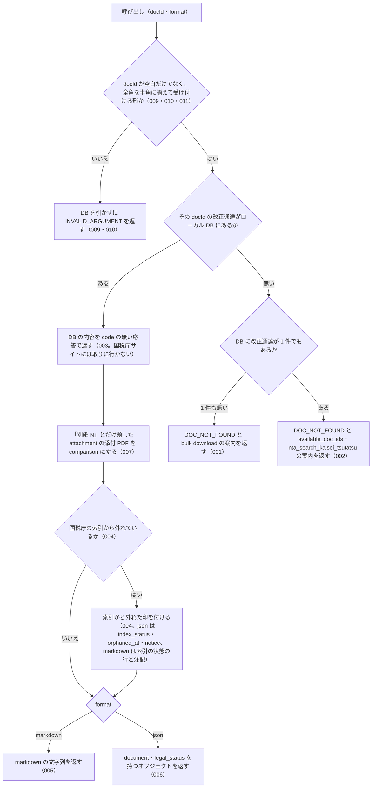

# nta_get_kaisei_tsutatsu

<!-- GENERATED FILE — 手で編集しない。説明と引数はサーバーの tools/list、呼び出し例は scripts/reference-examples/houki-nta/ja/nta_get_kaisei_tsutatsu.md、利用者と得られる結果・扱わないこと・処理の流れ・仕様項目の一覧は specs/current/nta_get_kaisei_tsutatsu/spec.md、使いどころは scripts/spec-pages/houki-nta/nta_get_kaisei_tsutatsu.md から。 -->

::: info
houki-nta-mcp **v0.27.0** の `tools/list` と `specs/current/nta_get_kaisei_tsutatsu/spec.md` から自動生成しました（仕様 ID 11 件・2026-10-10）。手で編集しないでください。再生成は `node scripts/generate-reference.mjs` です。
:::

改正通達の本文を docId で取得する（DB 経由）。本文 + 添付 PDF URL（pdf-reader-mcp で読み取り推奨）を返す。

## 利用者と得られる結果

このツールの利用者と、利用者が渡すもの・得られる結果を示します。

- MCP クライアント（Claude などの LLM、または CLI から呼ぶ人）。`docId` を渡して、ローカル DB に入れてある改正通達（法令解釈通達の一部改正）1 件の本文と添付 PDF の一覧を受け取る。`docId` は `nta_search_kaisei_tsutatsu` の結果か、このツールのエラーの `available_doc_ids` から得る

## 引数

呼び出すときに渡す値です。動いているサーバーの `tools/list` から写しています。

| 引数 | 型 | 必須 | 既定値 | 説明 |
|---|---|---|---|---|
| `docId` | string (minLength 1) | **必須** |  | 文書 ID。英小文字・数字・- だけの値（例: "0026003-067"、"240401"）。全角の数字・ハイフンは半角に揃えて読む。`nta_search_kaisei_tsutatsu` 結果や DB hint で取得 |
| `format` | `"markdown"` \| `"json"` | 任意 | `"markdown"` | 出力形式 |

## 呼び出し例

実際に呼び出したときの引数と応答です。版と日付は実測したときのものです。

::: details 呼び出し例 — 「令和 7 年 4 月 1 日の消基通改正の本文と添付 PDF」
- 実測: v0.25.0（2026-10-05）
- ローカル DB: あり（`source: "db"`）

**引数**

```jsonc
{ "docId": "0025004-026", "format": "json" }
```

**返る JSON**

```jsonc
{
  "document": {
    "docType": "kaisei",
    "docId": "0025004-026",
    "taxonomy": "shohi",
    "title": "消費税法基本通達の一部改正について（法令解釈通達）",
    "issuedAt": "2025-04-01",
    "issuer": "各国税局長 殿 沖縄国税事務所長 殿 各税関長 殿 沖縄地区税関長 殿\n国税庁長官 （官印省略）",
    "sourceUrl": "https://www.nta.go.jp/law/tsutatsu/kihon/shohi/kaisei/0025004-026/index.htm",
    "fetchedAt": "2026-10-04T03:24:16.836Z",
    "fullText": "課消2-4 課総11-10 … 令和7年4月1日\n…\n記\n1 消費税法基本通達について、別紙1「消費税法基本通達新旧対照表」の「改正前」欄に掲げる部分を「改正後」欄に掲げる部分のとおり改めることとし、令和7年4月1日から適用する。\n2 … 別紙2 … 令和8年11月1日から適用する。\n…",
    "attachedPdfs": [
      { "title": "別紙1（PDF/221KB）", "url": "https://www.nta.go.jp/law/tsutatsu/kihon/shohi/kaisei/0025004-026/pdf/01.pdf", "sizeKb": 221, "kind": "comparison" },
      { "title": "別紙2（PDF/449KB）", "url": "https://www.nta.go.jp/law/tsutatsu/kihon/shohi/kaisei/0025004-026/pdf/02.pdf", "sizeKb": 449, "kind": "comparison" },
      { "title": "【参考】令和８年11月１日から適用される「消費税法基本通達（第８章）」の構成及び新旧対応表（令和７年４月１日）（PDF/399KB）", "url": "https://www.nta.go.jp/law/tsutatsu/kihon/shohi/kaisei/pdf/b0025003-111.pdf", "sizeKb": 399, "kind": "comparison" }
    ],
    "orphanedAt": null
  },
  "index_status": null,
  "orphaned_at": null,
  "notice": null,
  "legal_status": {
    "binds_citizens": false,
    "binds_courts": false,
    "binds_tax_office": true,
    "note": "通達は行政内部文書。納税者・裁判所には直接的拘束力なし。ただし税務署員は職務として守る義務あり（最高裁 昭和43.12.24）"
  },
  "source": "db"
}
```

本文は「別紙のとおり改める」までで、改正の中身は `attachedPdfs` の新旧対照表にあります。3 件とも `kind: "comparison"`（新旧対照表）です。PDF の読み方は `nta_inspect_pdf_meta` が返す `attachedPdfs[].read_strategy` / `layout_note` と `next_actions` を参照してください（`save: true` で保存すれば pdf-reader-mcp の `extract_tables` で表として取れます）。この例では別紙 1 が令和 7 年 4 月 1 日から、別紙 2 が令和 8 年 11 月 1 日から適用と、適用日が 2 つに分かれています。
:::

::: details 呼び出し例 — 「docId を打ち間違えたとき」
- 実測: v0.25.0（2026-10-05）
- ローカル DB: あり（改正通達 118 件）

**引数**

```jsonc
{ "docId": "0025004-999" }
```

**返る JSON**（`isError: true`）

```jsonc
{
  "error": "改正通達 docId=\"0025004-999\" は見つかりません",
  "code": "DOC_NOT_FOUND",
  "hint": "DB の改正通達 118 件に、この docId はありません。available_doc_ids（新しい順に 30 件）から選ぶか、nta_search_kaisei_tsutatsu で検索して docId を確かめてください。DB を投入した後に国税庁が公開した文書は、`npx -y @shuji-bonji/houki-nta-mcp@latest --bulk-download-kaisei` をもう一度実行すると取り込めます",
  "next_actions": [
    { "action": "nta_search_kaisei_tsutatsu", "reason": "キーワード検索で正しい docId を探せます" }
  ],
  "available_doc_ids": [
    { "docId": "260807", "title": "法人税基本通達等の一部改正について（法令解釈通達）", "issuedAt": "2026-08-07" },
    { "docId": "2606xx", "title": "法人税基本通達等の一部改正について（法令解釈通達）", "issuedAt": "2026-06-30" },
    { "docId": "2606", "title": "「所得税基本通達の制定について」の一部改正について（法令解釈通達）", "issuedAt": "2026-06-30" },
    // … 新しい順に 30 件。15 件目が { "docId": "0025004-026", …, "issuedAt": "2025-04-01" }
  ],
  "tool": "nta_get_kaisei_tsutatsu"
}
```

`available_doc_ids` には題名と発出日が入るので、探していた改正（この例では令和 7 年 4 月 1 日の消基通改正）を選び直せます。

改正通達が DB に 1 件も入っていないときも `code` は同じ `DOC_NOT_FOUND` ですが、中身が変わります。`error` が「ローカル DB に改正通達が 1 件も無いため、docId=… を取得できません」になり、`next_actions[0].action` が `cli_bulk_download`（`example.command` は `npx -y @shuji-bonji/houki-nta-mcp@latest --bulk-download-kaisei`）になり、`available_doc_ids` は付きません。`next_actions[0].action` を見れば、投入が必要なのか docId が誤っているのかを区別できます（v0.14.1 から）。`hint` は DB の状態ごとに先頭の文が変わり、どれも開こうとした DB のパス（ホームは `~`）を含みます（v0.25.0 から）。DB のファイルが無いときは「ローカル DB（~/.cache/houki-nta-mcp/cache.db）がありません。…」、改正通達だけが無いときは「ローカル DB（~/.cache/houki-nta-mcp/cache.db）に改正通達（doc_type="kaisei"）が入っていません。…」で始まり、後者には投入したシェルで `--status` を実行して DB が同じか確かめる手順が続きます。

`nta_get_jimu_unei` と `nta_get_bunshokaitou` も同じ形（`code: "DOC_NOT_FOUND"`）で返します。v0.21.3 までの改正通達の `code` は `TSUTATSU_NOT_FOUND` でした。

`docId` に英小文字・数字・`-` 以外の文字が入っているときは、DB を引く前に `INVALID_ARGUMENT` になります。`DOC_NOT_FOUND` は、形は合っているが DB にその文書が無いときだけです。
:::

## 扱わないこと

このツールが意図して扱わないことです。

- DB に無い改正通達を国税庁サイトから取ること（改正通達は docId から個別ページの URL を組み立てるのに税目フォルダの世代差を解く必要があるため。DB に入れるのは `houki-nta-mcp --bulk-download-kaisei`）
- 添付 PDF の本文を読むこと（応答には PDF の URL・種別・読み方の案内までを載せる。本文は pdf-reader-mcp などの PDF 読み取りツールに渡す。表を取るときの保存は `nta_inspect_pdf_meta`）
- 改正通達を題名やキーワードから探すこと（探すのは `nta_search_kaisei_tsutatsu`）
- 改正後の基本通達の条項本文を返すこと（条項は `nta_get_tsutatsu`）
- 改正通達が今も有効か、改正後の取扱いが現行かを判定すること

## 処理の流れ

仕様書の「処理の流れ」の節を、図も含めてそのまま写しています。図が大きいので畳んでいます。

::: details 処理の流れの図（仕様書の写し）
呼び出しを受けてから応答を返すまでに、何をどの順で確かめるかを示します。図の中の番号は「できること」の仕様 ID の末尾 3 桁です。


:::

## 仕様項目の一覧

このツールの仕様項目 11 件の見出しです。仕様項目は受入テストと 1 対 1 で対応していて、条件と例は[仕様書ページ](/specs/houki-nta/nta_get_kaisei_tsutatsu)で読めます。

::: details 仕様項目の見出し（11 件）
| 仕様 ID | 仕様項目 |
|---|---|
| [001](/specs/houki-nta/nta_get_kaisei_tsutatsu#spec-nta-get-kaisei-tsutatsu-001) | ローカル DB に改正通達が 1 件も無いときは投入を案内する |
| [002](/specs/houki-nta/nta_get_kaisei_tsutatsu#spec-nta-get-kaisei-tsutatsu-002) | 改正通達はあるが docId が無いときは「見つかりません」と候補を返す |
| [003](/specs/houki-nta/nta_get_kaisei_tsutatsu#spec-nta-get-kaisei-tsutatsu-003) | ローカル DB にある改正通達は DB から返す |
| [004](/specs/houki-nta/nta_get_kaisei_tsutatsu#spec-nta-get-kaisei-tsutatsu-004) | 国税庁の索引から消えた文書に印を付け、索引にある文書では印のキーを null にする |
| [005](/specs/houki-nta/nta_get_kaisei_tsutatsu#spec-nta-get-kaisei-tsutatsu-005) | markdown（既定）の応答 |
| [006](/specs/houki-nta/nta_get_kaisei_tsutatsu#spec-nta-get-kaisei-tsutatsu-006) | json の応答 |
| [007](/specs/houki-nta/nta_get_kaisei_tsutatsu#spec-nta-get-kaisei-tsutatsu-007) | 「別紙 N」とだけ題した添付 PDF は新旧対照表として返す |
| [008](/specs/houki-nta/nta_get_kaisei_tsutatsu#spec-nta-get-kaisei-tsutatsu-008) | kind の無い添付 PDF は題名から kind を決めて返す |
| [009](/specs/houki-nta/nta_get_kaisei_tsutatsu#spec-nta-get-kaisei-tsutatsu-009) | docId が空文字・空白だけのときはDBを引かずに `INVALID_ARGUMENT` を返す |
| [010](/specs/houki-nta/nta_get_kaisei_tsutatsu#spec-nta-get-kaisei-tsutatsu-010) | `docId` が受け付ける形でないときは DB を引かずに `INVALID_ARGUMENT` を返す |
| [011](/specs/houki-nta/nta_get_kaisei_tsutatsu#spec-nta-get-kaisei-tsutatsu-011) | `docId` は半角に揃えてから形を確かめる |
:::

## 関連ページ

このページの元になった文書と、あわせて読むページです。

- [houki-nta-mcp の解説](/mcp/houki-nta)
- [houki-nta-mcp のツール一覧](/reference/mcp/houki-nta/)
- [nta_get_kaisei_tsutatsu の仕様書ページ](/specs/houki-nta/nta_get_kaisei_tsutatsu)
- [元の仕様書（GitHub、v0.27.0）](https://github.com/shuji-bonji/houki-nta-mcp/blob/v0.27.0/specs/current/nta_get_kaisei_tsutatsu/spec.md)
