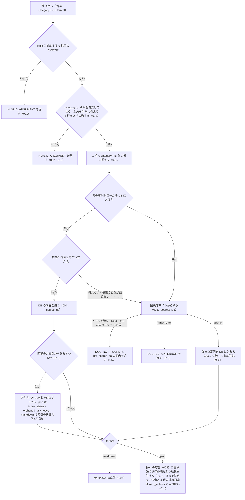

# nta_get_qa

<!-- GENERATED FILE — 手で編集しない。説明と引数はサーバーの tools/list、呼び出し例は scripts/reference-examples/houki-nta/ja/nta_get_qa.md、使う人と受け取るもの・できないこと・処理の流れ・約束の一覧は specs/current/nta_get_qa/spec.md、使いどころは scripts/spec-pages/houki-nta/nta_get_qa.md から。 -->

::: info
houki-nta-mcp **v0.27.0** の `tools/list` と `specs/current/nta_get_qa/spec.md` から自動生成しました（仕様 ID 16 件・2026-10-10）。手で編集しないでください。再生成は `node scripts/generate-reference.mjs` です。
:::

国税庁の質疑応答事例 1 件を取得する。URL 形式: /law/shitsugi/{topic}/{category}/{id}.htm。国税庁サイトにそのページが無いときはエラー DOC_NOT_FOUND を返し、nta_search_qa を案内する。format=json では【関係法令通達】を法令（related_laws）と通達（related_tsutatsu）に分け、next_actions で houki-egov-mcp の get_law と nta_get_tsutatsu を案内する。

## 使う人と受け取るもの

このツールを誰が呼び、何を渡して何を受け取るかを示します。

- MCP クライアント（Claude などの LLM、または CLI から呼ぶ人）。`topic`・`category`・`id` を渡して、国税庁の質疑応答事例 1 件の照会要旨・回答要旨・関係法令通達を受け取る

## 引数

呼び出すときに渡す値です。動いているサーバーの `tools/list` から写しています。

| 引数 | 型 | 必須 | 既定値 | 説明 |
|---|---|---|---|---|
| `topic` | `"shotoku"` \| `"gensen"` \| `"joto"` \| `"sozoku"` \| `"hyoka"` \| `"hojin"` \| `"shohi"` \| `"inshi"` \| `"hotei"` | **必須** |  | 税目フォルダ。shotoku=所得税, gensen=源泉所得税, joto=譲渡所得, sozoku=相続税・贈与税, hyoka=財産の評価, hojin=法人税, shohi=消費税, inshi=印紙税, hotei=法定調書 |
| `category` | string (minLength 1) | **必須** |  | カテゴリ番号（章相当）。1 桁か 2 桁の数字。例: "01", "02"。全角の数字は半角に揃えて読む。/law/shitsugi/{topic}/01.htm の TOC で確認できる |
| `id` | string (minLength 1) | **必須** |  | 事例番号。1 桁か 2 桁の数字。例: "19"。全角の数字は半角に揃えて読む |
| `format` | `"markdown"` \| `"json"` | 任意 | `"markdown"` | 出力形式 |

## 呼び出し例

実際に呼び出したときの引数と応答です。版と日付は実測したときのものです。

::: details 呼び出し例 — 「消費税の質疑応答事例 02/19 の照会と回答、関係法令通達」
- 実測: v0.25.0（2026-10-05）
- ローカル DB: 不要。ただし DB に構造があればそこから返る（この例は 2 回目の呼び出しで `source: "db"`）

**引数**

```jsonc
{ "topic": "shohi", "category": "02", "id": "19", "format": "json" }
```

**返る JSON（抜粋）**

```jsonc
{
  "qa": {
    "topic": "shohi",
    "category": "02",
    "id": "19",
    "title": "個人事業者が所有するゴルフ会員権の譲渡",
    "question": [
      "個人事業者がゴルフ会員権を譲渡した場合、課税の対象となるのでしょうか。"
    ],
    "answer": [
      "個人事業者が所有するゴルフ会員権は、会員権販売業者が所有している場合には棚卸資産に当たり、その譲渡は課税の対象となりますが、その他の個人事業者が所有している場合には生活用資産に当たり、その譲渡は課税の対象となりません（基通5－1－1（注）1）。"
    ],
    "relatedLaws": [
      "消費税法第2条第1項第8号、消費税法基本通達5-1-1"
    ],
    "notice": "令和7年8月1日現在の法令・通達等に基づいて作成しています。\n\nこの質疑事例は、照会に係る事実関係を前提とした一般的な回答であり、…この回答内容と異なる課税関係が生ずることがあることにご注意ください。",
    "basisDate": "2025-08-01",
    "sourceUrl": "https://www.nta.go.jp/law/shitsugi/shohi/02/19.htm",
    "fetchedAt": "2026-10-04T04:15:41.363Z"
  },
  "source": "db",
  "index_status": null,
  "orphaned_at": null,
  "notice": null,
  "legal_status": {
    "binds_citizens": false,
    "binds_courts": false,
    "binds_tax_office": false,
    "note": "タックスアンサー・質疑応答事例は国税庁の参考解説資料。法的拘束力はなく、実務判断は通達・法令本文に基づく必要がある"
  },
  "related_laws": [
    { "law_name": "消費税法", "article": "2", "paragraph": 1, "item": 8, "raw": "消費税法第2条第1項第8号" }
  ],
  "related_tsutatsu": [
    { "name": "消費税法基本通達", "clause": "5-1-1", "raw": "消費税法基本通達5-1-1" }
  ],
  "next_actions": [
    {
      "action": "delegate_to_mcp",
      "reason": "質疑応答事例は参考資料で法的拘束力がない。根拠は法律本文で確認する",
      "example": { "mcp": "houki-egov", "tool": "get_law", "law_name": "消費税法", "article": "2", "paragraph": 1, "item": 8 }
    },
    {
      "action": "nta_get_tsutatsu",
      "reason": "質疑応答事例が挙げている通達の本文を確認する",
      "example": { "name": "消費税法基本通達", "clause": "5-1-1" }
    }
  ]
}
```

【関係法令通達】の原文は `relatedLaws` にそのまま残り、法令は `related_laws`、通達は `related_tsutatsu` に分けて入ります。`next_actions` の `example` は、そのまま houki-egov-mcp の `get_law` と `nta_get_tsutatsu` の引数として使えます。

ページ下部の国税庁の注記（何年何月何日現在の法令に基づくか、個別の取引には異なる課税関係が生じうること）は `notice` に入り、基準日は `basisDate` に入ります。この注記は回答に残してください。

`source` はローカル DB（`"db"`）と国税庁サイト（`"live"`）のどちらから返したかです（v0.16.0 から）。1 回目は `"live"` で、その結果が DB に書き戻されるので 2 回目からは `"db"` になります。`"db"` の `fetchedAt` は呼び出した時刻ではなく DB に取り込んだ日時なので、引用するときはその値をそのまま書きます。v0.15.0 までは毎回国税庁サイトから取得していました（[houki-nta-mcp #29](https://github.com/shuji-bonji/houki-nta-mcp/issues/29)）。

国税庁の索引から外れた文書では、上の段の `index_status` が `"removed_from_index"` になり、`orphaned_at` と `notice` に値が入ります（v0.17.0 から）。この事例は索引にあるので、3 つとも `null` です（キーは v0.23.0 から常にあります）。上の段の `notice` は索引の注記で、`qa.notice`（国税庁のページ下部の注記）とは別のものです。
:::

::: details 呼び出し例 — 枝番号の号を挙げている事例（法人税 33/02）
- 実測: v0.25.0（2026-10-05）

**引数**

```jsonc
{ "topic": "hojin", "category": "33", "id": "02", "format": "json" }
```

**返る JSON**（`related_laws` と `next_actions` の抜粋）

```jsonc
{
  "related_laws": [
    { "law_name": "法人税法", "article": "2", "item": "12の8", "raw": "法人税法第2条第12号の8" },
    { "law_name": "法人税法施行令", "article": "4の3", "paragraph": 4, "item": 1, "raw": "法人税法施行令第4条の3第4項第1号" },
    { "law_name": "法人税法施行規則", "article": "3", "raw": "法人税法施行規則第3条" }
  ],
  "next_actions": [
    {
      "action": "delegate_to_mcp",
      "reason": "質疑応答事例は参考資料で法的拘束力がない。根拠は法律本文で確認する",
      "example": { "mcp": "houki-egov", "tool": "get_law", "law_name": "法人税法", "article": "2", "item": "12の8" }
    }
    // 施行令・施行規則への案内が続く
  ]
  // qa / legal_status は上の例と同じ形
}
```

「第2条第12号の8」のような枝番号の号は、v0.14.0 から `item` に文字列（`"12の8"`）で入ります（v0.13.0 までは `item` を入れていませんでした）。この `example` を houki-egov-mcp の `get_law` にそのまま渡せるのは v0.6.0 以上です。法人税法 2 条は項が 1 つだけなので、`paragraph` が無くても号を引けます。
:::

## できないこと

このツールが引き受けないことです。

- markdown の応答で `related_laws` / `related_tsutatsu` / `next_actions` を返すこと（json のときだけ。markdown は【関係法令通達】の節をページの表記のまま載せる）
- 事例番号を題名やキーワードから探すこと（探すのは `nta_search_qa`）
- 関係法令通達に挙がった法令・通達の本文を返すこと（`next_actions` で案内するだけ）
- 回答要旨が今の法令でも成り立つかを判定すること（`qa.basisDate` は国税庁が書いた作成時点をそのまま返す）

## 処理の流れ

仕様書の「処理の流れ」の節を、図も含めてそのまま写しています。図が大きいので畳んでいます。

::: details 処理の流れの図（仕様書の写し）
呼び出しを受けてから応答を返すまでに、何をどの順で確かめるかを示します。図の中の番号は「できること」の仕様 ID の末尾 3 桁です。


:::

## 約束の一覧

このツールが守る約束 16 件の見出しです。約束は受入テストと 1 対 1 で対応していて、条件と例は[仕様書ページ](/specs/houki-nta/nta_get_qa)で読めます。

::: details 約束の見出し（16 件）
| 仕様 ID | 約束 |
|---|---|
| [001](/specs/houki-nta/nta_get_qa#spec-nta-get-qa-001) | 対応していない税目は取りに行かない |
| [002](/specs/houki-nta/nta_get_qa#spec-nta-get-qa-002) | category と id が空文字・空白だけのときは取りに行かない |
| [003](/specs/houki-nta/nta_get_qa#spec-nta-get-qa-003) | 1 桁の category と id は 2 桁に揃えてから引く |
| [004](/specs/houki-nta/nta_get_qa#spec-nta-get-qa-004) | ローカル DB にある事例は DB から返す |
| [005](/specs/houki-nta/nta_get_qa#spec-nta-get-qa-005) | DB に無い事例は国税庁サイトから取る |
| [006](/specs/houki-nta/nta_get_qa#spec-nta-get-qa-006) | 国税庁サイトから取った事例は DB に入り、次からは DB から返す |
| [007](/specs/houki-nta/nta_get_qa#spec-nta-get-qa-007) | markdown（既定）の応答 |
| [008](/specs/houki-nta/nta_get_qa#spec-nta-get-qa-008) | json の応答 |
| [009](/specs/houki-nta/nta_get_qa#spec-nta-get-qa-009) | 関係法令通達を法令と通達に分け、本文を読む案内を付ける |
| [010](/specs/houki-nta/nta_get_qa#spec-nta-get-qa-010) | 国税庁の索引から消えた事例に印を付け、それ以外では印のキーを null にする |
| [011](/specs/houki-nta/nta_get_qa#spec-nta-get-qa-011) | 条まで読めない法令や、基本通達 4 種以外の通達は `next_actions` に入れない |
| [012](/specs/houki-nta/nta_get_qa#spec-nta-get-qa-012) | 段落の構造を持たない DB の行は、国税庁サイトから取り直す |
| [013](/specs/houki-nta/nta_get_qa#spec-nta-get-qa-013) | category と id は 1 桁か 2 桁の半角の数字で、それ以外は取りに行かずに `INVALID_ARGUMENT` を返す |
| [014](/specs/houki-nta/nta_get_qa#spec-nta-get-qa-014) | 国税庁サイトにページが無い（404・410・404 ページへの転送）ときは `DOC_NOT_FOUND` を返し、検索ツールを案内する |
| [015](/specs/houki-nta/nta_get_qa#spec-nta-get-qa-015) | 国税庁サイトとの通信が失敗したときは、失敗の種類ごとの `SOURCE_*` を返す |
| [016](/specs/houki-nta/nta_get_qa#spec-nta-get-qa-016) | `category` と `id` は半角に揃えてから形を確かめる |
:::

## 関連ページ

このページの元になった文書と、あわせて読むページです。

- [houki-nta-mcp の解説](/mcp/houki-nta)
- [houki-nta-mcp のツール一覧](/reference/mcp/houki-nta/)
- [nta_get_qa の仕様書ページ](/specs/houki-nta/nta_get_qa)
- [元の仕様書（GitHub、v0.27.0）](https://github.com/shuji-bonji/houki-nta-mcp/blob/v0.27.0/specs/current/nta_get_qa/spec.md)
