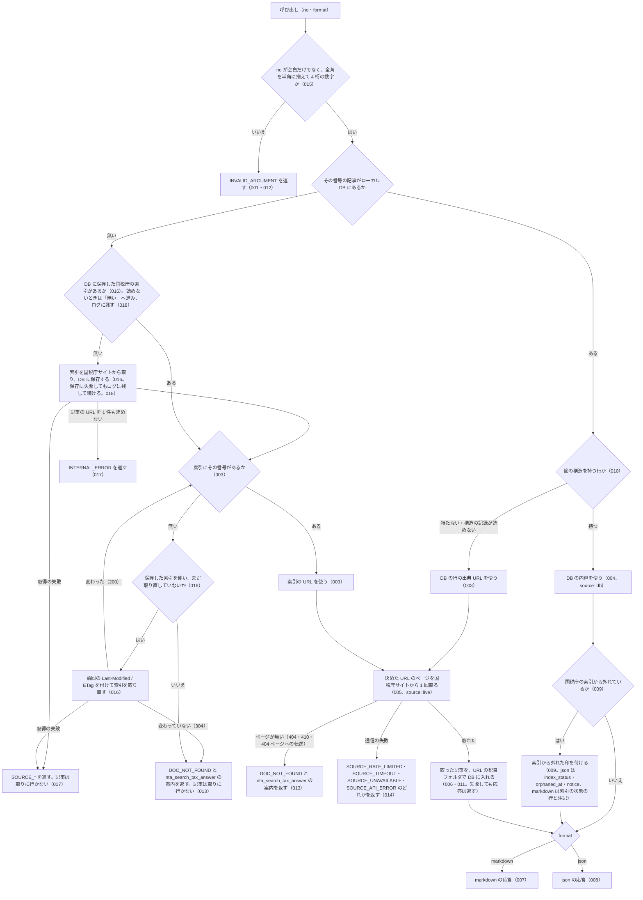

# nta_get_tax_answer

<!-- GENERATED FILE — 手で編集しない。説明と引数はサーバーの tools/list、呼び出し例は scripts/reference-examples/houki-nta/ja/nta_get_tax_answer.md、使う人と受け取るもの・できないこと・処理の流れ・約束の一覧は specs/current/nta_get_tax_answer/spec.md、使いどころは scripts/spec-pages/houki-nta/nta_get_tax_answer.md から。 -->

::: info
houki-nta-mcp **v0.27.0** の `tools/list` と `specs/current/nta_get_tax_answer/spec.md` から自動生成しました（仕様 ID 18 件・2026-10-10）。手で編集しないでください。再生成は `node scripts/generate-reference.mjs` です。
:::

国税庁のタックスアンサー（よくある税の質問）本文を番号で取得する。国税庁の索引で番号から記事の URL を決める。8xxx（災害）も取れる。例: 6101 → 消費税の基本的なしくみ。国税庁の索引に番号が無いとき、または国税庁サイトにそのページが無いときはエラー DOC_NOT_FOUND を返し、nta_search_tax_answer を案内する

## 使う人と受け取るもの

このツールを誰が呼び、何を渡して何を受け取るかを示します。

- MCP クライアント（Claude などの LLM、または CLI から呼ぶ人）。タックスアンサー番号 `no` を渡して、国税庁の「タックスアンサー（よくある税の質問）」1 件の本文（見出しごとの節）を受け取る

## 引数

呼び出すときに渡す値です。動いているサーバーの `tools/list` から写しています。

| 引数 | 型 | 必須 | 既定値 | 説明 |
|---|---|---|---|---|
| `no` | string (minLength 1) | **必須** |  | タックスアンサー番号。4 桁の数字（全角の数字は半角に揃えて読む）。国税庁の索引で番号から記事の URL を決める。8xxx（災害）も取れる。例: "6101", "1120", "8001" |
| `format` | `"markdown"` \| `"json"` | 任意 | `"markdown"` | 出力形式 |

::: tip 引数名は `no` です
`id` ではありません。記事の URL は国税庁の索引で番号から決めます（v0.24.0 から。それまでは番号の先頭の桁で税目のフォルダーを決めていました）。8xxx（災害）の記事も取れます。索引に無い番号は、記事を取りに行かずに `DOC_NOT_FOUND` を返します。
:::

## 呼び出し例

実際に呼び出したときの引数と応答です。版と日付は実測したときのものです。

::: details 呼び出し例 — 「No.6101 消費税の基本的なしくみ」
- 実測: v0.25.1（2026-10-05）
- ローカル DB: 不要。ただし DB に構造があればそこから返る（この例は `--bulk-download-tax-answer --refresh` で入れ直した DB から返した `source: "db"`）

**引数**

```jsonc
{ "no": "6101", "format": "json" }
```

**返る JSON（抜粋）**

```jsonc
{
  "taxAnswer": {
    "no": "6101",
    "title": "消費税の基本的なしくみ",
    "effectiveDate": "令和8年4月1日現在法令等",
    "basisDate": "2026-04-01",
    "taxCategory": "消費税",
    "sections": [
      { "heading": "概要", "paragraphs": ["消費税は、特定の物品やサービスに課税する個別消費税（酒税・たばこ税等）とは異なり、消費一般に広く公平に課税する間接税です。…", "…"], "level": 2 },
      { "heading": "消費税の負担者", "paragraphs": ["消費税は、事業者に負担を求めるものではありません。…"], "level": 3 },
      { "heading": "課税のしくみ", "paragraphs": ["…", "令和5年10月1日から開始した「適格請求書等保存方式（インボイス制度）」では、…", "…"], "level": 3 },
      { "heading": "申告・納付", "paragraphs": ["…"], "level": 3 },
      { "heading": "納税事務の負担軽減措置等", "paragraphs": ["…", "1 事業者免税点制度", "…", "3 2割特例・3割特例（経過措置）", "…"], "level": 3 },
      { "heading": "根拠法令等", "paragraphs": ["消費税法など"], "level": 2 },
      { "heading": "関連リンク", "paragraphs": ["…"], "level": 2 }
    ],
    "sourceUrl": "https://www.nta.go.jp/taxes/shiraberu/taxanswer/shohi/6101.htm",
    "fetchedAt": "2026-10-05T05:45:26.899Z"
  },
  "source": "db",
  "index_status": null,
  "orphaned_at": null,
  "notice": null,
  "legal_status": {
    "binds_citizens": false,
    "binds_courts": false,
    "binds_tax_office": false,
    "note": "タックスアンサー・質疑応答事例は国税庁の参考解説資料。法的拘束力はなく、実務判断は通達・法令本文に基づく必要がある"
  }
}
```

`sections` はページの見出し（h2）と小見出し（h3）ごとの節で、ページの順に 1 つの配列に並びます。`level` は見出しの段で、h2 の節が `2`、h3 の節が `3` です（v0.25.1 から）。h3 の節がどの見出しの下にあるかは、その前にある最も近い `level: 2` の節で分かります。この例では「消費税の負担者」から「納税事務の負担軽減措置等」までの 4 つが「概要」の下の小見出しです。`format` を省いた markdown の応答では、h2 の節を `## `、h3 の節を `### ` で書きます。

v0.25.0 までは小見出しの文字列が落ち、その段落が上の見出しの節に続けて入っていました。この記事では `sections` が「概要」（26 段落）・「根拠法令等」・「関連リンク」の 3 つでした（[houki-nta-mcp#147](https://github.com/shuji-bonji/houki-nta-mcp/issues/147)）。v0.25.0 以前に取り込んだ DB の行は、`--bulk-download-tax-answer --refresh` で入れ直すまで以前の分け方のまま返り、`level` はすべて `2` になります。

`effectiveDate` は国税庁がページに書いている「何年何月何日現在の法令等に基づくか」で、取得日ではありません。同じ日付を `YYYY-MM-DD` にしたものが `basisDate` です。`index_status`・`orphaned_at`・`notice` は国税庁の索引から記事が消えたときに値が入り、この例では `null` です。「根拠法令等」の節に法令名が入るので、そこから houki-egov-mcp の `get_law` につなげられます。

`source` はローカル DB（`"db"`）と国税庁サイト（`"live"`）のどちらから返したかです（v0.16.0 から）。DB に無い記事は国税庁サイトから取り（`"live"`、`fetchedAt` は取得した時刻）、その結果を DB に書き戻すので、同じ番号の 2 回目からは `"db"` になり `fetchedAt` は 1 回目の値のまま変わりません。この例の `fetchedAt` は `--bulk-download-tax-answer` で取り込んだ日時です。**`"db"` の `fetchedAt` は呼び出した時刻ではなく、DB に取り込んだ日時です。** 引用するときはその値をそのまま書きます。

v0.15.0 までは DB を引かずに毎回国税庁サイトから取得していたため、`fetchedAt` は常に呼び出し時刻でした（[houki-nta-mcp #29](https://github.com/shuji-bonji/houki-nta-mcp/issues/29)）。
:::

::: details 呼び出し例 — 「No.1222 耐震改修工事をした場合（住宅耐震改修特別控除）」（見出しの直後に小見出しが続く記事）
- 実測: v0.25.1（2026-10-05）
- ローカル DB: 不要（この例は `--bulk-download-tax-answer --refresh` で入れ直した DB から返した `source: "db"`）

**引数**

```jsonc
{ "no": "1222", "format": "json" }
```

**返る JSON の `taxAnswer.sections`（見出しと `level` と段落の数）**

```jsonc
[
  { "heading": "概要", "level": 2 /* 段落 4 */ },
  { "heading": "対象者または対象物", "paragraphs": [], "level": 2 },
  { "heading": "対象者", "level": 3 /* 段落 1 */ },
  { "heading": "控除の適用を受けるための要件", "level": 3 /* 段落 2 */ },
  { "heading": "計算方法・計算式", "paragraphs": [], "level": 2 },
  { "heading": "住宅耐震改修特別控除の控除額の計算方法", "level": 3 /* 段落 26 */ },
  { "heading": "手続き", "paragraphs": [], "level": 2 },
  { "heading": "申告等の方法", "level": 3 /* 段落 2 */ },
  { "heading": "申告先等", "level": 3 /* 段落 1 */ },
  { "heading": "提出書類等", "level": 2 /* 段落 4 */ },
  { "heading": "根拠法令等", "level": 2 /* 段落 1 */ },
  { "heading": "関連リンク", "level": 2 /* 段落 8 */ }
]
```

**`format` を省いた markdown の応答（見出しの行の部分）**

```markdown
## 対象者または対象物

### 対象者

マイホームについて住宅耐震改修を行った方

### 控除の適用を受けるための要件

…

## 計算方法・計算式

### 住宅耐震改修特別控除の控除額の計算方法

…

## 手続き

### 申告等の方法

…

### 申告先等

所轄税務署
```

見出し（h2）の直後に段落が無く、すぐ小見出し（h3）が続くときは、その見出しの節を `paragraphs: []` で返します。「手続き」のような見出しの文字列を残すためで、markdown では `## 手続き` の行だけになります。段落が空になるのはこの場合だけです。

`申告先等` が何についての話かは、その前にある最も近い `level: 2` の節（「手続き」）で分かります。v0.25.0 では、この記事の `sections` は 7 つで、小見出しの文字列はどこにも入らず、「手続き」の節に「申告等の方法」と「申告先等」の段落が続けて入っていました。
:::

## できないこと

このツールが引き受けないことです。

- 記事を題名やキーワードから探すこと（探すのは `nta_search_tax_answer`）
- 国税庁の索引に無い番号の記事を取ること（`DOC_NOT_FOUND`。`0xxx` 帯は索引に無い）
- 「根拠法令等」の節に挙がった法令・通達を読み取って `related_laws` / `related_tsutatsu` / `next_actions` を付けること（`nta_get_qa` の【関係法令通達】と違い、節の文字列のまま返す）
- 本文の中の画像・表・添付 PDF の内容を返すこと（段落の文字列だけ）
- 記事が今の法令でも成り立つかを判定すること（`taxAnswer.effectiveDate` は国税庁が書いた法令時点をそのまま返す）
- 1 回の呼び出しで複数の番号を取ること

## 処理の流れ

仕様書の「処理の流れ」の節を、図も含めてそのまま写しています。図が大きいので畳んでいます。

::: details 処理の流れの図（仕様書の写し）
呼び出しを受けてから応答を返すまでに、何をどの順で確かめるかを示します。図の中の番号は「できること」の仕様 ID の末尾 3 桁です。


:::

## 約束の一覧

このツールが守る約束 18 件の見出しです。約束は受入テストと 1 対 1 で対応していて、条件と例は[仕様書ページ](/specs/houki-nta/nta_get_tax_answer)で読めます。

::: details 約束の見出し（18 件）
| 仕様 ID | 約束 |
|---|---|
| [001](/specs/houki-nta/nta_get_tax_answer#spec-nta-get-tax-answer-001) | 番号が空か数字でなければ取りに行かない |
| [003](/specs/houki-nta/nta_get_tax_answer#spec-nta-get-tax-answer-003) | 記事の URL は国税庁の索引で決め、DB にある行はその行の URL を使う |
| [004](/specs/houki-nta/nta_get_tax_answer#spec-nta-get-tax-answer-004) | ローカル DB にある記事は DB から返す |
| [005](/specs/houki-nta/nta_get_tax_answer#spec-nta-get-tax-answer-005) | DB に無い記事は国税庁サイトから取る |
| [006](/specs/houki-nta/nta_get_tax_answer#spec-nta-get-tax-answer-006) | 国税庁サイトから取った記事は DB に入り、次からは DB から返す |
| [007](/specs/houki-nta/nta_get_tax_answer#spec-nta-get-tax-answer-007) | markdown（既定）の応答 |
| [008](/specs/houki-nta/nta_get_tax_answer#spec-nta-get-tax-answer-008) | json の応答 |
| [009](/specs/houki-nta/nta_get_tax_answer#spec-nta-get-tax-answer-009) | 国税庁の索引から消えた記事に印を付け、それ以外では印のキーを null にする |
| [010](/specs/houki-nta/nta_get_tax_answer#spec-nta-get-tax-answer-010) | 節の構造を持たない DB の行は、国税庁サイトから取り直す |
| [011](/specs/houki-nta/nta_get_tax_answer#spec-nta-get-tax-answer-011) | 記事番号は引数の no で決め、応答と DB の行に空の番号を入れない |
| [012](/specs/houki-nta/nta_get_tax_answer#spec-nta-get-tax-answer-012) | 番号は 4 桁で、桁数が違えば取りに行かずに `INVALID_ARGUMENT` を返す |
| [013](/specs/houki-nta/nta_get_tax_answer#spec-nta-get-tax-answer-013) | 索引に番号が無いとき、または国税庁サイトにページが無い（404・410・404 ページへの転送）ときは `DOC_NOT_FOUND` を返し、検索ツールを案内する |
| [014](/specs/houki-nta/nta_get_tax_answer#spec-nta-get-tax-answer-014) | 国税庁サイトとの通信が失敗したときは、失敗の種類ごとの `SOURCE_*` を返す |
| [015](/specs/houki-nta/nta_get_tax_answer#spec-nta-get-tax-answer-015) | `no` は半角に揃えてから形を確かめる |
| [016](/specs/houki-nta/nta_get_tax_answer#spec-nta-get-tax-answer-016) | 国税庁の索引を DB に保存して使い回し、番号が見つからないときにだけ取り直す |
| [017](/specs/houki-nta/nta_get_tax_answer#spec-nta-get-tax-answer-017) | 索引の取得に失敗したときは、記事を取りに行かずに `SOURCE_*` を返す |
| [018](/specs/houki-nta/nta_get_tax_answer#spec-nta-get-tax-answer-018) | 保存した索引を読めない・保存できないときも記事を返し、MCP サーバーのログに `warn` で残す |
| [019](/specs/houki-nta/nta_get_tax_answer#spec-nta-get-tax-answer-019) | ページの見出し h2 と h3 をどちらも節の区切りにし、節ごとに見出しの段を `level` で返す |
:::

## 関連ページ

このページの元になった文書と、あわせて読むページです。

- [houki-nta-mcp の解説](/mcp/houki-nta)
- [houki-nta-mcp のツール一覧](/reference/mcp/houki-nta/)
- [nta_get_tax_answer の仕様書ページ](/specs/houki-nta/nta_get_tax_answer)
- [元の仕様書（GitHub、v0.27.0）](https://github.com/shuji-bonji/houki-nta-mcp/blob/v0.27.0/specs/current/nta_get_tax_answer/spec.md)
