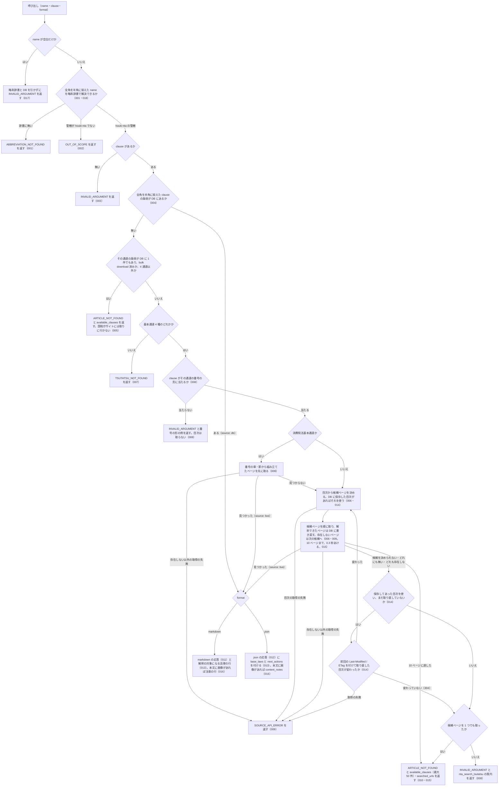

# nta_get_tsutatsu

<!-- GENERATED FILE — 手で編集しない。説明と引数はサーバーの tools/list、呼び出し例は scripts/reference-examples/houki-nta/ja/nta_get_tsutatsu.md、利用者と得られる結果・扱わないこと・処理の流れ・仕様項目の一覧は specs/current/nta_get_tsutatsu/spec.md、使いどころは scripts/spec-pages/houki-nta/nta_get_tsutatsu.md から。 -->

::: info
houki-nta-mcp **v0.27.0** の `tools/list` と `specs/current/nta_get_tsutatsu/spec.md` から自動生成しました（仕様 ID 18 件・2026-10-10）。手で編集しないでください。再生成は `node scripts/generate-reference.mjs` です。
:::

基本通達の本文を取得する。略称（消基通・所基通・法基通・相基通）対応、条項指定可能。DB に条項があれば DB から返す。無ければ、bulk download（`--bulk-download-all`）済みの通達はエラー ARTICLE_NOT_FOUND、それ以外は国税庁サイトの目次から候補ページを選んで取る（1 回の呼び出しで 10 ページまで。取ったページは DB に書き戻す）。応答に解釈の対象になる法律（base_laws）を付け、next_actions で houki-egov-mcp の get_law を案内する。

<!-- ここから人が書いた節: scripts/spec-pages/houki-nta/nta_get_tsutatsu.md -->

## 使いどころ

この節は、このツールをどんな場面で使うかを、仕様書の外から補うためのものです。

国税庁の基本通達（消費税法基本通達・所得税基本通達・法人税基本通達・相続税法基本通達）の条項を、番号を指定して 1 つ読むときに使います。番号が分からないときは、先に `nta_search_tsutatsu` でキーワードから探します。

通達は税務署の職員を拘束しますが、納税者と裁判所は拘束しません（[文書の種類と拘束力](/guide/document-types)）。そのため応答には、その通達が解釈している法律の名前と、houki-egov-mcp で法律の本文を読みに戻るための案内が付きます（[SPEC-NTA-GET-TSUTATSU-013](/specs/houki-nta/nta_get_tsutatsu#spec-nta-get-tsutatsu-013)）。houki-research Skill の [tax-research](/specs/houki-research/tax-research) では、ステップ ④ でこのツールを呼び、そのあと法律の本文へ戻ります。

<!-- ここまで人が書いた節 -->

## 利用者と得られる結果

このツールの利用者と、利用者が渡すもの・得られる結果を示します。

- MCP クライアント（Claude などの LLM、または CLI から呼ぶ人）。`name` と `clause` を渡して、基本通達の条項 1 つの本文を受け取る

## 引数

呼び出すときに渡す値です。動いているサーバーの `tools/list` から写しています。

| 引数 | 型 | 必須 | 既定値 | 説明 |
|---|---|---|---|---|
| `name` | string (minLength 1) | **必須** |  | 通達名または略称。例: "消費税法基本通達", "消基通", "所得税基本通達", "所基通" |
| `clause` | string | 任意 |  | 通達番号。形は通達ごとに違う。消費税法基本通達: 章-節-条（例 "5-1-9", "1-4-13の2"）。法人税基本通達: 章-節-条で、節に枝番号が付くことがある（例 "1-1-1", "1-3の2-1"）。所得税基本通達: 条-項。複数の条に共通する通達は "条~条共-項"（例 "34-1", "2-4の2", "23~35共-6"）。相続税法基本通達: 条-項。複数の条に共通する通達は "条・条共-項"（例 "3-1", "1の3・1の4共-1"）。全角の数字・ハイフンは半角に揃えて読む（DB から返すときも、国税庁サイトから取るときも） |
| `format` | `"markdown"` \| `"json"` | 任意 | `"markdown"` | 出力形式 |

## 呼び出し例

実際に呼び出したときの引数と応答です。版と日付は実測したときのものです。

::: details 呼び出し例 — 「消基通 1-7-2（登録番号の構成）の本文」
- 実測: v0.25.0（2026-10-05）
- ローカル DB: あり（`source: "db"`。DB に無ければ国税庁サイトから取得し、`source` が `"live"` になります）

**引数**

```jsonc
{ "name": "消基通", "clause": "1-7-2", "format": "json" }
```

**返る JSON**

```jsonc
{
  "tsutatsu": "消費税法基本通達",
  "clause": {
    "clauseNumber": "1-7-2",
    "title": "登録番号の構成",
    "paragraphs": [
      { "indent": 1, "text": "適格請求書発行事業者登録簿（法第57条の2第4項《適格請求書発行事業者の登録等》に規定する「適格請求書発行事業者登録簿」をいう。…）に登載する登録番号（…）は、次の区分に応じ、それぞれ次によるものとする。（令5課消2-9により追加、令7課消2-4により改正）" },
      { "indent": 2, "text": "(1) 法人番号を有する課税事業者 法人番号（…）及びその前に付されたローマ字の大文字Tにより構成されるもの" },
      { "indent": 2, "text": "(2) (1)以外の課税事業者 13桁の数字（法人番号と重複しないものとし、…）及びその前に付されたローマ字の大文字Tにより構成されるもの" }
    ],
    "fullText": "登録番号の構成\n適格請求書発行事業者登録簿（…"
  },
  "sourceUrl": "https://www.nta.go.jp/law/tsutatsu/kihon/shohi/01/07.htm",
  "fetchedAt": "2026-10-04T03:14:56.689Z",
  "source": "db",
  "legal_status": {
    "binds_citizens": false,
    "binds_courts": false,
    "binds_tax_office": true,
    "note": "通達は行政内部文書。納税者・裁判所には直接的拘束力なし。ただし税務署員は職務として守る義務あり（最高裁 昭和43.12.24）"
  },
  "base_laws": ["消費税法", "消費税法施行令", "消費税法施行規則"],
  "next_actions": [
    {
      "action": "delegate_to_mcp",
      "reason": "通達は国民・裁判所を拘束しない。根拠は法律本文で確認する",
      "example": { "mcp": "houki-egov", "tool": "get_law", "law_name": "消費税法" }
    }
  ]
}
```

引用するときは「消費税法基本通達 1-7-2」と `sourceUrl` を添え、`legal_status.binds_citizens: false`（通達は国民を拘束しない）を回答に残してください。`name` に法令名（「消費税法」）を渡すと、`OUT_OF_SCOPE` で houki-egov-mcp への案内が返ります。

`clause` の形は通達ごとに違います。消費税法基本通達・法人税基本通達は「章-節-条」（`1-7-2`、`1-3の2-1`）、所得税基本通達・相続税法基本通達は「条-項」（`34-1`、`23~35共-6`、`1の3・1の4共-1`）です。全角の数字・ハイフンで渡しても半角に揃えてから読みます。

DB に無い条項は、基本通達 4 種とも国税庁サイトから取得します（v0.21.0 から。v0.20.x までは消費税法基本通達だけでした）。消費税法基本通達以外は目次ページから候補のページを選び、1 回の呼び出しで最大 10 ページまで順に取得します。取得したページは DB に書き戻すので、同じ節の条項は次から `source: "db"` で返ります。候補のどのページにも無いときは `ARTICLE_NOT_FOUND` と、見たページの番号（`available_clauses`）・URL（`searched_urls`）が返ります（[houki-nta-mcp#54](https://github.com/shuji-bonji/houki-nta-mcp/issues/54)）。

`base_laws` は、この通達が解釈している法律・政令・省令です（v0.11.0 から）。`next_actions` の `example` をそのまま houki-egov-mcp の `get_law` に渡すと、根拠になる法律の本文を引けます。条番号は付きません。本文中の「法第57条の2第4項」のような参照を読んで、`article` を足してください。
:::

## 扱わないこと

このツールが意図して扱わないことです。

- 通達の条項と法律の条番号の対応を示すこと（`base_laws` は法令名まで。条は付けない）
- 条項本文の中の画像（算式の GIF）の内容を返すこと（alt テキストを `[画像: …]` として残す）
- 基本通達 4 種以外の通達（電帳法取通など）を国税庁サイトから取ること・ローカル DB に投入すること（投入のフラグ `--tsutatsu` は基本通達 4 種の正式名しか受け付けない。[SPEC-NTA-CLI-BULK-DOWNLOAD-011](/specs/houki-nta/cli_bulk_download#spec-nta-cli-bulk-download-011)）
- 1 回の呼び出しで 10 を超えるページを国税庁サイトから取ること（全節が要るときは `--bulk-download`）
- 通達が今も有効かどうかを判定すること（改正の追跡は `nta_search_kaisei_tsutatsu` / `nta_get_kaisei_tsutatsu`）

## 処理の流れ

仕様書の「処理の流れ」の節を、図も含めてそのまま写しています。図が大きいので畳んでいます。

::: details 処理の流れの図（仕様書の写し）
呼び出しを受けてから応答を返すまでに、何をどの順で確かめるかを示します。図の中の番号は「できること」の仕様 ID の末尾 3 桁です。


:::

## 仕様項目の一覧

このツールの仕様項目 18 件の見出しです。仕様項目は受入テストと 1 対 1 で対応していて、条件と例は[仕様書ページ](/specs/houki-nta/nta_get_tsutatsu)で読めます。

::: details 仕様項目の見出し（18 件）
| 仕様 ID | 仕様項目 |
|---|---|
| [001](/specs/houki-nta/nta_get_tsutatsu#spec-nta-get-tsutatsu-001) | 通達名を略称辞書で解決する |
| [002](/specs/houki-nta/nta_get_tsutatsu#spec-nta-get-tsutatsu-002) | houki-nta の管轄でない名前は取りに行かない |
| [003](/specs/houki-nta/nta_get_tsutatsu#spec-nta-get-tsutatsu-003) | clause が無ければ何も取りに行かない |
| [004](/specs/houki-nta/nta_get_tsutatsu#spec-nta-get-tsutatsu-004) | ローカル DB にある条項は DB から返す |
| [005](/specs/houki-nta/nta_get_tsutatsu#spec-nta-get-tsutatsu-005) | DB に通達はあるが条項が無いときは、国税庁サイトから取らない通達なら番号の候補を返す |
| [006](/specs/houki-nta/nta_get_tsutatsu#spec-nta-get-tsutatsu-006) | DB に無い基本通達 4 種の条項は国税庁サイトから取る |
| [007](/specs/houki-nta/nta_get_tsutatsu#spec-nta-get-tsutatsu-007) | DB に無く、ライブ取得にも対応していない通達は、今は取り込めないことを返す |
| [008](/specs/houki-nta/nta_get_tsutatsu#spec-nta-get-tsutatsu-008) | 国税庁サイトから取るときは、clause をその通達の番号の形で読む |
| [009](/specs/houki-nta/nta_get_tsutatsu#spec-nta-get-tsutatsu-009) | 国税庁サイトから取れなかったときは、失敗の種類ごとの `SOURCE_*` を返す |
| [010](/specs/houki-nta/nta_get_tsutatsu#spec-nta-get-tsutatsu-010) | 候補ページのどれにも条項が無いときは、見たページの番号（最大 50 件）と URL を返す |
| [011](/specs/houki-nta/nta_get_tsutatsu#spec-nta-get-tsutatsu-011) | markdown（既定）の応答 |
| [012](/specs/houki-nta/nta_get_tsutatsu#spec-nta-get-tsutatsu-012) | json の応答 |
| [013](/specs/houki-nta/nta_get_tsutatsu#spec-nta-get-tsutatsu-013) | 解釈の対象になる法律と、その本文を読む案内を付ける |
| [014](/specs/houki-nta/nta_get_tsutatsu#spec-nta-get-tsutatsu-014) | 目次を DB に保存して使い回し、条項が見つからないときにだけ取り直す |
| [015](/specs/houki-nta/nta_get_tsutatsu#spec-nta-get-tsutatsu-015) | 1 回の呼び出しで国税庁サイトから取るページは 10 まで |
| [016](/specs/houki-nta/nta_get_tsutatsu#spec-nta-get-tsutatsu-016) | 本文に画像がある条項には、画像を読めない旨の注記を付ける |
| [017](/specs/houki-nta/nta_get_tsutatsu#spec-nta-get-tsutatsu-017) | name が空文字・空白だけのときは略称辞書と DBを引かずに `INVALID_ARGUMENT` を返す |
| [018](/specs/houki-nta/nta_get_tsutatsu#spec-nta-get-tsutatsu-018) | `name` の全角英数字・ダッシュ類・全角空白は半角に揃えてから略称辞書で引く |
:::

## 関連ページ

このページの元になった文書と、あわせて読むページです。

- [houki-nta-mcp の解説](/mcp/houki-nta)
- [houki-nta-mcp のツール一覧](/reference/mcp/houki-nta/)
- [nta_get_tsutatsu の仕様書ページ](/specs/houki-nta/nta_get_tsutatsu)
- [元の仕様書（GitHub、v0.27.0）](https://github.com/shuji-bonji/houki-nta-mcp/blob/v0.27.0/specs/current/nta_get_tsutatsu/spec.md)
