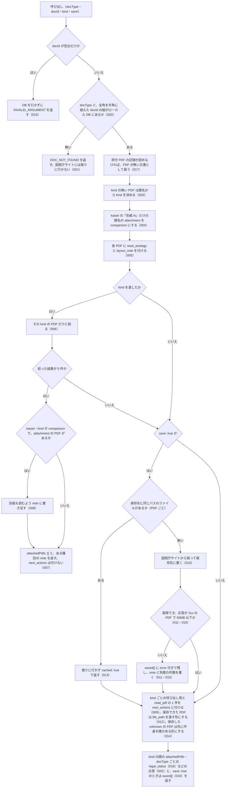

# nta_inspect_pdf_meta

<!-- GENERATED FILE — 手で編集しない。説明と引数はサーバーの tools/list、呼び出し例は scripts/reference-examples/houki-nta/ja/nta_inspect_pdf_meta.md、利用者と得られる結果・扱わないこと・処理の流れ・仕様項目の一覧は specs/current/nta_inspect_pdf_meta/spec.md、使いどころは scripts/spec-pages/houki-nta/nta_inspect_pdf_meta.md から。 -->

::: info
houki-nta-mcp **v0.27.0** の `tools/list` と `specs/current/nta_inspect_pdf_meta/spec.md` から自動生成しました（仕様 ID 20 件・2026-10-10）。手で編集しないでください。再生成は `node scripts/generate-reference.mjs` です。
:::

指定した文書の添付 PDF の一覧を返す。本文は読まない。各 PDF に kind（comparison=新旧対照表 / attachment=別紙・別表 / qa-pdf / related / notice / unknown）と、読み方（read_strategy: tables=表として取る / text=本文として読む / sample=先頭を見て決める、layout_note: 紙面の組み方）を付ける。save: true のときだけ PDF をサーバー側の保存先（既定は XDG_CACHE_HOME か ~/.cache の下の houki-nta-mcp/files/。環境変数 HOUKI_NTA_FILES_DIR で変更）に取得し、saved[] に絶対パスを返す。next_actions に pdf-reader-mcp の呼び出し例（保存済みなら extract_tables / read_text に file_path、未保存なら read_url に url）と、他の PDF 読み取りツール向けの汎用の 1 件を置く。読み手は固定しない。`nta_get_*` で全文を取得すると重い場合や、PDF だけを確認したい時に使う。

## 利用者と得られる結果

このツールの利用者と、利用者が渡すもの・得られる結果を示します。

- MCP クライアント（Claude などの LLM、または CLI から呼ぶ人）。`docType` と `docId` を渡して、ローカル DB にあるその文書の添付 PDF の一覧（種別・読み方・URL）を受け取る。PDF の本文は受け取らない。`save: true` にすると PDF をサーバー側に保存した絶対パスも受け取り、pdf-reader-mcp などの PDF 読み取りツールにそのパスを渡す

## 引数

呼び出すときに渡す値です。動いているサーバーの `tools/list` から写しています。

| 引数 | 型 | 必須 | 既定値 | 説明 |
|---|---|---|---|---|
| `docType` | `"kaisei"` \| `"jimu-unei"` \| `"bunshokaitou"` \| `"tax-answer"` | **必須** |  | 文書種別。改正通達 (kaisei) / 事務運営指針 (jimu-unei) / 文書回答事例 (bunshokaitou) / タックスアンサー (tax-answer)。質疑応答事例 (qa-jirei) は PDF を持たないため対象外 |
| `docId` | string (minLength 1) | **必須** |  | 文書 ID。各 docType の `nta_search_*` 結果や `nta_get_*` のレスポンスから得られる。全角の数字・ハイフンは半角に揃えて読む |
| `kind` | `"comparison"` \| `"attachment"` \| `"qa-pdf"` \| `"related"` \| `"notice"` \| `"unknown"` | 任意 |  | この種別の PDF だけを返す。改正点だけ見たいときは comparison。改正通達（kaisei）でタイトルが「別紙 N」だけの PDF は新旧対照表本体のことが多いので comparison として返す。省略すると全件 |
| `save` | boolean | 任意 |  | true のとき、返す PDF をサーバー側の保存先に取得し、saved[] に絶対パスを返す。pdf-reader-mcp の extract_tables / read_text はローカルファイルしか読まないので、表として取るときに使う。既に保存済みなら再取得しない（saved[].cached が true）。既定 false |

## 呼び出し例

実際に呼び出したときの引数と応答です。版と日付は実測したときのものです。

::: details 呼び出し例 — 「改正通達 0025004-026 の PDF は、どれをどう読めばよいか」
- 実測: v0.25.0（2026-10-05）
- ローカル DB: あり

**引数**

```jsonc
{ "docType": "kaisei", "docId": "0025004-026" }
```

**返る JSON**（`layout_note` は先頭の 1 件だけ載せ、他は `…` で省略。3 件とも同じ文）

```jsonc
{
  "docType": "kaisei",
  "docId": "0025004-026",
  "title": "消費税法基本通達の一部改正について（法令解釈通達）",
  "sourceUrl": "https://www.nta.go.jp/law/tsutatsu/kihon/shohi/kaisei/0025004-026/index.htm",
  "attachedPdfs": [
    {
      "title": "別紙1（PDF/221KB）",
      "url": "https://www.nta.go.jp/law/tsutatsu/kihon/shohi/kaisei/0025004-026/pdf/01.pdf",
      "sizeKb": 221,
      "kind": "comparison",
      "read_strategy": "tables",
      "layout_note": "改正後と改正前を左右 2 列に並べた表。国税庁の新旧対照表は左が改正後、右が改正前のことが多いが、見出し行で確かめる。変更箇所には下線が引かれる。改正前の側の「（同左）」は改正後と同じ文、両側の「（省略）」は改正に関係しない部分の省略。新設・削除の印は丸括弧「（新設）」「（削除）」のものと、墨付き括弧「【新設】」「【削除】」「【一部改正】」（改正前にもある項で内容が変わったもの）のものの 2 通りがある。どちらも新設の印は改正前の側、削除の印は改正後の側に置かれる。改正通達の「別紙 N」は本文の新旧対照表、「【参考】…対応表」は章の構成（通達番号）の対応表のことがある。表として取れるなら表で、取れないなら左右 2 列に分けて読む（1 列として読むと改正後と改正前の文が混ざる）"
    },
    { "title": "別紙2（PDF/449KB）", "url": "https://www.nta.go.jp/law/tsutatsu/kihon/shohi/kaisei/0025004-026/pdf/02.pdf", "sizeKb": 449, "kind": "comparison", "read_strategy": "tables", "layout_note": "…" },
    { "title": "【参考】… 新旧対応表 …（PDF/399KB）", "url": "https://www.nta.go.jp/law/tsutatsu/kihon/shohi/kaisei/pdf/b0025003-111.pdf", "sizeKb": 399, "kind": "comparison", "read_strategy": "tables", "layout_note": "…" }
  ],
  "index_status": null,
  "orphaned_at": null,
  "notice": null,
  "next_actions": [
    {
      "action": "pdf-reader-mcp:read_url",
      "reason": "新旧対照表を URL のまま本文として読む。左右の列が混ざらないよう split_columns: 2 を付ける。表として取るには、この tool を save: true で呼び直して saved[].path を extract_tables に渡す",
      "example": { "url": "https://www.nta.go.jp/law/tsutatsu/kihon/shohi/kaisei/0025004-026/pdf/01.pdf", "split_columns": 2 }
    },
    {
      "action": "read_pdf",
      "reason": "pdf-reader-mcp が無いときは、使っている PDF 読み取りツールに url（save: true で保存したときは path）を渡す。読み方は attachedPdfs[].read_strategy と layout_note のとおり",
      "example": { "url": "https://www.nta.go.jp/law/tsutatsu/kihon/shohi/kaisei/0025004-026/pdf/01.pdf" }
    }
  ],
  "legal_status": {
    "binds_citizens": false,
    "binds_courts": false,
    "binds_tax_office": true,
    "note": "通達は行政内部文書。納税者・裁判所には直接的拘束力なし。ただし税務署員は職務として守る義務あり（最高裁 昭和43.12.24）"
  }
}
```

`attachedPdfs[].kind` は PDF のタイトルから分類したもので、`read_strategy` と `layout_note` はその kind に応じた読み方です。道具の名前を含まないので、pdf-reader-mcp 以外の PDF 読み取りツールでもそのまま使えます。`next_actions` は kind ごとに 1 件（同じ kind が複数あれば先頭の PDF）と、最後に pdf-reader-mcp が無い環境向けの `read_pdf` が付きます。`save` を付けていないので、pdf-reader-mcp 向けの例は URL のまま読む `read_url` です。本文は含まないので、全文が要るときは `nta_get_kaisei_tsutatsu` を使います。`index_status`・`orphaned_at`・`notice` は `nta_get_kaisei_tsutatsu` と同じ索引の印で、文書が国税庁の索引に載っている間は `null` です。

「別紙1」「別紙2」は本文の新旧対照表で、「【参考】… 新旧対応表」は第 8 章の通達番号の対応表です。v0.20.0 から、改正通達（kaisei）でタイトルが「別紙」と番号だけの PDF は `comparison` として返します（[houki-nta-mcp#44](https://github.com/shuji-bonji/houki-nta-mcp/issues/44)）。v0.19.0 では別紙 1・2 が `attachment` になり、`kind: "comparison"` で絞ると参考の対応表だけが返っていました。DB の中身は変えていないので、再投入は要りません。

v0.18.3 までは `next_actions` の代わりに `reader_hints` が付いていました。その `examples[].args` は `{ "url": … }` で `extract_tables` を指していましたが、pdf-reader-mcp の `extract_tables` は `file_path` しか受け取らないため、そのままでは呼べませんでした。
:::

::: details 呼び出し例 — 「新旧対照表だけを保存して、表として取る」
- 実測: v0.25.0（2026-10-05）
- ローカル DB: あり

**引数**

```jsonc
{ "docType": "kaisei", "docId": "0025004-026", "kind": "comparison", "save": true }
```

**返る JSON**（`attachedPdfs` と `legal_status` は上と同じなので省略。保存先は既定の `~/.cache` の形で書いた）

```jsonc
{
  "docType": "kaisei",
  "docId": "0025004-026",
  "attachedPdfs": [ { "kind": "comparison", "read_strategy": "tables", "…": "…" }, { "…": "…" }, { "…": "…" } ],
  "saved": [
    {
      "url": "https://www.nta.go.jp/law/tsutatsu/kihon/shohi/kaisei/0025004-026/pdf/01.pdf",
      "path": "~/.cache/houki-nta-mcp/files/kaisei/0025004-026/01.pdf",
      "bytes": 225944,
      "cached": true
    },
    {
      "url": "https://www.nta.go.jp/law/tsutatsu/kihon/shohi/kaisei/0025004-026/pdf/02.pdf",
      "path": "~/.cache/houki-nta-mcp/files/kaisei/0025004-026/02.pdf",
      "bytes": 459477,
      "cached": true
    },
    {
      "url": "https://www.nta.go.jp/law/tsutatsu/kihon/shohi/kaisei/pdf/b0025003-111.pdf",
      "path": "~/.cache/houki-nta-mcp/files/kaisei/0025004-026/b0025003-111.pdf",
      "bytes": 408826,
      "cached": true
    }
  ],
  "index_status": null,
  "orphaned_at": null,
  "notice": null,
  "next_actions": [
    {
      "action": "pdf-reader-mcp:extract_tables",
      "reason": "新旧対照表を表として取る。タグ付き PDF なら行と列がそのまま返る。表が 0 件（タグ無し）なら read_text に split_columns: 2 を付けて同じ file_path を読む",
      "example": { "file_path": "~/.cache/houki-nta-mcp/files/kaisei/0025004-026/01.pdf" }
    },
    {
      "action": "read_pdf",
      "reason": "pdf-reader-mcp が無いときは、使っている PDF 読み取りツールに url（save: true で保存したときは path）を渡す。読み方は attachedPdfs[].read_strategy と layout_note のとおり",
      "example": {
        "url": "https://www.nta.go.jp/law/tsutatsu/kihon/shohi/kaisei/0025004-026/pdf/01.pdf",
        "path": "~/.cache/houki-nta-mcp/files/kaisei/0025004-026/01.pdf"
      }
    }
  ]
}
```

`kind: "comparison"` で新旧対照表 3 件（別紙 1・別紙 2・参考の対応表）に絞り、`save: true` でサーバー側の保存先（`HOUKI_NTA_FILES_DIR`、無ければ `${XDG_CACHE_HOME:-~/.cache}/houki-nta-mcp/files/<docType>/<docId>/`）に置きます。`saved[].path` は絶対パスで返るので、`next_actions[0].example` をそのまま pdf-reader-mcp の `extract_tables` に渡せます。`next_actions` は kind ごとに 1 件なので、`example` に入るのは先頭の別紙 1 だけです。別紙 2 と参考の対応表は `saved[1].path` / `saved[2].path` を同じ `extract_tables` に渡します。上の実測は同じ PDF を前に保存していたので `saved[].cached` が `true` になっています。初めて呼んだときは取得して `false` になり、同じ引数でもう一度呼ぶと再取得はせず `true` になります。取得に失敗した PDF は `saved[].path` が `null` になり、`error`（`HTTP 404`、`PDF ではありません（Content-Type: text/html）` など）と、`note` に件数が入ります。その PDF は URL のまま読みます。

別紙 1（本文の新旧対照表）はタグ付きなので `extract_tables` が見出し行「改正後 | 改正前」の表を返します。参考の対応表はタグ無しで `extract_tables` が 0 件になるので、`read_text` に `split_columns: 2` を付けて同じ `file_path` を読みます。新旧対照表から改正点を取り出す手順（左右どちらが改正後かを見出し行で確かめる、「（同左）」「（省略）」「（新設）」「（削除）」と「【新設】」「【削除】」「【一部改正】」の扱い）は houki-research-skill の鉄則 3 にあります。
:::

## 扱わないこと

このツールが意図して扱わないことです。

- PDF の本文を読むこと・要約すること（読むのは pdf-reader-mcp などの PDF 読み取りツール。このツールは一覧・種別・読み方・保存だけ）
- 質疑応答事例（qa-jirei）と基本通達の条項（`nta_get_tsutatsu` の対象）の PDF を扱うこと（`docType` に無い）
- ローカル DB に無い文書を国税庁サイトから取ること（先に `--bulk-download-<docType>` か `nta_get_*` で DB に入れる）
- 保存した PDF を更新すること・消すこと（同じパスにあれば常にそれを使う）
- 50MB を超える PDF を保存すること
- 種別や読み方を DB に書き戻すこと（応答のときに決めるだけ）

## 処理の流れ

仕様書の「処理の流れ」の節を、図も含めてそのまま写しています。図が大きいので畳んでいます。

::: details 処理の流れの図（仕様書の写し）
呼び出しを受けてから応答を返すまでに、何をどの順で確かめるかを示します。図の中の番号は「できること」の仕様 ID の末尾 3 桁です。


:::

## 仕様項目の一覧

このツールの仕様項目 20 件の見出しです。仕様項目は受入テストと 1 対 1 で対応していて、条件と例は[仕様書ページ](/specs/houki-nta/nta_inspect_pdf_meta)で読めます。

::: details 仕様項目の見出し（20 件）
| 仕様 ID | 仕様項目 |
|---|---|
| [001](/specs/houki-nta/nta_inspect_pdf_meta#spec-nta-inspect-pdf-meta-001) | ローカル DB に無い文書は取りに行かない |
| [002](/specs/houki-nta/nta_inspect_pdf_meta#spec-nta-inspect-pdf-meta-002) | 文書の添付 PDF の一覧を種別の順に返し、索引から消えた文書には印を付ける |
| [003](/specs/houki-nta/nta_inspect_pdf_meta#spec-nta-inspect-pdf-meta-003) | 種別の無い PDF は題名から種別を決める |
| [004](/specs/houki-nta/nta_inspect_pdf_meta#spec-nta-inspect-pdf-meta-004) | 改正通達の「別紙 N」だけの題名は comparison として返す |
| [005](/specs/houki-nta/nta_inspect_pdf_meta#spec-nta-inspect-pdf-meta-005) | 各 PDF に読み方（read_strategy と layout_note）を付ける |
| [006](/specs/houki-nta/nta_inspect_pdf_meta#spec-nta-inspect-pdf-meta-006) | kind で絞る |
| [007](/specs/houki-nta/nta_inspect_pdf_meta#spec-nta-inspect-pdf-meta-007) | 絞った結果が 0 件のときは空の一覧と、ある種別の注記を返す |
| [008](/specs/houki-nta/nta_inspect_pdf_meta#spec-nta-inspect-pdf-meta-008) | 改正通達で comparison が無く attachment があるときは別紙を読むよう注記する |
| [009](/specs/houki-nta/nta_inspect_pdf_meta#spec-nta-inspect-pdf-meta-009) | next_actions に kind ごとの呼び出し例と汎用の 1 件を付ける |
| [010](/specs/houki-nta/nta_inspect_pdf_meta#spec-nta-inspect-pdf-meta-010) | save: true で PDF を保存し、saved[] に絶対パスを返す。保存する PDF が 0 件でも `saved: []` を返す |
| [011](/specs/houki-nta/nta_inspect_pdf_meta#spec-nta-inspect-pdf-meta-011) | 保存に失敗した PDF は saved[] に error 付きで残す |
| [012](/specs/houki-nta/nta_inspect_pdf_meta#spec-nta-inspect-pdf-meta-012) | 保存した PDF の next_actions は file_path を渡す形にする |
| [013](/specs/houki-nta/nta_inspect_pdf_meta#spec-nta-inspect-pdf-meta-013) | 保存済みの PDF は取りに行かない |
| [014](/specs/houki-nta/nta_inspect_pdf_meta#spec-nta-inspect-pdf-meta-014) | 保存した `unknown` の PDF の next_actions は、先に中身を確かめる形にする |
| [015](/specs/houki-nta/nta_inspect_pdf_meta#spec-nta-inspect-pdf-meta-015) | 取得の応答が PDF でない、大きすぎる、取得できないときも saved[] に error 付きで残す |
| [016](/specs/houki-nta/nta_inspect_pdf_meta#spec-nta-inspect-pdf-meta-016) | legal_status は docType ごとの資料の位置付けを返す |
| [017](/specs/houki-nta/nta_inspect_pdf_meta#spec-nta-inspect-pdf-meta-017) | DB の添付 PDF の記録が読めない文書は、PDF が無い文書として返す |
| [018](/specs/houki-nta/nta_inspect_pdf_meta#spec-nta-inspect-pdf-meta-018) | 同じ文書の中で最後のパス要素が同じ URL は、前のパス要素を付けて区別する |
| [019](/specs/houki-nta/nta_inspect_pdf_meta#spec-nta-inspect-pdf-meta-019) | docId が空文字・空白だけのときはDBを引かずに `INVALID_ARGUMENT` を返す |
| [020](/specs/houki-nta/nta_inspect_pdf_meta#spec-nta-inspect-pdf-meta-020) | `docId` は半角に揃えてから形を確かめる |
:::

## 関連ページ

このページの元になった文書と、あわせて読むページです。

- [houki-nta-mcp の解説](/mcp/houki-nta)
- [houki-nta-mcp のツール一覧](/reference/mcp/houki-nta/)
- [nta_inspect_pdf_meta の仕様書ページ](/specs/houki-nta/nta_inspect_pdf_meta)
- [元の仕様書（GitHub、v0.27.0）](https://github.com/shuji-bonji/houki-nta-mcp/blob/v0.27.0/specs/current/nta_inspect_pdf_meta/spec.md)
