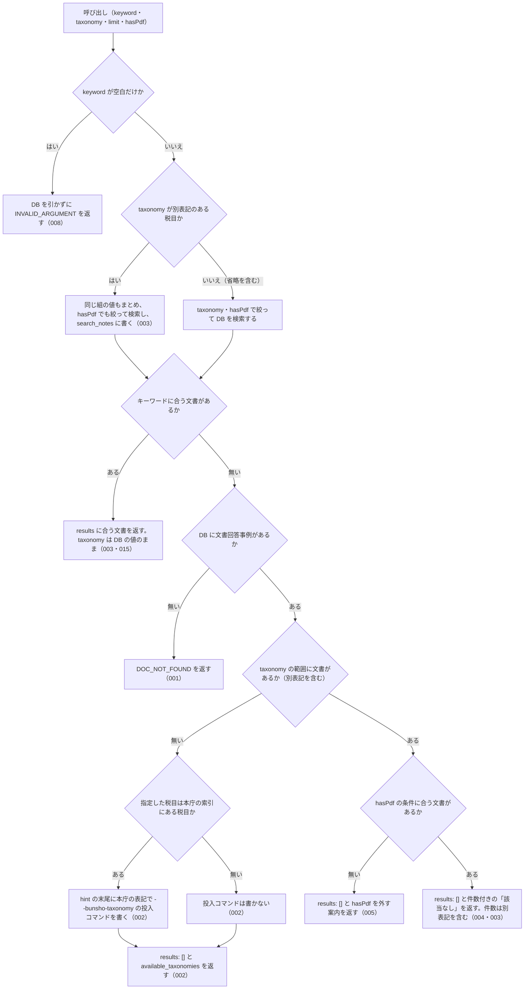

# nta_search_bunshokaitou

<!-- GENERATED FILE — 手で編集しない。説明と引数はサーバーの tools/list、呼び出し例は scripts/reference-examples/houki-nta/ja/nta_search_bunshokaitou.md、利用者と得られる結果・扱わないこと・処理の流れ・仕様項目の一覧は specs/current/nta_search_bunshokaitou/spec.md、使いどころは scripts/spec-pages/houki-nta/nta_search_bunshokaitou.md から。 -->

::: info
houki-nta-mcp **v0.27.0** の `tools/list` と `specs/current/nta_search_bunshokaitou/spec.md` から自動生成しました（仕様 ID 8 件・2026-10-10）。手で編集しないでください。再生成は `node scripts/generate-reference.mjs` です。
:::

文書回答事例（bunshokaitou）を FTS5 でキーワード検索する。事前に `--bulk-download-bunshokaitou` で DB 投入が必要。この種別の文書が DB に 1 件も無いときはエラー DOC_NOT_FOUND を返す（キーワードに合わないだけの 0 件は results: [] で返す）。

## 利用者と得られる結果

このツールの利用者と、利用者が渡すもの・得られる結果を示します。

- MCP クライアント（Claude などの LLM、または CLI から呼ぶ人）。`keyword` を渡して、ローカル DB に入っている国税庁の文書回答事例（本庁と国税局の両方）のうちキーワードに合うものの一覧（`docId`・題名・抜粋）を受け取る。本文は `nta_get_bunshokaitou` に `docId` を渡して読む

## 引数

呼び出すときに渡す値です。動いているサーバーの `tools/list` から写しています。

| 引数 | 型 | 必須 | 既定値 | 説明 |
|---|---|---|---|---|
| `keyword` | string (minLength 1) | **必須** |  | 検索キーワード。例: "電子帳簿", "適格請求書", "災害損失"。3 文字以上の語を推奨（FTS5 trigram のため）。2 文字の語は本文の部分一致で補完し、その旨を応答の search_notes に示す |
| `taxonomy` | string | 任意 |  | 税目で絞り込み。"shotoku" / "hojin" / "sozoku" / "gensen" / "joto-sanrin" / "shohi" 等（URL の税目フォルダ名）。国税局のページの別表記（"souzoku" / "gensenshotoku" / "joto_sanrin"）は、同じ税目としてまとめて検索する。値は列挙で検査しない。DB に無い値のときは available_taxonomies で正しい値を返す |
| `limit` | integer (1–50) | 任意 | `10` | 取得件数。1 以上 50 以下の整数（デフォルト: 10）。範囲の外は丸めずに INVALID_ARGUMENT |
| `hasPdf` | boolean | 任意 |  | 添付 PDF の有無で絞り込む（true=PDF 付き / false=PDF 無し / 未指定=絞らない）。回答書本文 PDF を持つ事例だけを抽出したい時に true を指定 |

::: tip 本文で検索できます（v0.10.3 以降）
v0.10.2 以前は表と別紙を取り込んでいなかったため、題名の語でしか当たりませんでした。いまは回答内容・関係する法令条項等・別紙の照会文まで検索の対象です。v0.10.2 以前に作った DB を使っている場合は `npx -y @shuji-bonji/houki-nta-mcp@latest --bulk-download-bunshokaitou --refresh` で再投入してください。
:::

## 呼び出し例

実際に呼び出したときの引数と応答です。版と日付は実測したときのものです。

::: details 呼び出し例 — 「産科医療の給付金に関する文書回答事例」
- 実測: v0.25.0（2026-10-05）
- 確かめた版: v0.27.0（2026-10-10）
- ローカル DB: あり（`staleness: "fresh"`）

**引数**

```jsonc
{ "keyword": "産科医療", "limit": 2 }
```

**返る JSON**

```jsonc
{
  "keyword": "産科医療",
  "results": [
    {
      "docType": "bunshokaitou",
      "docId": "shotoku/081102",
      "taxonomy": "shotoku",
      "title": "産科医療補償制度に基づき支払われる補償金の所得税法上の取扱いについて",
      "issuedAt": "2008-11-06",
      "basisDate": null,
      "sourceUrl": "https://www.nta.go.jp/law/bunshokaito/shotoku/081102/index.htm",
      "snippet": " … 施行令第30条\n添付書類: ・ <b>産科医療</b>補償制度標準補償約款 ・ <b>産科医療</b> … ",
      "score": 0.518,
      "scoreReasons": ["doc_type=bunshokaitou weight 0.90"],
      "index_status": null,
      "orphaned_at": null
    },
    {
      "docType": "bunshokaitou",
      "docId": "shotoku/250416",
      "taxonomy": "shotoku",
      "title": "産科医療特別給付事業に基づき支払われる給付金の所得税法上の取扱いについて",
      "issuedAt": "2025-04-07",
      "basisDate": null,
      "sourceUrl": "https://www.nta.go.jp/law/bunshokaito/shotoku/250416/index.htm",
      "snippet": " … 法施行令第30条\n添付書類: ・<b>産科医療</b>特別給付事業 実施要綱\n〔回答〕 … ",
      "score": 0.490,
      "scoreReasons": ["doc_type=bunshokaitou weight 0.90"],
      "index_status": null,
      "orphaned_at": null
    }
  ],
  "freshness": {
    "oldest_fetched_at": "2026-10-04T03:27:23.963Z",
    "newest_fetched_at": "2026-10-04T03:37:07.872Z",
    "staleness": "fresh",
    "days_since_oldest": 0,
    "db_path": "~/.cache/houki-nta-mcp/cache.db"
  },
  "legal_status": {
    "binds_citizens": false,
    "binds_courts": false,
    "binds_tax_office": false,
    "note": "文書回答事例は照会者・国税庁双方の合意に基づく個別事案回答であり、一般的な法的拘束力はない。同じ事案で同様の判断を期待することは可能だが、実務判断は通達・法令本文に基づく必要がある"
  }
}
```

`snippet` が添付書類の行から取れていることから、題名ではなく表の中身に当たっているのが分かります。`docId` をそのまま `nta_get_bunshokaitou` に渡せます。`basisDate`（文書の基準日）は文書回答事例には無いので `null` です。`index_status`・`orphaned_at` は、国税庁の索引から文書が消えたときに値が入ります。
:::

::: details 呼び出し例 — 別紙の本文にしかない語で引く
- 実測: v0.25.0（2026-10-05）
- 確かめた版: v0.27.0（2026-10-10）
- ローカル DB: あり（上の例と同じ DB。検索の対象はローカル DB だけ。SPEC-NTA-SEARCH-BUNSHOKAITOU-001）

「宇宙空間」は題名にも回答内容にもなく、別紙の照会文にだけ出てくる語です。

**引数**

```jsonc
{ "keyword": "宇宙空間", "limit": 3 }
```

**返る JSON（抜粋）**

```jsonc
{
  "keyword": "宇宙空間",
  "results": [
    {
      "docType": "bunshokaitou",
      "docId": "tokyo/shohi/251017",
      "taxonomy": "shohi",
      "title": "人工衛星打上げ輸送サービスに係る消費税の取扱いについて",
      "issuedAt": "2025-10-17",
      "basisDate": null,
      "sourceUrl": "https://www.nta.go.jp/about/organization/tokyo/bunshokaito/shohi/251017/index.htm",
      "snippet": " … を発射する機能を有する施設）より<b>宇宙空間</b>における所定の軌道に投入するまで … ",
      "score": 0.536,
      "scoreReasons": ["doc_type=bunshokaitou weight 0.90"],
      "index_status": null,
      "orphaned_at": null
    }
  ]
  // freshness / legal_status は上の例と同じ
}
```

キーワードに合う文書が無いときは、`results: []` と、検索した件数を書いた `hint`（例: 「該当なし。DB の文書回答事例（taxonomy="inshi"）6 件に「配当」に合う文書はありません」）が返ります（v0.13.0 から）。`taxonomy` に DB に無い税目を指定したときは、`available_taxonomies` に DB にある税目の一覧が入ります。文書回答事例が DB に 1 件も無いときは、エラー `DOC_NOT_FOUND` が返ります。
:::

::: details 呼び出し例 — 税目の別表記をまとめて検索する（`taxonomy: "sozoku"`）
- 実測: v0.25.0（2026-10-05）
- 確かめた版: v0.27.0（2026-10-10）
- ローカル DB: あり（`staleness: "fresh"`）

**引数**

```jsonc
{ "keyword": "小規模宅地等", "taxonomy": "sozoku", "limit": 5 }
```

**返る JSON**（抜粋）

```jsonc
{
  "keyword": "小規模宅地等",
  "results": [
    { "docId": "tokyo/souzoku/181207", "taxonomy": "souzoku", "title": "老人ホームに入居中に自宅を相続した場合の小規模宅地等についての相続税の課税価格の計算の特例（租税特別措置法第69条の4）の適用について", "issuedAt": "2018-12-07" },
    { "docId": "tokyo/souzoku/211224", "taxonomy": "souzoku", "title": "市街地再開発事業により中断した貸付事業を相続開始前3年以内に再開した場合の小規模宅地等についての相続税の課税価格の計算の特例（租税特別措置法第69条の4）の適用について", "issuedAt": "2021-11-26" },
    { "docId": "kantoshinetsu/sozoku/160822", "taxonomy": "sozoku", "title": "庭先部分を相続した場合の小規模宅地等についての相続税の課税価格の計算の特例（租税特別措置法第69条の4）の適用について", "issuedAt": "2016-08-22" }
    // docType / basisDate / sourceUrl / snippet / score / scoreReasons / index_status / orphaned_at は省略
  ],
  "search_notes": [
    "taxonomy=\"sozoku\" は、同じ税目の別表記 \"souzoku\" の文書もまとめて検索しました（国税局のページは本庁と違う税目フォルダ名を使うことがあるため）"
  ]
  // freshness は絞った税目の範囲（oldest 2026-10-04T03:31:32.294Z、fresh）。legal_status は上の例と同じ
}
```

国税局のページは本庁と違う税目フォルダ名を使うことがあり（東京局の `souzoku` など）、v0.13.0 までは `taxonomy: "sozoku"` で東京局の文書が出ませんでした。v0.14.0 からは、`sozoku` と `souzoku`、`gensen` と `gensenshotoku`、`joto-sanrin` と `joto_sanrin` をまとめて検索します。
:::

## 扱わないこと

このツールが意図して扱わないことです。

- 文書の本文を返すこと（結果は `docId`・題名・抜粋まで。本文は `nta_get_bunshokaitou`）
- 国税庁サイトに取りに行くこと（DB に無い文書は、`--bulk-download-bunshokaitou` をもう一度実行して取り込む）
- 発出日や国税局で絞り込むこと（絞り込めるのは `taxonomy` と `hasPdf` だけ。国税局の文書は `docId` の先頭（`tokyo/…` など）で見分ける）
- 索引から消えた文書を結果から除くこと（印を付けて返すだけ。未決 5）
- 回答が今の法令でも成り立つかを判定すること（`legal_status` は文書回答事例が個別事案への回答で一般的な法的拘束力を持たないことを示すだけ）

## 処理の流れ

仕様書の「処理の流れ」の節を、図も含めてそのまま写しています。図が大きいので畳んでいます。

::: details 処理の流れの図（仕様書の写し）
呼び出しを受けてから応答を返すまでに、何をどの順で確かめるかを示します。図の中の番号は「できること」の仕様 ID の末尾 3 桁です。


:::

## 仕様項目の一覧

このツールの仕様項目 8 件の見出しです。仕様項目は受入テストと 1 対 1 で対応していて、条件と例は[仕様書ページ](/specs/houki-nta/nta_search_bunshokaitou)で読めます。

::: details 仕様項目の見出し（8 件）
| 仕様 ID | 仕様項目 |
|---|---|
| [001](/specs/houki-nta/nta_search_bunshokaitou#spec-nta-search-bunshokaitou-001) | 文書回答事例が DB に 1 件も無いときは検索できないことをエラーで返す |
| [002](/specs/houki-nta/nta_search_bunshokaitou#spec-nta-search-bunshokaitou-002) | 税目の範囲に文書が無いときは税目の一覧と投入コマンドを案内する |
| [003](/specs/houki-nta/nta_search_bunshokaitou#spec-nta-search-bunshokaitou-003) | 税目の別表記をまとめて検索し、その旨を search_notes に書く |
| [004](/specs/houki-nta/nta_search_bunshokaitou#spec-nta-search-bunshokaitou-004) | キーワードに合う文書が無いときは件数付きの「該当なし」を返す |
| [005](/specs/houki-nta/nta_search_bunshokaitou#spec-nta-search-bunshokaitou-005) | `hasPdf` の条件に合う文書が無いときは `hasPdf` を外すよう案内する |
| [006](/specs/houki-nta/nta_search_bunshokaitou#spec-nta-search-bunshokaitou-006) | 0 件のときの `freshness` は、0 件の理由ごとに範囲を変える |
| [007](/specs/houki-nta/nta_search_bunshokaitou#spec-nta-search-bunshokaitou-007) | `limit` は 1 以上 50 以下の整数で、範囲の外は `INVALID_ARGUMENT` にして丸めない |
| [008](/specs/houki-nta/nta_search_bunshokaitou#spec-nta-search-bunshokaitou-008) | keyword が空文字・空白だけのときはDBを引かずに `INVALID_ARGUMENT` を返す |
:::

## 関連ページ

このページの元になった文書と、あわせて読むページです。

- [houki-nta-mcp の解説](/mcp/houki-nta)
- [houki-nta-mcp のツール一覧](/reference/mcp/houki-nta/)
- [nta_search_bunshokaitou の仕様書ページ](/specs/houki-nta/nta_search_bunshokaitou)
- [元の仕様書（GitHub、v0.27.0）](https://github.com/shuji-bonji/houki-nta-mcp/blob/v0.27.0/specs/current/nta_search_bunshokaitou/spec.md)
