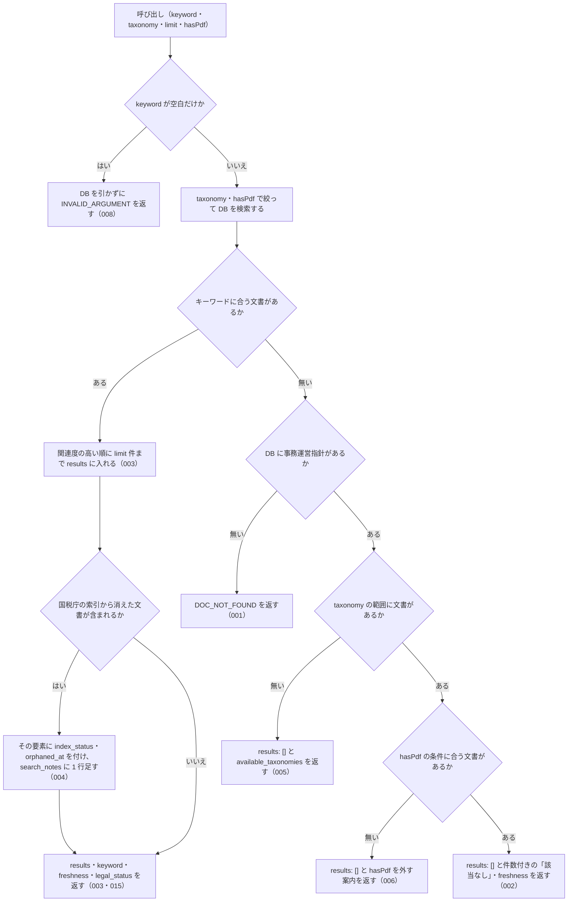

# nta_search_jimu_unei

<!-- GENERATED FILE — 手で編集しない。説明と引数はサーバーの tools/list、呼び出し例は scripts/reference-examples/houki-nta/ja/nta_search_jimu_unei.md、利用者と得られる結果・扱わないこと・処理の流れ・仕様項目の一覧は specs/current/nta_search_jimu_unei/spec.md、使いどころは scripts/spec-pages/houki-nta/nta_search_jimu_unei.md から。 -->

::: info
houki-nta-mcp **v0.27.0** の `tools/list` と `specs/current/nta_search_jimu_unei/spec.md` から自動生成しました（仕様 ID 8 件・2026-10-10）。手で編集しないでください。再生成は `node scripts/generate-reference.mjs` です。
:::

事務運営指針（jimu-unei）を FTS5 でキーワード検索する。事前に `--bulk-download-jimu-unei` で DB 投入が必要。この種別の文書が DB に 1 件も無いときはエラー DOC_NOT_FOUND を返す（キーワードに合わないだけの 0 件は results: [] で返す）。

## 利用者と得られる結果

このツールの利用者と、利用者が渡すもの・得られる結果を示します。

- MCP クライアント（Claude などの LLM、または CLI から呼ぶ人）。`keyword` を渡して、ローカル DB に入っている国税庁の事務運営指針のうちキーワードに合うものの一覧（`docId`・題名・抜粋）を受け取り、`nta_get_jimu_unei` で本文を読む前の当たりを付ける

## 引数

呼び出すときに渡す値です。動いているサーバーの `tools/list` から写しています。

| 引数 | 型 | 必須 | 既定値 | 説明 |
|---|---|---|---|---|
| `keyword` | string (minLength 1) | **必須** |  | 検索キーワード。例: "書面添付", "重加算税"。3 文字以上の語を推奨（FTS5 trigram のため）。2 文字の語は本文の部分一致で補完し、その旨を応答の search_notes に示す |
| `taxonomy` | string | 任意 |  | 税目で絞り込み。例: "shotoku" / "hojin" / "sozoku" / "shohi"。値は列挙で検査しない。DB に無い値のときは available_taxonomies で正しい値を返す |
| `limit` | integer (1–50) | 任意 | `10` | 取得件数。1 以上 50 以下の整数（デフォルト: 10）。範囲の外は丸めずに INVALID_ARGUMENT |
| `hasPdf` | boolean | 任意 |  | 添付 PDF の有無で絞り込む（true=PDF 付き / false=PDF 無し / 未指定=絞らない）。別紙・別表 PDF を伴う指針だけを抽出したい時に true を指定 |

## 呼び出し例

実際に呼び出したときの引数と応答です。版と日付は実測したときのものです。

::: details 呼び出し例 — 「書面添付制度の事務運営指針」
- 実測: v0.25.0（2026-10-05）
- ローカル DB: あり（`staleness: "fresh"`）

**引数**

```jsonc
{ "keyword": "書面添付", "limit": 2 }
```

**返る JSON**

```jsonc
{
  "keyword": "書面添付",
  "results": [
    {
      "docType": "jimu-unei",
      "docId": "hojin/090401-2",
      "taxonomy": "hojin",
      "title": "調査課における書面添付制度の運用に当たっての基本的な考え方及び事務手続等について（事務運営指針）",
      "issuedAt": "2009-04-01",
      "basisDate": null,
      "sourceUrl": "https://www.nta.go.jp/law/jimu-unei/hojin/090401-2/01.htm",
      "snippet": " … の一部改正に伴う調査課における新<b>書面添付</b>制度の運用に当たっての基本的な考 … ",
      "score": 0.463,
      "scoreReasons": ["doc_type=jimu-unei weight 0.85"],
      "index_status": null,
      "orphaned_at": null
    },
    {
      "docType": "jimu-unei",
      "docId": "shotoku/shinkoku/090401",
      "taxonomy": "shotoku",
      "title": "個人課税部門における書面添付制度の運用に当たっての基本的な考え方及び事務手続等について(事務運営指針)",
      "issuedAt": "2009-04-01",
      "sourceUrl": "https://www.nta.go.jp/law/jimu-unei/shotoku/shinkoku/090401/01.htm",
      "score": 0.446 /* … */
    }
  ],
  "freshness": {
    "oldest_fetched_at": "2026-10-04T03:26:38.243Z",
    "newest_fetched_at": "2026-10-04T03:27:13.440Z",
    "staleness": "fresh",
    "days_since_oldest": 0,
    "db_path": "~/.cache/houki-nta-mcp/cache.db"
  },
  "legal_status": {
    "binds_citizens": false,
    "binds_courts": false,
    "binds_tax_office": true,
    "note": "通達・事務運営指針は行政内部文書であり、納税者・裁判所には直接的拘束力なし。ただし税務署員は職務として守る義務あり（最高裁 昭和43.12.24）"
  }
}
```

`docId` は `税目/日付` の形（`hojin/090401-2`）か `税目/…/日付` の形（`shotoku/shinkoku/090401`）で、そのまま `nta_get_jimu_unei` に渡します。書面添付制度の事務運営指針は部門ごとに 5 件あり（調査課・個人課税・酒税・法人課税・資産税）、2 件目以降は score がほぼ同じ（0.446〜0.441）なので、DB を取り込み直すと順が入れ替わることがあります。事務運営指針は通達と同じく税務職員を拘束し、国民は拘束しません（`binds_tax_office: true`）。
:::

## 扱わないこと

このツールが意図して扱わないことです。

- 国税庁サイトに取りに行くこと（DB に無い文書は `--bulk-download-jimu-unei` で入れてから検索する）
- 事務運営指針の本文を返すこと（本文は `nta_get_jimu_unei` に `docId` を渡して読む）
- 添付 PDF の中身を検索すること（`hasPdf` は PDF の有無で絞るだけ。PDF の中身は `nta_inspect_pdf_meta` と pdf-reader-mcp で読む）
- キーワードに合う文書の総数を返すこと（`results` は `limit` 件まで。件数を書くのは 0 件のときの `hint` だけ）
- 改正通達・文書回答事例・質疑応答事例を一緒に検索すること（種別ごとに別のツール）
- 事務運営指針が今も有効かを判定すること（`index_status` は国税庁の索引に載っているかどうかを表すだけ）

## 処理の流れ

仕様書の「処理の流れ」の節を、図も含めてそのまま写しています。図が大きいので畳んでいます。

::: details 処理の流れの図（仕様書の写し）
呼び出しを受けてから応答を返すまでに、何をどの順で確かめるかを示します。図の中の番号は「できること」の仕様 ID の末尾 3 桁です。


:::

## 仕様項目の一覧

このツールの仕様項目 8 件の見出しです。仕様項目は受入テストと 1 対 1 で対応していて、条件と例は[仕様書ページ](/specs/houki-nta/nta_search_jimu_unei)で読めます。

::: details 仕様項目の見出し（8 件）
| 仕様 ID | 仕様項目 |
|---|---|
| [001](/specs/houki-nta/nta_search_jimu_unei#spec-nta-search-jimu-unei-001) | DB に事務運営指針が 1 件も無いときはエラー DOC_NOT_FOUND を返す |
| [002](/specs/houki-nta/nta_search_jimu_unei#spec-nta-search-jimu-unei-002) | 事務運営指針はあるがキーワードに合わないときは成功で「該当なし」を返す |
| [003](/specs/houki-nta/nta_search_jimu_unei#spec-nta-search-jimu-unei-003) | キーワードに合う事務運営指針を results に返す |
| [004](/specs/houki-nta/nta_search_jimu_unei#spec-nta-search-jimu-unei-004) | 国税庁の索引から消えた文書は除外せず、印と注記を付ける |
| [005](/specs/houki-nta/nta_search_jimu_unei#spec-nta-search-jimu-unei-005) | `taxonomy` の範囲に文書が無いときは税目の一覧を返す |
| [006](/specs/houki-nta/nta_search_jimu_unei#spec-nta-search-jimu-unei-006) | `hasPdf` の条件に合う文書が無いときは `hasPdf` を外すよう案内する |
| [007](/specs/houki-nta/nta_search_jimu_unei#spec-nta-search-jimu-unei-007) | `limit` は 1 以上 50 以下の整数で、範囲の外は `INVALID_ARGUMENT` にして丸めない |
| [008](/specs/houki-nta/nta_search_jimu_unei#spec-nta-search-jimu-unei-008) | keyword が空文字・空白だけのときはDBを引かずに `INVALID_ARGUMENT` を返す |
:::

## 関連ページ

このページの元になった文書と、あわせて読むページです。

- [houki-nta-mcp の解説](/mcp/houki-nta)
- [houki-nta-mcp のツール一覧](/reference/mcp/houki-nta/)
- [nta_search_jimu_unei の仕様書ページ](/specs/houki-nta/nta_search_jimu_unei)
- [元の仕様書（GitHub、v0.27.0）](https://github.com/shuji-bonji/houki-nta-mcp/blob/v0.27.0/specs/current/nta_search_jimu_unei/spec.md)
