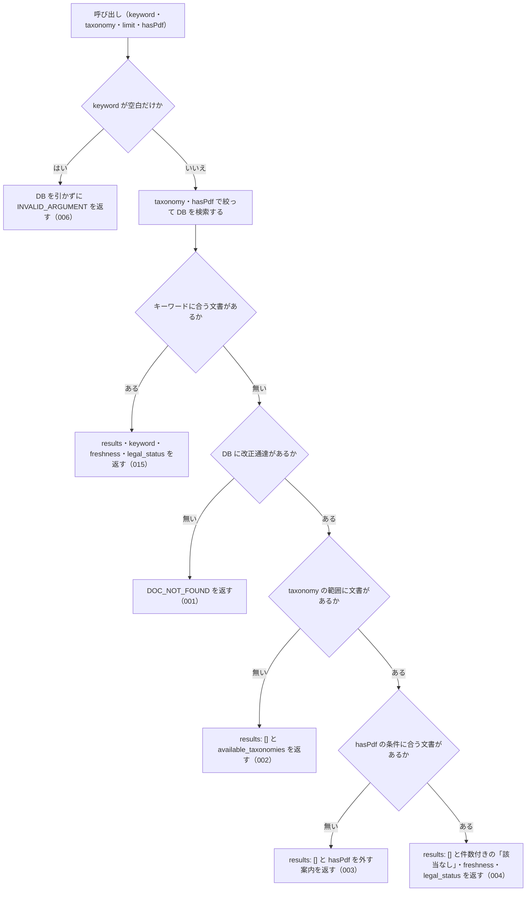

# nta_search_kaisei_tsutatsu

<!-- GENERATED FILE — 手で編集しない。説明と引数はサーバーの tools/list、呼び出し例は scripts/reference-examples/houki-nta/ja/nta_search_kaisei_tsutatsu.md、利用者と得られる結果・扱わないこと・処理の流れ・仕様項目の一覧は specs/current/nta_search_kaisei_tsutatsu/spec.md、使いどころは scripts/spec-pages/houki-nta/nta_search_kaisei_tsutatsu.md から。 -->

::: info
houki-nta-mcp **v0.27.0** の `tools/list` と `specs/current/nta_search_kaisei_tsutatsu/spec.md` から自動生成しました（仕様 ID 6 件・2026-10-10）。手で編集しないでください。再生成は `node scripts/generate-reference.mjs` です。
:::

改正通達（一部改正通達）を FTS5 でキーワード検索する。事前に `--bulk-download-kaisei` で DB 投入が必要。この種別の文書が DB に 1 件も無いときはエラー DOC_NOT_FOUND を返す（キーワードに合わないだけの 0 件は results: [] で返す）。

## 利用者と得られる結果

このツールの利用者と、利用者が渡すもの・得られる結果を示します。

- MCP クライアント（Claude などの LLM、または CLI から呼ぶ人）。`keyword` を渡して、ローカル DB に取り込んである国税庁の改正通達（一部改正通達）のうち、キーワードに合う文書の一覧（文書 ID・題名・発遣日・出典 URL・抜粋）を受け取る。本文は `nta_get_kaisei_tsutatsu` で別に取る

## 引数

呼び出すときに渡す値です。動いているサーバーの `tools/list` から写しています。

| 引数 | 型 | 必須 | 既定値 | 説明 |
|---|---|---|---|---|
| `keyword` | string (minLength 1) | **必須** |  | 検索キーワード。例: "電子帳簿", "インボイス", "軽減税率"。3 文字以上の語を推奨（FTS5 trigram のため）。2 文字の語は本文の部分一致で補完し、その旨を応答の search_notes に示す |
| `taxonomy` | string | 任意 |  | 税目フォルダで絞り込み。例: "shohi" / "shotoku" / "hojin" / "sisan/sozoku"。値は列挙で検査しない。DB に無い値のときは available_taxonomies で正しい値を返す |
| `limit` | integer (1–50) | 任意 | `10` | 取得件数。1 以上 50 以下の整数（デフォルト: 10）。範囲の外は丸めずに INVALID_ARGUMENT |
| `hasPdf` | boolean | 任意 |  | 添付 PDF の有無で絞り込む（true=PDF 付き / false=PDF 無し / 未指定=絞らない）。改正通達は新旧対照表 PDF を持つことが多く、改正点だけ知りたい時は true 推奨 |

::: tip 改正点だけ知りたいときは `hasPdf: true`
改正通達の本文は「別紙のとおり改める」という短い文で、実際の差分は新旧対照表の PDF にあります。`hasPdf: true` で PDF 付きの文書に絞り、`docId` を `nta_inspect_pdf_meta` に渡すと PDF の一覧と読み方の例が返ります。
:::

## 呼び出し例

実際に呼び出したときの引数と応答です。版と日付は実測したときのものです。

::: details 呼び出し例 — 「インボイス関係の改正通達を新旧対照表付きで」
- 実測: v0.25.0（2026-10-05）
- ローカル DB: あり（`staleness: "fresh"`）

**引数**

```jsonc
{ "keyword": "インボイス", "hasPdf": true, "limit": 2 }
```

**返る JSON**

```jsonc
{
  "keyword": "インボイス",
  "results": [
    {
      "docType": "kaisei",
      "docId": "0025004-026",
      "taxonomy": "shohi",
      "title": "消費税法基本通達の一部改正について（法令解釈通達）",
      "issuedAt": "2025-04-01",
      "basisDate": null,
      "sourceUrl": "https://www.nta.go.jp/law/tsutatsu/kihon/shohi/kaisei/0025004-026/index.htm",
      "snippet": " …  殿\n国税庁長官 （官印省略）\n<b>消費税法</b>基本通達（平成7年12月25日付 … ",
      "score": 0.250,
      "scoreReasons": ["doc_type=kaisei weight 0.95", "abbreviation expanded: インボイス → 消費税法"],
      "index_status": null,
      "orphaned_at": null
    },
    {
      "docType": "kaisei",
      "docId": "191001",
      "taxonomy": "shohi",
      "title": "消費税法基本通達の一部改正について（法令解釈通達）",
      "issuedAt": "2019-10-01",
      "sourceUrl": "https://www.nta.go.jp/law/tsutatsu/kihon/shohi/kaisei/191001/index.htm",
      "score": 0.248 /* … */
    }
  ],
  "freshness": {
    "oldest_fetched_at": "2026-10-04T03:24:14.576Z",
    "newest_fetched_at": "2026-10-04T03:26:38.132Z",
    "staleness": "fresh",
    "days_since_oldest": 0,
    "db_path": "~/.cache/houki-nta-mcp/cache.db"
  },
  "search_notes": [
    "\"インボイス\" を含む文書は見つかりませんでした。略称辞書で \"インボイス\" は 消費税法 の通称として登録されているため、\"消費税法\" を含む文書に広げて検索しました。\"消費税法\" という語が出てくるだけの文書も含まれます"
  ],
  "legal_status": {
    "binds_citizens": false,
    "binds_courts": false,
    "binds_tax_office": true,
    "note": "通達は行政内部文書。納税者・裁判所には直接的拘束力なし。ただし税務署員は職務として守る義務あり（最高裁 昭和43.12.24）"
  }
}
```

「インボイス」という語を含む改正通達は無いので、略称辞書で通称として登録されている「消費税法」に広げて検索しています。そのことは `search_notes` と `scoreReasons` の `abbreviation expanded` に出ます。`basisDate`・`index_status`・`orphaned_at` は、改正通達では `null` です（索引から消えた文書では `orphaned_at` に日時が入ります）。

`docId` には新形式（`0025004-026`）と旧形式（`191001`）が混在します。どちらもそのまま `nta_get_kaisei_tsutatsu` に渡せます。
:::

## 扱わないこと

このツールが意図して扱わないことです。

- 国税庁サイトから改正通達を取ること（DB に無い文書は検索に出ない。取り込みは `--bulk-download-kaisei`）
- 改正通達の本文や添付 PDF の内容を返すこと（本文は `nta_get_kaisei_tsutatsu`、PDF の一覧は `nta_inspect_pdf_meta`）
- 基本通達の条項を検索すること（`nta_search_tsutatsu`）。事務運営指針・文書回答事例・質疑応答事例・タックスアンサーも別のツール
- 改正後の通達の本文を組み立てること、改正が今も有効かを判定すること
- 発遣日や文書 ID で絞り込むこと（絞り込めるのは `taxonomy` と `hasPdf` だけ）

## 処理の流れ

仕様書の「処理の流れ」の節を、図も含めてそのまま写しています。図が大きいので畳んでいます。

::: details 処理の流れの図（仕様書の写し）
呼び出しを受けてから応答を返すまでに、何をどの順で確かめるかを示します。図の中の番号は「できること」の仕様 ID の末尾 3 桁です。


:::

## 仕様項目の一覧

このツールの仕様項目 6 件の見出しです。仕様項目は受入テストと 1 対 1 で対応していて、条件と例は[仕様書ページ](/specs/houki-nta/nta_search_kaisei_tsutatsu)で読めます。

::: details 仕様項目の見出し（6 件）
| 仕様 ID | 仕様項目 |
|---|---|
| [001](/specs/houki-nta/nta_search_kaisei_tsutatsu#spec-nta-search-kaisei-tsutatsu-001) | DB に改正通達が 1 件も無いときは検索せずにエラーを返す |
| [002](/specs/houki-nta/nta_search_kaisei_tsutatsu#spec-nta-search-kaisei-tsutatsu-002) | taxonomy で絞った範囲に文書が無いときは税目の一覧を返す |
| [003](/specs/houki-nta/nta_search_kaisei_tsutatsu#spec-nta-search-kaisei-tsutatsu-003) | hasPdf の条件に合う文書が無いときは hasPdf を外すよう案内する |
| [004](/specs/houki-nta/nta_search_kaisei_tsutatsu#spec-nta-search-kaisei-tsutatsu-004) | 文書はあるがキーワードに合わないときは「該当なし」と件数を返す |
| [005](/specs/houki-nta/nta_search_kaisei_tsutatsu#spec-nta-search-kaisei-tsutatsu-005) | `limit` は 1 以上 50 以下の整数で、範囲の外は `INVALID_ARGUMENT` にして丸めない |
| [006](/specs/houki-nta/nta_search_kaisei_tsutatsu#spec-nta-search-kaisei-tsutatsu-006) | keyword が空文字・空白だけのときはDBを引かずに `INVALID_ARGUMENT` を返す |
:::

## 関連ページ

このページの元になった文書と、あわせて読むページです。

- [houki-nta-mcp の解説](/mcp/houki-nta)
- [houki-nta-mcp のツール一覧](/reference/mcp/houki-nta/)
- [nta_search_kaisei_tsutatsu の仕様書ページ](/specs/houki-nta/nta_search_kaisei_tsutatsu)
- [元の仕様書（GitHub、v0.27.0）](https://github.com/shuji-bonji/houki-nta-mcp/blob/v0.27.0/specs/current/nta_search_kaisei_tsutatsu/spec.md)
