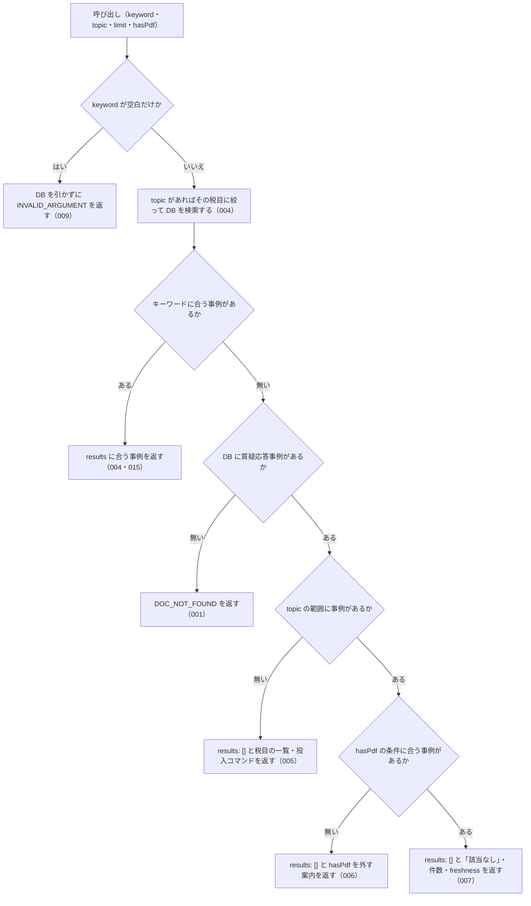

# nta_search_qa

<!-- GENERATED FILE — 手で編集しない。説明と引数はサーバーの tools/list、呼び出し例は scripts/reference-examples/houki-nta/ja/nta_search_qa.md、利用者と得られる結果・扱わないこと・処理の流れ・仕様項目の一覧は specs/current/nta_search_qa/spec.md、使いどころは scripts/spec-pages/houki-nta/nta_search_qa.md から。 -->

::: info
houki-nta-mcp **v0.27.0** の `tools/list` と `specs/current/nta_search_qa/spec.md` から自動生成しました（仕様 ID 8 件・2026-10-10）。手で編集しないでください。再生成は `node scripts/generate-reference.mjs` です。
:::

国税庁の質疑応答事例（9 税目: 所得税/源泉所得税/譲渡所得/相続税・贈与税/財産の評価/法人税/消費税/印紙税/法定調書）を FTS5 でキーワード検索する。事前に `--bulk-download-qa` で DB 投入が必要。この種別の文書が DB に 1 件も無いときはエラー DOC_NOT_FOUND を返す（キーワードに合わないだけの 0 件は results: [] で返す）。

## 利用者と得られる結果

このツールの利用者と、利用者が渡すもの・得られる結果を示します。

- MCP クライアント（Claude などの LLM、または CLI から呼ぶ人）。`keyword` を渡して、ローカル DB に取り込んである国税庁の質疑応答事例（9 税目）のうち、キーワードに合う事例の一覧（題名・事例の番号・出典 URL・抜粋）を受け取る。事例の本文は `nta_get_qa` で読む

## 引数

呼び出すときに渡す値です。動いているサーバーの `tools/list` から写しています。

| 引数 | 型 | 必須 | 既定値 | 説明 |
|---|---|---|---|---|
| `keyword` | string (minLength 1) | **必須** |  | 検索キーワード。例: "社内会議 軽減税率", "テレワーク 必要経費"。3 文字以上の語を推奨（FTS5 trigram のため）。2 文字の語は本文の部分一致で補完し、その旨を応答の search_notes に示す |
| `topic` | `"shotoku"` \| `"gensen"` \| `"joto"` \| `"sozoku"` \| `"hyoka"` \| `"hojin"` \| `"shohi"` \| `"inshi"` \| `"hotei"` | 任意 |  | 税目で絞り込み。shotoku=所得税 / gensen=源泉所得税 / joto=譲渡所得 / sozoku=相続税・贈与税 / hyoka=財産の評価 / hojin=法人税 / shohi=消費税 / inshi=印紙税 / hotei=法定調書 |
| `limit` | integer (1–50) | 任意 | `10` | 取得件数。1 以上 50 以下の整数（デフォルト: 10）。範囲の外は丸めずに INVALID_ARGUMENT |
| `hasPdf` | boolean | 任意 |  | 添付 PDF の有無で絞り込む（true=PDF 付き / false=PDF 無し / 未指定=絞らない）。質疑応答事例は現状すべて HTML のみで PDF を持たないため true 指定時は空配列になる |

## 呼び出し例

実際に呼び出したときの引数と応答です。版と日付は実測したときのものです。

::: details 呼び出し例 — 「テレワークに関係する質疑応答事例」
- 実測: v0.25.0（2026-10-05）
- ローカル DB: あり（`staleness: "fresh"`）

**引数**

```jsonc
{ "keyword": "テレワーク", "limit": 2 }
```

**返る JSON**

```jsonc
{
  "keyword": "テレワーク",
  "results": [
    {
      "docType": "qa-jirei",
      "docId": "hojin/04/16",
      "taxonomy": "hojin",
      "title": "中小企業者等が取得をした働き方改革に資する減価償却資産の中小企業経営強化税制（租税特別措置法第42条の12の4）の適用について",
      "issuedAt": null,
      "basisDate": null,
      "sourceUrl": "https://www.nta.go.jp/law/shitsugi/hojin/04/16.htm",
      "snippet": " … 活動の用に直接供される器具備品（<b>テレワーク</b>用電子計算機等）、ソフトウエア（ … ",
      "score": 0.341,
      "scoreReasons": ["doc_type=qa weight 0.70"],
      "index_status": null,
      "orphaned_at": null
    }
  ],
  "freshness": {
    "oldest_fetched_at": "2026-10-04T03:51:26.746Z",
    "newest_fetched_at": "2026-10-04T04:26:15.744Z",
    "staleness": "fresh",
    "days_since_oldest": 0,
    "db_path": "~/.cache/houki-nta-mcp/cache.db"
  },
  "legal_status": {
    "binds_citizens": false,
    "binds_courts": false,
    "binds_tax_office": false,
    "note": "タックスアンサー・質疑応答事例は国税庁の参考解説資料。法的拘束力はなく、実務判断は通達・法令本文に基づく必要がある"
  }
}
```

`docId` の `hojin/04/16` は、`nta_get_qa` の `topic` / `category` / `id` にそのまま分かれます。質疑応答事例は PDF を持たないので、`hasPdf: true` を付けると `results: []` と、`hint`「DB の質疑応答事例 1,841 件に、PDF 付きの文書はありません。hasPdf を外して検索してください」が返ります。`issuedAt`・`basisDate` は質疑応答事例の検索結果では `null` です（基準日は `nta_get_qa` の `qa.basisDate` で読めます）。
:::

::: details 呼び出し例 — 税目（topic）で絞る
- 実測: v0.25.0（2026-10-05）
- ローカル DB: あり（`staleness: "fresh"`）

**引数**

```jsonc
{ "keyword": "軽減税率", "topic": "shohi", "limit": 3 }
```

**返る JSON**

```jsonc
{
  "keyword": "軽減税率",
  "results": [
    {
      "docType": "qa-jirei",
      "docId": "shohi/21/10",
      "taxonomy": "shohi",
      "title": "令和元年10月1日前の借入金の返済に充てる補助金の交付を受けた場合",
      "issuedAt": null,
      "basisDate": null,
      "sourceUrl": "https://www.nta.go.jp/law/shitsugi/shohi/21/10.htm",
      "snippet": " … は、原則として消費税率7.8％（<b>軽減税率</b>が適用される課税仕入れ等に係る支 … ",
      "score": 0.199,
      "scoreReasons": ["doc_type=qa weight 0.70"],
      "index_status": null,
      "orphaned_at": null
    }
  ],
  "freshness": {
    "oldest_fetched_at": "2026-10-04T04:15:37.962Z",
    "newest_fetched_at": "2026-10-04T04:20:45.581Z",
    "staleness": "fresh",
    "days_since_oldest": 0,
    "db_path": "~/.cache/houki-nta-mcp/cache.db"
  }
  // legal_status は上の例と同じ
}
```

`topic` は `--qa-topic` と同じ値（`shotoku` / `gensen` / `joto` / `sozoku` / `hyoka` / `hojin` / `shohi` / `inshi` / `hotei`）です。`freshness` は、絞り込んだ税目の文書の取得時点を示します。
分野の引数 `domain` は v0.24.0 で外しました。渡すと `INVALID_ARGUMENT`（`detail.issues[0].path: "domain"`）になるので、税目で絞るときは `topic` を使います（v0.23.x までは `domain: "tax"` を受け付けて、省いたときと同じ結果を返していました）。
:::

::: details 呼び出し例 — キーワードに合う文書が無いとき
- 実測: v0.25.0（2026-10-05）
- ローカル DB: あり（質疑応答事例 1,841 件）

**引数**

```jsonc
{ "keyword": "異なる課税関係が生ずる" }
```

**返る JSON**

```jsonc
{
  "results": [],
  "keyword": "異なる課税関係が生ずる",
  "hint": "該当なし。DB の質疑応答事例 1,841 件に「異なる課税関係が生ずる」に合う文書はありません。別のキーワードで試してください",
  "freshness": {
    "oldest_fetched_at": "2026-10-04T03:51:26.746Z",
    "newest_fetched_at": "2026-10-04T04:26:15.744Z",
    "staleness": "fresh",
    "days_since_oldest": 0,
    "db_path": "~/.cache/houki-nta-mcp/cache.db"
  }
  // legal_status は上の例と同じ
}
```

この語はページ下部の注記の文言で、v0.12.0 から注記は本文から外しているので 0 件になります。`hint` の件数で、DB に質疑応答事例が入っていることが分かります。
質疑応答事例が DB に 1 件も無いときは、`results: []` ではなくエラー `DOC_NOT_FOUND` が返ります。`hint` は DB の状態ごとに先頭の文が変わり、どれも開こうとした DB のパス（ホームは `~`）を含みます（v0.25.0 から）。DB のファイルが無いときは「ローカル DB（~/.cache/houki-nta-mcp/cache.db）がありません。…」、質疑応答事例だけが無いときは「ローカル DB（~/.cache/houki-nta-mcp/cache.db）に質疑応答事例（doc_type="qa-jirei"）が入っていません。…」で始まります。`next_actions` の `example.command` は `npx -y @shuji-bonji/houki-nta-mcp@latest --bulk-download-qa` です。
:::

## 扱わないこと

このツールが意図して扱わないことです。

- 事例の本文（照会要旨・回答要旨・関係法令通達）を返すこと（`results` の `docId` を `nta_get_qa` の `topic` / `category` / `id` に分けて読む）
- 国税庁サイトを直接検索すること（DB に無い事例は見つからない。`--bulk-download-qa` で取り込む）
- 件数の合計（`total`）やページ送りを返すこと（`limit` 件までを返す）
- 分野（`domain`）を指定すること（質疑応答事例はすべて税務。税目は `topic` で絞る）
- 添付 PDF 付きの事例を返すこと（質疑応答事例は PDF を持たない）

## 処理の流れ

仕様書の「処理の流れ」の節を、図も含めてそのまま写しています。図が大きいので畳んでいます。

::: details 処理の流れの図（仕様書の写し）
呼び出しを受けてから応答を返すまでに、何をどの順で確かめるかを示します。図の中の番号は「できること」の仕様 ID の末尾 3 桁です。


:::

## 仕様項目の一覧

このツールの仕様項目 8 件の見出しです。仕様項目は受入テストと 1 対 1 で対応していて、条件と例は[仕様書ページ](/specs/houki-nta/nta_search_qa)で読めます。

::: details 仕様項目の見出し（8 件）
| 仕様 ID | 仕様項目 |
|---|---|
| [001](/specs/houki-nta/nta_search_qa#spec-nta-search-qa-001) | 質疑応答事例が DB に 1 件も無いときはエラー `DOC_NOT_FOUND` |
| [004](/specs/houki-nta/nta_search_qa#spec-nta-search-qa-004) | `topic` で税目を絞る |
| [005](/specs/houki-nta/nta_search_qa#spec-nta-search-qa-005) | `topic` の範囲に事例が 1 件も無いときは税目の一覧と投入コマンドを案内する |
| [006](/specs/houki-nta/nta_search_qa#spec-nta-search-qa-006) | `hasPdf` の条件に合う事例が無いときは `hasPdf` を外すよう案内する |
| [007](/specs/houki-nta/nta_search_qa#spec-nta-search-qa-007) | キーワードに合う事例が無いときは「該当なし」と件数・`freshness` を返す |
| [008](/specs/houki-nta/nta_search_qa#spec-nta-search-qa-008) | `limit` は 1 以上 50 以下の整数で、範囲の外は `INVALID_ARGUMENT` にして丸めない |
| [009](/specs/houki-nta/nta_search_qa#spec-nta-search-qa-009) | keyword が空文字・空白だけのときはDBを引かずに `INVALID_ARGUMENT` を返す |
| [010](/specs/houki-nta/nta_search_qa#spec-nta-search-qa-010) | `domain` は受け付けず、渡すと DB を引かずに `INVALID_ARGUMENT` を返す |
:::

## 関連ページ

このページの元になった文書と、あわせて読むページです。

- [houki-nta-mcp の解説](/mcp/houki-nta)
- [houki-nta-mcp のツール一覧](/reference/mcp/houki-nta/)
- [nta_search_qa の仕様書ページ](/specs/houki-nta/nta_search_qa)
- [元の仕様書（GitHub、v0.27.0）](https://github.com/shuji-bonji/houki-nta-mcp/blob/v0.27.0/specs/current/nta_search_qa/spec.md)
