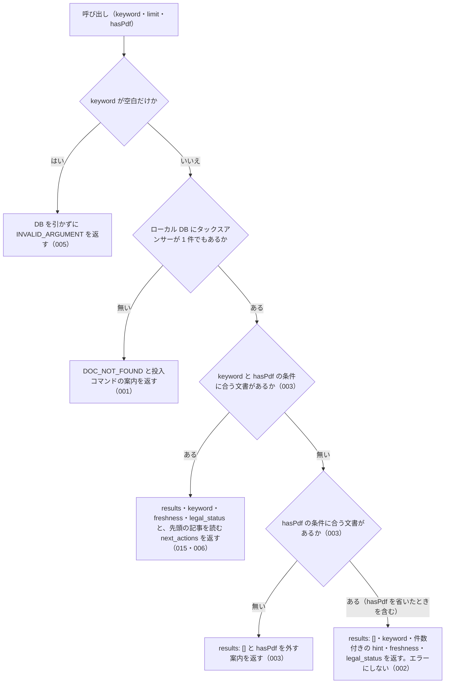

# nta_search_tax_answer

<!-- GENERATED FILE — 手で編集しない。説明と引数はサーバーの tools/list、呼び出し例は scripts/reference-examples/houki-nta/ja/nta_search_tax_answer.md、利用者と得られる結果・扱わないこと・処理の流れ・仕様項目の一覧は specs/current/nta_search_tax_answer/spec.md、使いどころは scripts/spec-pages/houki-nta/nta_search_tax_answer.md から。 -->

::: info
houki-nta-mcp **v0.27.0** の `tools/list` と `specs/current/nta_search_tax_answer/spec.md` から自動生成しました（仕様 ID 6 件・2026-10-10）。手で編集しないでください。再生成は `node scripts/generate-reference.mjs` です。
:::

タックスアンサー（一般納税者向け解説、約 750 件）を FTS5 でキーワード検索する。事前に `--bulk-download-tax-answer` で DB 投入が必要。この種別の文書が DB に 1 件も無いときはエラー DOC_NOT_FOUND を返す（キーワードに合わないだけの 0 件は results: [] で返す）。

## 利用者と得られる結果

このツールの利用者と、利用者が渡すもの・得られる結果を示します。

- MCP クライアント（Claude などの LLM、または CLI から呼ぶ人）。`keyword` を渡して、ローカル DB に入っている国税庁のタックスアンサー（一般納税者向けの解説、約 750 件）のうちキーワードに合うものの一覧（番号・題名・出典 URL・抜粋）を受け取る。本文は `nta_get_tax_answer` で番号を指定して取る

## 引数

呼び出すときに渡す値です。動いているサーバーの `tools/list` から写しています。

| 引数 | 型 | 必須 | 既定値 | 説明 |
|---|---|---|---|---|
| `keyword` | string (minLength 1) | **必須** |  | 検索キーワード。例: "ふるさと納税", "医療費控除"。3 文字以上の語を推奨（FTS5 trigram のため）。2 文字の語は本文の部分一致で補完し、その旨を応答の search_notes に示す |
| `limit` | integer (1–50) | 任意 | `10` | 取得件数。1 以上 50 以下の整数（デフォルト: 10）。範囲の外は丸めずに INVALID_ARGUMENT |
| `hasPdf` | boolean | 任意 |  | 添付 PDF の有無で絞り込む（true=PDF 付き / false=PDF 無し / 未指定=絞らない）。様式・別表系の説明など PDF 添付がある重要トピックを抽出したい時に true を指定 |

## 呼び出し例

実際に呼び出したときの引数と応答です。版と日付は実測したときのものです。

::: details 呼び出し例 — 「医療費控除のタックスアンサー」
- 実測: v0.25.1（2026-10-05。タックスアンサーを `--bulk-download-tax-answer --refresh` で入れ直した DB）
- ローカル DB: あり（`staleness: "fresh"`。国税庁の索引から消えた記事が 1 件ある DB）
- 照合: `results` は 1 件目だけ（2 件目以降は score がほぼ同じで、DB を取り込み直すと順が入れ替わる）

**引数**

```jsonc
{ "keyword": "医療費控除", "limit": 2 }
```

**返る JSON**

```jsonc
{
  "keyword": "医療費控除",
  "results": [
    {
      "docType": "tax-answer",
      "docId": "1131",
      "taxonomy": "shotoku",
      "title": "セルフメディケーション税制と通常の医療費控除との選択適用",
      "issuedAt": null,
      "basisDate": "2026-04-01",
      "sourceUrl": "https://www.nta.go.jp/taxes/shiraberu/taxanswer/shotoku/1131.htm",
      "snippet": " … ルフメディケーション税制と通常の<b>医療費控除</b>との選択適用\n\n[令和8年4月1 … ",
      "score": 0.2529,
      "scoreReasons": ["doc_type=tax-answer weight 0.60"],
      "index_status": null,
      "orphaned_at": null
    },
    {
      "docType": "tax-answer",
      "docId": "1127",
      "taxonomy": "shotoku",
      "title": "医療費控除の対象となる介護保険制度下での居宅サービス等の対価",
      "sourceUrl": "https://www.nta.go.jp/taxes/shiraberu/taxanswer/shotoku/1127.htm",
      "snippet": "<b>医療費控除</b>の対象となる介護保険制度下での居 … ",
      "score": 0.2510 /* … */
    }
  ],
  "freshness": {
    "oldest_fetched_at": "2026-10-05T05:34:49.324Z",
    "newest_fetched_at": "2026-10-05T05:49:00.545Z",
    "staleness": "fresh",
    "days_since_oldest": 0,
    "db_path": "~/.cache/houki-nta-mcp/cache.db"
  },
  "legal_status": {
    "binds_citizens": false,
    "binds_courts": false,
    "binds_tax_office": false,
    "note": "タックスアンサー・質疑応答事例は国税庁の参考解説資料。法的拘束力はなく、実務判断は通達・法令本文に基づく必要がある"
  },
  "next_actions": [
    { "action": "nta_get_tax_answer", "reason": "記事の本文を読めます", "example": { "no": "1131" } }
  ]
}
```

`docId` がタックスアンサー番号です。そのまま `nta_get_tax_answer` の `no` に渡します。`next_actions` に先頭の記事を読む呼び出しが入っています（v0.23.0 から）。`basisDate` は記事の「令和8年4月1日現在法令等」を `YYYY-MM-DD` にしたもので、取得日ではありません。2 件目以降は score がほぼ同じ（0.25 前後）なので、DB を取り込み直すと順が入れ替わることがあります。v0.25.1 で入れ直す前の DB では、2 件目は No.1128（医療費控除の対象となる歯の治療費の具体例、score 0.2495）でした。v0.25.1 から本文に小見出し（h3）の文字列が `【<小見出し>】` として入り、記事の本文の長さが変わって score が少し動いたためです。小見出しの語（例: `消費税の負担者`）でも記事が当たるようになりました。

`freshness` は、国税庁の索引にある記事だけの取得日時の範囲です（v0.24.1 から）。索引から消えた記事（`orphaned_at` が付いた行）は投入で取り直されないので、範囲から外しています。この DB では No.2882 が 2026-10-04 に索引から消え、2026-09-07 の取得日時のまま残っていますが、`oldest_fetched_at` はその日時にならず、`staleness` は `fresh` です。v0.24.0 までは、この記事の日時が `oldest_fetched_at` になり、投入をやり直しても `stale` のままでした（[houki-nta-mcp#139](https://github.com/shuji-bonji/houki-nta-mcp/issues/139)）。`freshness.db_path` は引いた DB のパスで、ホームディレクトリの部分は `~` に置き換えてあります（v0.25.0 から）。`legal_status.binds_tax_office` も `false` で、通達と違い税務職員も拘束しない参考資料です。
:::

## 扱わないこと

このツールが意図して扱わないことです。

- 国税庁サイトからタックスアンサーを探すこと（探すのはローカル DB だけ。DB に入れるのは `--bulk-download-tax-answer`）
- タックスアンサーの本文を返すこと（`results` は番号・題名・出典 URL・抜粋まで。本文は `nta_get_tax_answer`）
- 税目（税目フォルダ）で絞ること（`nta_search_qa` の `topic` や `nta_search_kaisei_tsutatsu` の `taxonomy` のような引数は無い）
- 結果が 0 件のときに、検索範囲を国税庁サイトや他の種別の文書に広げること
- 回答が今の法令でも成り立つかを判定すること

## 処理の流れ

仕様書の「処理の流れ」の節を、図も含めてそのまま写しています。図が大きいので畳んでいます。

::: details 処理の流れの図（仕様書の写し）
呼び出しを受けてから応答を返すまでに、何をどの順で確かめるかを示します。図の中の番号は「できること」の仕様 ID の末尾 3 桁です。


:::

## 仕様項目の一覧

このツールの仕様項目 6 件の見出しです。仕様項目は受入テストと 1 対 1 で対応していて、条件と例は[仕様書ページ](/specs/houki-nta/nta_search_tax_answer)で読めます。

::: details 仕様項目の見出し（6 件）
| 仕様 ID | 仕様項目 |
|---|---|
| [001](/specs/houki-nta/nta_search_tax_answer#spec-nta-search-tax-answer-001) | DB にタックスアンサーが 1 件も無いときは「該当なし」ではなくエラーを返す |
| [002](/specs/houki-nta/nta_search_tax_answer#spec-nta-search-tax-answer-002) | タックスアンサーはあるがキーワードに合わないときは、成功として空の一覧と件数を返す |
| [003](/specs/houki-nta/nta_search_tax_answer#spec-nta-search-tax-answer-003) | `hasPdf` で絞り、合う文書が無いときは `hasPdf` を外すよう案内する |
| [004](/specs/houki-nta/nta_search_tax_answer#spec-nta-search-tax-answer-004) | `limit` は 1 以上 50 以下の整数で、範囲の外は `INVALID_ARGUMENT` にして丸めない |
| [005](/specs/houki-nta/nta_search_tax_answer#spec-nta-search-tax-answer-005) | keyword が空文字・空白だけのときはDBを引かずに `INVALID_ARGUMENT` を返す |
| [006](/specs/houki-nta/nta_search_tax_answer#spec-nta-search-tax-answer-006) | ヒットしたときは、先頭の記事を `nta_get_tax_answer` で読む案内を `next_actions` に入れる |
:::

## 関連ページ

このページの元になった文書と、あわせて読むページです。

- [houki-nta-mcp の解説](/mcp/houki-nta)
- [houki-nta-mcp のツール一覧](/reference/mcp/houki-nta/)
- [nta_search_tax_answer の仕様書ページ](/specs/houki-nta/nta_search_tax_answer)
- [元の仕様書（GitHub、v0.27.0）](https://github.com/shuji-bonji/houki-nta-mcp/blob/v0.27.0/specs/current/nta_search_tax_answer/spec.md)
