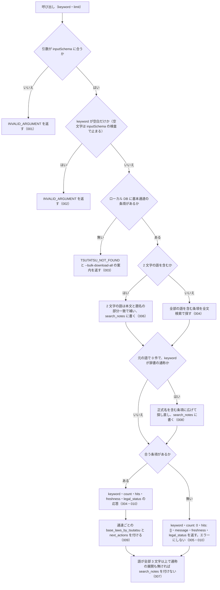

# nta_search_tsutatsu

<!-- GENERATED FILE — 手で編集しない。説明と引数はサーバーの tools/list、呼び出し例は scripts/reference-examples/houki-nta/ja/nta_search_tsutatsu.md、利用者と得られる結果・扱わないこと・処理の流れ・仕様項目の一覧は specs/current/nta_search_tsutatsu/spec.md、使いどころは scripts/spec-pages/houki-nta/nta_search_tsutatsu.md から。 -->

::: info
houki-nta-mcp **v0.27.0** の `tools/list` と `specs/current/nta_search_tsutatsu/spec.md` から自動生成しました（仕様 ID 11 件・2026-10-10）。手で編集しないでください。再生成は `node scripts/generate-reference.mjs` です。
:::

国税庁の基本通達（消基通・所基通・法基通・相基通の 4 通達）を FTS5 でキーワード検索する。事前に `--bulk-download-all` で DB 投入が必要。結果に現れた通達ごとに、解釈の対象になる法律の対応表（base_laws_by_tsutatsu）と、houki-egov-mcp の get_law を案内する next_actions を付ける。

## 利用者と得られる結果

このツールの利用者と、利用者が渡すもの・得られる結果を示します。

- MCP クライアント（Claude などの LLM、または CLI から呼ぶ人）。`keyword` を渡して、ローカル DB に入っている基本通達 4 種（消費税法基本通達・所得税基本通達・法人税基本通達・相続税法基本通達）の条項から、キーワードに合う条項の一覧を受け取る

## 引数

呼び出すときに渡す値です。動いているサーバーの `tools/list` から写しています。

| 引数 | 型 | 必須 | 既定値 | 説明 |
|---|---|---|---|---|
| `keyword` | string (minLength 1) | **必須** |  | 検索キーワード。例: "軽減税率", "電子帳簿", "棚卸資産"。略称も可（例: "電帳法"）。3 文字以上の語を推奨（FTS5 trigram のため）。2 文字の語は本文の部分一致で補完し、その旨を応答の search_notes に示す |
| `limit` | integer (1–50) | 任意 | `10` | 取得件数。1 以上 50 以下の整数（デフォルト: 10）。範囲の外は丸めずに INVALID_ARGUMENT |

::: warning ローカル DB が必要です
`npx -y @shuji-bonji/houki-nta-mcp@latest --bulk-download-all` で基本通達 4 種を取り込んでいないと、結果は空になります。応答の `freshness.staleness` が `outdated` のときは、同じコマンドで取り直してください。
:::

## 呼び出し例

実際に呼び出したときの引数と応答です。版と日付は実測したときのものです。

::: details 呼び出し例 — 「軽減税率に関係する通達の節は」
- 実測: v0.25.0（2026-10-05）
- 確かめた版: v0.27.0（2026-10-10）
- ローカル DB: あり（`staleness: "fresh"`）

**引数**

```jsonc
{ "keyword": "軽減税率", "limit": 2 }
```

**返る JSON**

```jsonc
{
  "keyword": "軽減税率",
  "count": 2,
  "hits": [
    {
      "tsutatsu": "消費税法基本通達",
      "abbr": "消基通",
      "clauseNumber": "5-9-10",
      "title": "持ち帰りのための飲食料品の譲渡か否かの判定",
      "snippet": " … 施して行う飲食料品の譲渡に該当し<b>軽減税率</b>の適用対象となるのかは、当該飲食 … ",
      "sourceUrl": "https://www.nta.go.jp/law/tsutatsu/kihon/shohi/05/09.htm",
      "score": 0.4414,
      "scoreReasons": ["doc_type=tsutatsu weight 1.00"]
    },
    {
      "tsutatsu": "消費税法基本通達",
      "abbr": "消基通",
      "clauseNumber": "5-9-5",
      "title": "自動販売機による譲渡",
      "snippet": " … 食料品を販売するものであるから、<b>軽減税率</b>の適用対象となる飲食料品の譲渡に … ",
      "sourceUrl": "https://www.nta.go.jp/law/tsutatsu/kihon/shohi/05/09.htm",
      "score": 0.4384,
      "scoreReasons": ["doc_type=tsutatsu weight 1.00"]
    }
  ],
  "freshness": {
    "oldest_fetched_at": "2026-10-04T03:14:49.904Z",
    "newest_fetched_at": "2026-10-04T03:24:14.467Z",
    "staleness": "fresh",
    "days_since_oldest": 0,
    "db_path": "~/.cache/houki-nta-mcp/cache.db"
  },
  "legal_status": {
    "binds_citizens": false,
    "binds_courts": false,
    "binds_tax_office": true,
    "note": "通達は行政内部文書。納税者・裁判所には直接的拘束力なし。ただし税務署員は職務として守る義務あり（最高裁 昭和43.12.24）"
  },
  "base_laws_by_tsutatsu": {
    "消費税法基本通達": ["消費税法", "消費税法施行令", "消費税法施行規則"]
  },
  "next_actions": [
    {
      "action": "delegate_to_mcp",
      "reason": "通達は国民・裁判所を拘束しない。根拠は法律本文で確認する",
      "example": { "mcp": "houki-egov", "tool": "get_law", "law_name": "消費税法" }
    }
  ]
}
```

`hits[].clauseNumber` と `hits[].abbr` をそのまま `nta_get_tsutatsu` の `clause` / `name` に渡すと本文が取れます。

`base_laws_by_tsutatsu` は、結果に現れた通達ごとの、解釈の対象になる法律・政令・省令の対応表です（v0.11.0 から）。対応は通達単位の事実なので、hit ごとではなく応答に 1 回だけ置いています。`hits[].tsutatsu` をキーにして引いてください。`next_actions` は通達ごとに 1 件で、houki-egov-mcp の `get_law` に渡す法律名が入っています。

「軽減税率」は略称辞書で消費税法の通称として登録されていますが、本文に「軽減税率」を含む条項があるので、「消費税法」には広げずに検索しています（v0.11.1 から）。本文に出てこない通称（「インボイス」など）で 0 件になったときだけ「消費税法」に広げ、その旨を `search_notes` に書き、`scoreReasons` に `abbreviation expanded: インボイス → 消費税法` が付きます。v0.11.0 までは通称でも常に広げていたため、「消費税法」が出てくるだけの条項が混ざることがありました（[houki-nta-mcp#21](https://github.com/shuji-bonji/houki-nta-mcp/issues/21)）。
:::

::: details 呼び出し例 — DB が古いとき（`staleness: "outdated"`）
- 実測: v0.10.2（2026-09-07）。同じ呼び出しを、最後の取り込みから 126 日たった DB に対して行ったときの応答です
- ローカル DB: あり（最後の取り込みから 126 日たった DB）
- 版の照合: しない（126 日たった DB を用意できず、取り直せないため）

引数は上の例と同じです。違うのは `freshness` だけで、`hits` の中身は変わりません。

```jsonc
{
  "keyword": "軽減税率",
  "count": 2,
  "hits": [ /* 上の例と同じ */ ],
  "freshness": {
    "oldest_fetched_at": "2026-05-04T00:34:38.918Z",
    "newest_fetched_at": "2026-09-07T11:53:51.084Z",
    "staleness": "outdated",
    "days_since_oldest": 126,
    "warning": "一部ドキュメントが 126 日前のデータです。最新化するには `npx -y @shuji-bonji/houki-nta-mcp@latest --bulk-download-all` を実行してください",
    "db_path": "~/.cache/houki-nta-mcp/cache.db"
  }
  // legal_status は同じ
}
```

この例の JSON は v0.10.2 の実測に、v0.25.0 で変わった 2 か所を仕様（SPEC-NTA-SEARCH-RULES-017・022）に合わせて書き足したものです。`warning` のコマンドが `npx -y @shuji-bonji/houki-nta-mcp@latest --bulk-download-all` の形になり（v0.24.x まではフラグだけ）、`freshness.db_path` が付きます。126 日たった DB を用意できないため、v0.25.0 では実測していません。

`staleness` が `fresh` 以外のときは、返ってきた本文が国税庁サイトの現在の内容と違う可能性があります。回答にその旨を書き、`warning` にあるコマンドの実行を利用者に案内してください。`days_since_oldest` は範囲内で最も古い文書の経過日数なので、一部だけが古い場合もこの値になります。
:::

## 扱わないこと

このツールが意図して扱わないことです。

- 国税庁サイトを検索すること（対象はローカル DB に入れた条項だけ。DB に入れるのは CLI の `--bulk-download` / `--bulk-download-all`）
- 通達を 1 つに絞って検索すること（`keyword` に通達名を入れても、通達名を本文に含む条項を探すだけで、絞り込みにはならない）
- 基本通達 4 種以外の文書を検索すること（改正通達は `nta_search_kaisei_tsutatsu`、質疑応答事例は `nta_search_qa`、タックスアンサーは `nta_search_tax_answer`、事務運営指針は `nta_search_jimu_unei`、文書回答事例は `nta_search_bunshokaitou`）
- 条項の本文全体を返すこと（`snippet` は抜粋。本文は `nta_get_tsutatsu` で `clauseNumber` を渡して取る）
- 通達の条項と法律の条番号の対応を示すこと（`base_laws_by_tsutatsu` は法令名まで。条は付けない）
- 通達が今も有効かどうかを判定すること（改正の追跡は `nta_search_kaisei_tsutatsu` / `nta_get_kaisei_tsutatsu`）

## 処理の流れ

仕様書の「処理の流れ」の節を、図も含めてそのまま写しています。図が大きいので畳んでいます。

::: details 処理の流れの図（仕様書の写し）
呼び出しを受けてから応答を返すまでに、何をどの順で確かめるかを示します。図の中の番号は「できること」の仕様 ID の末尾 3 桁です。


:::

## 仕様項目の一覧

このツールの仕様項目 11 件の見出しです。仕様項目は受入テストと 1 対 1 で対応していて、条件と例は[仕様書ページ](/specs/houki-nta/nta_search_tsutatsu)で読めます。

::: details 仕様項目の見出し（11 件）
| 仕様 ID | 仕様項目 |
|---|---|
| [001](/specs/houki-nta/nta_search_tsutatsu#spec-nta-search-tsutatsu-001) | inputSchema に合わない引数では検索しない |
| [002](/specs/houki-nta/nta_search_tsutatsu#spec-nta-search-tsutatsu-002) | keyword が空なら検索しない |
| [003](/specs/houki-nta/nta_search_tsutatsu#spec-nta-search-tsutatsu-003) | DB に条項が 1 件も無いときは、開こうとした DB のパスと、基本通達 4 種の bulk download を案内する |
| [004](/specs/houki-nta/nta_search_tsutatsu#spec-nta-search-tsutatsu-004) | キーワードに合う条項があれば count と hits を返す |
| [005](/specs/houki-nta/nta_search_tsutatsu#spec-nta-search-tsutatsu-005) | キーワードに合う条項が無いときはエラーにせず、`count: 0` と `freshness`・`legal_status` を返す |
| [006](/specs/houki-nta/nta_search_tsutatsu#spec-nta-search-tsutatsu-006) | 2 文字の語は本文の部分一致で補い、search_notes で知らせる |
| [007](/specs/houki-nta/nta_search_tsutatsu#spec-nta-search-tsutatsu-007) | 3 文字以上の語だけなら search_notes を付けない |
| [008](/specs/houki-nta/nta_search_tsutatsu#spec-nta-search-tsutatsu-008) | 通称は、元の語で 0 件のときだけ法令名に広げ、search_notes で知らせる |
| [009](/specs/houki-nta/nta_search_tsutatsu#spec-nta-search-tsutatsu-009) | 結果に現れた通達ごとに、解釈の対象になる法律と get_law への案内を付ける |
| [010](/specs/houki-nta/nta_search_tsutatsu#spec-nta-search-tsutatsu-010) | `legal_status` は、ヒットの有無によらず付ける |
| [011](/specs/houki-nta/nta_search_tsutatsu#spec-nta-search-tsutatsu-011) | `limit` は 1 以上 50 以下の整数で、範囲の外は `INVALID_ARGUMENT` にして丸めない |
:::

## 関連ページ

このページの元になった文書と、あわせて読むページです。

- [houki-nta-mcp の解説](/mcp/houki-nta)
- [houki-nta-mcp のツール一覧](/reference/mcp/houki-nta/)
- [nta_search_tsutatsu の仕様書ページ](/specs/houki-nta/nta_search_tsutatsu)
- [元の仕様書（GitHub、v0.27.0）](https://github.com/shuji-bonji/houki-nta-mcp/blob/v0.27.0/specs/current/nta_search_tsutatsu/spec.md)
