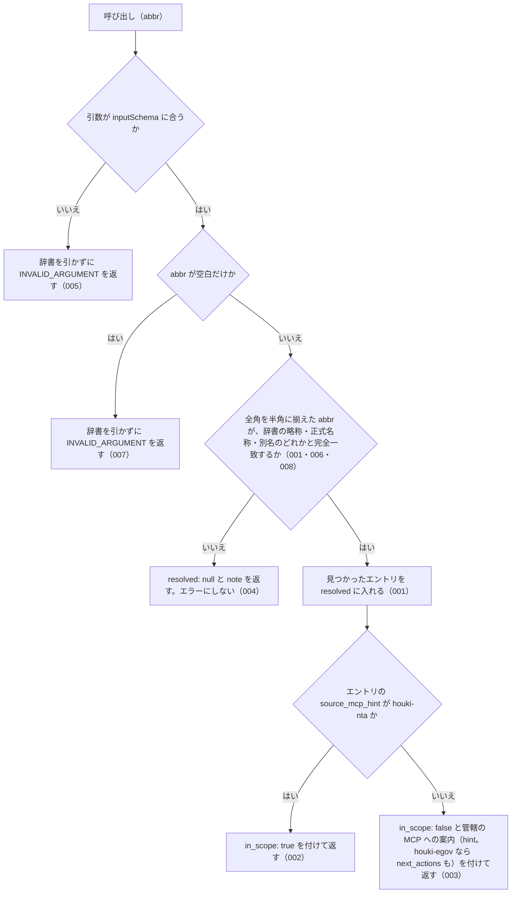

# resolve_abbreviation

<!-- GENERATED FILE — 手で編集しない。説明と引数はサーバーの tools/list、呼び出し例は scripts/reference-examples/houki-nta/ja/resolve_abbreviation.md、利用者と得られる結果・扱わないこと・処理の流れ・仕様項目の一覧は specs/current/resolve_abbreviation/spec.md、使いどころは scripts/spec-pages/houki-nta/resolve_abbreviation.md から。 -->

::: info
houki-nta-mcp **v0.27.0** の `tools/list` と `specs/current/resolve_abbreviation/spec.md` から自動生成しました（仕様 ID 8 件・2026-10-10）。手で編集しないでください。再生成は `node scripts/generate-reference.mjs` です。
:::

略称・通称から houki-abbreviations 経由でエントリを解決する。houki-nta-mcp 管轄外（法令系等）の場合は「他 MCP に誘導」のヒントを返す。

## 利用者と得られる結果

このツールの利用者と、利用者が渡すもの・得られる結果を示します。

- MCP クライアント（Claude などの LLM、または CLI から呼ぶ人）。`abbr` を渡して、その略称・通称が houki-abbreviations の辞書でどの法令・通達を指すか、そしてその本文を houki-nta-mcp で取れるか（管轄か）を受け取る

## 引数

呼び出すときに渡す値です。動いているサーバーの `tools/list` から写しています。

| 引数 | 型 | 必須 | 既定値 | 説明 |
|---|---|---|---|---|
| `abbr` | string (minLength 1) | **必須** |  | 略称。例: "消基通", "所基通", "法基通"。全角の英数字・ダッシュ類・全角スペースは半角に揃えてから引く |

## 呼び出し例

実際に呼び出したときの引数と応答です。版と日付は実測したときのものです。

::: details 呼び出し例 — 「電帳法 は houki-nta-mcp で引けるか」
- 実測: v0.25.0（2026-10-05）
- 確かめた版: v0.27.0（2026-10-10）
- ローカル DB: 不要

**引数**

```jsonc
{ "abbr": "電帳法" }
```

**返る JSON**

```jsonc
{
  "abbr": "電帳法",
  "resolved": {
    "abbr": "電帳法",
    "formal": "電子計算機を使用して作成する国税関係帳簿書類の保存方法等の特例に関する法律",
    "law_id": null,
    "law_type": "Act",
    "domain": "tax",
    "category": "law",
    "source_mcp_hint": "houki-egov",
    "aliases": ["電子帳簿保存法", "電子帳簿保存", "電帳", "電子帳簿等保存制度"],
    "note": "通称: 電子帳簿保存法 (電帳法)"
  },
  "in_scope": false,
  "hint": "このエントリは houki-egov の管轄です。houki-egov-mcp で取得してください。",
  "next_actions": [
    {
      "action": "delegate_to_mcp",
      "reason": "houki-egov の管轄リソースです。該当 MCP に切り替えてください",
      "example": { "mcp": "houki-egov" }
    }
  ]
}
```

`in_scope: false` は、この略称が houki-nta-mcp の管轄外（法律なので houki-egov-mcp）であることを示します。houki-egov-mcp 側の同名ツールとの違いはこの `in_scope` と `hint` で、辞書は同じ houki-abbreviations です。「消基通」「所基通」のような通達の略称なら `in_scope: true` になります。管轄外のときは `next_actions` に `delegate_to_mcp`（`example.mcp` は担当のサーバー）が 1 件付きます（v0.23.0 から）。
:::

## 扱わないこと

このツールが意図して扱わないことです。

- 部分一致やあいまい一致で探すこと（完全一致だけ。`消費税` のような通称は辞書の別名に登録されているときだけ引ける）
- 全角・半角の表記ゆれを吸収すること（`ＰＬ法` は辞書に無い扱いになる。未決 2）
- 解決した通達・法令の本文を返すこと（通達は `nta_get_tsutatsu`、法令は管轄先の MCP）
- 管轄外のエントリについて、管轄先の MCP の呼び出し方（`next_actions`）を返すこと（`hint` の文で MCP 名を案内するだけ）
- 1 回の呼び出しで複数の略称を解決すること
- 辞書に無い名前に対して、似た名前の候補を返すこと
- 辞書の版や更新日を返すこと

## 処理の流れ

仕様書の「処理の流れ」の節を、図も含めてそのまま写しています。図が大きいので畳んでいます。

::: details 処理の流れの図（仕様書の写し）
呼び出しを受けてから応答を返すまでに、何をどの順で確かめるかを示します。図の中の番号は「できること」の仕様 ID の末尾 3 桁です。


:::

## 仕様項目の一覧

このツールの仕様項目 8 件の見出しです。仕様項目は受入テストと 1 対 1 で対応していて、条件と例は[仕様書ページ](/specs/houki-nta/resolve_abbreviation)で読めます。

::: details 仕様項目の見出し（8 件）
| 仕様 ID | 仕様項目 |
|---|---|
| [001](/specs/houki-nta/resolve_abbreviation#spec-nta-resolve-abbreviation-001) | 略称でも正式名称でも辞書のエントリを返す |
| [002](/specs/houki-nta/resolve_abbreviation#spec-nta-resolve-abbreviation-002) | houki-nta の管轄のエントリには in_scope: true を返す |
| [003](/specs/houki-nta/resolve_abbreviation#spec-nta-resolve-abbreviation-003) | 管轄外のエントリには in_scope: false と、管轄の MCP への案内を返す |
| [004](/specs/houki-nta/resolve_abbreviation#spec-nta-resolve-abbreviation-004) | 辞書に無い名前には resolved: null を返す |
| [005](/specs/houki-nta/resolve_abbreviation#spec-nta-resolve-abbreviation-005) | inputSchema に合わない引数は INVALID_ARGUMENT で止める |
| [006](/specs/houki-nta/resolve_abbreviation#spec-nta-resolve-abbreviation-006) | 辞書の別名（`aliases`）でも同じエントリを返す |
| [007](/specs/houki-nta/resolve_abbreviation#spec-nta-resolve-abbreviation-007) | abbr が空文字・空白だけのときは略称辞書を引かずに `INVALID_ARGUMENT` を返す |
| [008](/specs/houki-nta/resolve_abbreviation#spec-nta-resolve-abbreviation-008) | `abbr` の全角英数字・ダッシュ類・全角空白は半角に揃えてから辞書と照合する |
:::

## 関連ページ

このページの元になった文書と、あわせて読むページです。

- [houki-nta-mcp の解説](/mcp/houki-nta)
- [houki-nta-mcp のツール一覧](/reference/mcp/houki-nta/)
- [resolve_abbreviation の仕様書ページ](/specs/houki-nta/resolve_abbreviation)
- [元の仕様書（GitHub、v0.27.0）](https://github.com/shuji-bonji/houki-nta-mcp/blob/v0.27.0/specs/current/resolve_abbreviation/spec.md)
