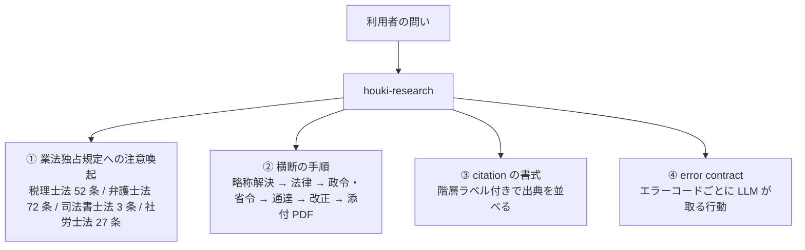

# houki-research Skill

日本の法規（法律・政令・省令・通達・判例・裁決・行政解釈）を横断して調べるときに、
LLM が **どの MCP をどの順に呼び、出典をどう書き、どこで注意を促すか** を定めた Skill です。
MCP サーバーは資料を返すだけで、順序や書式や注意喚起は決めません。それらの正典がこの Skill です。

- リポジトリ: [shuji-bonji/houki-research-skill](https://github.com/shuji-bonji/houki-research-skill)（0.1.0）
- 配布: claude-plugins marketplace の plugin `houki-research`、または `skills/houki-research/` をプロジェクトの `.claude/skills/` に置く
- 対象分野: 税務に限らず日本の全法規。現時点で MCP が揃っているのが税務なので、例は税務が中心です

## 4 つの責務



### ① 業法独占規定への注意喚起

問いが「私の確定申告で」「うちの会社の決算で」「この契約書の条項は」のように **個別の事案への当てはめ** を求めていると見えたら、
回答の冒頭で「条文・通達の引用と一般的な説明は行うが、事案への適用判断は資格者に相談してほしい」と伝えます。
文献調査・制度の概観・条文の引用・改正履歴の説明は、その後で通常どおり行います。

### ② 横断の手順

1. 略称（「消基通」「インボイス」「労基法」）が含まれていれば、まず `resolve_abbreviation` で正式名と担当 MCP（`source_mcp_hint`）を確かめます
2. 法律本文を houki-egov-mcp で引きます。政令・省令があれば続けて引きます
3. 通達・Q&A を houki-nta-mcp で引きます。応答の `legal_status` を見て、通達が国民を拘束しないことを回答に残します
4. 改正の経緯が要るときは `get_law_revisions` と改正通達を引き、新旧対照表の PDF は pdf-reader-mcp の `extract_tables` で読みます
5. 応答の `freshness` が古ければ、DB の再取得を促してから答えます

### ③ citation の書式

回答の末尾に、階層ラベルを付けて出典を並べます。

```text
## Sources
### 法律（国会制定・国民を拘束）
- 消費税法 第 57 条の 2「適格請求書発行事業者の登録」 — e-Gov の URL
### 政令 / 省令
- 消費税法施行令 第 70 条の 5
### 行政解釈（通達。税務職員を拘束、国民・裁判所は拘束しない）
- 消費税法基本通達 1-7-2「登録番号の構成」 — 国税庁の URL
### 参考情報（拘束力なし）
- タックスアンサー No.6498
```

PDF から表を抽出して引用した場合は、どのツールでどう抽出したか（`extract_tables` で Markdown 化、など）を注釈として添えます。

### ④ error contract

family の全 MCP は、エラーを `isError: true` と `code` で返します。Skill は `code` ごとに LLM の行動を定めています。

| 分類 | 代表的な `code` | LLM が取る行動 |
| --- | --- | --- |
| 引数の問題 | `INVALID_ARGUMENT` / `INVALID_ARTICLE_NUM` / `OUT_OF_SCOPE` | 引数を直して呼び直す。`OUT_OF_SCOPE` なら案内された MCP に切り替える |
| 見つからない | `LAW_NOT_FOUND` / `ARTICLE_NOT_FOUND` / `TSUTATSU_NOT_FOUND` / `ABBREVIATION_NOT_FOUND` | 別の名前・条番号で探す。見つからないことを利用者に伝え、推測で本文を作らない |
| 取得元の問題 | `SOURCE_TIMEOUT` / `SOURCE_RATE_LIMITED` / `SOURCE_UNAVAILABLE` / `SOURCE_API_ERROR` | 間を置いて再試行する。続くなら取得できなかったことを明示する |
| PDF の問題 | `INVALID_PDF` / `ENCRYPTED_PDF` / `UNSUPPORTED_PDF_FEATURE` | その PDF は読めなかったと申告し、本文だけで答える |
| 内部 | `UNKNOWN_TOOL` / `INTERNAL_ERROR` | 再試行せず、利用者に報告する |

## 同梱している文書

| ファイル | 内容 |
| --- | --- |
| `SKILL.md` | 鉄則（注意喚起を回答前に行う、略称は最初に解決する、法律 → 通達 → 改正 → PDF の順で引く） |
| `docs/BUSINESS-LAW.md` | 業法独占規定の条文と、問いの見分け方 |
| `docs/CITATION.md` | 引用書式と、階層ラベルと `legal_status` の対応表 |
| `docs/ERROR-HANDLING.md` / `docs/ERROR-CODES.md` | error contract の正典。各 MCP はこの語彙に合わせて実装する |
| `docs/ARCHITECTURE.md` | family の中での Skill の位置づけ |
| `workflows/tax-research.md` | 税務調査の手順書（現時点で唯一の workflow） |
| `examples/` | インボイス登録要件の調査例、エラーからの復帰例 |

## 次の版で予定していること

- workflow の追加: 改正追跡（`revision-tracking`）。MCP の追加を待たずに書けます
- examples の追加: 電子帳簿保存法、相続税の改正
- `ARCHITECTURE.md` の配布形態の記述を plugin 化後の状態に更新
- 労務・民事・知財の workflow は、houki-mhlw-mcp / houki-court-mcp / houki-saiketsu-mcp が揃ってから
