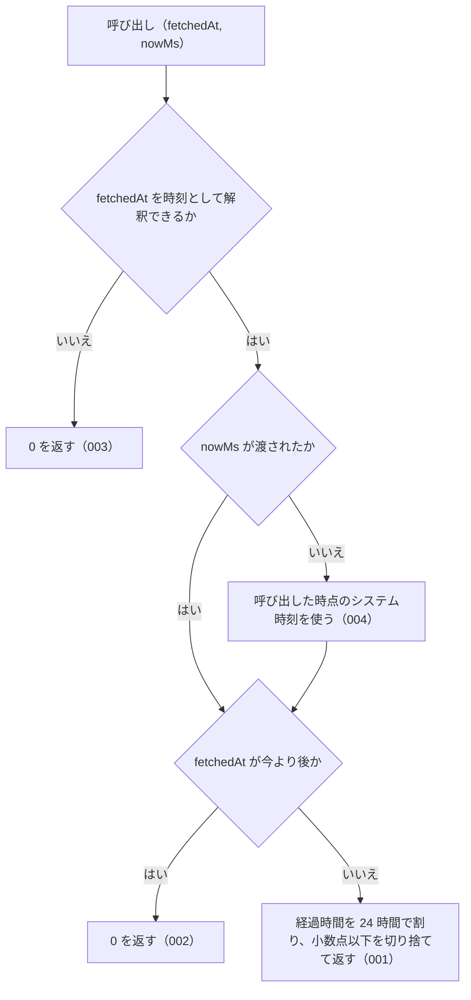

# computeDaysSince の仕様

<!-- GENERATED FILE — 手で編集しない。本文は houki-abbreviations の specs/current/compute_days_since/spec.md の写し。 -->

::: info
houki-abbreviations **v0.7.0** の `specs/current/compute_days_since/spec.md` から自動生成しました（仕様 ID 10 件・2026-10-09）。手で編集しないでください。再生成は `node scripts/generate-reference.mjs specs` です。
:::

このページは、houki-abbreviations の関数「computeDaysSince（取得時刻から今までの経過日数を返す）」の仕様です。「承認の履歴」の前までは、仕様書の本文を言い換えずに写しています。
引数の型と既定値の一覧と、実測の呼び出し例は[リファレンス](/reference/lib/houki-abbreviations#computedayssince)にあります。

最後に仕様が変わったのは v0.7.0 の「引数の検査を「丸めない」に揃える（limit・取得時刻・law_id の形）」（2026-09-30 承認）です。それまでの経緯は[承認の履歴](#承認の履歴)にあります。

## 使う人と受け取るもの

この機能を誰が呼び、何を渡して何を受け取るかを示します。

- houki-hub family の MCP サーバー（houki-nta-mcp など）。自分のローカル DB やキャッシュに持っている取得時刻 `fetched_at` を渡して経過日数を受け取り、`judgeStaleness` に渡して鮮度を判定する

## 入力

呼び出すときに渡す値です。

| 引数        | 必須 | 内容                                                                                                                                                                                                                                                                                                                                                                                                                    |
| ----------- | ---- | ----------------------------------------------------------------------------------------------------------------------------------------------------------------------------------------------------------------------------------------------------------------------------------------------------------------------------------------------------------------------------------------------------------------------- |
| `fetchedAt` | 必須 | 取得時刻。ISO 8601 の次の 3 つの形だけを受け付ける。(a) 日付だけ `YYYY-MM-DD`（UTC の 0 時として扱う）、(b) UTC の時刻 `YYYY-MM-DDTHH:mm:ss(.sss)Z`、(c) 時差付きの時刻 `YYYY-MM-DDTHH:mm:ss(.sss)±hh:mm`。例: `2026-04-01T00:00:00Z` / `2026-04-01T00:00:00.000Z` / `2026-04-01` / `2026-04-01T09:00:00+09:00`。それ以外の書き方、時差の無い時刻、存在しない日付は `RangeError`、文字列でない値は `TypeError` を投げる |
| `nowMs`     | 任意 | 「今」とする時刻（1970-01-01T00:00:00Z からのミリ秒）。省略すると呼び出した時点のシステム時刻を使う。テストで時刻を固定するときに渡す。有限の数でなければ `RangeError`、数でない値は `TypeError` を投げる                                                                                                                                                                                                               |

houki-nta-mcp の `fetched_at` は (b) の形（`new Date().toISOString()`）、houki-egov-mcp の `sync_state.last_sync_date` は (a) の形で書かれている。

## 戻り値

呼び出しが返す値です。

`number`。`fetchedAt` から `nowMs` までの経過日数（0 以上の整数）。`fetchedAt` が受け付けない値のときは戻り値を返さず、例外を投げる。

`judgeStaleness` と組み合わせたときの結果（`nowMs` は `2026-05-08T00:00:00Z`）。

| `fetchedAt`                              | `computeDaysSince` | `judgeStaleness(computeDaysSince(...))` | v0.6.1                      |
| ---------------------------------------- | ------------------ | --------------------------------------- | --------------------------- |
| `"2026-05-07T00:00:00Z"`                 | `1`                | `"fresh"`                               | 同じ                        |
| `"2026-05-07"`                           | `1`                | `"fresh"`                               | 同じ                        |
| `"2026-05-08T09:00:00+09:00"`            | `0`                | `"fresh"`                               | 同じ                        |
| `"2026-06-01T00:00:00Z"`（今より後）     | `0`                | `"fresh"`                               | 同じ                        |
| `"not-a-date"`、`""`                     | `RangeError`       | 呼ばれない                              | `0` → `"fresh"`             |
| `"2026/05/07"`、`"May 7, 2026"`          | `RangeError`       | 呼ばれない                              | `1` → `"fresh"`             |
| `"2026-05-07T08:00:00"`（時差なし）      | `RangeError`       | 呼ばれない                              | 実行環境の時差で `0` か `1` |
| `"2026-02-30T00:00:00Z"`（存在しない日） | `RangeError`       | 呼ばれない                              | `67` → `"outdated"`         |
| `nowMs` に `NaN`                         | `RangeError`       | 呼ばれない                              | `NaN` → `"outdated"`        |

## できないこと

この機能が引き受けないことです。

- 経過日数から鮮度（`fresh` / `stale` / `outdated`）を判定すること（`judgeStaleness`）
- `fetched_at` を DB やキャッシュから読むこと（各 MCP サーバーが持つ）
- 今より後の時刻を、呼び出し側に別の値やエラーで知らせること（`0` になる。時計のずれで起きるので、壊れた値とは扱わない）
- 時・分の単位で経過時間を返すこと

## 処理の流れ

図の中の番号は「できること」の仕様 ID の末尾 3 桁です。

## 仕様 ID ごとの約束

この機能が守る約束を、仕様 ID ごとに並べています。見出しは約束を 1 文で表したもので、条件・応答の細部・例は「詳細」を開くと読めます。仕様 ID はそれぞれ受入テストと対応していて、テストの無い ID があると各リポジトリの CI が止まります。

### SPEC-ABBR-COMPUTE-DAYS-SINCE-001 経過日数を 1 日未満切り捨ての整数で返す

::: details 詳細
`fetchedAt` から `nowMs` までの経過時間を 24 時間単位で数え、小数点以下を切り捨てた整数を返す。同じ時刻なら 0、24 時間未満の差も 0 になる。

例（`nowMs` は `2026-05-08T00:00:00Z`）: `fetchedAt: "2026-05-08T00:00:00Z"` → `0`、`"2026-05-07T00:00:00Z"` → `1`、`"2026-04-24T00:00:00Z"` → `14`、`"2026-05-07T12:00:00Z"`（12 時間前）→ `0`。
:::

### SPEC-ABBR-COMPUTE-DAYS-SINCE-002 今より後の取得時刻には 0 を返す

::: details 詳細
`fetchedAt` が `nowMs` より後のときは、負の値ではなく `0` を返す。

例: `fetchedAt: "2026-06-01T00:00:00Z"`、`nowMs` が `2026-05-08T00:00:00Z` → `0`。
:::

### SPEC-ABBR-COMPUTE-DAYS-SINCE-003 時刻として解釈できない文字列には RangeError を投げる

::: details 詳細
`fetchedAt` が受け付ける 3 つの形のどれにも当たらない文字列のときは、`0` を返さずに `RangeError` を投げる。壊れた取得時刻を `fresh` と判定させない。

例: `computeDaysSince('not-a-date', nowMs)` と `computeDaysSince('', nowMs)` はどちらも `RangeError`（v0.6.1 では `0`）。
:::

### SPEC-ABBR-COMPUTE-DAYS-SINCE-004 nowMs を省略すると呼び出した時点のシステム時刻を使う

::: details 詳細
`nowMs` を渡さないときは、呼び出した時点のシステム時刻を「今」として経過日数を数える。

例: 呼び出す 5 分後の時刻を `fetchedAt` に渡し、`nowMs` を省略すると `0`。
:::

### SPEC-ABBR-COMPUTE-DAYS-SINCE-005 日付だけ・UTC・時差付きの 3 つの形を受け付ける

::: details 詳細
`YYYY-MM-DD`、`YYYY-MM-DDTHH:mm:ssZ`（秒の小数 `.sss` があってもよい）、`YYYY-MM-DDTHH:mm:ss±hh:mm` の 3 つの形を受け付ける。日付だけの形は UTC の 0 時として扱う。

例（`nowMs` は `2026-05-08T00:00:00Z`）: `computeDaysSince('2026-05-07', nowMs)` → `1`、`computeDaysSince('2026-05-07T00:00:00.000Z', nowMs)` → `1`、`computeDaysSince('2026-05-08T09:00:00+09:00', nowMs)` → `0`（同じ時刻）、`computeDaysSince('2026-05-07T15:00:00-09:00', nowMs)` → `0`（同じ時刻）、`computeDaysSince('2026-04-24', nowMs)` → `14`。
:::

### SPEC-ABBR-COMPUTE-DAYS-SINCE-006 ISO 8601 以外の書き方には RangeError を投げる

::: details 詳細
`Date.parse` が読める書き方でも、3 つの形に当たらなければ `RangeError` を投げる。

例: `computeDaysSince('2026/05/07', nowMs)`、`computeDaysSince('May 7, 2026', nowMs)`、`computeDaysSince('20260507', nowMs)` は、どれも `RangeError`（v0.6.1 では前の 2 つは `1`）。
:::

### SPEC-ABBR-COMPUTE-DAYS-SINCE-007 時差の無い時刻には RangeError を投げる

::: details 詳細
`T` 以降があるのに末尾が `Z` でも `±hh:mm` でもない時刻は、実行環境の時差で結果が変わるので `RangeError` を投げる。

例: `computeDaysSince('2026-05-07T08:00:00', nowMs)` は `RangeError`（v0.6.1 では実行環境が UTC なら `0`、Asia/Tokyo なら `1`）。
:::

### SPEC-ABBR-COMPUTE-DAYS-SINCE-008 存在しない日付には RangeError を投げる

::: details 詳細
形は合っていても、暦に無い日付（2 月 30 日、13 月、4 月 31 日）は繰り上げずに `RangeError` を投げる。

例: `computeDaysSince('2026-02-30T00:00:00Z', nowMs)`、`computeDaysSince('2026-13-01', nowMs)`、`computeDaysSince('2026-04-31', nowMs)` は、どれも `RangeError`（v0.6.1 では 2 月 30 日を 3 月 2 日として `67`）。`computeDaysSince('2024-02-29', Date.parse('2024-03-01T00:00:00Z'))` は閏日なので `1`。
:::

### SPEC-ABBR-COMPUTE-DAYS-SINCE-009 有限でない nowMs には例外を投げる

::: details 詳細
`nowMs` が `NaN` か `Infinity` か `-Infinity` のときは `RangeError`、数でない値（文字列など）のときは `TypeError` を投げる。`undefined` は省いたときと同じくシステム時刻を使う。

例: `computeDaysSince('2026-05-07T00:00:00Z', NaN)` は `RangeError`（v0.6.1 では `NaN`）。`computeDaysSince('2026-05-07T00:00:00Z', '1')` は `TypeError`。
:::

### SPEC-ABBR-COMPUTE-DAYS-SINCE-010 文字列でない fetchedAt には TypeError を投げる

::: details 詳細
`fetchedAt` が文字列でないとき（`null`、`undefined`、数値、`Date`）は `TypeError` を投げる。

例: `computeDaysSince(null, nowMs)`、`computeDaysSince(undefined, nowMs)`、`computeDaysSince(1778198400000, nowMs)`、`computeDaysSince(new Date(), nowMs)` は、どれも `TypeError`。
:::

## まだ決めていないこと

仕様を書き起こしたときに見つかった項目のうち、扱いを決めている途中のものです。開くと、元の仕様書の記述をそのまま読めます。

::: details 仕様書の「未決」の節
初版起こしで見つけた、意図か不具合かを人が決める項目です。決まったら「できること」に ID を振るか、`specs/changes/` の差分にします。

意図か不具合かの判断が要る項目は houki-abbreviations の Issue に移し、ここには題と Issue の番号だけを残します。今の振る舞いのままでよくテストが無いだけの項目は、受入テストを書いてから「できること」に ID を振ります。

1. **ISO 8601 以外の書き方も受け付ける。** → [SPEC-ABBR-COMPUTE-DAYS-SINCE-006](#spec-abbr-compute-days-since-006)
2. **時差の書かれていない時刻は、実行環境のタイムゾーンで結果が変わる。** → [SPEC-ABBR-COMPUTE-DAYS-SINCE-007](#spec-abbr-compute-days-since-007)
3. **存在しない日付が繰り上がって数えられる。** → [SPEC-ABBR-COMPUTE-DAYS-SINCE-008](#spec-abbr-compute-days-since-008)
4. **解釈できない文字列や今より後の時刻を `judgeStaleness` に渡すと `fresh` になる。** → [SPEC-ABBR-COMPUTE-DAYS-SINCE-003](#spec-abbr-compute-days-since-003)
5. **`nowMs` に `NaN` を渡すと `NaN` を返す。** → [SPEC-ABBR-COMPUTE-DAYS-SINCE-009](#spec-abbr-compute-days-since-009)
:::

## 承認の履歴

この機能の仕様が、いつ、どの変更で承認されたかを新しい順に並べています。各リポジトリの `npx spec-ids history compute_days_since` と同じ内容です。変更の名前から、変更の理由と前後の振る舞いを書いた文書（GitHub）を開けます。

::: details 承認の履歴（3 件）
| 承認日 | 版 | 変更 | 仕様 PR |
|---|---|---|---|
| 2026-09-30 | v0.7.0 | [引数の検査を「丸めない」に揃える（limit・取得時刻・law_id の形）](https://github.com/shuji-bonji/houki-abbreviations/blob/v0.7.0/specs/releases/v0.7.0/20261001-input-guards/proposal.md) | [#31](https://github.com/shuji-bonji/houki-abbreviations/pull/31) |
| 2026-09-27 | v0.6.1 | [「未決」のうち判断が要る 52 件を Issue に移す](https://github.com/shuji-bonji/houki-abbreviations/blob/v0.7.0/specs/releases/v0.6.1/20260927-undecided-to-issues/proposal.md) | [#26](https://github.com/shuji-bonji/houki-abbreviations/pull/26) |
| 2026-09-27 | — | 初版 | [#10](https://github.com/shuji-bonji/houki-abbreviations/pull/10) |
:::

## 関連ページ

このページの元になった文書と、あわせて読むページです。

- [houki-abbreviations の仕様の一覧](/specs/houki-abbreviations/)
- [houki-abbreviations の解説](/lib/houki-abbreviations)
- [リファレンスの computeDaysSince](/reference/lib/houki-abbreviations#computedayssince)
- [元の仕様書（GitHub、v0.7.0）](https://github.com/shuji-bonji/houki-abbreviations/blob/v0.7.0/specs/current/compute_days_since/spec.md)
