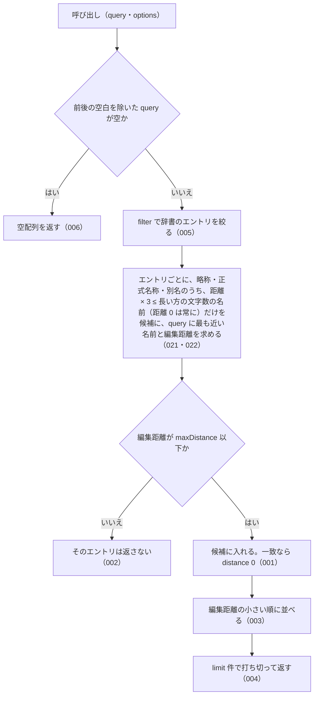

# findSimilar の仕様

<!-- GENERATED FILE — 手で編集しない。本文は houki-abbreviations の specs/current/find_similar/spec.md の写し。 -->

::: info
houki-abbreviations **v0.7.0** の `specs/current/find_similar/spec.md` から自動生成しました（仕様 ID 22 件・2026-10-09）。手で編集しないでください。再生成は `node scripts/generate-reference.mjs specs` です。
:::

このページは、houki-abbreviations の関数「findSimilar（編集距離が近い名前を持つエントリを探す）」の仕様です。「承認の履歴」の前までは、仕様書の本文を言い換えずに写しています。
引数の型と既定値の一覧と、実測の呼び出し例は[リファレンス](/reference/lib/houki-abbreviations#findsimilar)にあります。

最後に仕様が変わったのは v0.7.0 の「辞書の約束（名前の重なり・別名・告示）と、件数・近さの決め方」（2026-09-30 承認）です。それまでの経緯は[承認の履歴](#承認の履歴)にあります。

## 使う人と受け取るもの

この機能を誰が呼び、何を渡して何を受け取るかを示します。

- houki-abbreviations を import する利用者（houki-nta-mcp・houki-egov-mcp などの MCP サーバー、または独自のコード）。`労働基準法施行例` のように 1〜2 文字誤った名前を渡して、近い名前を持つ辞書のエントリと、その近さ（編集距離）を受け取る
- この関数は編集距離で近い名前を返す関数で、名前の一部から一覧を得る関数ではない。`民法` のような短い名前を渡しても、`民` で始まる法令の一覧にはならない。一覧が欲しいときは `searchByName` を使う（README と JSDoc にも同じ文を書く）

## 入力

呼び出すときに渡す値です。

| 引数                  | 必須 | 内容                                                                                                                                      |
| --------------------- | ---- | ----------------------------------------------------------------------------------------------------------------------------------------- |
| `query`               | 必須 | 探す名前。例: `労働基準法` / `消費税法施行令例`。前後の空白は無視する                                                                     |
| `options.maxDistance` | 任意 | 返すエントリの編集距離の上限。既定 2。編集距離がこの値以下でも、距離の比（下記）がしきい値を超える名前は返さない                          |
| `options.limit`       | 任意 | 返す件数の上限。1 以上 500 以下の整数。省くと 5                                                                                           |
| `options.sortByScore` | 任意 | 編集距離の小さい順に並べるか。既定 `true`                                                                                                 |
| `options.filter`      | 任意 | 絞り込み。型は `SearchFilter`（`searchByName` と同じ）。キーは `domain` / `category` / `source_mcp_hint` で、それぞれ単一の値か配列を取る |
| `options.normalize`   | 任意 | 全角英数字・ダッシュ類・全角チルダ・全角スペースを半角にしてから比べるか。既定 `true`                                                     |

型は `FuzzyOptions`。辞書は関数が持っている（v0.6.1 で 174 件）。エントリの配列を渡す引数は無い。

距離の比: `query` と名前の編集距離を、2 つのうち長い方の文字数（コードポイント数）で割った値。比が 1/3 を超える名前は、`maxDistance` 以下でも返さない（`距離 × 3 ≤ 長い方の文字数` のときだけ返す）。距離 0（一致）は文字数によらず返す。この比は指定できない。

| 長い方の文字数 | 返す編集距離                              |
| -------------- | ----------------------------------------- |
| 1〜2           | 0                                         |
| 3〜5           | 0〜1                                      |
| 6〜8           | 0〜2                                      |
| 9 以上         | 0〜3（既定の `maxDistance: 2` では 0〜2） |

## 戻り値

呼び出しが返す値です。

`FuzzyMatch` の配列。1 件も無ければ空配列。1 つのエントリは 1 回だけ入る。

| フィールド   | 内容                                                                                                 |
| ------------ | ---------------------------------------------------------------------------------------------------- |
| `entry`      | 辞書のエントリ（`AbbreviationEntry`）                                                                |
| `matchedKey` | そのエントリの略称・正式名称・別名のうち、`query` との編集距離が最も小さかった名前。辞書の表記のまま |
| `distance`   | `query` と `matchedKey` の編集距離（`levenshtein` の値）。0 は一致                                   |

## できないこと

この機能が引き受けないことです。

- 名前の一部で探すこと（`searchByName`。`findSimilar` は名前全体どうしの編集距離を比べる）
- 略称と正式名称のように編集距離が大きい組を結び付けること（辞書の `aliases` に登録して `resolveAbbreviation` で引く）
- 英字の大文字・小文字の違いを同じとみなすこと（`findSimilar('pl法')` は `製造物責任法` を返さない）
- 正式名称だけを文字列で返すこと（`suggestCorrection`）

## 処理の流れ

呼び出しを受けてから配列を返すまでに、何をどの順で確かめるかを示します。図の中の番号は「できること」の仕様 ID の末尾 3 桁です。

## 仕様 ID ごとの約束

この機能が守る約束を、仕様 ID ごとに並べています。見出しは約束を 1 文で表したもので、条件・応答の細部・例は「詳細」を開くと読めます。仕様 ID はそれぞれ受入テストと対応していて、テストの無い ID があると各リポジトリの CI が止まります。

### SPEC-ABBR-FIND-SIMILAR-001 名前が一致するエントリは distance 0 で先頭に返す

::: details 詳細
`query` がエントリの略称・正式名称・別名のどれかと一致するとき、そのエントリを `distance: 0` で返す。既定の並び順では先頭に来る。

例: `findSimilar('所得税法施行令')` の先頭は `entry.abbr: "所令"`、`entry.formal: "所得税法施行令"`、`matchedKey: "所得税法施行令"`、`distance: 0`。続いて `所規`（`所得税法施行規則`、2）・`法令`（`法人税法施行令`、2）・`消令`（`消費税法施行令`、2）・`相令`（`相続税法施行令`、2）。`findSimilar('労働基準法')` は `労基法`（`労働基準法`、0）の 1 件（v0.6.1 では `労契法`・`労組法`・`建基法` も距離 2 で続いていたが、5 文字に対する距離 2 は比が 1/3 を超えるので返さない）。
:::

### SPEC-ABBR-FIND-SIMILAR-002 編集距離が maxDistance 以下のエントリだけを返す

::: details 詳細
エントリの略称・正式名称・別名のうち最も近いものとの編集距離が `maxDistance` 以下のエントリだけを返す。どのエントリも `maxDistance` を超えるときは空配列を返す。

例: `findSimilar('労働基準法施行例', { maxDistance: 2 })` は `労基則`（`matchedKey: "労働基準法施行規則"`、`distance: 2`）の 1 件を返す。`findSimilar('消費税法施行令例')` は `消令`（`消費税法施行令`、1）と `消規`（`消費税法施行規則`、2）を返す。`findSimilar('全く関係ない長い文字列ですよ', { maxDistance: 1 })` は `[]`。
:::

### SPEC-ABBR-FIND-SIMILAR-003 既定では編集距離の小さい順に並べる

::: details 詳細
`sortByScore` を省くか `true` にすると、`distance` の小さい順に並べてから返す。

例: `findSimilar('法人税法施行令')` は `法令`（0）・`所令`（2）・`法規`（2）・`消令`（2）・`相令`（2）の順。辞書では `所令` が `法令` より前にあるが、距離の順で `法令` が先頭になる。
:::

### SPEC-ABBR-FIND-SIMILAR-004 limit の件数で打ち切る

::: details 詳細
候補が `limit` を超えるときは、並べた後で `limit` 件に打ち切って返す。

例: `findSimilar('所得税法施行令', { limit: 3 })` は 3 件を返す（`limit` を付けなければ 5 件、`limit: 500` なら 7 件）。
:::

### SPEC-ABBR-FIND-SIMILAR-005 filter で候補のエントリを絞る

::: details 詳細
`filter` を渡すと、その条件に当たるエントリだけを候補にする。キーの意味は `searchByName` と同じ（[SPEC-ABBR-SEARCH-BY-NAME-005](/specs/houki-abbreviations/search_by_name#spec-abbr-search-by-name-005)）。

例: `findSimilar('所得税法施行令', { filter: { domain: 'tax' }, limit: 100 })` は 7 件を返し、すべて `entry.domain: "tax"`。`findSimilar('所得税法施行令', { filter: { domain: 'labor' }, limit: 100 })` は `[]`。
:::

### SPEC-ABBR-FIND-SIMILAR-006 空の query には空配列を返す

::: details 詳細
`query` が空文字か、前後の空白を除くと空になるときは、辞書を調べずに空配列を返す。エラーにはしない。

例: `findSimilar('')` と `findSimilar('   ')` はどちらも `[]`。
:::

### SPEC-ABBR-FIND-SIMILAR-007 既定では全角英数字を半角にしてから比べる

::: details 詳細
`normalize` を省くか `true` にすると、`query` と辞書の名前の両方の全角英数字を半角にしてから編集距離を求める。

例: `findSimilar('ＰＬ法')` の先頭は `entry.formal: "製造物責任法"`、`matchedKey: "PL法"`、`distance: 0`。
:::

### SPEC-ABBR-FIND-SIMILAR-008 normalize が false のときは全角英数字をそのまま比べる

::: details 詳細
`normalize: false` のときは、全角英数字を半角にせずに編集距離を求める。

例: `findSimilar('ＰＬ法', { normalize: false })` は `[]`（`PL法` との距離 2 は 3 文字に対して比が 1/3 を超える）。`findSimilar('ＰＬ法')` は `製造物責任法` のエントリ（`matchedKey: "PL法"`、`distance: 0`）を返す。
:::

### SPEC-ABBR-FIND-SIMILAR-009 全角で引いても matchedKey は辞書の表記のまま返す

::: details 詳細
`normalize` で半角にして比べたときも、`matchedKey` には半角にした後の文字列ではなく、辞書に書かれている名前をそのまま入れる。

例: `findSimilar('ＰＬ法')` の先頭の `matchedKey` は、辞書の別名と同じ `PL法`。
:::

### SPEC-ABBR-FIND-SIMILAR-010 sortByScore が false のときは辞書の並びのまま limit 件で打ち切る

::: details 詳細
`sortByScore: false` のときは、`distance` で並べ替えず、`abbreviationEntries` の並びのまま候補を `limit` 件で打ち切って返す。辞書の後ろにある距離の小さいエントリが打ち切りで入らないことがある。

例: `findSimilar('法人税法施行令', { sortByScore: false })` は `所令`（2）・`法令`（0）・`法規`（2）・`消令`（2）・`相令`（2）の 5 件で、距離 0 の `法令` が 2 番目に来る。`findSimilar('法人税法施行令', { sortByScore: false, limit: 1 })` は `所令`（2）の 1 件で、`法令` は入らない。
:::

### SPEC-ABBR-FIND-SIMILAR-011 distance が同じエントリは辞書の並びのまま並べる

::: details 詳細
`distance` の小さい順に並べるとき、`distance` が同じエントリどうしは `abbreviationEntries` での並びを保つ。

例: `findSimilar('所得税法施行令', { limit: 100 })` の `distance: 2` の 6 件は `所規`・`法令`・`消令`・`相令`・`印令`・`地税令` の順で、v0.6.1 の `abbreviationEntries` での順と同じ。
:::

### SPEC-ABBR-FIND-SIMILAR-012 limit を省くと 5 件で打ち切る

::: details 詳細
`limit` を省くと、候補が 5 件を超えるときに 5 件で打ち切る。

例: `findSimilar('所得税法施行令')` は 5 件を返す（`limit: 500` なら 7 件）。
:::

### SPEC-ABBR-FIND-SIMILAR-013 1 未満の limit には RangeError を投げる

::: details 詳細
`limit` が 1 未満のとき（0・負の値・0.5 など）は、1 として扱わずに `RangeError` を投げる。辞書は調べない。

例: `findSimilar('所得税法施行令', { limit: 0 })`、`{ limit: -1 }`、`{ limit: 0.5 }` は、どれも `RangeError` を投げる（v0.6.1 では 1 件を返していた）。
:::

### SPEC-ABBR-FIND-SIMILAR-014 maxDistance を省くと 2 として扱う

::: details 詳細
`maxDistance` を省くと、編集距離が 2 以下のエントリだけを返す。

例: `findSimilar('租税特別措置法施行令', { limit: 100 })` は `措令`（`租税特別措置法施行令`、0）と `措規`（`租税特別措置法施行規則`、2）の 2 件で、`distance: 3` の `措法`（`租税特別措置法`）は入らない（`maxDistance: 3` なら `措法` も入る。10 文字に対する距離 3 は比が 1/3 以下）。
:::

### SPEC-ABBR-FIND-SIMILAR-015 maxDistance が 0 のときは名前が一致するエントリだけを返す

::: details 詳細
`maxDistance: 0` のときは、略称・正式名称・別名のどれかが `query` と一致するエントリだけを、`distance: 0` で返す。

例: `findSimilar('消費税', { maxDistance: 0 })` は、別名 `消費税` に一致した `消法`（`matchedKey: "消費税"`、`distance: 0`）の 1 件。
:::

### SPEC-ABBR-FIND-SIMILAR-016 maxDistance が負の値のときは空配列を返す

::: details 詳細
`maxDistance` が負の値のときは、名前が一致するエントリがあっても空配列を返す。エラーにはしない。

例: `findSimilar('消費税', { maxDistance: -1 })` と `findSimilar('消法', { maxDistance: -1 })` はどちらも `[]`。
:::

### SPEC-ABBR-FIND-SIMILAR-017 1 つのエントリで距離が同じ名前が複数あるときは、略称・正式名称・別名の順で先の名前を matchedKey にする

::: details 詳細
エントリの名前のうち `query` との編集距離が最も小さいものが 2 つ以上あるときは、`abbr`・`formal`・`aliases`（辞書の順）の順で先に来る名前を `matchedKey` にする。

例: `findSimilar('消費法', { maxDistance: 1 })` の `消法` は、略称 `消法` と正式名称 `消費税法` と別名 `消費税` がどれも距離 1 で、`matchedKey: "消法"`。`findSimilar('消費税X', { maxDistance: 1 })` の `消法` は、正式名称 `消費税法` と別名 `消費税` がどちらも距離 1 で、`matchedKey: "消費税法"`。
:::

### SPEC-ABBR-FIND-SIMILAR-018 小数の limit には RangeError を投げる

::: details 詳細
`limit` が整数でないときは、切り捨てずに `RangeError` を投げる。

例: `findSimilar('所得税法施行令', { limit: 2.5 })` は `RangeError`（v0.6.1 では 2 件を返していた。`searchByName` は切り上げで 3 件だったので、関数ごとに違っていた）。`{ limit: 3 }` は 3 件を返す。
:::

### SPEC-ABBR-FIND-SIMILAR-019 NaN・Infinity・数でない limit には例外を投げる

::: details 詳細
`limit` が `NaN` か `Infinity` か `-Infinity` のときは `RangeError`、数でない値（文字列・`null`・オブジェクトなど）のときは `TypeError` を投げる。`undefined` は省いたときと同じく 5 として扱う。

例: `findSimilar('所得税法施行令', { limit: NaN })` と `{ limit: Infinity }` は `RangeError`（v0.6.1 では `NaN` のとき `[]` を返していた）。`{ limit: '3' }` と `{ limit: null }` は `TypeError`。`{ limit: undefined }` は `findSimilar('所得税法施行令')` と同じ結果。
:::

### SPEC-ABBR-FIND-SIMILAR-020 500 を超える limit には RangeError を投げる

::: details 詳細
`limit` が 500 を超えるときは `RangeError` を投げる。500 は受け付ける。v0.6.1 には上限が無かった。

例: `findSimilar('所得税法施行令', { limit: 501 })` は `RangeError`。`findSimilar('所得税法施行令', { limit: 500 })` は候補をすべて返す（候補が 500 件を超えることは v0.6.1 の辞書では無い）。
:::

### SPEC-ABBR-FIND-SIMILAR-021 編集距離の比が 1/3 を超える名前は返さない

::: details 詳細
`query` と名前の編集距離を、2 つのうち長い方の文字数（コードポイント数）で割った比が 1/3 を超える名前は、`maxDistance` 以下でも候補にしない。`距離 × 3 ≤ 長い方の文字数` のときだけ候補にする。2〜3 文字の `query` が、意味の違う短い略称に当たることを防ぐ。

例: `findSimilar('民法')` は `民`（`民法`、0）に続いて `民訴`（`民訴法`、1）・`民執`（`民執法`、1）・`民保`（`民保法`、1）の 4 件（v0.6.1 では `所法`・`法法`・`消法`・`措法` が距離 1 で続いていた。2 文字に対する距離 1 は比 1/2）。`findSimilar('法', { maxDistance: 5, limit: 100 })` は `[]`（v0.6.1 では 165 件）。`findSimilar('労基側')` は `労基法`（1）と `労基則`（1）の 2 件（3 文字に対する距離 1 は比 1/3）。
:::

### SPEC-ABBR-FIND-SIMILAR-022 距離 0 の一致は文字数によらず返す

::: details 詳細
`query` が名前と一致するときは、名前が 1 文字でも `distance: 0` で返す。`query` の最短文字数は設けない。

例: `findSimilar('民')` は `民`（`matchedKey: "民"`、`distance: 0`）の 1 件。`findSimilar('会社')` は `会社`（`matchedKey: "会社"`、0）と `会社規`（`会社規`、1）の 2 件。
:::

## まだ決めていないこと

仕様を書き起こしたときに見つかった項目のうち、扱いを決めている途中のものです。開くと、元の仕様書の記述をそのまま読めます。

::: details 仕様書の「未決」の節
初版起こしで見つけた、意図か不具合かを人が決める項目です。決まったら「できること」に ID を振るか、`specs/changes/` の差分にします。

意図か不具合かの判断が要る項目は houki-abbreviations の Issue に移し、ここには題と Issue の番号だけを残します。今の振る舞いのままでよくテストが無いだけの項目は、受入テストを書いてから「できること」に ID を振ります。

1. **ドキュメントの例と実際の結果が違う。** → houki-abbreviations #17
2. **短い query は意味の違う短い略称に当たる。** → [SPEC-ABBR-FIND-SIMILAR-021](#spec-abbr-find-similar-021)、[SPEC-ABBR-FIND-SIMILAR-022](#spec-abbr-find-similar-022)
3. **全角・半角の吸収（`normalize`）。** → [SPEC-ABBR-FIND-SIMILAR-007](#spec-abbr-find-similar-007)、[SPEC-ABBR-FIND-SIMILAR-008](#spec-abbr-find-similar-008)、[SPEC-ABBR-FIND-SIMILAR-009](#spec-abbr-find-similar-009)
4. **`sortByScore: false` と、距離が同じときの順。** → [SPEC-ABBR-FIND-SIMILAR-010](#spec-abbr-find-similar-010)、[SPEC-ABBR-FIND-SIMILAR-011](#spec-abbr-find-similar-011)
5. **`limit` の既定値と 1 未満の値。** → [SPEC-ABBR-FIND-SIMILAR-012](#spec-abbr-find-similar-012)、[SPEC-ABBR-FIND-SIMILAR-013](#spec-abbr-find-similar-013)
6. **`maxDistance` の既定値と 0 以下の値。** → [SPEC-ABBR-FIND-SIMILAR-014](#spec-abbr-find-similar-014)、[SPEC-ABBR-FIND-SIMILAR-015](#spec-abbr-find-similar-015)、[SPEC-ABBR-FIND-SIMILAR-016](#spec-abbr-find-similar-016)
7. **`matchedKey` の選び方。** → [SPEC-ABBR-FIND-SIMILAR-017](#spec-abbr-find-similar-017)
8. **`limit` に `NaN` を渡したときの扱いと上限。** → [SPEC-ABBR-FIND-SIMILAR-013](#spec-abbr-find-similar-013)、[SPEC-ABBR-FIND-SIMILAR-018](#spec-abbr-find-similar-018)、[SPEC-ABBR-FIND-SIMILAR-019](#spec-abbr-find-similar-019)、[SPEC-ABBR-FIND-SIMILAR-020](#spec-abbr-find-similar-020)
:::

## 承認の履歴

この機能の仕様が、いつ、どの変更で承認されたかを新しい順に並べています。各リポジトリの `npx spec-ids history find_similar` と同じ内容です。変更の名前から、変更の理由と前後の振る舞いを書いた文書（GitHub）を開けます。

::: details 承認の履歴（5 件）
| 承認日 | 版 | 変更 | 仕様 PR |
|---|---|---|---|
| 2026-09-30 | v0.7.0 | [辞書の約束（名前の重なり・別名・告示）と、件数・近さの決め方](https://github.com/shuji-bonji/houki-abbreviations/blob/v0.7.0/specs/releases/v0.7.0/20261001-dictionary-rules/proposal.md) | [#32](https://github.com/shuji-bonji/houki-abbreviations/pull/32) |
| 2026-09-30 | v0.7.0 | [引数の検査を「丸めない」に揃える（limit・取得時刻・law_id の形）](https://github.com/shuji-bonji/houki-abbreviations/blob/v0.7.0/specs/releases/v0.7.0/20261001-input-guards/proposal.md) | [#31](https://github.com/shuji-bonji/houki-abbreviations/pull/31) |
| 2026-09-27 | v0.6.1 | [テストが無いだけの振る舞いに仕様 ID を振る](https://github.com/shuji-bonji/houki-abbreviations/blob/v0.7.0/specs/releases/v0.6.1/20260927-untested-behaviors/proposal.md) | [#27](https://github.com/shuji-bonji/houki-abbreviations/pull/27) |
| 2026-09-27 | v0.6.1 | [「未決」のうち判断が要る 52 件を Issue に移す](https://github.com/shuji-bonji/houki-abbreviations/blob/v0.7.0/specs/releases/v0.6.1/20260927-undecided-to-issues/proposal.md) | [#26](https://github.com/shuji-bonji/houki-abbreviations/pull/26) |
| 2026-09-27 | — | 初版 | [#10](https://github.com/shuji-bonji/houki-abbreviations/pull/10) |
:::

## 関連ページ

このページの元になった文書と、あわせて読むページです。

- [houki-abbreviations の仕様の一覧](/specs/houki-abbreviations/)
- [houki-abbreviations の解説](/lib/houki-abbreviations)
- [リファレンスの findSimilar](/reference/lib/houki-abbreviations#findsimilar)
- [元の仕様書（GitHub、v0.7.0）](https://github.com/shuji-bonji/houki-abbreviations/blob/v0.7.0/specs/current/find_similar/spec.md)
