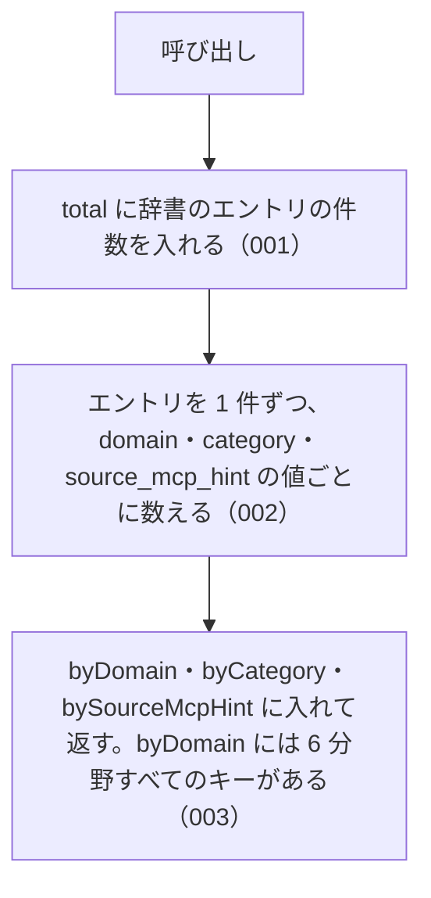

# getAbbreviationStats の仕様

<!-- GENERATED FILE — 手で編集しない。本文は houki-abbreviations の specs/current/get_abbreviation_stats/spec.md の写し。 -->

::: info
houki-abbreviations **v0.7.1** の `specs/current/get_abbreviation_stats/spec.md` から自動生成しました（仕様 ID 6 件・2026-10-10）。手で編集しないでください。再生成は `node scripts/generate-reference.mjs specs` です。
:::

辞書の件数を分野別・種別別・MCP 別に数えて返す

使いどころ・引数・実測の呼び出し例は、[関数のページ](/reference/lib/houki-abbreviations/get_abbreviation_stats)にあります。

最後に仕様が変わったのは v0.7.0 の「辞書の約束（名前の重なり・別名・告示）と、件数・近さの決め方」（2026-09-30 承認）です。それまでの経緯は[承認の履歴](#承認の履歴)にあります。

## 利用者と得られる結果

この機能の利用者と、利用者が渡すもの・得られる結果を示します。

- houki-hub family の MCP サーバーと、このパッケージを import する利用者のコード。起動時のログや診断で、取り込んだ辞書の件数を確かめるために呼ぶ

## 入力

呼び出すときに渡す値です。

引数は無い。

## 戻り値

呼び出しが返す値です。

`AbbreviationStats`。次の 4 つのフィールドを持つオブジェクト。

| フィールド        | 型                              | 内容                                                                                               |
| ----------------- | ------------------------------- | -------------------------------------------------------------------------------------------------- |
| `total`           | `number`                        | 辞書のエントリの件数                                                                               |
| `byDomain`        | `Record<Domain, number>`        | キーは `DOMAINS` の全値（定数の順）、値はその分野のエントリの件数。辞書に無い分野は `0`            |
| `byCategory`      | `Record<Category, number>`      | キーは `CATEGORIES` の全値（定数の順）、値はその種別のエントリの件数。辞書に無い種別は `0`         |
| `bySourceMcpHint` | `Record<SourceMcpHint, number>` | キーは `SOURCE_MCP_HINTS` の全値（定数の順）、値はその MCP のエントリの件数。辞書に無い MCP は `0` |

件数の実数（総数 174 など）は仕様に固定しない。エントリを足すたびに変わる。

例: v0.6.1 の辞書では次の値を返す（`byCategory` の `kokuji` は `spec/20261001-dictionary-rules` で足す種別）。

```json
{
  "total": 174,
  "byDomain": {
    "tax": 35,
    "labor": 28,
    "accounting": 9,
    "commercial": 31,
    "civil": 23,
    "administrative": 48
  },
  "byCategory": {
    "constitution": 1,
    "law": 138,
    "cabinet-order": 8,
    "imperial-ordinance": 0,
    "ministerial-ordinance": 16,
    "rule": 2,
    "kokuji": 0,
    "kihon-tsutatsu": 8,
    "kobetsu-tsutatsu": 1,
    "qa-jirei": 0,
    "tax-answer": 0,
    "hanrei": 0,
    "saiketsu": 0
  },
  "bySourceMcpHint": {
    "houki-egov": 165,
    "houki-nta": 9,
    "houki-mhlw": 0,
    "houki-jaish": 0,
    "houki-court": 0,
    "houki-saiketsu": 0
  }
}
```

## 扱わないこと

この機能が意図して扱わないことです。

- 分野などで絞り込んだ件数を返すこと（引数は無い。絞り込んだ一覧は `listByDomain` / `listByCategory` / `listBySourceMcpHint`）
- 辞書の版や更新日を返すこと
- 別名の件数や、名前（略称・正式名称・別名）の総数を返すこと
- 辞書の整合性を検査すること（`validateAllEntries`）

## 処理の流れ

図の中の番号は「できること」の仕様 ID の末尾 3 桁です。



## 仕様項目

この機能の仕様項目を、仕様 ID ごとに並べています。見出しは仕様項目を 1 文で表したもので、条件・応答の細部・例は「詳細」を開くと読めます。仕様 ID はそれぞれ受入テストと対応していて、テストの無い ID があると各リポジトリの CI が止まります。

<a id="spec-abbr-get-abbreviation-stats-001"></a>

### SPEC-ABBR-GET-ABBREVIATION-STATS-001 total は辞書のエントリの件数

::: details 詳細
`total` に、辞書の全エントリ（`abbreviationEntries`）の件数を返す。v0.6.0 では 174。
:::

<a id="spec-abbr-get-abbreviation-stats-002"></a>

### SPEC-ABBR-GET-ABBREVIATION-STATS-002 分野別・種別別・MCP 別の件数の合計は total と等しい

::: details 詳細
`byDomain` の値の合計、`byCategory` の値の合計、`bySourceMcpHint` の値の合計は、どれも `total` と等しい。1 件のエントリはそれぞれの内訳でちょうど 1 回ずつ数えられる。

例: v0.6.0 では `byDomain` の合計 35 + 28 + 9 + 31 + 23 + 48 = 174、`bySourceMcpHint` の合計 165 + 9 = 174。
:::

<a id="spec-abbr-get-abbreviation-stats-003"></a>

### SPEC-ABBR-GET-ABBREVIATION-STATS-003 byDomain には 6 分野すべてが 1 件以上で入る

::: details 詳細
`byDomain` には `DOMAINS` の 6 つの値（`tax` / `labor` / `accounting` / `commercial` / `civil` / `administrative`）すべてがキーとしてあり、どの値も 1 以上。
:::

<a id="spec-abbr-get-abbreviation-stats-004"></a>

### SPEC-ABBR-GET-ABBREVIATION-STATS-004 呼ぶたびに新しいオブジェクトを返す

::: details 詳細
呼ぶたびに新しいオブジェクトを返す。`byDomain`・`byCategory`・`bySourceMcpHint` も呼ぶたびに新しいオブジェクトになる。返したオブジェクトやその中の値を書き換えても、次の呼び出しの結果は変わらない。

例: `const s = getAbbreviationStats(); s.total = 0; s.byDomain.tax = 0; s.byCategory.law = 0` の後も、`getAbbreviationStats()` は `total: 174`、`byDomain.tax: 35`、`byCategory.law: 138` を返す。2 回呼んだ結果は別のオブジェクト（`!==`）で、`byDomain` なども別のオブジェクト。
:::

<a id="spec-abbr-get-abbreviation-stats-005"></a>

### SPEC-ABBR-GET-ABBREVIATION-STATS-005 byDomain・byCategory・bySourceMcpHint は定数の全値をキーに、定数の順で持つ

::: details 詳細
`byDomain` のキーは `DOMAINS` の全値、`byCategory` のキーは `CATEGORIES` の全値、`bySourceMcpHint` のキーは `SOURCE_MCP_HINTS` の全値で、それ以外のキーは無い。`Object.keys` の順は定数の順と同じ。

例: `Object.keys(getAbbreviationStats().byCategory)` は `[...CATEGORIES]` と同じ配列。`Object.keys(getAbbreviationStats().bySourceMcpHint)` は `[...SOURCE_MCP_HINTS]` と同じ配列（v0.6.1 では `['houki-egov', 'houki-nta']` の 2 つだけだった）。
:::

<a id="spec-abbr-get-abbreviation-stats-006"></a>

### SPEC-ABBR-GET-ABBREVIATION-STATS-006 辞書にエントリの無い値は 0 を返す

::: details 詳細
辞書に 1 件も無い分野・種別・MCP のキーの値は `0`。`undefined` にはしない。

例: `getAbbreviationStats().byCategory.hanrei` は `0`（v0.6.1 では `undefined`）。`getAbbreviationStats().bySourceMcpHint['houki-mhlw']` は `0`。`getAbbreviationStats().byCategory.law` は 1 以上。
:::

## 検討中のこと

仕様を書き起こしたときに見つかった項目のうち、扱いを Issue で検討しているものです。ここに挙げたことは、今後の版で変わることがあります。開くと、元の仕様書の記述をそのまま読めます。

::: details 仕様書の「未決」の節
初版起こしで見つけた、意図か不具合かを人が決める項目です。決まったら「できること」に ID を振るか、`specs/changes/` の差分にします。

意図か不具合かの判断が要る項目は houki-abbreviations の Issue に移し、ここには題と Issue の番号だけを残します。今の振る舞いのままでよくテストが無いだけの項目は、受入テストを書いてから「できること」に ID を振ります。

1. **件数が 0 の種別と MCP はキーが無い。** → [SPEC-ABBR-GET-ABBREVIATION-STATS-005](#spec-abbr-get-abbreviation-stats-005)、[SPEC-ABBR-GET-ABBREVIATION-STATS-006](#spec-abbr-get-abbreviation-stats-006)
2. **`AbbreviationStats` のキーの型が `string`。** → 「戻り値」の型（`Record<Domain, number>` / `Record<Category, number>` / `Record<SourceMcpHint, number>`）
3. **返すオブジェクトは呼ぶたびに新しい。** → [SPEC-ABBR-GET-ABBREVIATION-STATS-004](#spec-abbr-get-abbreviation-stats-004)
4. **キーの並び。** → [SPEC-ABBR-GET-ABBREVIATION-STATS-005](#spec-abbr-get-abbreviation-stats-005)
:::

## 承認の履歴

この機能の仕様が、いつ、どの変更で承認されたかを新しい順に並べています。各リポジトリの `npx spec-ids history get_abbreviation_stats` と同じ内容です。変更の名前から、変更の理由と前後の振る舞いを書いた文書（GitHub）を開けます。

::: details 承認の履歴（4 件）
| 承認日 | 版 | 変更 | 仕様 PR |
|---|---|---|---|
| 2026-09-30 | v0.7.0 | [辞書の約束（名前の重なり・別名・告示）と、件数・近さの決め方](https://github.com/shuji-bonji/houki-abbreviations/blob/v0.7.1/specs/releases/v0.7.0/20261001-dictionary-rules/proposal.md) | [#32](https://github.com/shuji-bonji/houki-abbreviations/pull/32) |
| 2026-09-27 | v0.6.1 | [テストが無いだけの振る舞いに仕様 ID を振る](https://github.com/shuji-bonji/houki-abbreviations/blob/v0.7.1/specs/releases/v0.6.1/20260927-untested-behaviors/proposal.md) | [#27](https://github.com/shuji-bonji/houki-abbreviations/pull/27) |
| 2026-09-27 | v0.6.1 | [「未決」のうち判断が要る 52 件を Issue に移す](https://github.com/shuji-bonji/houki-abbreviations/blob/v0.7.1/specs/releases/v0.6.1/20260927-undecided-to-issues/proposal.md) | [#26](https://github.com/shuji-bonji/houki-abbreviations/pull/26) |
| 2026-09-27 | — | 初版 | [#10](https://github.com/shuji-bonji/houki-abbreviations/pull/10) |
:::

## 関連ページ

このページの元になった文書と、あわせて読むページです。

- [houki-abbreviations の仕様の一覧](/specs/houki-abbreviations/)
- [houki-abbreviations の解説](/lib/houki-abbreviations)
- [getAbbreviationStats の関数のページ（リファレンス）](/reference/lib/houki-abbreviations/get_abbreviation_stats)
- [元の仕様書（GitHub、v0.7.1）](https://github.com/shuji-bonji/houki-abbreviations/blob/v0.7.1/specs/current/get_abbreviation_stats/spec.md)
