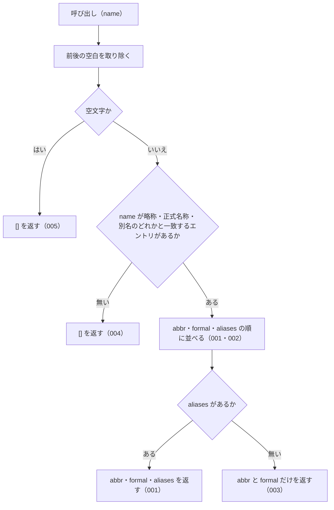

# getAllNames の仕様

<!-- GENERATED FILE — 手で編集しない。本文は houki-abbreviations の specs/current/get_all_names/spec.md の写し。 -->

::: info
houki-abbreviations **v0.7.0** の `specs/current/get_all_names/spec.md` から自動生成しました（仕様 ID 10 件・2026-10-10）。手で編集しないでください。再生成は `node scripts/generate-reference.mjs specs` です。
:::

略称・正式名称・別名のどれかから、そのエントリの名前をすべて返す

使いどころ・引数・実測の呼び出し例は、[関数のページ](/reference/lib/houki-abbreviations/get_all_names)にあります。

最後に仕様が変わったのは v0.7.0 の「辞書の約束（名前の重なり・別名・告示）と、件数・近さの決め方」（2026-09-30 承認）です。それまでの経緯は[承認の履歴](#承認の履歴)にあります。

## 利用者と得られる結果

この機能の利用者と、利用者が渡すもの・得られる結果を示します。

- houki-abbreviations を import する利用者（houki-egov-mcp・houki-nta-mcp などの MCP サーバー、またはアプリケーション）。法令・通達の名前を 1 つ渡して、同じ法令・通達を指す名前（略称・正式名称・別名）の一覧を受け取る。LLM のプロンプトに「この法令はこれらの名前でも呼ばれる」と書くときに使う

## 入力

呼び出すときに渡す値です。

| 引数                | 必須 | 内容                                                                                                                                                        |
| ------------------- | ---- | ----------------------------------------------------------------------------------------------------------------------------------------------------------- |
| `name`              | 必須 | 辞書の略称（`abbr`）・正式名称（`formal`）・別名（`aliases`）のどれか。例: `消法` / `消費税法` / `インボイス`。完全一致で引く                               |
| `options.normalize` | 任意 | `true` なら、`name` と辞書の名前の両方を `normalizeJpText` に通してから比べる（全角英数字・ダッシュ類・全角チルダ・全角スペースを半角にする）。既定 `false` |

型は `GetAllNamesOptions`（`{ normalize?: boolean }`）。`resolveAbbreviation` の `options.normalize` と同じ意味で、既定も同じ `false`。houki-egov-mcp・houki-nta-mcp は入口で `normalize: true` を渡す。

## 戻り値

呼び出しが返す値です。

`string[]`。

- 見つかったとき: そのエントリの `abbr`、`formal`、`aliases` をこの順に並べた配列
- 見つからないとき、`name` が空文字・空白だけのとき: 空配列 `[]`（`null` ではない）

## 扱わないこと

この機能が意図して扱わないことです。

- 部分一致やあいまい一致で探すこと（完全一致だけ。部分一致は `searchByName`、似た名前の候補は `findSimilar` / `suggestCorrection`）
- エントリそのもの（`law_id`・`domain` など）を返すこと（`resolveAbbreviation`）
- e-Gov の法令 ID や法令番号から名前を引くこと（`lookupByLawId` / `lookupByLawNum` でエントリを引いてから、その `abbr` を渡す）
- 1 回の呼び出しで複数の名前を引くこと

## 処理の流れ

図の中の番号は「できること」の仕様 ID の末尾 3 桁です。

## 仕様項目

この機能の仕様項目を、仕様 ID ごとに並べています。見出しは仕様項目を 1 文で表したもので、条件・応答の細部・例は「詳細」を開くと読めます。仕様 ID はそれぞれ受入テストと対応していて、テストの無い ID があると各リポジトリの CI が止まります。

### SPEC-ABBR-GET-ALL-NAMES-001 略称からそのエントリの名前を abbr・formal・aliases の順ですべて返す

::: details 詳細
`name` が辞書のエントリの `abbr` と一致するとき、そのエントリの `abbr`、`formal`、`aliases` をこの順に並べた配列を返す。`aliases` の中の順番は辞書のまま。

例: `getAllNames('消法')` は `['消法', '消費税法', '消費税', 'インボイス', 'インボイス制度', '適格請求書', '適格請求書等保存方式', '適格請求書発行事業者', '軽減税率', '軽減税率制度', '簡易課税', '簡易課税制度']`（v0.6.0 の辞書で 12 件）。
:::

### SPEC-ABBR-GET-ALL-NAMES-002 正式名称や別名から引いても略称から引いたときと同じ配列を返す

::: details 詳細
`name` が `formal` または `aliases` のどれかと一致するときも、[SPEC-ABBR-GET-ALL-NAMES-001](#spec-abbr-get-all-names-001) と同じ配列を返す。先頭は常に `abbr` で、渡した名前が先頭に来るわけではない。

例: `getAllNames('消費税法')` と `getAllNames('インボイス')` は、どちらも `getAllNames('消法')` と同じ配列。
:::

### SPEC-ABBR-GET-ALL-NAMES-003 別名の無いエントリには abbr と formal だけを返す

::: details 詳細
エントリに `aliases` が無いときは、`abbr` と `formal` の 2 つだけを返す。

例: fixtures の `憲`（`aliases` 無し）では `['憲', '日本国憲法']`。v0.6.0 の辞書の `憲` には別名 `憲法` があるので、`getAllNames('憲')` は `['憲', '日本国憲法', '憲法']`。
:::

### SPEC-ABBR-GET-ALL-NAMES-004 一致するエントリが無ければ空配列を返す

::: details 詳細
どのエントリの略称・正式名称・別名とも一致しないときは `[]` を返す。`null` は返さず、例外も投げない。

例: `getAllNames('存在しない')` は `[]`。
:::

### SPEC-ABBR-GET-ALL-NAMES-005 空文字・空白だけの name には空配列を返す

::: details 詳細
`name` が空文字、または空白だけのときは、辞書を照合せずに `[]` を返す。

例: `getAllNames('')` と `getAllNames('   ')` はどちらも `[]`。
:::

### SPEC-ABBR-GET-ALL-NAMES-006 同じ文字列の名前は最初の 1 つだけを返す

::: details 詳細
エントリの `abbr`・`formal`・`aliases` に同じ文字列が 2 回以上あるときは、`abbr`・`formal`・`aliases` の順で最初に出たものだけを残し、後のものは返さない。残した名前の順は [SPEC-ABBR-GET-ALL-NAMES-001](#spec-abbr-get-all-names-001) と同じ。

例: `abbr` と `formal` がどちらも `酒税法` のエントリでは、`getAllNames('酒税法')` は `['酒税法']`。`abbr` と `formal` がどちらも `製造物責任法` で別名 `PL法` を持つエントリでは、`getAllNames('PL法')` は `['製造物責任法', 'PL法']`。0.7.0 の辞書では `aliases` に自分の `abbr` / `formal` と同じ値を入れない（[SPEC-ABBR-ABBREVIATION-ENTRIES-018](/specs/houki-abbreviations/abbreviation_entries#spec-abbr-abbreviation-entries-018)）ので、重なるのは `abbr` と `formal` が同じ場合だけ。
:::

### SPEC-ABBR-GET-ALL-NAMES-007 name の前後の空白を除いてから引く

::: details 詳細
`name` の前後にある空白（スペース・タブ・改行）を取り除いてから辞書と照合する。

例: `getAllNames(' 消法 ')` と `getAllNames('\t消費税法\n')` は、どちらも `getAllNames('消法')` と同じ配列。
:::

### SPEC-ABBR-GET-ALL-NAMES-008 呼ぶたびに新しい配列を返す

::: details 詳細
戻り値は呼び出しごとに作った配列で、書き換えても辞書や次の呼び出しの結果は変わらない。

例: `getAllNames('消法')` の戻り値に `push('x')` し、先頭を `'y'` に書き換えても、次の `getAllNames('消法')` は先頭が `消法` の 12 件。2 回の呼び出しの戻り値は同じ配列（`===`）ではない。
:::

### SPEC-ABBR-GET-ALL-NAMES-009 normalize: true では全角英数字・ダッシュ類を半角にしてから引く

::: details 詳細
`options.normalize` が `true` のとき、`name` と辞書の名前の両方を `normalizeJpText` に通して比べる。返す名前は辞書に書かれた表記のままで、半角にした文字列は返さない。前後の空白も除く。

例: `getAllNames('ＰＬ法', { normalize: true })` は `['製造物責任法', 'PL法']`（`getAllNames('PL法')` と同じ配列）。`getAllNames('　消法　', { normalize: true })` は `getAllNames('消法')` と同じ配列。
:::

### SPEC-ABBR-GET-ALL-NAMES-010 normalize を省くか false にすると全角と半角を別の文字として引く

::: details 詳細
`options` を渡さないとき、`{}`、`{ normalize: false }` のどれでも、全角と半角の違いは吸収しない。v0.6.1 までの `getAllNames(name)` と同じ結果を返す。

例: `getAllNames('ＰＬ法')`、`getAllNames('ＰＬ法', {})`、`getAllNames('ＰＬ法', { normalize: false })` はどれも `[]`。`getAllNames('PL法', { normalize: false })` は `['製造物責任法', 'PL法']`。
:::

## 検討中のこと

仕様を書き起こしたときに見つかった項目のうち、扱いを Issue で検討しているものです。ここに挙げたことは、今後の版で変わることがあります。開くと、元の仕様書の記述をそのまま読めます。

::: details 仕様書の「未決」の節
初版起こしで見つけた、意図か不具合かを人が決める項目です。決まったら「できること」に ID を振るか、`specs/changes/` の差分にします。

意図か不具合かの判断が要る項目は houki-abbreviations の Issue に移し、ここには題と Issue の番号だけを残します。今の振る舞いのままでよくテストが無いだけの項目は、受入テストを書いてから「できること」に ID を振ります。

1. **同じ名前の重複を除く。** → [SPEC-ABBR-GET-ALL-NAMES-006](#spec-abbr-get-all-names-006)
2. **前後の空白を無視する。** → [SPEC-ABBR-GET-ALL-NAMES-007](#spec-abbr-get-all-names-007)
3. **全角・半角の表記ゆれを吸収しない。** → [SPEC-ABBR-GET-ALL-NAMES-009](#spec-abbr-get-all-names-009)、[SPEC-ABBR-GET-ALL-NAMES-010](#spec-abbr-get-all-names-010)
4. **複数のエントリが同じ名前を持つときにどれを返すか。** → [SPEC-ABBR-ABBREVIATION-ENTRIES-017](/specs/houki-abbreviations/abbreviation_entries#spec-abbr-abbreviation-entries-017)（名前は重ならない）
5. **呼ぶたびに新しい配列を返す。** → [SPEC-ABBR-GET-ALL-NAMES-008](#spec-abbr-get-all-names-008)
:::

## 承認の履歴

この機能の仕様が、いつ、どの変更で承認されたかを新しい順に並べています。各リポジトリの `npx spec-ids history get_all_names` と同じ内容です。変更の名前から、変更の理由と前後の振る舞いを書いた文書（GitHub）を開けます。

::: details 承認の履歴（5 件）
| 承認日 | 版 | 変更 | 仕様 PR |
|---|---|---|---|
| 2026-09-30 | v0.7.0 | [辞書の約束（名前の重なり・別名・告示）と、件数・近さの決め方](https://github.com/shuji-bonji/houki-abbreviations/blob/v0.7.0/specs/releases/v0.7.0/20261001-dictionary-rules/proposal.md) | [#32](https://github.com/shuji-bonji/houki-abbreviations/pull/32) |
| 2026-09-30 | v0.7.0 | [関数ごとの全角・ダッシュ類・大文字の扱いを揃える（T3 正規化）](https://github.com/shuji-bonji/houki-abbreviations/blob/v0.7.0/specs/releases/v0.7.0/20261001-normalize/proposal.md) | [#30](https://github.com/shuji-bonji/houki-abbreviations/pull/30) |
| 2026-09-27 | v0.6.1 | [テストが無いだけの振る舞いに仕様 ID を振る](https://github.com/shuji-bonji/houki-abbreviations/blob/v0.7.0/specs/releases/v0.6.1/20260927-untested-behaviors/proposal.md) | [#27](https://github.com/shuji-bonji/houki-abbreviations/pull/27) |
| 2026-09-27 | v0.6.1 | [「未決」のうち判断が要る 52 件を Issue に移す](https://github.com/shuji-bonji/houki-abbreviations/blob/v0.7.0/specs/releases/v0.6.1/20260927-undecided-to-issues/proposal.md) | [#26](https://github.com/shuji-bonji/houki-abbreviations/pull/26) |
| 2026-09-27 | — | 初版 | [#10](https://github.com/shuji-bonji/houki-abbreviations/pull/10) |
:::

## 関連ページ

このページの元になった文書と、あわせて読むページです。

- [houki-abbreviations の仕様の一覧](/specs/houki-abbreviations/)
- [houki-abbreviations の解説](/lib/houki-abbreviations)
- [getAllNames の関数のページ（リファレンス）](/reference/lib/houki-abbreviations/get_all_names)
- [元の仕様書（GitHub、v0.7.0）](https://github.com/shuji-bonji/houki-abbreviations/blob/v0.7.0/specs/current/get_all_names/spec.md)
