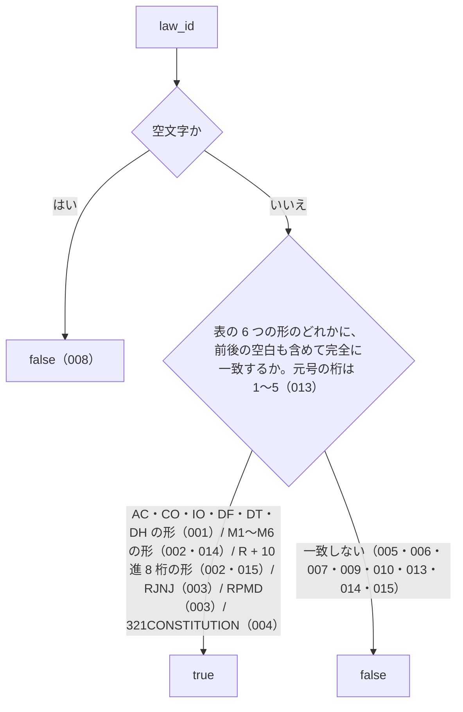

# isValidLawId の仕様

<!-- GENERATED FILE — 手で編集しない。本文は houki-abbreviations の specs/current/is_valid_law_id/spec.md の写し。 -->

::: info
houki-abbreviations **v0.7.0** の `specs/current/is_valid_law_id/spec.md` から自動生成しました（仕様 ID 15 件・2026-10-10）。手で編集しないでください。再生成は `node scripts/generate-reference.mjs specs` です。
:::

文字列が e-Gov の law_id の形をしているかを判定する

使いどころ・引数・実測の呼び出し例は、[関数のページ](/reference/lib/houki-abbreviations/is_valid_law_id)にあります。

最後に仕様が変わったのは v0.7.0 の「引数の検査を「丸めない」に揃える（limit・取得時刻・law_id の形）」（2026-09-30 承認）です。それまでの経緯は[承認の履歴](#承認の履歴)にあります。

## 利用者と得られる結果

この機能の利用者と、利用者が渡すもの・得られる結果を示します。

- houki-abbreviations を import する側（houki-egov-mcp・houki-nta-mcp などの MCP サーバー、辞書を検査する `validateAllEntries`、辞書のテスト）。`law_id` を渡して、e-Gov の法令 ID として形が正しいかを `true` / `false` で受け取る

## 入力

呼び出すときに渡す値です。

| 引数     | 必須 | 内容                                                                                    |
| -------- | ---- | --------------------------------------------------------------------------------------- |
| `law_id` | 必須 | 判定する文字列。例: `363AC0000000108`。前後の空白は取り除かない（呼び出し側で取り除く） |

## 戻り値

呼び出しが返す値です。

`boolean`。下の表のどれかの形に一致すれば `true`、それ以外は `false`。例外は投げない。

受け付ける `law_id` の形は e-Gov の公式仕様（法令データ ドキュメンテーション「法令種別と法令ID」 https://laws.e-gov.go.jp/docs/law-data-basic/607318a-lawtypes-and-lawid/ ）に合わせた次の 6 つで、長さはどれも 15 文字、英字は大文字だけです。件数は 2026-09-30 に e-Gov 法令 API v2 `GET /api/2/laws` で取得した全 9,570 件の内訳で、6 つの形で全件が `true` になります。

| 形                                                                           | 対象                                               | 件数  | 例                                    |
| ---------------------------------------------------------------------------- | -------------------------------------------------- | ----- | ------------------------------------- |
| 元号 1 桁 + 年 2 桁 + `AC` / `CO` / `IO` / `DF` / `DT` / `DH` + 数字 10 桁   | 法律・政令・勅令・太政官布告・太政官達・太政官布達 | 4,677 | `363AC0000000108`（消費税法）         |
| 元号 1 桁 + 年 2 桁 + `M` + `1`〜`6` + 数字と `A`〜`F` の 7 文字 + 数字 3 桁 | 府省令（`M1`〜`M6` は府省令ビットフラグの世代）    | 4,687 | `340M50000040011`（所得税法施行規則） |
| 元号 1 桁 + 年 2 桁 + `R` + 数字 8 桁 + 数字 3 桁                            | 会計検査院規則、行政機関の規則、その他機関の規則   | 49    | `322R00000001001`（会計検査院規則）   |
| 元号 1 桁 + 年 2 桁 + `RJNJ` + 数字 8 桁                                     | 人事院規則                                         | 142   | `324RJNJ01001000`                     |
| 元号 1 桁 + 年 2 桁 + `RPMD` + 数字 8 桁                                     | 内閣総理大臣決定                                   | 14    | `351RPMD12230000`                     |
| `321CONSTITUTION`                                                            | 日本国憲法（昭和二十一年憲法の 1 件だけ）          | 1     | `321CONSTITUTION`                     |

元号の 1 桁は `1`（明治）`2`（大正）`3`（昭和）`4`（平成）`5`（令和）のどれか。年の 2 桁は 0 埋めで、値の範囲は確かめない。`R` の後の機関番号は 10 進の 8 桁で、値の範囲（公式仕様の `00000001`〜`00000019`）は確かめない。`DH`（太政官布達）は公式仕様にあり、2026-09-30 の e-Gov には 0 件。`AC` などの 6〜12 桁目（閣法・議員立法・効力の区別）の値は確かめない。

## 扱わないこと

この機能が意図して扱わないことです。

- その `law_id` の法令が e-Gov に実在するかを確かめること（形だけを見る。実在の確認は e-Gov API を呼ぶ `scripts/verify-law-ids.mjs` で、パッケージには含まれない）
- `law_id` から法令名やエントリを引くこと（`lookupByLawId`）
- 前後の空白・全角文字・小文字を直して判定すること（直さずに `false` を返す）
- 法令番号（`昭和六十三年法律第百八号` の形）を判定すること（`law_num` は対象外。表記を揃えるのは `normalizeLawNum`）

## 処理の流れ

図の中の番号は「できること」の仕様 ID の末尾 3 桁です。

## 仕様項目

この機能の仕様項目を、仕様 ID ごとに並べています。見出しは仕様項目を 1 文で表したもので、条件・応答の細部・例は「詳細」を開くと読めます。仕様 ID はそれぞれ受入テストと対応していて、テストの無い ID があると各リポジトリの CI が止まります。

### SPEC-ABBR-IS-VALID-LAW-ID-001 法律・政令・勅令・太政官布告・太政官達・太政官布達の形を受け付ける

::: details 詳細
元号 1 桁（`1`〜`5`）+ 年 2 桁 + `AC` / `CO` / `IO` / `DF` / `DT` / `DH` のどれか + 数字 10 桁の 15 文字なら `true` を返す。

例: `363AC0000000108`（法律）、`505CO0000000034`（政令）、`320IO0000000730`（勅令）、`105DF0000000337`（太政官布告）、`108DT0000000152`（太政官達）、`106DH0000000016`（太政官布達）は、どれも `true`。`DH` は v0.7.0 から受け付ける。
:::

### SPEC-ABBR-IS-VALID-LAW-ID-002 府省令の M の形と、機関の規則の R の形を受け付ける

::: details 詳細
元号 1 桁 + 年 2 桁 + `M` + `1`〜`6` の 1 桁 + 数字と大文字 `A`〜`F` からなる 7 文字（府省令ビットフラグの 16 進数）+ 数字 3 桁の 15 文字、または元号 1 桁 + 年 2 桁 + `R` + 数字 8 桁（機関番号）+ 数字 3 桁の 15 文字なら `true` を返す。

例: `340M50000040011`（所得税法施行規則）、`415M60000F4A003`（共同省令）、`122M10000001012`（明治の閣令）、`322R00000001001`（会計検査院規則）、`326R00000002002`（海上保安庁令）は `true`。`415M60000G4A003`（`G` は 16 進数に無い）は `false`。
:::

### SPEC-ABBR-IS-VALID-LAW-ID-003 人事院規則と内閣総理大臣決定の形を受け付ける

::: details 詳細
数字 3 桁 + `RJNJ` + 数字 8 桁、または数字 3 桁 + `RPMD` + 数字 8 桁なら `true` を返す。v0.6.0 から受け付ける。

例: `324RJNJ01001000`（人事院規則一―一）と `351RPMD12230000`（内閣総理大臣決定）は `true`。
:::

### SPEC-ABBR-IS-VALID-LAW-ID-004 憲法の形を受け付ける

::: details 詳細
`321CONSTITUTION` だけを `true` にする。e-Gov にある憲法は昭和二十一年憲法（日本国憲法）の 1 件だけなので、先頭 3 桁が `321` 以外の `CONSTITUTION` は受け付けない。

例: `321CONSTITUTION` は `true`。`363CONSTITUTION` と `521CONSTITUTION` は `false`（v0.6.1 では `true`）。
:::

### SPEC-ABBR-IS-VALID-LAW-ID-005 e-Gov に無い MO・RU の形は受け付けない

::: details 詳細
種別が `MO` / `RU` の形は `false` を返す。v0.5.x では `true` だった（e-Gov の実データに 1 件も無いため v0.6.0 で外した）。

例: `505MO0000000020` と `505RU0000000001` は `false`。
:::

### SPEC-ABBR-IS-VALID-LAW-ID-006 知らない種別コードは受け付けない

::: details 詳細
表の 5 つの形に無い種別コードなら、長さが 15 文字でも `false` を返す。

例: `363XX0000000108` は `false`。
:::

### SPEC-ABBR-IS-VALID-LAW-ID-007 15 文字でなければ受け付けない

::: details 詳細
長さが足りない、または余る文字列は `false` を返す。

例: `363AC123`（8 文字）と `363AC00000001080`（16 文字）は `false`。
:::

### SPEC-ABBR-IS-VALID-LAW-ID-008 空文字は受け付けない

::: details 詳細
`''` は `false` を返す。
:::

### SPEC-ABBR-IS-VALID-LAW-ID-009 前後の空白を取り除かない

::: details 詳細
前後に空白が付いた文字列は、空白を取り除けば正しい形でも `false` を返す。空白を取り除くのは呼び出し側。

例: `' 363AC0000000108'` は `false`。
:::

### SPEC-ABBR-IS-VALID-LAW-ID-010 小文字の英字は受け付けない

::: details 詳細
英字が小文字なら `false` を返す（e-Gov の law_id は英字が大文字）。

例: `363ac0000000108` は `false`。
:::

### SPEC-ABBR-IS-VALID-LAW-ID-011 文字列でない値は受け付けない

::: details 詳細
`law_id` に文字列でない値を渡すと `false` を返す。

例: `null`、`undefined`、`123` は、どれも `false`。
:::

### SPEC-ABBR-IS-VALID-LAW-ID-012 全角の英数字は受け付けない

::: details 詳細
英字か数字のどれかが全角なら `false` を返す。半角に直してから判定することはしない。

例: `363ＡC0000000108`（`Ａ` が全角）と `363AC000000010８`（`８` が全角）は `false`。
:::

### SPEC-ABBR-IS-VALID-LAW-ID-013 元号の桁が 1〜5 以外なら受け付けない

::: details 詳細
先頭の 1 桁が `1`〜`5` でなければ、残りが正しい形でも `false` を返す。

例: `000AC0000000000`、`699AC0000000001`、`999AC9999999999`、`040M50000040011`、`924RJNJ01001000` は、どれも `false`（v0.6.1 では `true`）。`105DF0000000337`（明治）と `501M60000F00006`（令和）は `true`。
:::

### SPEC-ABBR-IS-VALID-LAW-ID-014 M の次の 1 桁が 1〜6 以外なら受け付けない

::: details 詳細
府省令の形で `M` の次の 1 桁が `0`、`7`〜`9`、`A`〜`F` のときは `false` を返す。

例: `340M00000040011`、`340M70000040011`、`340MF0000040011` は、どれも `false`（v0.6.1 では `true`）。`340M10000040011` と `340M60000040011` は `true`。
:::

### SPEC-ABBR-IS-VALID-LAW-ID-015 R の機関番号に英字があれば受け付けない

::: details 詳細
`R` の後の 8 桁は 10 進の数字だけ。`A`〜`F` を含むと `false` を返す。`M` の形（16 進数）とは違う。

例: `322R0000000A001` と `322RA000000A001` は `false`（v0.6.1 では `true`）。`322R00000001001` は `true`。
:::

## 検討中のこと

仕様を書き起こしたときに見つかった項目のうち、扱いを Issue で検討しているものです。ここに挙げたことは、今後の版で変わることがあります。開くと、元の仕様書の記述をそのまま読めます。

::: details 仕様書の「未決」の節
初版起こしで見つけた、意図か不具合かを人が決める項目です。決まったら「できること」に ID を振るか、`specs/changes/` の差分にします。

意図か不具合かの判断が要る項目は houki-abbreviations の Issue に移し、ここには題と Issue の番号だけを残します。今の振る舞いのままでよくテストが無いだけの項目は、受入テストを書いてから「できること」に ID を振ります。

1. **先頭 3 桁（元号と年）の値を確かめない。** → [SPEC-ABBR-IS-VALID-LAW-ID-013](#spec-abbr-is-valid-law-id-013)
2. **M の形の府省コードの 1 文字目が、実装の注記と違う範囲まで通る。** → [SPEC-ABBR-IS-VALID-LAW-ID-014](#spec-abbr-is-valid-law-id-014)、[SPEC-ABBR-IS-VALID-LAW-ID-015](#spec-abbr-is-valid-law-id-015)
3. **文字列でない値は `false`。** → [SPEC-ABBR-IS-VALID-LAW-ID-011](#spec-abbr-is-valid-law-id-011)
4. **全角の英数字は `false`。** → [SPEC-ABBR-IS-VALID-LAW-ID-012](#spec-abbr-is-valid-law-id-012)
:::

## 承認の履歴

この機能の仕様が、いつ、どの変更で承認されたかを新しい順に並べています。各リポジトリの `npx spec-ids history is_valid_law_id` と同じ内容です。変更の名前から、変更の理由と前後の振る舞いを書いた文書（GitHub）を開けます。

::: details 承認の履歴（4 件）
| 承認日 | 版 | 変更 | 仕様 PR |
|---|---|---|---|
| 2026-09-30 | v0.7.0 | [引数の検査を「丸めない」に揃える（limit・取得時刻・law_id の形）](https://github.com/shuji-bonji/houki-abbreviations/blob/v0.7.0/specs/releases/v0.7.0/20261001-input-guards/proposal.md) | [#31](https://github.com/shuji-bonji/houki-abbreviations/pull/31) |
| 2026-09-27 | v0.6.1 | [テストが無いだけの振る舞いに仕様 ID を振る](https://github.com/shuji-bonji/houki-abbreviations/blob/v0.7.0/specs/releases/v0.6.1/20260927-untested-behaviors/proposal.md) | [#27](https://github.com/shuji-bonji/houki-abbreviations/pull/27) |
| 2026-09-27 | v0.6.1 | [「未決」のうち判断が要る 52 件を Issue に移す](https://github.com/shuji-bonji/houki-abbreviations/blob/v0.7.0/specs/releases/v0.6.1/20260927-undecided-to-issues/proposal.md) | [#26](https://github.com/shuji-bonji/houki-abbreviations/pull/26) |
| 2026-09-27 | — | 初版 | [#10](https://github.com/shuji-bonji/houki-abbreviations/pull/10) |
:::

## 関連ページ

このページの元になった文書と、あわせて読むページです。

- [houki-abbreviations の仕様の一覧](/specs/houki-abbreviations/)
- [houki-abbreviations の解説](/lib/houki-abbreviations)
- [isValidLawId の関数のページ（リファレンス）](/reference/lib/houki-abbreviations/is_valid_law_id)
- [元の仕様書（GitHub、v0.7.0）](https://github.com/shuji-bonji/houki-abbreviations/blob/v0.7.0/specs/current/is_valid_law_id/spec.md)
