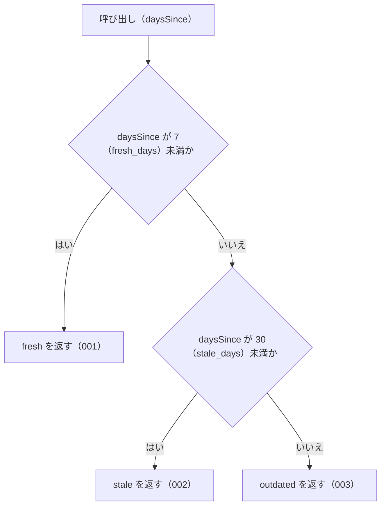

# judgeStaleness の仕様

<!-- GENERATED FILE — 手で編集しない。本文は houki-abbreviations の specs/current/judge_staleness/spec.md の写し。 -->

::: info
houki-abbreviations **v0.7.0** の `specs/current/judge_staleness/spec.md` から自動生成しました（仕様 ID 6 件・2026-10-10）。手で編集しないでください。再生成は `node scripts/generate-reference.mjs specs` です。
:::

経過日数から鮮度の段階を返す

使いどころ・引数・実測の呼び出し例は、[関数のページ](/reference/lib/houki-abbreviations/judge_staleness)にあります。

最後に仕様が変わったのは v0.7.0 の「引数の検査を「丸めない」に揃える（limit・取得時刻・law_id の形）」（2026-09-30 承認）です。それまでの経緯は[承認の履歴](#承認の履歴)にあります。

## 利用者と得られる結果

この機能の利用者と、利用者が渡すもの・得られる結果を示します。

- houki-hub family の MCP サーバー（houki-nta-mcp など）。`computeDaysSince` で得た経過日数を渡して鮮度の段階を受け取り、自分の応答（取得した文書がどれだけ古いか）に載せる。family のどの MCP サーバーも同じ境界で判定するためにこの関数を使う

## 入力

呼び出すときに渡す値です。

| 引数        | 必須 | 内容                                                                                                                                                                          |
| ----------- | ---- | ----------------------------------------------------------------------------------------------------------------------------------------------------------------------------- |
| `daysSince` | 必須 | 経過日数。0 以上の有限の数。通常は `computeDaysSince` の戻り値を渡す。小数でもよい。負の値、`NaN`、`Infinity`、`-Infinity` は `RangeError`、数でない値は `TypeError` を投げる |

## 戻り値

呼び出しが返す値です。

`StalenessLevel`。次の 3 つの文字列のどれか 1 つ。この 3 つの値は family の MCP サーバーの応答に使われるので変えない。

| 値           | 意味                                                           |
| ------------ | -------------------------------------------------------------- |
| `"fresh"`    | 最近取得した。そのまま使ってよい                               |
| `"stale"`    | やや古い。使ってよいが、MCP サーバーが再取得を勧める警告を出す |
| `"outdated"` | 古い。使う前に再取得を勧める                                   |

境界の日数は `STALENESS_THRESHOLDS`（`fresh_days: 7`、`stale_days: 30`）。

## 扱わないこと

この機能が意図して扱わないことです。

- 取得時刻から経過日数を数えること（`computeDaysSince`）
- MCP サーバーごとに違う境界で判定すること（境界は `STALENESS_THRESHOLDS` の値に固定。違う境界が要る MCP サーバーは、この関数を使わずに自分の判定関数を書く）
- 警告の文言や再取得の手順を返すこと（各 MCP サーバーが持つ）

## 処理の流れ

図の中の番号は「できること」の仕様 ID の末尾 3 桁です。

## 仕様項目

この機能の仕様項目を、仕様 ID ごとに並べています。見出しは仕様項目を 1 文で表したもので、条件・応答の細部・例は「詳細」を開くと読めます。仕様 ID はそれぞれ受入テストと対応していて、テストの無い ID があると各リポジトリの CI が止まります。

### SPEC-ABBR-JUDGE-STALENESS-001 7 日未満なら fresh を返す

::: details 詳細
`daysSince` が `STALENESS_THRESHOLDS.fresh_days`（7）未満のとき `"fresh"` を返す。

例: `0` → `"fresh"`、`6` → `"fresh"`。`computeDaysSince` で 4 日前の取得時刻から数えた値（4）→ `"fresh"`。
:::

### SPEC-ABBR-JUDGE-STALENESS-002 7 日以上 30 日未満なら stale を返す

::: details 詳細
`daysSince` が `fresh_days`（7）以上で `STALENESS_THRESHOLDS.stale_days`（30）未満のとき `"stale"` を返す。ちょうど 7 日は `"stale"`。

例: `7` → `"stale"`、`29` → `"stale"`。`computeDaysSince` で 14 日前の取得時刻から数えた値（14）→ `"stale"`。
:::

### SPEC-ABBR-JUDGE-STALENESS-003 30 日以上なら outdated を返す

::: details 詳細
`daysSince` が `stale_days`（30）以上のとき `"outdated"` を返す。ちょうど 30 日は `"outdated"`。

例: `30` → `"outdated"`、`100` → `"outdated"`。`computeDaysSince` で 2 か月前（`2026-03-08T00:00:00Z` から `2026-05-08T00:00:00Z`）の値（61）→ `"outdated"`。
:::

### SPEC-ABBR-JUDGE-STALENESS-004 小数の日数も境界の値と「未満」で比べて判定する

::: details 詳細
`daysSince` が小数でも、整数のときと同じく `fresh_days`（7）・`stale_days`（30）と「未満」で比べて段階を返す。丸めはしない。

例: `6.99` → `"fresh"`、`29.5` → `"stale"`、`29.999` → `"stale"`、`30.0` → `"outdated"`。
:::

### SPEC-ABBR-JUDGE-STALENESS-005 負の値には RangeError を投げる

::: details 詳細
`daysSince` が負の値のときは、`"fresh"` を返さずに `RangeError` を投げる。0 に丸めるのは呼び出し側の責任にしない。

例: `judgeStaleness(-5)` と `judgeStaleness(-0.5)` は `RangeError`（v0.6.1 では `"fresh"`）。`judgeStaleness(0)` は `"fresh"`。
:::

### SPEC-ABBR-JUDGE-STALENESS-006 NaN・Infinity・数でない値には例外を投げる

::: details 詳細
`daysSince` が `NaN` か `Infinity` か `-Infinity` のときは `RangeError`、数でない値（文字列・`null`・`undefined` など）のときは `TypeError` を投げる。3 つの段階のどれにも当てはめない。

例: `judgeStaleness(NaN)` は `RangeError`（v0.6.1 では `"outdated"`）。`judgeStaleness(Infinity)` と `judgeStaleness(-Infinity)` も `RangeError`（v0.6.1 では `"outdated"` と `"fresh"`）。`judgeStaleness('7')`、`judgeStaleness(null)`、`judgeStaleness(undefined)` は `TypeError`。
:::

## 検討中のこと

仕様を書き起こしたときに見つかった項目のうち、扱いを Issue で検討しているものです。ここに挙げたことは、今後の版で変わることがあります。開くと、元の仕様書の記述をそのまま読めます。

::: details 仕様書の「未決」の節
初版起こしで見つけた、意図か不具合かを人が決める項目です。決まったら「できること」に ID を振るか、`specs/changes/` の差分にします。

意図か不具合かの判断が要る項目は houki-abbreviations の Issue に移し、ここには題と Issue の番号だけを残します。今の振る舞いのままでよくテストが無いだけの項目は、受入テストを書いてから「できること」に ID を振ります。

1. **負の値は `fresh` になる。** → [SPEC-ABBR-JUDGE-STALENESS-005](#spec-abbr-judge-staleness-005)
2. **`NaN` は `outdated` になる。** → [SPEC-ABBR-JUDGE-STALENESS-006](#spec-abbr-judge-staleness-006)
3. **小数の日数。** → [SPEC-ABBR-JUDGE-STALENESS-004](#spec-abbr-judge-staleness-004)
4. **`STALENESS_THRESHOLDS` を実行時に書き換えると判定が変わる。** → [SPEC-ABBR-PUBLIC-CONSTANTS-009](/specs/houki-abbreviations/public_constants#spec-abbr-public-constants-009)
:::

## 承認の履歴

この機能の仕様が、いつ、どの変更で承認されたかを新しい順に並べています。各リポジトリの `npx spec-ids history judge_staleness` と同じ内容です。変更の名前から、変更の理由と前後の振る舞いを書いた文書（GitHub）を開けます。

::: details 承認の履歴（4 件）
| 承認日 | 版 | 変更 | 仕様 PR |
|---|---|---|---|
| 2026-09-30 | v0.7.0 | [引数の検査を「丸めない」に揃える（limit・取得時刻・law_id の形）](https://github.com/shuji-bonji/houki-abbreviations/blob/v0.7.0/specs/releases/v0.7.0/20261001-input-guards/proposal.md) | [#31](https://github.com/shuji-bonji/houki-abbreviations/pull/31) |
| 2026-09-27 | v0.6.1 | [テストが無いだけの振る舞いに仕様 ID を振る](https://github.com/shuji-bonji/houki-abbreviations/blob/v0.7.0/specs/releases/v0.6.1/20260927-untested-behaviors/proposal.md) | [#27](https://github.com/shuji-bonji/houki-abbreviations/pull/27) |
| 2026-09-27 | v0.6.1 | [「未決」のうち判断が要る 52 件を Issue に移す](https://github.com/shuji-bonji/houki-abbreviations/blob/v0.7.0/specs/releases/v0.6.1/20260927-undecided-to-issues/proposal.md) | [#26](https://github.com/shuji-bonji/houki-abbreviations/pull/26) |
| 2026-09-27 | — | 初版 | [#10](https://github.com/shuji-bonji/houki-abbreviations/pull/10) |
:::

## 関連ページ

このページの元になった文書と、あわせて読むページです。

- [houki-abbreviations の仕様の一覧](/specs/houki-abbreviations/)
- [houki-abbreviations の解説](/lib/houki-abbreviations)
- [judgeStaleness の関数のページ（リファレンス）](/reference/lib/houki-abbreviations/judge_staleness)
- [元の仕様書（GitHub、v0.7.0）](https://github.com/shuji-bonji/houki-abbreviations/blob/v0.7.0/specs/current/judge_staleness/spec.md)
