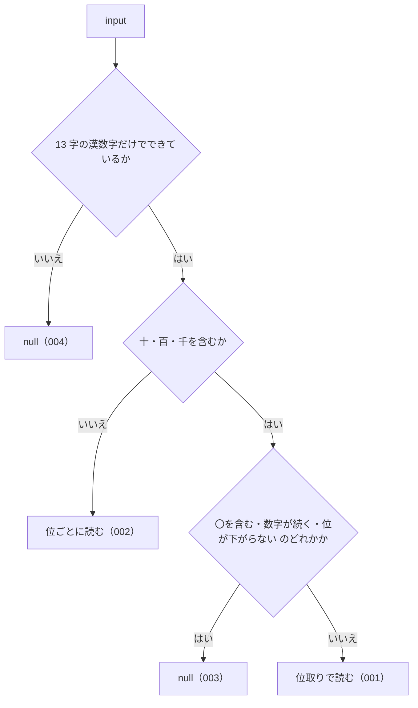

# kanjiToNumber の仕様

<!-- GENERATED FILE — 手で編集しない。本文は houki-abbreviations の specs/current/kanji_to_number/spec.md の写し。 -->

::: info
houki-abbreviations **v0.7.0** の `specs/current/kanji_to_number/spec.md` から自動生成しました（仕様 ID 9 件・2026-10-10）。手で編集しないでください。再生成は `node scripts/generate-reference.mjs specs` です。
:::

漢数字だけの文字列を数値にする

使いどころ・引数・実測の呼び出し例は、[関数のページ](/reference/lib/houki-abbreviations/kanji_to_number)にあります。

最後に仕様が変わったのは v0.7.0 の「関数ごとの全角・ダッシュ類・大文字の扱いを揃える（T3 正規化）」（2026-09-30 承認）です。それまでの経緯は[承認の履歴](#承認の履歴)にあります。

## 利用者と得られる結果

この機能の利用者と、利用者が渡すもの・得られる結果を示します。

- このパッケージを import するコード（houki-hub family の MCP サーバーなど）。条番号・法令番号から切り出した漢数字の並びを渡して、数値を受け取る
- このパッケージの中では `normalizeLawNum` が、漢数字の並びごとにこの関数を使う

## 入力

呼び出すときに渡す値です。

| 引数    | 必須 | 内容                                                                                                       |
| ------- | ---- | ---------------------------------------------------------------------------------------------------------- |
| `input` | 必須 | 漢数字だけの文字列。使える文字は `〇` `一` `二` `三` `四` `五` `六` `七` `八` `九` `十` `百` `千` の 13 字 |

## 戻り値

呼び出しが返す値です。

`number | null`。読めたときは数値、読めないときは `null`。例外は投げない。

受け付ける書き方は 2 つ。

| 書き方 | 見分け方                                   | 読み方                                                    | 例                                                        |
| ------ | ------------------------------------------ | --------------------------------------------------------- | --------------------------------------------------------- |
| 位取り | `十` `百` `千` のどれかを含む              | 数字 × 単位の和。単位の前の数字が無いときは 1。千の位まで | `三十` → 30、`百八` → 108、`千五十` → 1050、`一千` → 1000 |
| 位ごと | `十` `百` `千` を含まない（`〇` を使える） | 1 文字を 1 桁として左から並べる（算用数字と同じ）         | `二五` → 25、`一三七` → 137、`三〇` → 30                  |

1 文字（`五`）はどちらで読んでも同じ値になる。

## 扱わないこと

この機能が意図して扱わないことです。

- 万以上の単位（`万` `億`）を読むこと
- 大字（`壱` `弐` `拾`）や `零` を読むこと
- 算用数字や全角数字を読むこと（算用数字の入った法令番号は `normalizeLawNum`）
- 文字列の中から漢数字の部分を探して変換すること（渡すのは漢数字だけの文字列。法令番号の中の漢数字を変換するのは `normalizeLawNum`）
- `元年` の `元` を 1 と読むこと（`normalizeLawNum` が扱う）

## 処理の流れ

図の中の番号は「できること」の仕様 ID の末尾 3 桁です。

## 仕様項目

この機能の仕様項目を、仕様 ID ごとに並べています。見出しは仕様項目を 1 文で表したもので、条件・応答の細部・例は「詳細」を開くと読めます。仕様 ID はそれぞれ受入テストと対応していて、テストの無い ID があると各リポジトリの CI が止まります。

### SPEC-ABBR-KANJI-TO-NUMBER-001 位取りの漢数字を読む

::: details 詳細
単位 `十` `百` `千` を使う書き方を、数字 × 単位の和として読む。単位の前に数字が無いときは 1 とする（`十` → 10、`千` → 1000）。単位の前に `一` を書いてもよい（`一千` → 1000）。

例: `一` → 1、`十` → 10、`二十五` → 25、`六十三` → 63、`百八` → 108、`百三十七` → 137、`三百八十二` → 382、`千五十` → 1050、`一千` → 1000、`千` → 1000。
:::

### SPEC-ABBR-KANJI-TO-NUMBER-002 位ごとの漢数字を読む

::: details 詳細
単位を含まない並びは、1 文字を 1 桁として左から並べて読む。`〇` は 0。

例: `二五` → 25、`一三七` → 137、`三〇` → 30、`一四` → 14、`〇` → 0。
:::

### SPEC-ABBR-KANJI-TO-NUMBER-003 位取りとして成り立たない並びは null を返す

::: details 詳細
単位を含む並びのうち、次のどれかに当たるものは `null` を返す。

| 並び                                           | 例               |
| ---------------------------------------------- | ---------------- |
| 単位の後の単位が同じか大きい（位が下がらない） | `十十`、`五百百` |
| 数字が 2 つ以上続く                            | `三三十`         |
| 単位と `〇` が混ざる                           | `二〇十`         |
:::

### SPEC-ABBR-KANJI-TO-NUMBER-004 13 字以外の文字を含む入力は null を返す

::: details 詳細
13 字の漢数字以外の文字を 1 つでも含む入力と、空文字は `null` を返す。算用数字・`元`・`万` も対象外。

例: `元` → `null`、`25` → `null`、`''` → `null`、`二万` → `null`。
:::

### SPEC-ABBR-KANJI-TO-NUMBER-005 位ごとの並びの先頭の〇は数に入れない

::: details 詳細
位ごとの並びの先頭にある `〇` は、算用数字の先頭の 0 と同じく値に影響しない。`〇` だけの並びは 0。

例: `kanjiToNumber('〇五')` → 5、`kanjiToNumber('〇一三')` → 13、`kanjiToNumber('〇〇')` → 0。
:::

### SPEC-ABBR-KANJI-TO-NUMBER-006 文字列でない値には null を返す

::: details 詳細
`input` が文字列でないとき（数値・`null`・`undefined`）は `null` を返す。

例: `kanjiToNumber(123)`、`kanjiToNumber(null)`、`kanjiToNumber(undefined)` はどれも `null`。
:::

### SPEC-ABBR-KANJI-TO-NUMBER-007 空白を含む入力には null を返す

::: details 詳細
空白を取り除かない。前後や途中に空白が 1 つでもあれば `null` を返す。

例: `kanjiToNumber(' 五')` → `null`、`kanjiToNumber('五 ')` → `null`、`kanjiToNumber('二十 五')` → `null`。
:::

### SPEC-ABBR-KANJI-TO-NUMBER-008 単位の前の一は十・百でも 1 として読む

::: details 詳細
`千` と同じく、`十` `百` の前に `一` を書いても、書かないときと同じ値になる。

例: `kanjiToNumber('一十')` → 10、`kanjiToNumber('一百')` → 100、`kanjiToNumber('一千一百一十一')` → 1111、`kanjiToNumber('千百十')` → 1110。
:::

### SPEC-ABBR-KANJI-TO-NUMBER-009 位ごとの並びが 16 文字以上なら null を返す

::: details 詳細
位ごとの書き方（`十` `百` `千` を含まない並び）で 16 文字以上の入力は、値が正確に表せないので `null` を返す。丸めた値は返さない。15 文字までは読む。位取りの書き方は千の位までしか無いので、この上限は関係しない。

例: `kanjiToNumber('一'.repeat(15))` は `111111111111111`（15 桁）。`kanjiToNumber('一'.repeat(16))` は `null`（v0.6.1 では `1111111111111111`）。`kanjiToNumber('一'.repeat(20))` は `null`（v0.6.1 では `11111111111111110000`）。`kanjiToNumber('〇'.repeat(20))` も `null`。
:::

## 検討中のこと

仕様を書き起こしたときに見つかった項目のうち、扱いを Issue で検討しているものです。ここに挙げたことは、今後の版で変わることがあります。開くと、元の仕様書の記述をそのまま読めます。

::: details 仕様書の「未決」の節
初版起こしで見つけた、意図か不具合かを人が決める項目です。決まったら「できること」に ID を振るか、`specs/changes/` の差分にします。

意図か不具合かの判断が要る項目は houki-abbreviations の Issue に移し、ここには題と Issue の番号だけを残します。今の振る舞いのままでよくテストが無いだけの項目は、受入テストを書いてから「できること」に ID を振ります。

1. **位ごとの並びの先頭の `〇`。** → [SPEC-ABBR-KANJI-TO-NUMBER-005](#spec-abbr-kanji-to-number-005)
2. **位ごとの長い並びで値が正確でなくなる。** → [SPEC-ABBR-KANJI-TO-NUMBER-009](#spec-abbr-kanji-to-number-009)
3. **文字列以外の値を渡したとき。** → [SPEC-ABBR-KANJI-TO-NUMBER-006](#spec-abbr-kanji-to-number-006)
4. **前後や途中に空白があるとき。** → [SPEC-ABBR-KANJI-TO-NUMBER-007](#spec-abbr-kanji-to-number-007)
5. **単位の前の `一` と、`一十`。** → [SPEC-ABBR-KANJI-TO-NUMBER-008](#spec-abbr-kanji-to-number-008)
:::

## 承認の履歴

この機能の仕様が、いつ、どの変更で承認されたかを新しい順に並べています。各リポジトリの `npx spec-ids history kanji_to_number` と同じ内容です。変更の名前から、変更の理由と前後の振る舞いを書いた文書（GitHub）を開けます。

::: details 承認の履歴（4 件）
| 承認日 | 版 | 変更 | 仕様 PR |
|---|---|---|---|
| 2026-09-30 | v0.7.0 | [関数ごとの全角・ダッシュ類・大文字の扱いを揃える（T3 正規化）](https://github.com/shuji-bonji/houki-abbreviations/blob/v0.7.0/specs/releases/v0.7.0/20261001-normalize/proposal.md) | [#30](https://github.com/shuji-bonji/houki-abbreviations/pull/30) |
| 2026-09-27 | v0.6.1 | [テストが無いだけの振る舞いに仕様 ID を振る](https://github.com/shuji-bonji/houki-abbreviations/blob/v0.7.0/specs/releases/v0.6.1/20260927-untested-behaviors/proposal.md) | [#27](https://github.com/shuji-bonji/houki-abbreviations/pull/27) |
| 2026-09-27 | v0.6.1 | [「未決」のうち判断が要る 52 件を Issue に移す](https://github.com/shuji-bonji/houki-abbreviations/blob/v0.7.0/specs/releases/v0.6.1/20260927-undecided-to-issues/proposal.md) | [#26](https://github.com/shuji-bonji/houki-abbreviations/pull/26) |
| 2026-09-27 | — | 初版 | [#10](https://github.com/shuji-bonji/houki-abbreviations/pull/10) |
:::

## 関連ページ

このページの元になった文書と、あわせて読むページです。

- [houki-abbreviations の仕様の一覧](/specs/houki-abbreviations/)
- [houki-abbreviations の解説](/lib/houki-abbreviations)
- [kanjiToNumber の関数のページ（リファレンス）](/reference/lib/houki-abbreviations/kanji_to_number)
- [元の仕様書（GitHub、v0.7.0）](https://github.com/shuji-bonji/houki-abbreviations/blob/v0.7.0/specs/current/kanji_to_number/spec.md)
