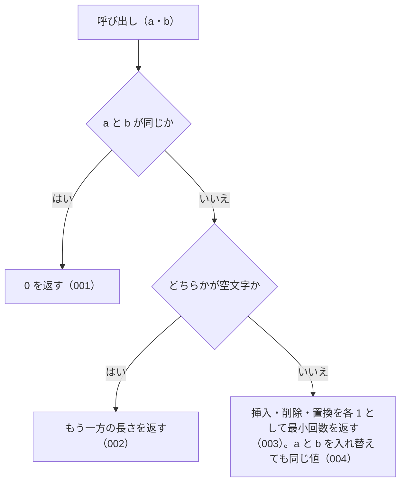

# levenshtein の仕様

<!-- GENERATED FILE — 手で編集しない。本文は houki-abbreviations の specs/current/levenshtein/spec.md の写し。 -->

::: info
houki-abbreviations **v0.7.0** の `specs/current/levenshtein/spec.md` から自動生成しました（仕様 ID 5 件・2026-10-10）。手で編集しないでください。再生成は `node scripts/generate-reference.mjs specs` です。
:::

2 つの文字列の編集距離を返す

使いどころ・引数・実測の呼び出し例は、[関数のページ](/reference/lib/houki-abbreviations/levenshtein)にあります。

最後に仕様が変わったのは v0.7.0 の「関数ごとの全角・ダッシュ類・大文字の扱いを揃える（T3 正規化）」（2026-09-30 承認）です。それまでの経緯は[承認の履歴](#承認の履歴)にあります。

## 利用者と得られる結果

この機能の利用者と、利用者が渡すもの・得られる結果を示します。

- houki-abbreviations を import する利用者（独自の検索を組むコードやテスト）。2 つの文字列を渡して編集距離を受け取る。`findSimilar` と `suggestCorrection` もこの値で近さを決める

## 入力

呼び出すときに渡す値です。

| 引数 | 必須 | 内容                  |
| ---- | ---- | --------------------- |
| `a`  | 必須 | 比べる文字列の 1 つ目 |
| `b`  | 必須 | 比べる文字列の 2 つ目 |

全角・半角をそろえる処理はしない。渡された文字列をそのまま比べる。

## 戻り値

呼び出しが返す値です。

0 以上の整数。`a` を `b` に変えるのに要る、1 文字の挿入・削除・置換の最小回数（どれも 1 回を 1 と数える）。

## 扱わないこと

この機能が意図して扱わないことです。

- 全角と半角を同じ文字とみなすこと（`levenshtein('ＰＬ', 'PL')` は 2。`findSimilar` は比べる前に半角にそろえる）
- 英字の大文字・小文字を同じ文字とみなすこと（`levenshtein('A', 'a')` は 1）
- 隣り合う 2 文字の入れ替えを 1 回と数えること（入れ替えは置換 2 回として数える）
- 文字の種類ごとに操作の重みを変えること

## 処理の流れ

図の中の番号は「できること」の仕様 ID の末尾 3 桁です。

## 仕様項目

この機能の仕様項目を、仕様 ID ごとに並べています。見出しは仕様項目を 1 文で表したもので、条件・応答の細部・例は「詳細」を開くと読めます。仕様 ID はそれぞれ受入テストと対応していて、テストの無い ID があると各リポジトリの CI が止まります。

### SPEC-ABBR-LEVENSHTEIN-001 同じ文字列には 0 を返す

::: details 詳細
`a` と `b` が同じ文字列なら 0 を返す。

例: `levenshtein('abc', 'abc')` と `levenshtein('労働基準法', '労働基準法')` はどちらも 0。
:::

### SPEC-ABBR-LEVENSHTEIN-002 片方が空文字ならもう一方の文字数を返す

::: details 詳細
どちらかが空文字なら、もう一方の文字数（コードポイント数）を返す。両方とも空文字なら 0。

例: `levenshtein('', 'abc')` と `levenshtein('abc', '')` はどちらも 3。`levenshtein('', '')` は 0。`levenshtein('', '𠮷')` は 1（`'𠮷'.length` は 2 だが、1 文字と数える）。
:::

### SPEC-ABBR-LEVENSHTEIN-003 挿入・削除・置換を 1 回 1 として最小回数を返す

::: details 詳細
`a` を `b` に変えるのに要る、1 文字の挿入・削除・置換の最小回数を返す。どの操作も 1 回を 1 と数える。

例: `levenshtein('abc', 'abd')` は 1、`levenshtein('施行例', '施行令')` は 1、`levenshtein('kitten', 'sitting')` は 3（置換 2 回と挿入 1 回）。
:::

### SPEC-ABBR-LEVENSHTEIN-004 引数の順を入れ替えても同じ値を返す

::: details 詳細
`levenshtein(a, b)` と `levenshtein(b, a)` は同じ値を返す。

例: `levenshtein('abc', 'xyz')` と `levenshtein('xyz', 'abc')` はどちらも 3。
:::

### SPEC-ABBR-LEVENSHTEIN-005 BMP の外の文字を 1 文字として数える

::: details 詳細
文字はコードポイント単位で数える。サロゲートペアで表す文字（`𠮷` U+20BB7 など）は 1 文字で、その置換は 1 回と数える。

例: `levenshtein('𠮷', '吉')` は 1（v0.6.1 では 2）。`levenshtein('𠮷野家', '吉野家')` は 1。`levenshtein('𠮷', '')` は 1。`findSimilar` と `suggestCorrection` の `distance` もこの数え方になる。
:::

## 検討中のこと

仕様を書き起こしたときに見つかった項目のうち、扱いを Issue で検討しているものです。ここに挙げたことは、今後の版で変わることがあります。開くと、元の仕様書の記述をそのまま読めます。

::: details 仕様書の「未決」の節
初版起こしで見つけた、意図か不具合かを人が決める項目です。決まったら「できること」に ID を振るか、`specs/changes/` の差分にします。

意図か不具合かの判断が要る項目は houki-abbreviations の Issue に移し、ここには題と Issue の番号だけを残します。今の振る舞いのままでよくテストが無いだけの項目は、受入テストを書いてから「できること」に ID を振ります。テストの名前と中身が合っていない項目は、テストを直します（ID を振っていないものは、直してから振ります）。

1. **サロゲートペアの文字は 2 文字として数える。** → [SPEC-ABBR-LEVENSHTEIN-005](#spec-abbr-levenshtein-005)
2. **テストの describe 名が「内部 helper」。** （テストを直した。v0.6.1）
:::

## 承認の履歴

この機能の仕様が、いつ、どの変更で承認されたかを新しい順に並べています。各リポジトリの `npx spec-ids history levenshtein` と同じ内容です。変更の名前から、変更の理由と前後の振る舞いを書いた文書（GitHub）を開けます。

::: details 承認の履歴（4 件）
| 承認日 | 版 | 変更 | 仕様 PR |
|---|---|---|---|
| 2026-09-30 | v0.7.0 | [関数ごとの全角・ダッシュ類・大文字の扱いを揃える（T3 正規化）](https://github.com/shuji-bonji/houki-abbreviations/blob/v0.7.0/specs/releases/v0.7.0/20261001-normalize/proposal.md) | [#30](https://github.com/shuji-bonji/houki-abbreviations/pull/30) |
| 2026-09-27 | v0.6.1 | [テストが無いだけの振る舞いに仕様 ID を振る](https://github.com/shuji-bonji/houki-abbreviations/blob/v0.7.0/specs/releases/v0.6.1/20260927-untested-behaviors/proposal.md) | [#27](https://github.com/shuji-bonji/houki-abbreviations/pull/27) |
| 2026-09-27 | v0.6.1 | [「未決」のうち判断が要る 52 件を Issue に移す](https://github.com/shuji-bonji/houki-abbreviations/blob/v0.7.0/specs/releases/v0.6.1/20260927-undecided-to-issues/proposal.md) | [#26](https://github.com/shuji-bonji/houki-abbreviations/pull/26) |
| 2026-09-27 | — | 初版 | [#10](https://github.com/shuji-bonji/houki-abbreviations/pull/10) |
:::

## 関連ページ

このページの元になった文書と、あわせて読むページです。

- [houki-abbreviations の仕様の一覧](/specs/houki-abbreviations/)
- [houki-abbreviations の解説](/lib/houki-abbreviations)
- [levenshtein の関数のページ（リファレンス）](/reference/lib/houki-abbreviations/levenshtein)
- [元の仕様書（GitHub、v0.7.0）](https://github.com/shuji-bonji/houki-abbreviations/blob/v0.7.0/specs/current/levenshtein/spec.md)
