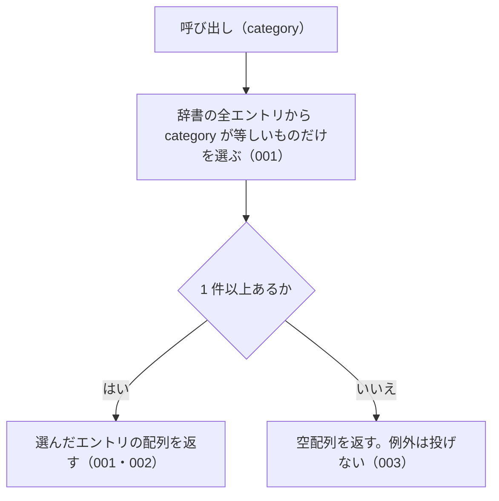

# listByCategory の仕様

<!-- GENERATED FILE — 手で編集しない。本文は houki-abbreviations の specs/current/list_by_category/spec.md の写し。 -->

::: info
houki-abbreviations **v0.7.0** の `specs/current/list_by_category/spec.md` から自動生成しました（仕様 ID 7 件・2026-10-10）。手で編集しないでください。再生成は `node scripts/generate-reference.mjs specs` です。
:::

指定した種別のエントリをすべて返す

使いどころ・引数・実測の呼び出し例は、[関数のページ](/reference/lib/houki-abbreviations/list_by_category)にあります。

最後に仕様が変わったのは v0.6.1 の「テストが無いだけの振る舞いに仕様 ID を振る」（2026-09-27 承認）です。それまでの経緯は[承認の履歴](#承認の履歴)にあります。

## 利用者と得られる結果

この機能の利用者と、利用者が渡すもの・得られる結果を示します。

- houki-hub family の MCP サーバーと、このパッケージを import する利用者のコード。種別（法律・政令・通達など）を渡して、その種別の辞書のエントリの一覧を受け取る

## 入力

呼び出すときに渡す値です。

| 引数       | 必須 | 内容                                                                                                                                                                                                                               |
| ---------- | ---- | ---------------------------------------------------------------------------------------------------------------------------------------------------------------------------------------------------------------------------------- |
| `category` | 必須 | 種別。`constitution` / `law` / `cabinet-order` / `imperial-ordinance` / `ministerial-ordinance` / `rule` / `kihon-tsutatsu` / `kobetsu-tsutatsu` / `qa-jirei` / `tax-answer` / `hanrei` / `saiketsu` のどれか（定数 `CATEGORIES`） |

## 戻り値

呼び出しが返す値です。

`AbbreviationEntry[]`。`category` フィールドが `category` と等しいエントリの配列。エントリのフィールドは `resolveAbbreviation` の戻り値と同じ。各要素は辞書のエントリそのもので、凍結されている（[SPEC-ABBR-ABBREVIATION-ENTRIES-019](/specs/houki-abbreviations/abbreviation_entries#spec-abbr-abbreviation-entries-019)）。

v0.6.0 の辞書（174 件）での件数は次のとおり。

| `category`              | 件数 |
| ----------------------- | ---- |
| `constitution`          | 1    |
| `law`                   | 138  |
| `cabinet-order`         | 8    |
| `imperial-ordinance`    | 0    |
| `ministerial-ordinance` | 16   |
| `rule`                  | 2    |
| `kihon-tsutatsu`        | 8    |
| `kobetsu-tsutatsu`      | 1    |
| `qa-jirei`              | 0    |
| `tax-answer`            | 0    |
| `hanrei`                | 0    |
| `saiketsu`              | 0    |

## 扱わないこと

この機能が意図して扱わないことです。

- 複数の種別をまとめて絞り込むこと（`searchByName` の `filter.category` は配列を受け付ける）
- 分野で絞り込むこと（`listByDomain`）
- 本文を持つ MCP で絞り込むこと（`listBySourceMcpHint`）
- 件数だけを返すこと（`getAbbreviationStats` の `byCategory`）

## 処理の流れ

図の中の番号は「できること」の仕様 ID の末尾 3 桁です。

## 仕様項目

この機能の仕様項目を、仕様 ID ごとに並べています。見出しは仕様項目を 1 文で表したもので、条件・応答の細部・例は「詳細」を開くと読めます。仕様 ID はそれぞれ受入テストと対応していて、テストの無い ID があると各リポジトリの CI が止まります。

### SPEC-ABBR-LIST-BY-CATEGORY-001 指定した種別のエントリだけを返す

::: details 詳細
辞書のエントリのうち、`category` フィールドが引数 `category` と等しいものだけを配列で返す。ほかの種別のエントリは含まない。

例: `listByCategory('law')` は 138 件を返し、どの要素も `category: "law"`。`listByCategory('cabinet-order')` は `所得税法施行令` など正式名称が `施行令` で終わるエントリを含む 8 件を返す。`listByCategory('kihon-tsutatsu')` は `消費税法基本通達` を含む 8 件を返す。
:::

### SPEC-ABBR-LIST-BY-CATEGORY-002 constitution には日本国憲法の 1 件を返す

::: details 詳細
`listByCategory('constitution')` は、`formal: "日本国憲法"` のエントリ 1 件だけの配列を返す。
:::

### SPEC-ABBR-LIST-BY-CATEGORY-003 エントリの無い種別には空配列を返す

::: details 詳細
辞書にその種別のエントリが 1 件も無いときは、例外を投げずに空配列を返す。v0.6.0 では `imperial-ordinance` / `qa-jirei` / `tax-answer` / `hanrei` / `saiketsu` の 5 つが空配列になる。

例: `listByCategory('hanrei')` と `listByCategory('saiketsu')` は `[]`。
:::

### SPEC-ABBR-LIST-BY-CATEGORY-004 辞書の並びのまま返す

::: details 詳細
返す配列の要素は、辞書（`abbreviationEntries`）での並びのまま並ぶ。`abbreviationEntries.filter((e) => e.category === category)` と同じエントリを同じ順で返す。

例: `listByCategory('law')` の先頭の 3 件は `所法` / `法法` / `消法`、`listByCategory('kihon-tsutatsu')` の先頭の 3 件は `消基通` / `所基通` / `法基通` で、どれも `abbreviationEntries` での順と同じ。
:::

### SPEC-ABBR-LIST-BY-CATEGORY-005 呼ぶたびに新しい配列を返す

::: details 詳細
呼ぶたびに新しい配列を返す。返した配列に要素を足したり、配列から要素を除いたりしても、次の呼び出しの結果は変わらない。

例: `const a = listByCategory('law'); a.push({})` の後も、`listByCategory('law')` は 138 件を返す。`a.splice(0)` の後も同じ。同じ引数で 2 回呼んだ結果は別の配列（`!==`）。
:::

### SPEC-ABBR-LIST-BY-CATEGORY-006 CATEGORIES に無い値には空配列を返す

::: details 詳細
JavaScript から `CATEGORIES` に無い値を渡したときは、例外を投げずに空配列を返す。

例: `listByCategory('xxx')` と `listByCategory(undefined)` は `[]`。
:::

### SPEC-ABBR-LIST-BY-CATEGORY-007 ministerial-ordinance・rule・kobetsu-tsutatsu にもその種別のエントリを返す

::: details 詳細
`ministerial-ordinance`（省令）・`rule`（規則）・`kobetsu-tsutatsu`（個別通達）を渡したときも、その種別のエントリだけを返す。

例: `listByCategory('ministerial-ordinance')` は `所規`（`formal: "所得税法施行規則"`）・`労基則`・`会社規` などを含む 16 件、`listByCategory('rule')` は `民訴規`（`formal: "民事訴訟規則"`）と `刑訴規`（`formal: "刑事訴訟規則"`）の 2 件、`listByCategory('kobetsu-tsutatsu')` は `電帳法取通`（`formal: "電子計算機を使用して作成する国税関係帳簿書類の保存方法等の特例に関する法律の取扱通達"`）の 1 件を返す。どの要素もそれぞれの `category` を持つ。
:::

## 検討中のこと

仕様を書き起こしたときに見つかった項目のうち、扱いを Issue で検討しているものです。ここに挙げたことは、今後の版で変わることがあります。開くと、元の仕様書の記述をそのまま読めます。

::: details 仕様書の「未決」の節
初版起こしで見つけた、意図か不具合かを人が決める項目です。決まったら「できること」に ID を振るか、`specs/changes/` の差分にします。

意図か不具合かの判断が要る項目は houki-abbreviations の Issue に移し、ここには題と Issue の番号だけを残します。今の振る舞いのままでよくテストが無いだけの項目は、受入テストを書いてから「できること」に ID を振ります。

1. **返すエントリは凍結されておらず、書き換えると辞書に残る。** → [SPEC-ABBR-ABBREVIATION-ENTRIES-019](/specs/houki-abbreviations/abbreviation_entries#spec-abbr-abbreviation-entries-019)
2. **返す順序。** → [SPEC-ABBR-LIST-BY-CATEGORY-004](#spec-abbr-list-by-category-004)
3. **返す配列は呼ぶたびに新しい。** → [SPEC-ABBR-LIST-BY-CATEGORY-005](#spec-abbr-list-by-category-005)
4. **`CATEGORIES` に無い値。** → [SPEC-ABBR-LIST-BY-CATEGORY-006](#spec-abbr-list-by-category-006)
5. **`kobetsu-tsutatsu` と `rule` と `ministerial-ordinance` の中身。** → [SPEC-ABBR-LIST-BY-CATEGORY-007](#spec-abbr-list-by-category-007)
:::

## 承認の履歴

この機能の仕様が、いつ、どの変更で承認されたかを新しい順に並べています。各リポジトリの `npx spec-ids history list_by_category` と同じ内容です。変更の名前から、変更の理由と前後の振る舞いを書いた文書（GitHub）を開けます。

::: details 承認の履歴（3 件）
| 承認日 | 版 | 変更 | 仕様 PR |
|---|---|---|---|
| 2026-09-27 | v0.6.1 | [テストが無いだけの振る舞いに仕様 ID を振る](https://github.com/shuji-bonji/houki-abbreviations/blob/v0.7.0/specs/releases/v0.6.1/20260927-untested-behaviors/proposal.md) | [#27](https://github.com/shuji-bonji/houki-abbreviations/pull/27) |
| 2026-09-27 | v0.6.1 | [「未決」のうち判断が要る 52 件を Issue に移す](https://github.com/shuji-bonji/houki-abbreviations/blob/v0.7.0/specs/releases/v0.6.1/20260927-undecided-to-issues/proposal.md) | [#26](https://github.com/shuji-bonji/houki-abbreviations/pull/26) |
| 2026-09-27 | — | 初版 | [#10](https://github.com/shuji-bonji/houki-abbreviations/pull/10) |
:::

## 関連ページ

このページの元になった文書と、あわせて読むページです。

- [houki-abbreviations の仕様の一覧](/specs/houki-abbreviations/)
- [houki-abbreviations の解説](/lib/houki-abbreviations)
- [listByCategory の関数のページ（リファレンス）](/reference/lib/houki-abbreviations/list_by_category)
- [元の仕様書（GitHub、v0.7.0）](https://github.com/shuji-bonji/houki-abbreviations/blob/v0.7.0/specs/current/list_by_category/spec.md)
