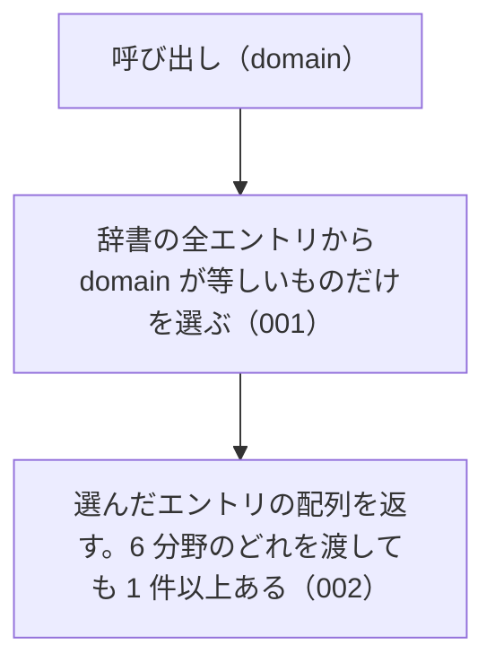

# listByDomain の仕様

<!-- GENERATED FILE — 手で編集しない。本文は houki-abbreviations の specs/current/list_by_domain/spec.md の写し。 -->

::: info
houki-abbreviations **v0.7.0** の `specs/current/list_by_domain/spec.md` から自動生成しました（仕様 ID 5 件・2026-10-10）。手で編集しないでください。再生成は `node scripts/generate-reference.mjs specs` です。
:::

指定した分野のエントリをすべて返す

使いどころ・引数・実測の呼び出し例は、[関数のページ](/reference/lib/houki-abbreviations/list_by_domain)にあります。

最後に仕様が変わったのは v0.6.1 の「テストが無いだけの振る舞いに仕様 ID を振る」（2026-09-27 承認）です。それまでの経緯は[承認の履歴](#承認の履歴)にあります。

## 使う人と受け取るもの

この機能を誰が呼び、何を渡して何を受け取るかを示します。

- houki-hub family の MCP サーバーと、このパッケージを import する利用者のコード。分野を渡して、その分野に属する辞書のエントリの一覧を受け取る

## 入力

呼び出すときに渡す値です。

| 引数     | 必須 | 内容                                                                                                        |
| -------- | ---- | ----------------------------------------------------------------------------------------------------------- |
| `domain` | 必須 | 分野。`tax` / `labor` / `accounting` / `commercial` / `civil` / `administrative` のどれか（定数 `DOMAINS`） |

## 戻り値

呼び出しが返す値です。

`AbbreviationEntry[]`。`domain` フィールドが `domain` と等しいエントリの配列。エントリのフィールドは `resolveAbbreviation` の戻り値と同じ。各要素は辞書のエントリそのもので、凍結されている（[SPEC-ABBR-ABBREVIATION-ENTRIES-019](/specs/houki-abbreviations/abbreviation_entries#spec-abbr-abbreviation-entries-019)）。

v0.6.0 の辞書（174 件）での件数は次のとおり。

| `domain`         | 件数 |
| ---------------- | ---- |
| `tax`            | 35   |
| `labor`          | 28   |
| `accounting`     | 9    |
| `commercial`     | 31   |
| `civil`          | 23   |
| `administrative` | 48   |

## できないこと

この機能が引き受けないことです。

- 複数の分野をまとめて絞り込むこと（`searchByName` の `filter.domain` は配列を受け付ける）
- 種別で絞り込むこと（`listByCategory`）
- 本文を持つ MCP で絞り込むこと（`listBySourceMcpHint`）
- 件数だけを返すこと（`getAbbreviationStats` の `byDomain`）

## 処理の流れ

図の中の番号は「できること」の仕様 ID の末尾 3 桁です。

## 仕様 ID ごとの約束

この機能が守る約束を、仕様 ID ごとに並べています。見出しは約束を 1 文で表したもので、条件・応答の細部・例は「詳細」を開くと読めます。仕様 ID はそれぞれ受入テストと対応していて、テストの無い ID があると各リポジトリの CI が止まります。

### SPEC-ABBR-LIST-BY-DOMAIN-001 指定した分野のエントリだけを返す

::: details 詳細
辞書のエントリのうち、`domain` フィールドが引数 `domain` と等しいものだけを配列で返す。ほかの分野のエントリは含まない。

例: `listByDomain('tax')` は 35 件を返し、どの要素も `domain: "tax"`。
:::

### SPEC-ABBR-LIST-BY-DOMAIN-002 6 分野のどれを渡しても 1 件以上を返す

::: details 詳細
`DOMAINS` の 6 つの値のどれを渡しても、1 件以上のエントリを返す。v0.6.0 の件数は「戻り値」の表のとおり。
:::

### SPEC-ABBR-LIST-BY-DOMAIN-003 辞書の並びのまま返す

::: details 詳細
返す配列の要素は、辞書（`abbreviationEntries`）での並びのまま並ぶ。`abbreviationEntries.filter((e) => e.domain === domain)` と同じエントリを同じ順で返す。

例: `listByDomain('tax')` の先頭の 3 件は `所法` / `所令` / `所規`、`listByDomain('labor')` の先頭の 3 件は `労基法` / `労基則` / `労契法` で、どれも `abbreviationEntries` での順と同じ。
:::

### SPEC-ABBR-LIST-BY-DOMAIN-004 呼ぶたびに新しい配列を返す

::: details 詳細
呼ぶたびに新しい配列を返す。返した配列に要素を足したり、配列から要素を除いたりしても、次の呼び出しの結果は変わらない。

例: `const a = listByDomain('tax'); a.push({})` の後も、`listByDomain('tax')` は 35 件を返す。`a.splice(0)` の後も同じ。同じ引数で 2 回呼んだ結果は別の配列（`!==`）。
:::

### SPEC-ABBR-LIST-BY-DOMAIN-005 DOMAINS に無い値には空配列を返す

::: details 詳細
JavaScript から `DOMAINS` に無い値を渡したときは、例外を投げずに空配列を返す。

例: `listByDomain('xxx')` と `listByDomain('')` は `[]`。
:::

## まだ決めていないこと

仕様を書き起こしたときに見つかった項目のうち、扱いを決めている途中のものです。開くと、元の仕様書の記述をそのまま読めます。

::: details 仕様書の「未決」の節
初版起こしで見つけた、意図か不具合かを人が決める項目です。決まったら「できること」に ID を振るか、`specs/changes/` の差分にします。

意図か不具合かの判断が要る項目は houki-abbreviations の Issue に移し、ここには題と Issue の番号だけを残します。今の振る舞いのままでよくテストが無いだけの項目は、受入テストを書いてから「できること」に ID を振ります。

1. **README の件数が実際と違う。** → houki-abbreviations #17
2. **返すエントリは凍結されておらず、書き換えると辞書に残る。** → [SPEC-ABBR-ABBREVIATION-ENTRIES-019](/specs/houki-abbreviations/abbreviation_entries#spec-abbr-abbreviation-entries-019)
3. **返す順序。** → [SPEC-ABBR-LIST-BY-DOMAIN-003](#spec-abbr-list-by-domain-003)
4. **返す配列は呼ぶたびに新しい。** → [SPEC-ABBR-LIST-BY-DOMAIN-004](#spec-abbr-list-by-domain-004)
5. **`DOMAINS` に無い値。** → [SPEC-ABBR-LIST-BY-DOMAIN-005](#spec-abbr-list-by-domain-005)
:::

## 承認の履歴

この機能の仕様が、いつ、どの変更で承認されたかを新しい順に並べています。各リポジトリの `npx spec-ids history list_by_domain` と同じ内容です。変更の名前から、変更の理由と前後の振る舞いを書いた文書（GitHub）を開けます。

::: details 承認の履歴（3 件）
| 承認日 | 版 | 変更 | 仕様 PR |
|---|---|---|---|
| 2026-09-27 | v0.6.1 | [テストが無いだけの振る舞いに仕様 ID を振る](https://github.com/shuji-bonji/houki-abbreviations/blob/v0.7.0/specs/releases/v0.6.1/20260927-untested-behaviors/proposal.md) | [#27](https://github.com/shuji-bonji/houki-abbreviations/pull/27) |
| 2026-09-27 | v0.6.1 | [「未決」のうち判断が要る 52 件を Issue に移す](https://github.com/shuji-bonji/houki-abbreviations/blob/v0.7.0/specs/releases/v0.6.1/20260927-undecided-to-issues/proposal.md) | [#26](https://github.com/shuji-bonji/houki-abbreviations/pull/26) |
| 2026-09-27 | — | 初版 | [#10](https://github.com/shuji-bonji/houki-abbreviations/pull/10) |
:::

## 関連ページ

このページの元になった文書と、あわせて読むページです。

- [houki-abbreviations の仕様の一覧](/specs/houki-abbreviations/)
- [houki-abbreviations の解説](/lib/houki-abbreviations)
- [listByDomain の関数のページ（リファレンス）](/reference/lib/houki-abbreviations/list_by_domain)
- [元の仕様書（GitHub、v0.7.0）](https://github.com/shuji-bonji/houki-abbreviations/blob/v0.7.0/specs/current/list_by_domain/spec.md)
