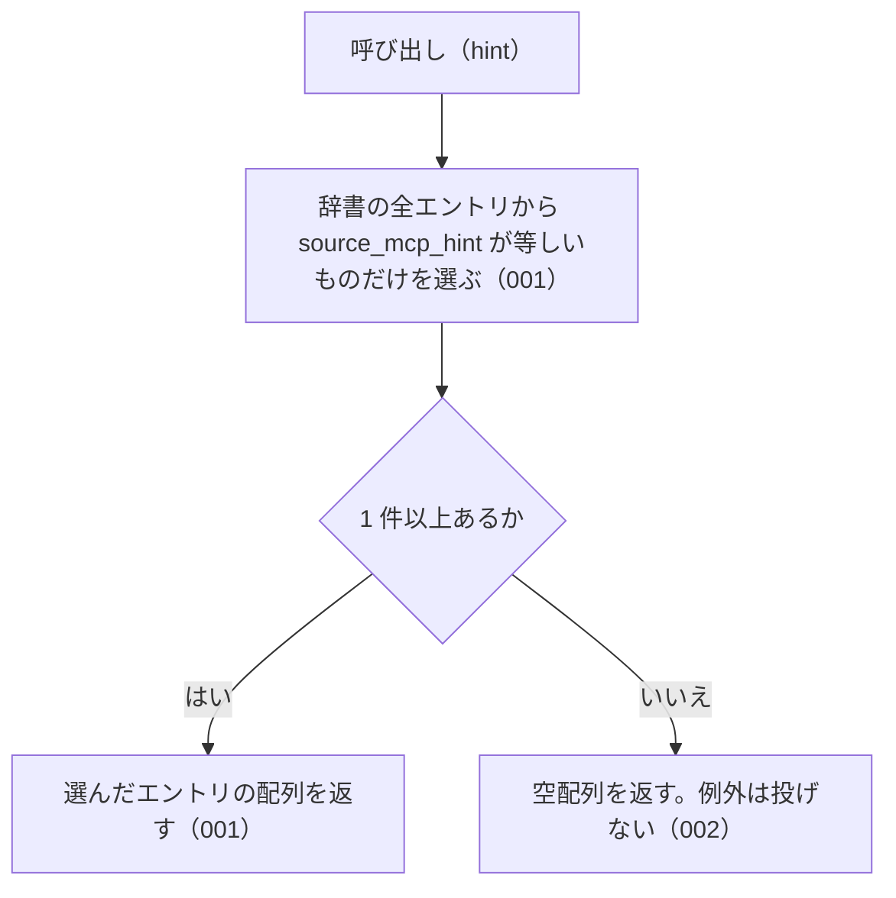

# listBySourceMcpHint の仕様

<!-- GENERATED FILE — 手で編集しない。本文は houki-abbreviations の specs/current/list_by_source_mcp_hint/spec.md の写し。 -->

::: info
houki-abbreviations **v0.7.1** の `specs/current/list_by_source_mcp_hint/spec.md` から自動生成しました（仕様 ID 5 件・2026-10-10）。手で編集しないでください。再生成は `node scripts/generate-reference.mjs specs` です。
:::

指定した MCP が本文を持つエントリをすべて返す

使いどころ・引数・実測の呼び出し例は、[関数のページ](/reference/lib/houki-abbreviations/list_by_source_mcp_hint)にあります。

最後に仕様が変わったのは v0.6.1 の「テストが無いだけの振る舞いに仕様 ID を振る」（2026-09-27 承認）です。それまでの経緯は[承認の履歴](#承認の履歴)にあります。

## 利用者と得られる結果

この機能の利用者と、利用者が渡すもの・得られる結果を示します。

- houki-hub family の MCP サーバー。起動時に自分の名前（例: `houki-nta`）を渡して、自分が本文を返せるエントリだけの一覧を受け取る。それ以外のエントリを問い合わせられたときに、本文を持つ MCP の名前を案内するために使う

## 入力

呼び出すときに渡す値です。

| 引数   | 必須 | 内容                                                                                                                                         |
| ------ | ---- | -------------------------------------------------------------------------------------------------------------------------------------------- |
| `hint` | 必須 | MCP の名前。`houki-egov` / `houki-nta` / `houki-mhlw` / `houki-jaish` / `houki-court` / `houki-saiketsu` のどれか（定数 `SOURCE_MCP_HINTS`） |

## 戻り値

呼び出しが返す値です。

`AbbreviationEntry[]`。`source_mcp_hint` フィールドが `hint` と等しいエントリの配列。エントリのフィールドは `resolveAbbreviation` の戻り値と同じ。各要素は辞書のエントリそのもので、凍結されている（[SPEC-ABBR-ABBREVIATION-ENTRIES-019](/specs/houki-abbreviations/abbreviation_entries#spec-abbr-abbreviation-entries-019)）。

v0.6.0 の辞書（174 件）での件数は次のとおり。

| `hint`           | 件数 |
| ---------------- | ---- |
| `houki-egov`     | 165  |
| `houki-nta`      | 9    |
| `houki-mhlw`     | 0    |
| `houki-jaish`    | 0    |
| `houki-court`    | 0    |
| `houki-saiketsu` | 0    |

## 扱わないこと

この機能が意図して扱わないことです。

- 複数の MCP をまとめて絞り込むこと（`searchByName` の `filter.source_mcp_hint` は配列を受け付ける）
- 分野で絞り込むこと（`listByDomain`）
- 種別で絞り込むこと（`listByCategory`）
- 1 つの名前が、渡した MCP の担当かどうかを判定すること（`resolveAbbreviation` で引いたエントリの `source_mcp_hint` を利用者が比べる）
- 件数だけを返すこと（`getAbbreviationStats` の `bySourceMcpHint`）

## 処理の流れ

図の中の番号は「できること」の仕様 ID の末尾 3 桁です。

## 仕様項目

この機能の仕様項目を、仕様 ID ごとに並べています。見出しは仕様項目を 1 文で表したもので、条件・応答の細部・例は「詳細」を開くと読めます。仕様 ID はそれぞれ受入テストと対応していて、テストの無い ID があると各リポジトリの CI が止まります。

### SPEC-ABBR-LIST-BY-SOURCE-MCP-HINT-001 指定した MCP が本文を持つエントリだけを返す

::: details 詳細
辞書のエントリのうち、`source_mcp_hint` フィールドが引数 `hint` と等しいものだけを配列で返す。ほかの MCP のエントリは含まない。

例: `listBySourceMcpHint('houki-egov')` は 165 件（法律・政令・省令など）を返し、どの要素も `source_mcp_hint: "houki-egov"`。`listBySourceMcpHint('houki-nta')` は `消費税法基本通達` を含む 9 件（基本通達 8 件と個別通達 1 件）を返し、どの要素も `source_mcp_hint: "houki-nta"`。
:::

### SPEC-ABBR-LIST-BY-SOURCE-MCP-HINT-002 エントリの無い MCP には空配列を返す

::: details 詳細
辞書にその MCP のエントリが 1 件も無いときは、例外を投げずに空配列を返す。v0.6.0 では `houki-mhlw` / `houki-jaish` / `houki-court` / `houki-saiketsu` の 4 つが空配列になる。

例: `listBySourceMcpHint('houki-mhlw')` と `listBySourceMcpHint('houki-court')` は `[]`。
:::

### SPEC-ABBR-LIST-BY-SOURCE-MCP-HINT-003 辞書の並びのまま返す

::: details 詳細
返す配列の要素は、辞書（`abbreviationEntries`）での並びのまま並ぶ。`abbreviationEntries.filter((e) => e.source_mcp_hint === hint)` と同じエントリを同じ順で返す。

例: `listBySourceMcpHint('houki-egov')` の先頭の 3 件は `所法` / `所令` / `所規`、`listBySourceMcpHint('houki-nta')` の先頭の 3 件は `消基通` / `所基通` / `法基通` で、どれも `abbreviationEntries` での順と同じ。
:::

### SPEC-ABBR-LIST-BY-SOURCE-MCP-HINT-004 呼ぶたびに新しい配列を返す

::: details 詳細
呼ぶたびに新しい配列を返す。返した配列に要素を足したり、配列から要素を除いたりしても、次の呼び出しの結果は変わらない。

例: `const a = listBySourceMcpHint('houki-nta'); a.push({})` の後も、`listBySourceMcpHint('houki-nta')` は 9 件を返す。`a.splice(0)` の後も同じ。同じ引数で 2 回呼んだ結果は別の配列（`!==`）。
:::

### SPEC-ABBR-LIST-BY-SOURCE-MCP-HINT-005 SOURCE_MCP_HINTS に無い値には空配列を返す

::: details 詳細
JavaScript から `SOURCE_MCP_HINTS` に無い値を渡したときは、例外を投げずに空配列を返す。大文字と小文字は区別する。

例: `listBySourceMcpHint('xxx')` と `listBySourceMcpHint('HOUKI-EGOV')` は `[]`。
:::

## 検討中のこと

仕様を書き起こしたときに見つかった項目のうち、扱いを Issue で検討しているものです。ここに挙げたことは、今後の版で変わることがあります。開くと、元の仕様書の記述をそのまま読めます。

::: details 仕様書の「未決」の節
初版起こしで見つけた、意図か不具合かを人が決める項目です。決まったら「できること」に ID を振るか、`specs/changes/` の差分にします。

意図か不具合かの判断が要る項目は houki-abbreviations の Issue に移し、ここには題と Issue の番号だけを残します。今の振る舞いのままでよくテストが無いだけの項目は、受入テストを書いてから「できること」に ID を振ります。

1. **返すエントリは凍結されておらず、書き換えると辞書に残る。** → [SPEC-ABBR-ABBREVIATION-ENTRIES-019](/specs/houki-abbreviations/abbreviation_entries#spec-abbr-abbreviation-entries-019)
2. **返す順序。** → [SPEC-ABBR-LIST-BY-SOURCE-MCP-HINT-003](#spec-abbr-list-by-source-mcp-hint-003)
3. **返す配列は呼ぶたびに新しい。** → [SPEC-ABBR-LIST-BY-SOURCE-MCP-HINT-004](#spec-abbr-list-by-source-mcp-hint-004)
4. **`SOURCE_MCP_HINTS` に無い値。** → [SPEC-ABBR-LIST-BY-SOURCE-MCP-HINT-005](#spec-abbr-list-by-source-mcp-hint-005)
5. **`houki-jaish` と `houki-saiketsu`。** → [SPEC-ABBR-LIST-BY-SOURCE-MCP-HINT-002](#spec-abbr-list-by-source-mcp-hint-002)（テストを足した）
:::

## 承認の履歴

この機能の仕様が、いつ、どの変更で承認されたかを新しい順に並べています。各リポジトリの `npx spec-ids history list_by_source_mcp_hint` と同じ内容です。変更の名前から、変更の理由と前後の振る舞いを書いた文書（GitHub）を開けます。

::: details 承認の履歴（3 件）
| 承認日 | 版 | 変更 | 仕様 PR |
|---|---|---|---|
| 2026-09-27 | v0.6.1 | [テストが無いだけの振る舞いに仕様 ID を振る](https://github.com/shuji-bonji/houki-abbreviations/blob/v0.7.1/specs/releases/v0.6.1/20260927-untested-behaviors/proposal.md) | [#27](https://github.com/shuji-bonji/houki-abbreviations/pull/27) |
| 2026-09-27 | v0.6.1 | [「未決」のうち判断が要る 52 件を Issue に移す](https://github.com/shuji-bonji/houki-abbreviations/blob/v0.7.1/specs/releases/v0.6.1/20260927-undecided-to-issues/proposal.md) | [#26](https://github.com/shuji-bonji/houki-abbreviations/pull/26) |
| 2026-09-27 | — | 初版 | [#10](https://github.com/shuji-bonji/houki-abbreviations/pull/10) |
:::

## 関連ページ

このページの元になった文書と、あわせて読むページです。

- [houki-abbreviations の仕様の一覧](/specs/houki-abbreviations/)
- [houki-abbreviations の解説](/lib/houki-abbreviations)
- [listBySourceMcpHint の関数のページ（リファレンス）](/reference/lib/houki-abbreviations/list_by_source_mcp_hint)
- [元の仕様書（GitHub、v0.7.1）](https://github.com/shuji-bonji/houki-abbreviations/blob/v0.7.1/specs/current/list_by_source_mcp_hint/spec.md)
