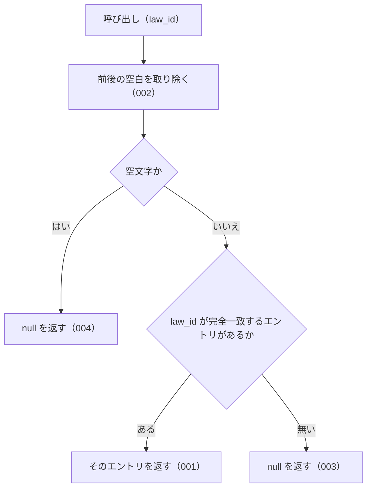

# lookupByLawId の仕様

<!-- GENERATED FILE — 手で編集しない。本文は houki-abbreviations の specs/current/lookup_by_law_id/spec.md の写し。 -->

::: info
houki-abbreviations **v0.7.1** の `specs/current/lookup_by_law_id/spec.md` から自動生成しました（仕様 ID 7 件・2026-10-10）。手で編集しないでください。再生成は `node scripts/generate-reference.mjs specs` です。
:::

e-Gov の法令 ID から辞書のエントリを 1 件引く

使いどころ・引数・実測の呼び出し例は、[関数のページ](/reference/lib/houki-abbreviations/lookup_by_law_id)にあります。

最後に仕様が変わったのは v0.7.0 の「関数ごとの全角・ダッシュ類・大文字の扱いを揃える（T3 正規化）」（2026-09-30 承認）です。それまでの経緯は[承認の履歴](#承認の履歴)にあります。

## 利用者と得られる結果

この機能の利用者と、利用者が渡すもの・得られる結果を示します。

- houki-abbreviations を import する利用者（houki-egov-mcp・houki-nta-mcp などの MCP サーバー、またはアプリケーション）。e-Gov の法令 ID（`law_id`）を渡して、その法令の略称・正式名称などを持つ辞書のエントリを受け取る

## 入力

呼び出すときに渡す値です。

| 引数                | 必須 | 内容                                                                                                      |
| ------------------- | ---- | --------------------------------------------------------------------------------------------------------- |
| `law_id`            | 必須 | e-Gov の法令 ID。例: `363AC0000000108`（消費税法）/ `321CONSTITUTION`（日本国憲法）。前後の空白は無視する |
| `options.normalize` | 任意 | `true` なら、`law_id` を `normalizeJpText` に通してから比べる（全角英数字を半角にする）。既定 `false`     |

型は `LookupByLawIdOptions`（`{ normalize?: boolean }`）。`resolveAbbreviation` の `options.normalize` と同じ意味で、既定も同じ `false`。houki-egov-mcp・houki-nta-mcp は入口で `normalize: true` を渡す。辞書の `law_id` は半角の大文字なので、辞書の側は変換しない。

## 戻り値

呼び出しが返す値です。

`AbbreviationEntry | null`。見つかったときは辞書のエントリそのもので、凍結されている（[SPEC-ABBR-ABBREVIATION-ENTRIES-019](/specs/houki-abbreviations/abbreviation_entries#spec-abbr-abbreviation-entries-019)）。

- 見つかったとき: 辞書のエントリ（`abbr` / `formal` / `law_id` / `law_num` / `law_type` / `domain` / `category` / `source_mcp_hint` / `aliases` / `note`。`law_num` 以降は辞書にあるときだけ付く）
- 見つからないとき、`law_id` が空文字・空白だけのとき: `null`

v0.6.0 の辞書 174 件のうち、`law_id` を持つ（`null` でない）エントリは 9 件（`所法` / `法法` / `消法` / `労基法` / `育介法` / `会社` / `商` / `民` / `憲`）。この関数で引けるのはこの 9 件だけ。

## 扱わないこと

この機能が意図して扱わないことです。

- 大文字・小文字の違いを吸収すること（`363ac0000000108` は `normalize: true` でも `null`）
- 通達など `law_id` が `null` のエントリ（v0.6.0 の辞書で 174 件中 165 件）を引くこと
- 法令番号から引くこと（`lookupByLawNum`）
- 略称・正式名称・別名から引くこと（`resolveAbbreviation`）
- `law_id` の形式が e-Gov の規則に合うかを確かめること（`isValidLawId`）
- 1 回の呼び出しで複数の `law_id` を引くこと

## 処理の流れ

図の中の番号は「できること」の仕様 ID の末尾 3 桁です。

## 仕様項目

この機能の仕様項目を、仕様 ID ごとに並べています。見出しは仕様項目を 1 文で表したもので、条件・応答の細部・例は「詳細」を開くと読めます。仕様 ID はそれぞれ受入テストと対応していて、テストの無い ID があると各リポジトリの CI が止まります。

### SPEC-ABBR-LOOKUP-BY-LAW-ID-001 law_id が完全一致するエントリを返す

::: details 詳細
`law_id` が辞書のエントリの `law_id` と完全一致するとき、そのエントリを返す。`363AC0000000108` のような通常の形式でも、`321CONSTITUTION` のような形式でも同じく引ける。

例: `lookupByLawId('363AC0000000108')?.formal` は `'消費税法'`。`lookupByLawId('321CONSTITUTION')?.formal` は `'日本国憲法'`。
:::

### SPEC-ABBR-LOOKUP-BY-LAW-ID-002 前後の空白を無視する

::: details 詳細
`law_id` の前後の空白を取り除いてから照合する。

例: `lookupByLawId('  363AC0000000108  ')?.formal` は `'消費税法'`。
:::

### SPEC-ABBR-LOOKUP-BY-LAW-ID-003 一致するエントリが無ければ null を返す

::: details 詳細
どのエントリの `law_id` とも一致しないときは `null` を返す。例外は投げない。

例: `lookupByLawId('999XX0000000000')` は `null`。
:::

### SPEC-ABBR-LOOKUP-BY-LAW-ID-004 空文字・空白だけの law_id には null を返す

::: details 詳細
`law_id` が空文字、または空白だけのときは、辞書を照合せずに `null` を返す。

例: `lookupByLawId('')` と `lookupByLawId('   ')` はどちらも `null`。
:::

### SPEC-ABBR-LOOKUP-BY-LAW-ID-005 normalize: true では全角英数字を半角にしてから引く

::: details 詳細
`options.normalize` が `true` のとき、`law_id` の全角英数字を半角にしてから辞書の `law_id` と比べる。

例: `lookupByLawId('３６３AC0000000108', { normalize: true })?.formal` は `'消費税法'`。`lookupByLawId('３６３ＡＣ０００００００１０８', { normalize: true })?.formal` も `'消費税法'`。
:::

### SPEC-ABBR-LOOKUP-BY-LAW-ID-006 normalize: true でも英字の小文字は大文字にしない

::: details 詳細
`options.normalize` が `true` でも、英字の小文字を大文字にはしない。`isValidLawId`（[SPEC-ABBR-IS-VALID-LAW-ID-010](/specs/houki-abbreviations/is_valid_law_id#spec-abbr-is-valid-law-id-010)）と同じく、小文字の `law_id` は辞書の `law_id` と一致しない。

例: `lookupByLawId('363ac0000000108', { normalize: true })` は `null`。`lookupByLawId('３６３ac0000000108', { normalize: true })` も `null`。
:::

### SPEC-ABBR-LOOKUP-BY-LAW-ID-007 normalize を省くか false にすると全角と半角を別の文字として引く

::: details 詳細
`options` を渡さないとき、`{}`、`{ normalize: false }` のどれでも、全角と半角の違いは吸収しない。v0.6.1 までの `lookupByLawId(law_id)` と同じ結果を返す。

例: `lookupByLawId('３６３AC0000000108')`、`lookupByLawId('３６３AC0000000108', {})`、`lookupByLawId('３６３AC0000000108', { normalize: false })` はどれも `null`。
:::

## 検討中のこと

仕様を書き起こしたときに見つかった項目のうち、扱いを Issue で検討しているものです。ここに挙げたことは、今後の版で変わることがあります。開くと、元の仕様書の記述をそのまま読めます。

::: details 仕様書の「未決」の節
初版起こしで見つけた、意図か不具合かを人が決める項目です。決まったら「できること」に ID を振るか、`specs/changes/` の差分にします。

意図か不具合かの判断が要る項目は houki-abbreviations の Issue に移し、ここには題と Issue の番号だけを残します。今の振る舞いのままでよくテストが無いだけの項目は、受入テストを書いてから「できること」に ID を振ります。テストの名前と中身が合っていない項目は、テストを直します（ID を振っていないものは、直してから振ります）。

1. **大文字・小文字と全角・半角を区別する。** → [SPEC-ABBR-LOOKUP-BY-LAW-ID-005](#spec-abbr-lookup-by-law-id-005)、[SPEC-ABBR-LOOKUP-BY-LAW-ID-006](#spec-abbr-lookup-by-law-id-006)、[SPEC-ABBR-LOOKUP-BY-LAW-ID-007](#spec-abbr-lookup-by-law-id-007)
2. **テスト「law_id=null のエントリはヒットしない」の中身が名前と合っていない。** （テストを直した。v0.6.1）
3. **返すエントリは辞書のオブジェクトそのもの。** → [SPEC-ABBR-ABBREVIATION-ENTRIES-019](/specs/houki-abbreviations/abbreviation_entries#spec-abbr-abbreviation-entries-019)
:::

## 承認の履歴

この機能の仕様が、いつ、どの変更で承認されたかを新しい順に並べています。各リポジトリの `npx spec-ids history lookup_by_law_id` と同じ内容です。変更の名前から、変更の理由と前後の振る舞いを書いた文書（GitHub）を開けます。

::: details 承認の履歴（4 件）
| 承認日 | 版 | 変更 | 仕様 PR |
|---|---|---|---|
| 2026-09-30 | v0.7.0 | [関数ごとの全角・ダッシュ類・大文字の扱いを揃える（T3 正規化）](https://github.com/shuji-bonji/houki-abbreviations/blob/v0.7.1/specs/releases/v0.7.0/20261001-normalize/proposal.md) | [#30](https://github.com/shuji-bonji/houki-abbreviations/pull/30) |
| 2026-09-27 | v0.6.1 | [テストが無いだけの振る舞いに仕様 ID を振る](https://github.com/shuji-bonji/houki-abbreviations/blob/v0.7.1/specs/releases/v0.6.1/20260927-untested-behaviors/proposal.md) | [#27](https://github.com/shuji-bonji/houki-abbreviations/pull/27) |
| 2026-09-27 | v0.6.1 | [「未決」のうち判断が要る 52 件を Issue に移す](https://github.com/shuji-bonji/houki-abbreviations/blob/v0.7.1/specs/releases/v0.6.1/20260927-undecided-to-issues/proposal.md) | [#26](https://github.com/shuji-bonji/houki-abbreviations/pull/26) |
| 2026-09-27 | — | 初版 | [#10](https://github.com/shuji-bonji/houki-abbreviations/pull/10) |
:::

## 関連ページ

このページの元になった文書と、あわせて読むページです。

- [houki-abbreviations の仕様の一覧](/specs/houki-abbreviations/)
- [houki-abbreviations の解説](/lib/houki-abbreviations)
- [lookupByLawId の関数のページ（リファレンス）](/reference/lib/houki-abbreviations/lookup_by_law_id)
- [元の仕様書（GitHub、v0.7.1）](https://github.com/shuji-bonji/houki-abbreviations/blob/v0.7.1/specs/current/lookup_by_law_id/spec.md)
